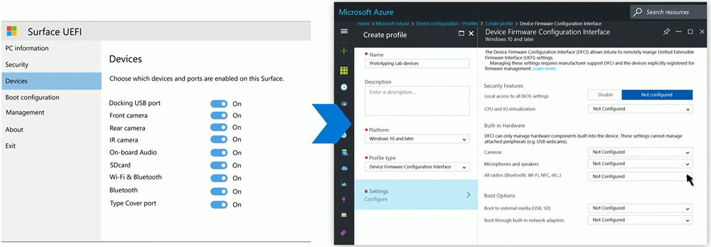
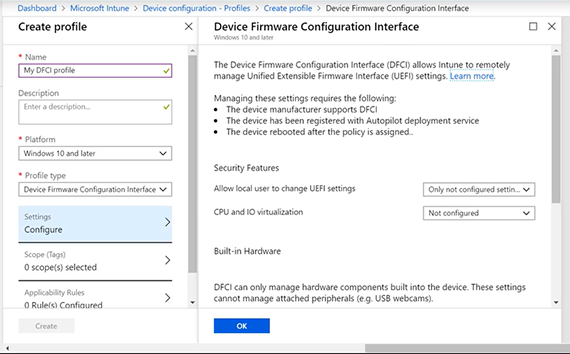
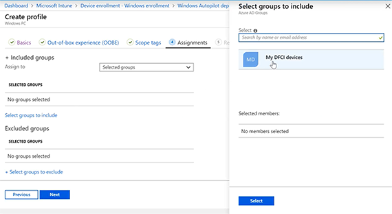
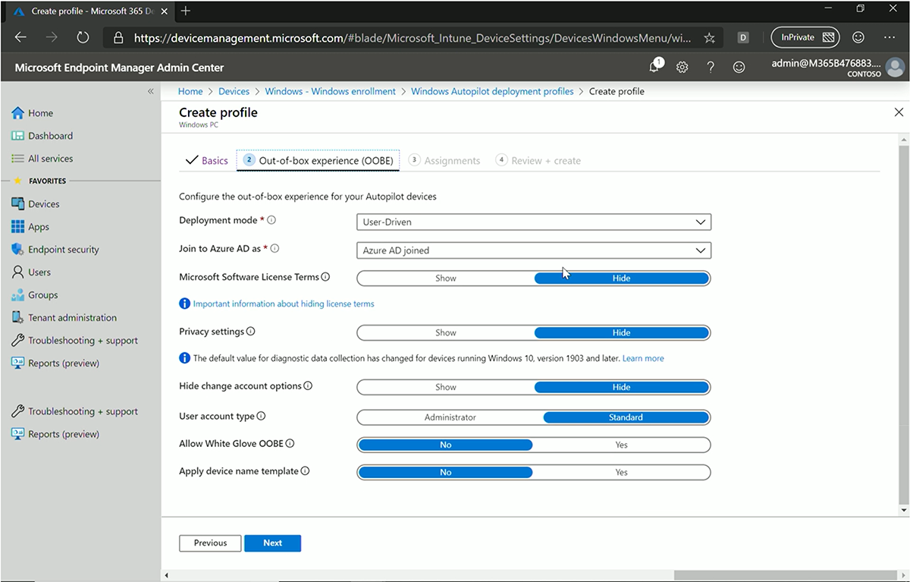
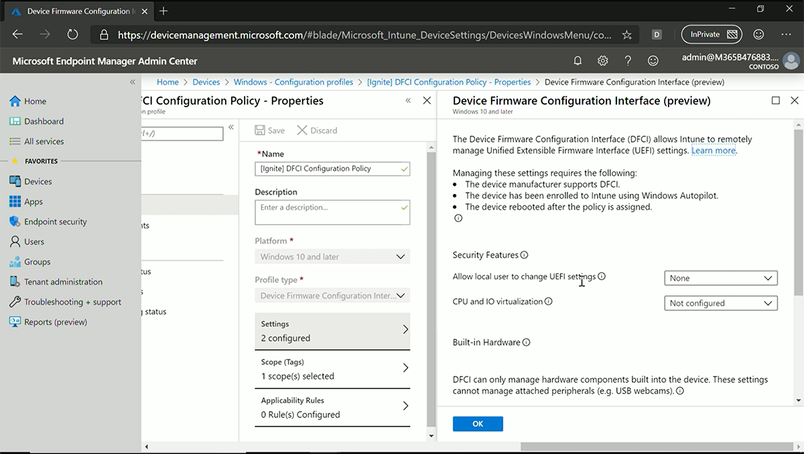
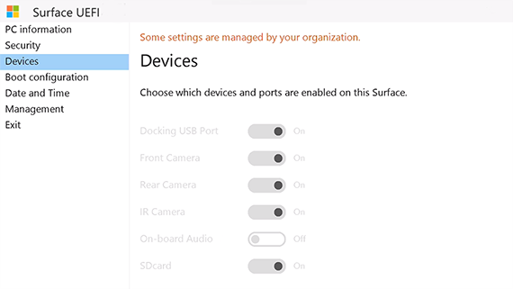

# Intune management of Surface UEFI settings

## Introduction

The ability to manage devices from the cloud has dramatically simplified IT deployment and provisioning across the lifecycle. With Device Firmware Configuration Interface (DFCI) profiles built into Microsoft Intune (now available in [public preview](https://docs.microsoft.com/intune/configuration/device-firmware-configuration-interface-windows)), Surface UEFI management extends the modern management stack down to the UEFI hardware level. DFCI supports zero-touch provisioning, eliminates BIOS passwords, provides control of security settings including boot options and built-in peripherals, and lays the groundwork for advanced security scenarios in the future. For answers to frequently asked questions, see [Ignite 2019: Announcing remote management of Surface UEFI settings from Intune](https://techcommunity.microsoft.com/t5/Surface-IT-Pro-Blog/Ignite-2019-Announcing-remote-management-of-Surface-UEFI/ba-p/978333).

### Background

Like any computer running Windows 10, Surface devices rely on code stored in the SoC that enables the CPU to interface with hard drives, display devices, USB ports, and other devices. The programs stored in this read-only memory (ROM) are known as firmware (while programs stored in dynamic media are known as software).

In contrast to other Windows 10 devices available in the market today, Surface provides IT admins with the ability to configure and manage firmware through a rich set of UEFI configuration settings. This provides a layer of hardware control on top of software-based policy management as implemented via mobile device management (MDM) policies, Configuration Manager or Group Policy. For example, organizations deploying devices in highly secure areas with sensitive information can prevent camera use by removing functionality at the hardware level. From a device standpoint, turning the camera off via a firmware setting is equivalent to physically removing the camera. Compare the added security of managing at the firmware level to relying only on operating system software settings. For example, if you disable the Windows audio service via a policy setting in a domain environment, a local admin could still re-enable the service.

### DFCI versus SEMM

Until now, managing firmware required enrolling devices into Surface Enterprise Management Mode (SEMM) with the overhead of ongoing manual IT-intensive tasks. As an example, SEMM requires IT staff to physically access each PC to enter a two-digit pin as part of the certificate management process. Although SEMM remains a good solution for organizations in a strictly on-premises environment, its complexity and IT-intensive requirements make it costly to use.

Now with newly integrated UEFI firmware management capabilities in Microsoft Intune, the ability to lock down hardware is simplified and easier to use with new features for provisioning, security, and streamlined updating all in a single console, now unified as [Microsoft Endpoint Manager](https://www.microsoft.com/microsoft-365/microsoft-endpoint-manager). The following figure shows UEFI settings viewed directly on the device (left) and viewed in the Endpoint Manager console (right).

Crucially, DFCI enables zero touch management, eliminating the need for manual interaction by IT admins. DFCI is deployed via Windows Autopilot using the device profiles capability in Intune. A device profile allows you to add and configure settings which can then be deployed to devices enrolled in management within your organization. Once the device receives the device profile, the features and settings are applied automatically. Examples of common device profiles include Email, Device restrictions, VPN, Wi-Fi, and Administrative templates. DFCI is simply an additional device profile that enables you to manage UEFI configuration settings from the cloud without having to maintain on-premises infrastructure.  

## Supported devices

At this time, DFCI is supported in the following devices:

- Surface Pro 7
- Surface Pro X
- Surface Laptop 3

> [!NOTE]
> Surface Pro X does not support DFCI settings management for built-in camera, audio, and Wi-Fi/Bluetooth.

## Prerequisites

- Devices must be registered with Windows Autopilot by a [Microsoft Cloud Solution Provider (CSP) partner](https://partner.microsoft.com/membership/cloud-solution-provider) or OEM distributor.

- Before configuring DFCI for Surface, you should be familiar with Autopilot configuration requirements in  [Microsoft Intune](https://docs.microsoft.com/intune/) and [Azure Active Directory](https://docs.microsoft.com/azure/active-directory/) (Azure AD).

## Before you begin

Add your target Surface devices to an Azure AD security group. For more information about creating and managing security groups, refer to [Intune documentation](https://docs.microsoft.com/intune/configuration/device-firmware-configuration-interface-windows#create-your-azure-ad-security-groups).

## Configure DFCI management for Surface devices

A DFCI environment requires setting up a DFCI profile that contains  the settings and an Autopilot profile to apply the settings to registered devices. An enrollment status profile is also recommended to ensure settings are pushed down during OOBE setup when users first start the device. This guide explains how to configure the DFCI environment and manage UEFI configuration settings for targeted Surface devices.

## Create DFCI profile

Before configuring DFCI policy settings, first create a DFCI profile and assign it to the Azure AD security group that contains your target devices.

1. Sign into your tenant at  devicemanagement.microsoft.com.
2. In the Microsoft Endpoint Manager Admin Center, select **Devices > Configuration profiles > Create profile** and enter a name; for example, **DFCI Configuration Policy.**
3. Select **Windows 10 and later** for platform type.
4. In the Profile type drop down list, select **Device Firmware Configuration Interface** to open the DFCI blade containing all available policy settings. For information on DFCI settings, refer to Table 1 on this page or the [Intune documentation](https://docs.microsoft.com/intune/configuration/device-firmware-configuration-interface-windows). You can configure DFCI settings during the initial setup process or later by editing the DFCI profile.

    

5. Click **OK** and then select **Create**.
6. Select **Assignments** and under **Select groups to include** select the Azure AD security group that contains your target devices, as shown in the following figure. Click **Save**.

    

## Create Autopilot profile

1. In Endpoint Manager at  devicemanagement.microsoft.com, select **devices > Windows enrollment** and scroll down to **Deployment profiles**.
2. Select **Create profile** and enter a name; for example, **My Autopilot profile**, and select **Next**.
3. Select the following settings:

    - Deployment mode: **User-Driven**.
    - Join type: Azure **AD joined**.

4. Leave the remaining default settings unchanged and select **Next**, as shown in the following figure.

    

5. On the Assignments page, choose **Select groups to include** and click your Azure AD security group. Select **Next**.
6. Accept the summary and then select **Create**. The Autopilot profile is now created and assigned to the group.

## Configure Enrollment Status Page

To ensure that devices apply the DFCI configuration during OOBE before users sign in, you need to configure enrollment status.

For more information, refer to [Set up an enrollment status page](https://docs.microsoft.com/intune/enrollment/windows-enrollment-status).

## Configure DFCI settings on Surface devices

DFCI includes a streamlined set of UEFI configuration policies that provide an extra level of security by locking down devices at the hardware level. DFCI is designed to be used in conjunction with mobile device management settings at the software level. Note that DFCI settings only affect hardware components built into Surface devices and do not extend to attached peripherals such as USB webcams. (However, you can use Device restriction policies in Intune to turn off access to attached peripherals at the software level).

You configure DFCI policy settings by editing the DFCI profile from Endpoint Manager, as shown in the figure below. 

- In Endpoint Manager at  devicemanagement.microsoft.com, select **Devices > Windows > Configuration Profiles > “DFCI profile name” > Properties > Settings**.

    

### Block user access to UEFI settings

For many customers, the ability to block users from changing UEFI settings is critically important and a primary reason to use DFCI. As listed in Table 1, this is managed via the setting **Allow local user to change UEFI settings**. If you do not edit or configure this setting, local users will be able to change any UEFI setting not managed by Intune. Therefore, it’s highly recommended to disable **Allow local user to change UEFI settings.**
The rest of the DFCI settings enable you to turn off functionality that would otherwise be available to users. For example, if you need to protect sensitive information in highly secure areas, you can disable the camera, and if you don’t want users booting from USB drives, you can disable that also.

### Table 1. DFCI scenarios

| Device management goal                        | Configuration steps                                                                           |
| --------------------------------------------- | --------------------------------------------------------------------------------------------- |
| Block local users from changing UEFI settings | Under **Security Features > Allow local user to change UEFI settings**, select **None**.              |
| Disable cameras                               | Under **Built in Hardware > Cameras**, select **Disabled**.                                       |
| Disable Microphones and speakers              | Under **Built in Hardware > Microphones and speakers**, select **Disabled**.                      |
| Disable radios (Bluetooth, Wi-Fi)             | Under **Built in Hardware > Radios (Bluetooth, Wi-Fi, etc…)**, select **Disabled**.                   |
| Disable Boot from external media (USB, SD)    | Under **Built in Hardware > Boot Options > Boot from external media (USB, SD)**, select **Disabled**. |

> [!CAUTION]
> The **Disable radios (Bluetooth, Wi-Fi)** setting should only be used on devices that have a wired Ethernet connection.
 
> [!NOTE]
>  DFCI in Intune includes two settings that do not currently apply to Surface devices: (1) CPU and IO virtualization and (2) Disable Boot from network adapters.
 
Intune provides Scope tags to delegate administrative rights and Applicability Rules to manage device types. For more information about policy management support and full details on all DFCI settings, refer to [Microsoft Intune documentation](https://docs.microsoft.com/intune/configuration/device-firmware-configuration-interface-windows).

## Register devices in Autopilot

As stated above, DFCI can only be applied on devices registered in Windows Autopilot by your reseller or distributor and is only supported, at this time, on Surface Pro 7, Surface Pro X, and Surface Laptop 3. For security reasons, it’s not possible to “self-provision” your devices into Autopilot.

## Manually Sync Autopilot devices

Although Intune policy settings typically get applied almost immediately, there may be a delay of 10 minutes before the settings take effect on targeted devices. In rare circumstances, delays of up to 8 hours are possible. To ensure settings apply as soon as possible, (such as in test scenarios), you can manually sync the target devices.

- In Endpoint Manager at  devicemanagement.microsoft.com, go to **Devices > Device enrollment > Windows enrollment > Windows Autopilot Devices** and select **Sync**.

 For more information, refer to [Sync your Windows device manually](https://docs.microsoft.com/intune-user-help/sync-your-device-manually-windows).

> [!NOTE]
> When adjusting settings directly in UEFI, you need to ensure the device fully restarts to the standard Windows login.

## Verifying UEFI settings on DFCI-managed devices

In a test environment, you can verify settings in the Surface UEFI interface.

1. Open Surface UEFI, which involves pressing the **Volume +** and **Power** buttons at the same time.
2. Select **Devices**. The UEFI menu will reflect configured settings, as shown in the following figure.

    

    Note how:

      - The settings are greyed out because **Allow local user to change UEFI setting** is set to None.
      - Audio is set to off because **Microphones and speakers** are set to **Disabled**.

## Removing DFCI policy settings

When you create a DFCI profile, all configured settings will remain in effect across all devices within the profile’s scope of management. You can only remove DFCI policy settings by editing the DFCI profile directly.

If the original DFCI profile has been deleted, you can remove policy settings by creating a new profile and then editing the settings, as appropriate.

## Removing DFCI management

**To remove DFCI management and return device to factory new state:**

1. Retire the device from Intune:
    1. In Endpoint Manager at  devicemanagement.microsoft.com, choose **Groups > All Devices**. Select the devices you want to retire, and then choose **Retire/Wipe.** To learn more refer to [Remove devices by using wipe, retire, or manually unenrolling the device](https://docs.microsoft.com/intune/remote-actions/devices-wipe). 
2. Delete the Autopilot registration from Intune:
    1.  Choose **Device enrollment > Windows enrollment > Devices**.
    2. Under Windows Autopilot devices, choose the devices you want to delete, and then choose **Delete**.
3. Connect device to wired internet with Surface-branded ethernet adapter. Restart device and open the UEFI menu (press and hold the volume-up button while also pressing and releasing the power button).
4. Select **Management > Configure > Refresh from Network** and then choose **Opt-out.**

To keep managing the device with Intune, but without DFCI management, self-register the device to Autopilot and enroll it to Intune. DFCI will not be applied to self-registered devices.

## Learn more
- [Ignite 2019: Announcing remote management of Surface UEFI settings from Intune](https://techcommunity.microsoft.com/t5/Surface-IT-Pro-Blog/Ignite-2019-Announcing-remote-management-of-Surface-UEFI/ba-p/978333)
[Windows Autopilot](https://www.microsoft.com/microsoft-365/windows/windows-autopilot)
- [Windows Autopilot and Surface devices](windows-autopilot-and-surface-devices.md) 
- [Use DFCI profiles on Windows devices in Microsoft Intune](https://docs.microsoft.com/intune/configuration/device-firmware-configuration-interface-windows)
