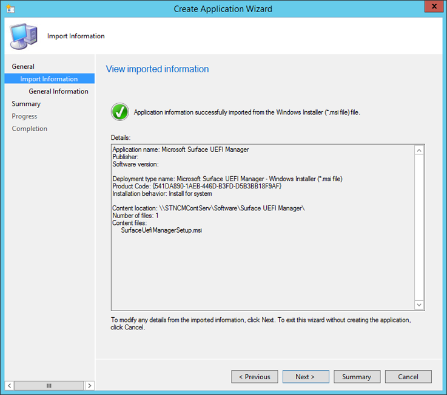
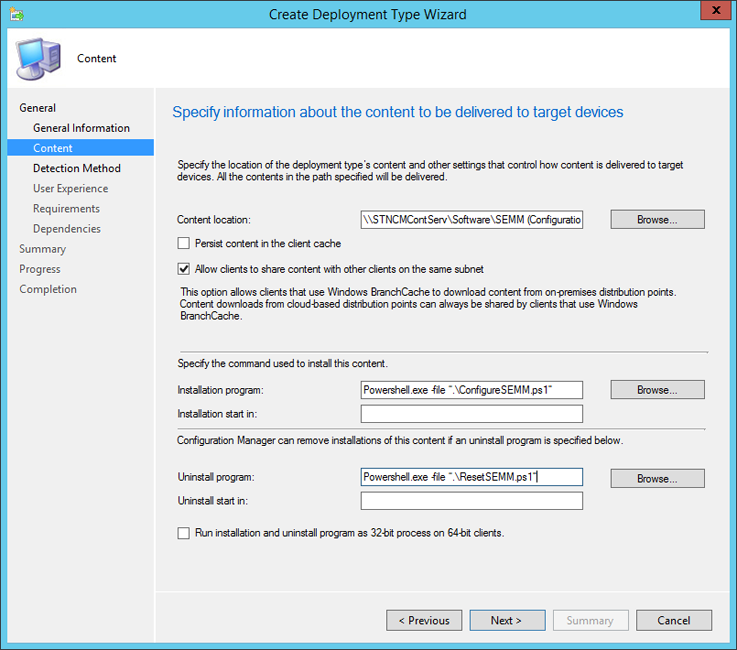

# Use System Center Configuration Manager to manage devices with SEMM

The Surface Enterprise Management Mode (SEMM) feature of Surface UEFI devices allows administrators to both manage and secure the configuration of Surface UEFI settings. For most organizations, this process is accomplished by creating Windows Installer (.msi) packages with the Microsoft Surface UEFI Configurator tool. These packages are then run or deployed to the client Surface devices to enroll the devices in SEMM and to update the Surface UEFI settings configuration.

For organizations with System Center Configuration Manager, there is an alternative to using the Microsoft Surface UEFI Configurator .msi process to deploy and administer SEMM. Microsoft Surface UEFI Manager is a lightweight installer that makes required assemblies for SEMM management available on a device. By installing these assemblies with Microsoft Surface UEFI Manager on a managed client, SEMM can be administered by Configuration Manager with PowerShell scripts, deployed as applications. With this process, SEMM management is performed within Configuration Manager, which eliminates the need for the external Microsoft Surface UEFI Configurator tool.

>[!Note]
>Although the process described in this article may work with earlier versions of System Center Configuration Manager or with other third-party management solutions, management of SEMM with Microsoft Surface UEFI Manager and PowerShell is supported only with the Current Branch of System Center Configuration Manager.

#### Prerequisites

Before you begin the process outlined in this article, it is expected that you are familiar with the following technologies and tools:

* [Surface UEFI](https://technet.microsoft.com/itpro/surface/manage-surface-uefi-settings)
* [Surface Enterprise Management Mode (SEMM)](https://technet.microsoft.com/itpro/surface/surface-enterprise-management-mode)
* [PowerShell scripting](https://technet.microsoft.com/scriptcenter/dd742419)
* [System Center Configuration Manager application deployment](https://docs.microsoft.com/sccm/apps/deploy-use/deploy-applications)
* Certificate management

>[!Note]
>You will also need access to the certificate that you intend to use to secure SEMM. For details about the requirements for this certificate, see [Surface Enterprise Management Mode certificate requirements](https://technet.microsoft.com/itpro/surface/surface-enterprise-management-mode#surface-enterprise-management-mode-certificate-requirements).

>It is very important that this certificate be kept in a safe location and properly backed up. If this certificate becomes lost or unusable, it is not possible to reset Surface UEFI, change managed Surface UEFI settings, or remove SEMM from an enrolled Surface device.

#### Download Microsoft Surface UEFI Manager

Management of SEMM with Configuration Manager requires the installation of Microsoft Surface UEFI Manager on each client Surface device. You can download Microsoft Surface UEFI Manager (SurfaceUEFIManager.msi) from the [Surface Tools for IT](https://www.microsoft.com/download/details.aspx?id=46703) page on the Microsoft Download Center.

#### Download SEMM scripts for Configuration Manager

After Microsoft Surface UEFI Manager is installed on the client Surface device, SEMM is deployed and managed with PowerShell scripts. You can download samples of the [SEMM management scripts](https://www.microsoft.com/en-us/download/details.aspx?id=46703) from the Download Center.

## Deploy Microsoft Surface UEFI Manager

Deployment of Microsoft Surface UEFI Manager is a typical application deployment. The Microsoft Surface UEFI Manager installer file is a standard Windows Installer file that you can install with the [standard quiet option](https://msdn.microsoft.com/library/windows/desktop/aa367988).

The command to install Microsoft Surface UEFI Manager is:

`msiexec /i "SurfaceUEFIManagerSetup.msi" /q`

The command to uninstall Microsoft Surface UEFI Manager is:

`msiexec /x {541DA890-1AEB-446D-B3FD-D5B3BB18F9AF} /q`

To create a new application and deploy it to a collection that contains your Surface devices, perform the following steps:

1. Open Configuration Manager Console from the Start screen or Start menu.
2. Click **Software Library** in the bottom left corner of the window.
3. Expand the Application Management node of the Software Library, and then click **Applications**.
4. Click the **Create Application** button under the **Home** tab at the top of the window. This starts the Create Application Wizard.
5. The Create Application Wizard presents a series of steps:

   * **General** – The **Automatically detect information about this application from installation files** option is selected by default. In the **Type** field, **Windows Installer (*.msi file)** is also selected by default. Click **Browse** to navigate to and select **SurfaceUEFIManagerSetup.msi**, and then click **Next**.
   
      >[!Note]
      >The location of SurfaceUEFIManagerSetup.msi must be on a network share and located in a folder that contains no other files. A local file location cannot be used.

   * **Import Information** – The Create Application Wizard will parse the .msi file and read the **Application Name** and **Product Code**. SurfaceUEFIManagerSetup.msi should be listed as the only file under the line **Content Files**, as shown in Figure 1. Click **Next** to proceed.

   
   
   
   *Figure 1. Information from Microsoft Surface UEFI Manager setup is automatically parsed*

   * **General Information** – You can modify the name of the application and information about the publisher and version, or add comments on this page. The installation command for Microsoft Surface UEFI Manager is displayed in the Installation Program field. The default installation behavior of Install for system will allow Microsoft Surface UEFI Manager to install the required assemblies for SEMM even if a user is not logged on to the Surface device. Click Next to proceed.
   * **Summary** – The information that was parsed in the **Import Information** step and your selections from the **General Information** step is displayed on this page. Click **Next** to confirm your selections and create the application.
   * **Progress** – Displays a progress bar and status as the application is imported and added to the Software Library.
   * **Completion** – Confirmation of the successful application creation is displayed when the application creation process is complete. Click **Close** to finish the Create Application Wizard.

After the application is created in Configuration Manager, you can distribute it to your distribution points and deploy it to the collections including your Surface devices. This application will not install or enable SEMM on the Surface device – it only provides the assemblies required for SEMM to be enabled via PowerShell script.

If you do not want to install the Microsoft Surface UEFI Manager assemblies on devices that will not be managed with SEMM, you can configure Microsoft Surface UEFI Manager as a dependency of the SEMM Configuration Manager scripts. This scenario is covered in the [Deploy SEMM Configuration Manager Scripts](#deploy-semm-configuration-manager-scripts) section later in this article.

## Create or modify the SEMM Configuration Manager scripts

After the required assemblies have been installed on the devices, the process of enrolling the devices in SEMM and configuring Surface UEFI is done with PowerShell scripts and deployed as a script application with Configuration Manager. These scripts can be modified to fit the needs of your organization and environment. For example, you can create multiple configurations for managed Surface devices in different departments or roles. You can download samples of the scripts for SEMM and Configuration Manager at the link in the [Prerequisites](#prerequisites) section at the beginning of this article.

There are two primary scripts you will need to perform a SEMM deployment with Configuration Manager:

* **ConfigureSEMM.ps1** – Use this script to create configuration packages for your Surface devices with your desired Surface UEFI settings, to apply the specified settings to a Surface device, to enroll the device in SEMM, and to set a registry key used to identify the enrollment of the device in SEMM.
* **ResetSEMM.ps1** – Use this script to reset SEMM on a Surface device, which unenrolls it from SEMM and removes the control over Surface UEFI settings.

The sample scripts include examples of how to set Surface UEFI settings and how to control permissions to those settings. These settings can be modified to secure Surface UEFI and set Surface UEFI settings according to the needs of your environment. The following sections of this article explain the ConfigureSEMM.ps1 script and explore the modifications you need to make to the script to fit your requirements.

>[!NOTE]
>The SEMM Configuration Manager scripts and the exported SEMM certificate file (.pfx) should be placed in the same folder with no other files before they are added to Configuration Manager.

### Specify certificate and package names

The first region of the script that you need to modify is the portion that specifies and loads the SEMM certificate, and also indicates the names for the SEMM configuration package and SEMM reset package. The certificate and package names are specified on lines 56 through 67 in the ConfigureSEMM.ps1 script:

  ```
  56	$WorkingDirPath = split-path -parent $MyInvocation.MyCommand.Definition
  57	$packageRoot = "$WorkingDirPath\Config"
  58	
  59	if (-not (Test-Path $packageRoot))  { New-Item -ItemType Directory -Force -Path $packageRoot }
  60	Copy-Item "$WorkingDirPath\FabrikamOwnerSigner.pfx" $packageRoot
  61	
  62	$privateOwnerKey = Join-Path -Path $packageRoot -ChildPath "FabrikamOwnerSigner.pfx"
  63	$ownerPackageName = Join-Path -Path $packageRoot -ChildPath "FabrikamSignerProvisioningPackage.pkg"
  64	$resetPackageName = Join-Path -Path $packageRoot -ChildPath "FabrikamUniversalResetPackage.pkg"
  65	
  66	# If your PFX file requires a password then it can be set here, otherwise use a blank string.
  67	$password = "1234" 
  ```

Replace the **FabrikamOwnerSigner.pfx** value for the **$privateOwnerKey** variable with the name of your SEMM Certificate file on both lines 60 and 62. The script will create a working directory (named Config) in the folder where your scripts are located, and will then copy the certificate file to this working directory.

Replace the **FabrikamSignerProvisioningPackage.pkg** and **FabrikamUniversalResetPackage.pkg** values on lines 63 and 64 to define the **$ownerPackageName** and **$resetPackageName** variables with your desired names for the SEMM configuration and reset packages. These packages will also be created in the Config directory and hold the configuration for Surface UEFI settings and permissions generated by the script.

On line 67, replace the value of the **$password** variable, from 1234, to the password for your certificate file. If a password is not required, delete the **1234** text.

>[!Note]
>The last two characters of the certificate thumbprint are required to enroll a device in SEMM. This script will display these digits to the user, which allows the user or technician to record these digits before the system reboots to enroll the device in SEMM. The script uses the following code, found on lines 144-149, to accomplish this:

```
144	# Device owners will need the last two characters of the thumbprint to accept SEMM ownership.
145	# For convenience we get the thumbprint here and present to the user.
146	$pw = ConvertTo-SecureString $password -AsPlainText -Force
147	$certPrint = New-Object System.Security.Cryptography.X509Certificates.X509Certificate2
148	$certPrint.Import($privateOwnerKey, $pw, [System.Security.Cryptography.X509Certificates.X509KeyStorageFlags]::DefaultKeySet)
149	Write-Host "Thumbprint =" $certPrint.Thumbprint
```

Administrators with access to the certificate file (.pfx) can read the thumbprint at any time by opening the .pfx file in CertMgr. To view the thumbprint with CertMgr, follow this process:

1. Right-click the .pfx file, and then click **Open**.
2. Expand the folder in the navigation pane.
3. Click **Certificates**.
4. Right-click your certificate in the main pane, and then click **Open**.
5. Click the **Details** tab.
6. **All** or **Properties Only** must be selected in the **Show** drop-down menu.
7. Select the field **Thumbprint**.

>[!NOTE]
>The SEMM certificate name and password must also be entered in this section of the ResetSEMM.ps1 script to enable Configuration Manager to remove SEMM from the device with the uninstall action.

### Configure permissions

The first region of the script where you will specify the configuration for Surface UEFI is the **Configure Permissions** region. This region begins at line 202 in the sample script with the comment **# Configure Permissions** and continues to line 238. The following code fragment first sets permissions to all Surface UEFI settings so that they may be modified by SEMM only, then adds explicit permissions to allow the local user to modify the Surface UEFI password, TPM, and front and rear cameras:

```
202	# Configure Permissions
203	foreach ($uefiV2 IN $surfaceDevices.Values) {
204	# Here we define which "identities" will be allowed to modify which settings
205	#   PermissionSignerOwner = The primary SEMM enterprise owner identity
206	#   PermissionLocal = The user when booting to the UEFI pre-boot GUI
207	#   PermissionSignerUser, PermissionSignerUser1, PermissionSignerUser2 =
208	#     Additional user identities created so that the signer owner
209	#     can delegate permission control for some settings.
210	$ownerOnly = [Microsoft.Surface.IUefiSetting]::PermissionSignerOwner
211	$ownerAndLocalUser = ([Microsoft.Surface.IUefiSetting]::PermissionSignerOwner -bor [Microsoft.Surface.IUefiSetting]::PermissionLocal)
212	
213	# Make all permissions owner only by default
214	foreach ($setting IN $uefiV2.Settings.Values) {
215	$setting.ConfiguredPermissionFlags = $ownerOnly
216	}
217	# Allow the local user to change their own password
218	$uefiV2.SettingsById[501].ConfiguredPermissionFlags = $ownerAndLocalUser
219	
220	# Allow the local user to change the state of the TPM
221	$uefiV2.Settings["Trusted Platform Module (TPM)"].ConfiguredPermissionFlags = $ownerAndLocalUser
222	
223	# Allow the local user to change the state of the Front and Rear cameras
224	$uefiV2.SettingsById[302].ConfiguredPermissionFlags = $ownerAndLocalUser
225	$uefiV2.SettingsById[304].ConfiguredPermissionFlags = $ownerAndLocalUser
226	 
227	 
228	# Create a unique package name based on family and LSV.
229	# We will choose a name that can be parsed by later scripts.
230	$packageName = $uefiV2.SurfaceUefiFamily + "^Permissions^" + $lsv + ".pkg"
231	$fullPackageName = Join-Path -Path $packageRoot -ChildPath $packageName
232	
233	# Build and sign the Permission package then save it to a file.
234	$permissionPackageStream =  $uefiV2.BuildAndSignPermissionPackage($privateOwnerKey, $password, "", $null, $lsv)
235	$permissionPackage = New-Object System.IO.Filestream($fullPackageName, [System.IO.FileMode]::CreateNew, [System.IO.FileAccess]::Write)
236	$permissionPackageStream.CopyTo($permissionPackage)
237	$permissionPackage.Close()
238	}
```

Each **$uefiV2** variable identifies a Surface UEFI setting by setting name or ID, and then configures the permissions to one of the following values:

* **$ownerOnly** – Permission to modify this setting is granted only to SEMM.
* **$ownerAndLocalUser** – Permission to modify this setting is granted to a local user booting to Surface UEFI, as well as to SEMM.

You can find information about the available settings names and IDs for Surface UEFI in the [Settings Names and IDs](#settings-names-and-ids) section of this article.

### Configure settings

The second region of the script where you will specify the configuration for Surface UEFI is the **Configure Settings** region of the ConfigureSEMM.ps1 script, which configures whether each setting is enabled or disabled. The sample script includes instructions to set all settings to their default values. The script then provides explicit instructions to disable IPv6 for PXE Boot and to leave the Surface UEFI Administrator password unchanged. You can find this region beginning with the **# Configure Settings** comment at line 282 through line 312 in the sample script. The region appears as follows:

```
282	# Configure Settings
283	foreach ($uefiV2 IN $surfaceDevices.Values) {
284	# In this demo, we will start by setting every setting to the default factory setting.
285	# You may want to start by doing this in your scripts
286	# so that every setting gets set to a known state.
287	foreach ($setting IN $uefiV2.Settings.Values) {
288	$setting.ConfiguredValue = $setting.DefaultValue
289	}
290	
291	# If you want to set something to a different value from the default,
292	# here are examples of how to accomplish this.
293	$uefiV2.Settings["IPv6 for PXE Boot"].ConfiguredValue = "Disabled"
294	
295	# If you want to leave the setting unmodified, set it to $null
296	# PowerShell has issues setting things to $null so ClearConfiguredValue()
297	# is supplied to do this explicitly.
298	# Here is an example of leaving the UEFI administrator password as-is,
299	# even after we initially set it to factory default above.
300	$uefiV2.SettingsById[501].ClearConfiguredValue()
301	
302	# Create a unique package name based on family and LSV.
303	# We will choose a name that can be parsed by later scripts.
304	$packageName = $uefiV2.SurfaceUefiFamily + "^Settings^" + $lsv + ".pkg"
305	$fullPackageName = Join-Path -Path $packageRoot -ChildPath $packageName
306	
307	# Build and sign the Settings package then save it to a file.
308	$settingsPackageStream =  $uefiV2.BuildAndSignSecuredSettingsPackage($privateOwnerKey, $password, "", $null, $lsv)
309	$settingsPackage = New-Object System.IO.Filestream($fullPackageName, [System.IO.FileMode]::CreateNew, [System.IO.FileAccess]::Write)
310	$settingsPackageStream.CopyTo($settingsPackage)
311	$settingsPackage.Close()
312	}
```

Like the permissions set in the **Configure Permissions** section of the script, the configuration of each Surface UEFI setting is performed by defining the **$uefiV2** variable. For each line defining the **$uefiV2** variable, a Surface UEFI setting is identified by setting name or ID and the configured value is set to **Enabled** or **Disabled**.

If you do not want to alter the configuration of a Surface UEFI setting, for example to ensure that the Surface UEFI administrator password is not cleared by the action of resetting all Surface UEFI settings to their default, you can use **ClearConfiguredValue()** to enforce that this setting will not be altered. In the sample script, this is used on line 300 to prevent the clearing of the Surface UEFI Administrator password, identified in the sample script by its setting ID, **501**.

You can find information about the available settings names and IDs for Surface UEFI in the [Settings Names and IDs](#settings-names-and-ids) section later in this article.

### Settings registry key

To identify enrolled systems for Configuration Manager, the ConfigureSEMM.ps1 script writes a registry key that can be used to identify enrolled systems as having been installed with the SEMM configuration script. This key can be found at the following location:

`HKLM\SOFTWARE\Microsoft\Surface\SEMM\Enabled_Version1000`

The following code fragment, found on lines 352-363, is used to write this registry key:

```
352	$SurfaceRegKey = "HKLM:\SOFTWARE\Microsoft\Surface\SEMM"
353	New-RegKey $SurfaceRegKey
354	$SurfaceRegValue = Get-ItemProperty $SurfaceRegKey Enabled_Version1000 -ErrorAction SilentlyContinue
355	
356	If ($SurfaceRegValue -eq $null)
357	{
358	New-ItemProperty -Path $SurfaceRegKey -Name Enabled_Version1000 -PropertyType String -Value 1 | Out-Null
359	}
360	Else
361	{
362	Set-ItemProperty -Path $SurfaceRegKey -Name Enabled_Version1000 -Value 1
363	}
```

### Settings names and IDs

To configure Surface UEFI settings or permissions for Surface UEFI settings, you must refer to each setting by either its setting name or setting ID. With each new update for Surface UEFI, new settings may be added. The best way to get a complete list of the settings available on a Surface device, along with the settings name and settings IDs, is to use the ShowSettingsOptions.ps1 script from SEMM_Powershell.zip in [Surface Tools for IT Downloads](https://www.microsoft.com/en-us/download/details.aspx?id=46703) 

The computer where ShowSettingsOptions.ps1 is run must have Microsoft Surface UEFI Manager installed, but the script does not require a Surface device.

The following tables show the available settings for Surface Pro 4 and Surface Book:

*Table 1. Surface UEFI settings for Surface Pro 4*

| Setting ID | Setting Name |	Description |	Default Setting |
| --- | --- | --- | --- |
|501|	Password | UEFI System Password	|   |
|200|	Secure Boot Keys | Secure Boot signing keys to enable for EFI applications |	MsPlus3rdParty |
|300|	Trusted Platform Module (TPM)	| TPM device enabled or disabled |	Enabled |
|301|	Docking USB Port | Docking USB Port enabled or disabled |	Enabled |
|302|	Front Camera | Front Camera enabled or disabled |	Enabled |
|303|	Bluetooth | Bluetooth radio enabled or disabled	 | Enabled | 
|304|	Rear Camera | Rear Camera enabled or disabled	| Enabled |
|305|	IR Camera | InfraRed Camera enabled or disabled	 | Enabled |
|308|	Wi-Fi and Bluetooth | Wi-Fi and Bluetooth enabled or disabled	 | Enabled |
|310|	Type Cover | Surface Type Cover connector | Enabled |
|320|	On-board Audio | On-board audio enabled or disabled	| Enabled |
|330|	Micro SD Card | Micro SD Card enabled or disabled	| Enabled |
|370|	USB Port 1 | Side USB Port (1) | UsbPortEnabled |
|400|	IPv6 for PXE Boot | Enable IPv6 PXE boot before IPv4 PXE boot	|Disabled |
|401|	Alternate Boot | Alternate Boot allows users to override the boot order by holding the volume down button when powering up the device	| Enabled |
|402|	Boot Order Lock | Boot Order variable lock enabled or disabled	| Disabled |
|403|	USB Boot | Enable booting from USB devices	| Enabled |
|500|	TPM clear EFI protocol | Enable EFI protocol for invoking TPM clear	| Disabled |
|600|	Security | UEFI Security Page Display enabled or disabled	| Enabled |
|601|	Devices | UEFI Devices Page Display enabled or disabled	| Enabled |
|602|	Boot | UEFI Boot Manager Page Display enabled or disabled	| Enabled |

*Table 2. Surface UEFI settings for Surface Book*

| Setting ID | Setting Name	| Description	| Default Setting |
| --- | --- | --- | --- |
| 501	| Password	| UEFI System Password |   |	
| 200	| Secure Boot Keys | Secure Boot signing keys to enable for EFI applications	| MsPlus3rdParty |
| 300	| Trusted Platform Module (TPM) | TPM device enabled or disabled | Enabled |
| 301	| Docking USB Port | Docking USB Port enabled or disabled | Enabled |
| 302	| Front Camera | Front Camera enabled or disabled | Enabled |
| 303	| Bluetooth | Bluetooth radio enabled or disabled | Enabled |
| 304	| Rear Camera | Rear Camera enabled or disabled | Enabled |
| 305	| IR Camera | InfraRed Camera enabled or disabled | Enabled |
| 308	| Wi-Fi and Bluetooth | Wi-Fi and Bluetooth enabled or disabled | Enabled |
| 320	| On-board Audio | On-board audio enabled or disabled | Enabled |
| 400	| IPv6 for PXE Boot	Enable | IPv6 PXE boot before IPv4 PXE boot | Disabled |
| 401	| Alternate Boot | Alternate Boot allows users to override the boot order by holding the volume down button when powering up the device | Enabled |
| 402	| Boot Order Lock | Boot Order variable lock enabled or disabled | Disabled |
| 403	| USB Boot | Enable booting from USB devices | Enabled |
| 500	| TPM clear EFI protocol | Enable EFI protocol for invoking TPM clear | Disabled |
| 600	| Security | UEFI Security Page Display enabled or disabled | Enabled |
| 601	| Devices | UEFI Devices Page Display enabled or disabled | Enabled |
| 602	| Boot | UEFI Boot Manager Page Display enabled or disabled | Enabled |

## Deploy SEMM Configuration Manager scripts

After your scripts are prepared to configure and enable SEMM on the client device, the next step is to add these scripts as an application in Configuration Manager. Before you open Configuration Manager, ensure that the following files are in a shared folder that does not include other files:

* ConfigureSEMM.ps1
* ResetSEMM.ps1
* Your SEMM certificate (for example SEMMCertificate.pfx)

The SEMM Configuration Manager scripts will be added to Configuration Manager as a script application. The command to install SEMM with ConfigureSEMM.ps1 is:

`Powershell.exe -file ".\ConfigureSEMM.ps1"`

The command to uninstall SEMM with ResetSEMM.ps1 is:

`Powershell.exe -file ".\ResetSEMM.ps1"`

To add the SEMM Configuration Manager scripts to Configuration Manager as an application, use the following process:

1. Start the Create Application Wizard using Step 1 through Step 5 from the [Deploy Microsoft Surface UEFI Manager](#deploy-microsoft-surface-uefi-manager) section earlier in this article.

2. Proceed through The Create Application Wizard as follows:

   - **General** – Select **Manually specify the application information**, and then click **Next**.

   - **General Information** – Enter a name for the application (for example SEMM) and any other information you want such as publisher, version, or comments on this page. Click **Next** to proceed.

   - **Application Catalog** – The fields on this page can be left with their default values. Click **Next**.

   - **Deployment Types** – Click **Add** to start the Create Deployment Type Wizard.

   - Proceed through the steps of the Create Deployment Type Wizard, as follows:

     * **General** – Click **Script Installer** from the **Type** drop-down menu. The **Manually specify the deployment type information** option will automatically be selected. Click **Next** to proceed.
     * **General Information** – Enter a name for the deployment type (for example SEMM Configuration Scripts), and then click **Next** to continue.
     * **Content** – Click **Browse** next to the **Content Location** field, and then click the folder where your SEMM Configuration Manager scripts are located. In the **Installation Program** field, type the [installation command](#deploy-semm-configuration-manager-scripts) found earlier in this article. In the **Uninstall Program** field, enter the [uninstallation command](#deploy-semm-configuration-manager-scripts) found earlier in this article (shown in Figure 2). Click **Next** to move to the next page.
    
     

     *Figure 2. Set the SEMM Configuration Manager scripts as the install and uninstall commands*

     * **Detection Method** – Click **Add Clause** to add the SEMM Configuration Manager script registry key detection rule. The **Detection Rule** window is displayed, as shown in Figure 3. Use the following settings:

       - Click **Registry** from the **Setting Type** drop-down menu.
       - Click **HKEY_LOCAL_MACHINE** from the **Hive** drop-down menu.
       - Enter **SOFTWARE\Microsoft\Surface\SEMM** in the **Key** field.
       - Enter **Enabled_Version1000** in the **Value** field.
       - Click **String** from the **Data Type** drop-down menu.
       - Click the **This registry setting must satisfy the following rule to indicate the presence of this application** button.
       - Enter **1** in the **Value** field.
       - Click **OK** to close the **Detection Rule** window.

     
     
     *Figure 3. Use a registry key to identify devices enrolled in SEMM*

     * Click **Next** to proceed to the next page.
     
     * **User Experience** – Click **Install for system** from the **Installation Behavior** drop-down menu. If you want your users to record and enter the certificate thumbprint themselves, leave the logon requirement set to **Only when a user is logged on**. If you want your administrators to enter the thumbprint for users and the users do not need to see the thumbprint, click **Whether or not a user is logged on** from the **Logon Requirement** drop-down menu.

     * **Requirements** – The ConfigureSEMM.ps1 script automatically verifies that the device is a Surface device before attempting to enable SEMM. However, if you intend to deploy this script application to a collection with devices other than those to be managed with SEMM, you could add requirements here to ensure this application would run only on Surface devices or devices you intend to manage with SEMM. Click **Next** to continue.
     
     * **Dependencies** – Click **Add** to open the **Add Dependency** window.

       * Click **Add** to open the **Specify Required Application** window.

          - Enter a name for the SEMM dependencies in the **Dependency Group Name** field (for example, *SEMM Assemblies*).

          - Click **Microsoft Surface UEFI Manager** from the list of **Available Applications** and the MSI deployment type, and then click **OK** to close the **Specify Required Application** window.
          
        *	Keep the **Auto Install** check box selected if you want Microsoft Surface UEFI Manager installed automatically on devices when you attempt to enable SEMM with the Configuration Manager scripts. Click **OK** to close the **Add Dependency** window.

     * Click **Next** to proceed.
     
     * **Summary** – The information you have entered throughout the Create Deployment Type wizard is displayed on this page. Click **Next** to confirm your selections.
     
     * **Progress** – A progress bar and status as the deployment type is added for the SEMM script application is displayed on this page.
     
     * **Completion** – Confirmation of the deployment type creation is displayed when the process is complete. Click **Close** to finish the Create Deployment Type Wizard.

   * **Summary** – The information that you entered throughout the Create Application Wizard is displayed. Click **Next** to create the application.

   * **Progress** – A progress bar and status as the application is added to the Software Library is displayed on this page.

   * **Completion** – Confirmation of the successful application creation is displayed when the application creation process is complete. Click **Close** to finish the Create Application Wizard.

After the script application is available in the Software Library of Configuration Manager, you can distribute and deploy SEMM using the scripts you prepared to devices or collections. If you have configured the Microsoft Surface UEFI Manager assemblies as a dependency that will be automatically installed, you can deploy SEMM in a single step. If you have not configured the assemblies as a dependency, they must be installed on the devices you intend to manage before you enable SEMM.

When you deploy SEMM using this script application and with a configuration that is visible to the end user, the PowerShell script will start and the thumbprint for the certificate will be displayed by the PowerShell window. You can have your users record this thumbprint and enter it when prompted by Surface UEFI after the device reboots.

Alternatively, you can configure the application installation to reboot automatically and to install invisibly to the user – in this scenario, a technician will be required to enter the thumbprint on each device as it reboots. Any technician with access to the certificate file can read the thumbprint by viewing the certificate with CertMgr. Instructions for viewing the thumbprint with CertMgr are in the [Create or modify the SEMM Configuration Manager scripts](#create-or-modify-the-semm-configuration-manager-scripts) section of this article.

Removal of SEMM from a device deployed with Configuration Manager using these scripts is as easy as uninstalling the application with Configuration Manager. This action starts the ResetSEMM.ps1 script and properly unenrolls the device with the same certificate file that was used during the deployment of SEMM.

>[!NOTE]
>Microsoft Surface recommends that you create reset packages only when you need to unenroll a device. These reset packages are typically valid for only one device, identified by its serial number. You can, however, create a universal reset package that would work for any device enrolled in SEMM with this certificate.

>We strongly recommend that you protect your universal reset package as carefully as the certificate you used to enroll devices in SEMM. Please remember that – just like the certificate itself – this universal reset package can be used to unenroll any of your organization’s Surface devices from SEMM.

>When you install a reset package, the Lowest Supported Value (LSV) is reset to a value of 1. You can reenroll a device by using an existing configuration package – the device will prompt for the certificate thumbprint before ownership is taken.

>For this reason, the reenrollment of a device in SEMM would require a new package to be created and installed on that device. Because this action is a new enrollment and not a change in configuration on a device already enrolled in SEMM, the device will prompt for the certificate thumbprint before ownership is taken.
