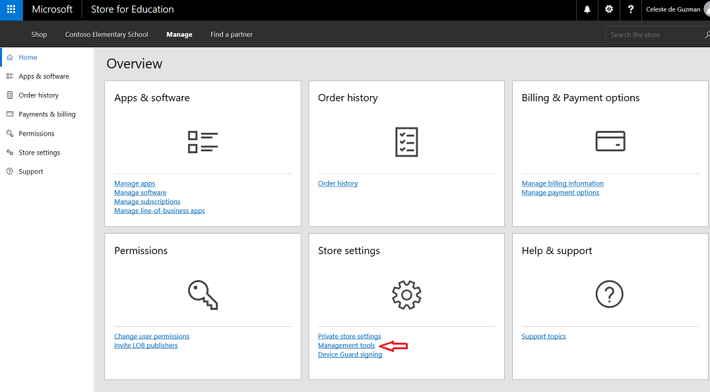

# Configure Microsoft Store for Education

> [!div class="step-by-step"]
[<< Use School Data Sync to import student data](use-school-data-sync.md)
[Use Intune for Education to manage groups, apps, and settings >>](use-intune-for-education.md)

You'll need to configure Microsoft Store for Education to accept the services agreement and make sure your Microsoft Store account is associated with Intune for Education.

You can watch the video to see how this is done, or follow the step-by-step guide.  

> [!VIDEO https://www.youtube.com/embed/Jnbssq0gC_g]

You can watch the descriptive audio version here: [Microsoft Education: Configure Microsoft Store for Education (DA)](https://www.youtube.com/watch?v=bStgEpHbEXw)

## Associate your Microsoft Store account with Intune for Education

1. Sign in to <a href="https://educationstore.microsoft.com" target="_blank">Microsoft Store for Education</a>.
2. Accept the Microsoft Store for Business and Education Services Agreement. 

  This will take you to the Microsoft Store for Education portal.

  **Figure 1** - Microsoft Store for Education portal

  

3. In the Microsoft Store portal, click **Manage** to go to the Microsoft Store **Overview** page.
4. Find the **Overview** page, find the **Store settings** tile and click **Management tools**.

  **Figure 2** - Select management tools from the list of Store settings options

  

4. In the **Management tools** page, find **Microsoft Intune** on the list and click **Activate** to get Intune for Education ready for use with Microsoft Store for Education.

  **Figure 3** - Activate Intune for Education as the management tool

   

Your Microsoft Store for Education account is now linked to Intune for Education so let's set that up next.

> [!div class="step-by-step"]
[<< Use School Data Sync to import student data](use-school-data-sync.md)
[Use Intune for Education to manage groups, apps, and settings >>](use-intune-for-education.md)

## Related topic
[Get started: Deploy and manage a full cloud IT solution with Microsoft Education](get-started-with-microsoft-education.md)
