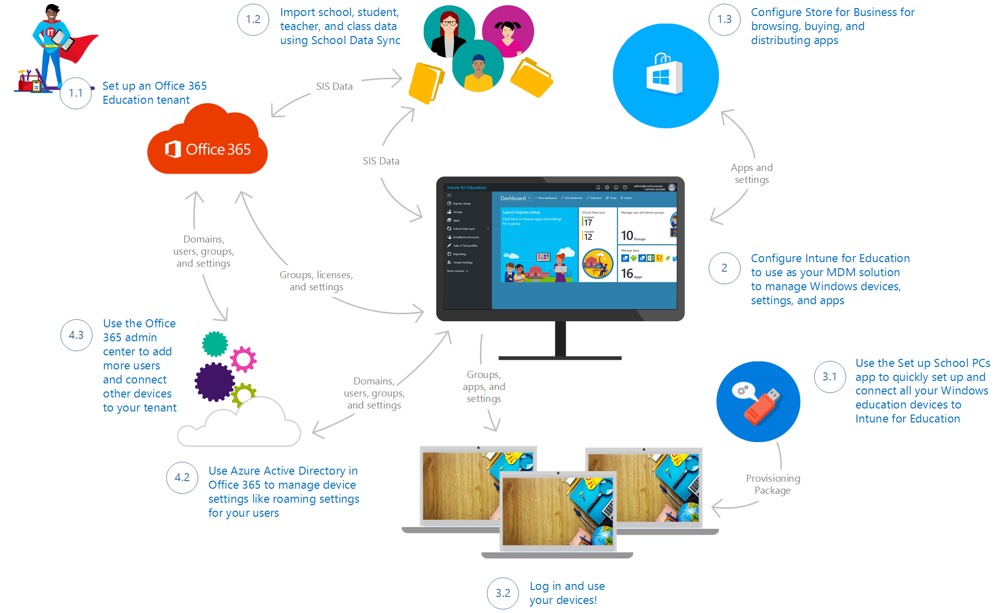
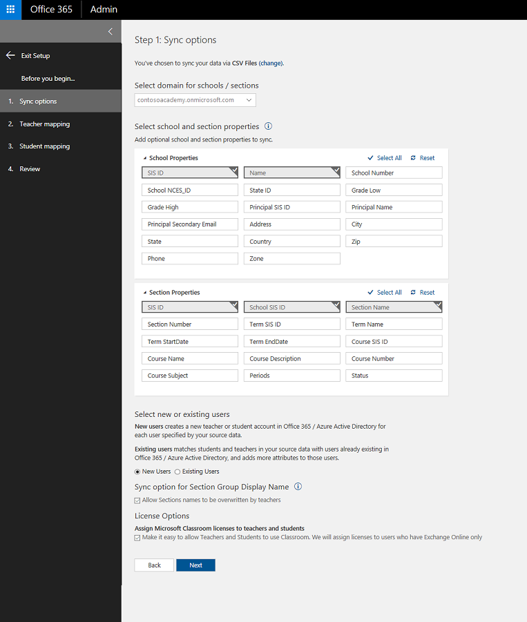
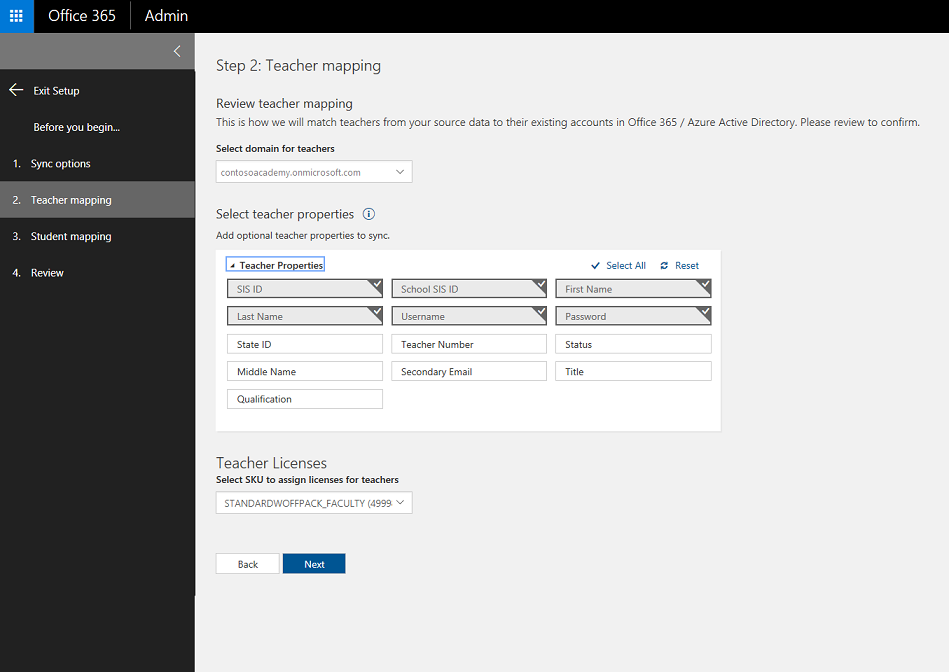
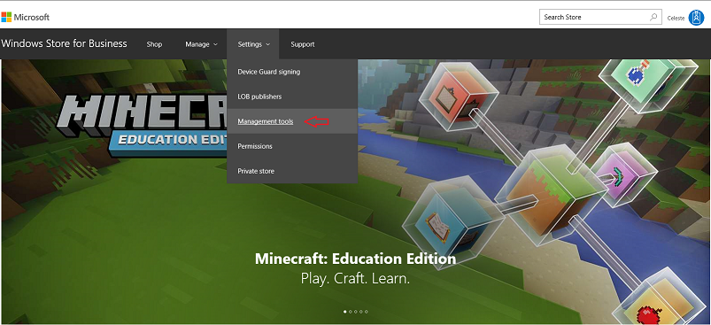
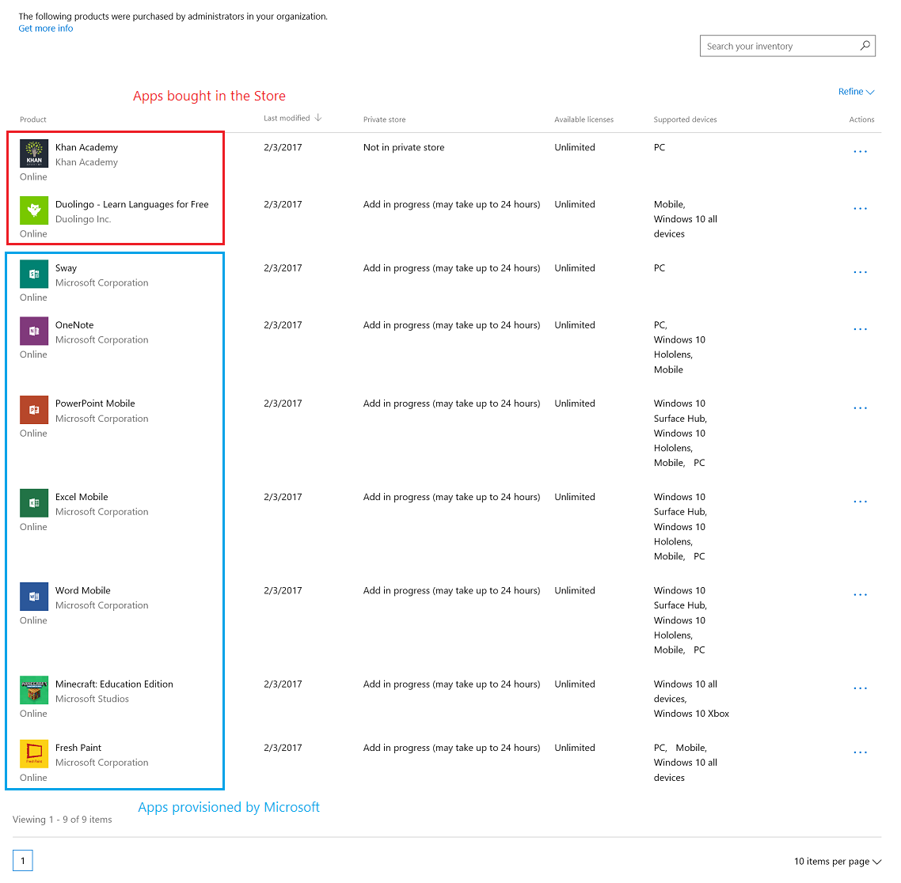
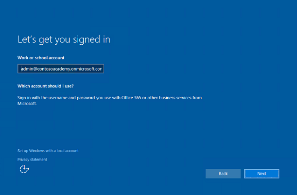
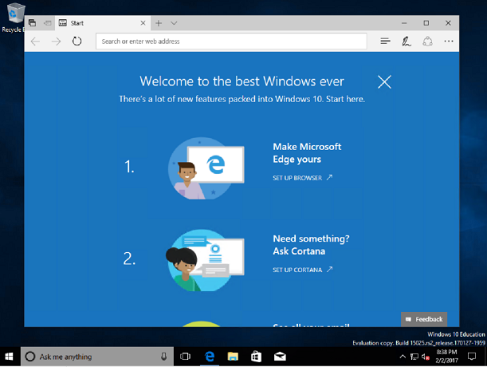
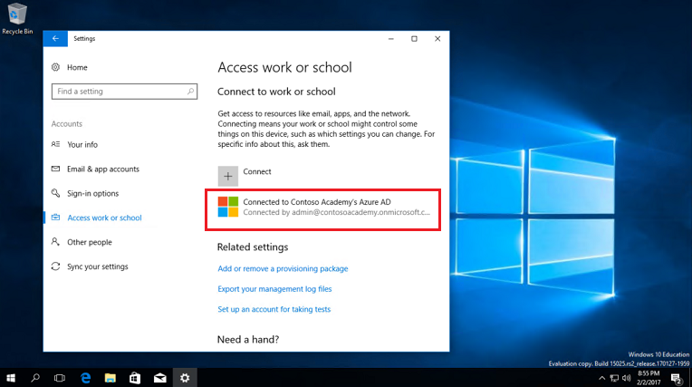
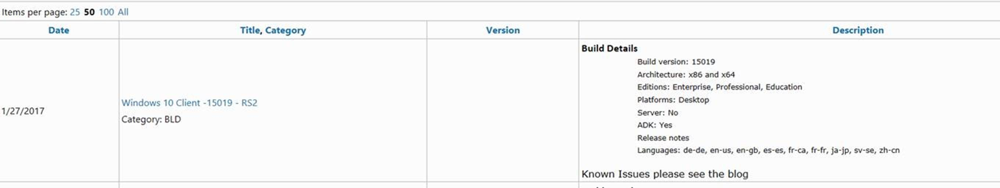

# Get started: Deploy and manage a full cloud IT solution using the Microsoft Education System

**Applies to:**

-   Office 365 Education, Microsoft Classroom, School Data Sync, Intune for Education, Store for Business, Set up School PCs, Windows 10   

Hello, IT administrators! In this walkthrough, we'll show you how you can quickly and easily use the new Microsoft Education system, consisting of new and existing cloud services and tools, to implement a full IT cloud solution for your school.

## What is the Microsoft Education System?
**Microsoft Education System (MSES)** consists of these new and existing services and tools from Microsoft:
- **Intune for Education** for simple set up, control, and management of the resources for your school including apps, devices, and settings
- **Office 365 Education** provides online apps for work from anywhere and desktop apps for advanced functionality, built for working together and available across devices, and it's free for schools, teachers, and students
  - **Microsoft Classroom** allows teachers to create classes, assignments, class calendars, conversations, and more, and **School Data Sync (SDS)** to manage your school data 
  - **OneNote Class Notebook** to organize course content, create and deliver interactive lessons to some or all students, collaborate and provide private feedback to individual students, and connect with major LMS and SIS partners for assignment workflow
- **Learning Tools** are moving beyond the OneNote desktop app and is now available in Office Lens, OneNote Online, Word Online, and Word desktop
- **Whiteboard** to create interactive lessons on the big screen, share and collaborate real-time by connecting to Class Notebook and Classroom
- **Windows 10 Creators Update** which brings 3D for everyone and other new and updated Windows features
- **Minecraft: Education Edition** which provides an open and immersive environment to promote creativity, collaboration, and problem-solving 

With the new Microsoft Education System, schools can:
- **Use affordable devices and simple setup** - Boost creativity and get started instantly with Windows 10 devices that support Windows Ink. Set up devices in minutes and stay in control with the new Intune for Education.
- **Collaborate in a modern classroom** - Help students become career-ready with Office apps like Word, Excel, PowerPoint, and OneNote. Increase comprehension and outcomes with the most advanced teaching apps like integrated Learning Tools.
- **Go beyond the browser with inspiring apps for classroom learning** - Inspire with Minecraft: Education Edition and innovative apps from the Store.

Go to the <a href="https://www.microsoft.com/en-us/education" target="_blank">Microsoft Education site</a> to learn more about Microsoft Education System. See <a href="https://www.microsoft.com/en-us/education/buy-license/overview-of-how-to-buy/default.aspx?tabshow=schools" target="_blank">How to buy</a> to learn about pricing and purchasing options for schools, students, and teachers as well as academic pricing and offers for qualified K-12 and higher education institutions.

## What we're doing
In this walkthrough, we'll show you the basics on how to:
- Acquire an Office 365 education domain
- Import school student, teacher, and class data through School Data Sync (SDS)
- Manage app and settings deployment with Intune for Education
- Acquire additional apps in Store for Business
- Use the Set up School PCs app to quickly set up and provision your Windows education devices
- Log in and use the device

This diagram shows a high-level view of what we cover in this walkthrough. The numbers correspond to the sections in the walkthrough and roughly correspond to the flow of the overall process, but note that not all sections are shown in the diagram.

## Prerequisites
Here's a few a tasks you need to complete before you start the walkthrough:
- [Download and install the latest Windows 10 Creators Update image](#download-and-install-the-latest-windows-10-creators-update-image). 

  This process takes a while so we recommend that you start this task before setting up your cloud infrastructure.

- Open an InPrivate session on your browser.

  > [!IMPORTANT] 
  > **This document is for internal use only**. To get started, click on this link: https://aka.ms/intuneforedutrial

## 1. Set up your cloud infrastructure
In the following sections, we'll walk you through the process of setting up a basic cloud infrastructure for your school.

### 1.1 Set up your Office 365 Education tenant
Schools can use Office 365 to save time and be more productive. Built with powerful tools and accessible from any device, setting it up is the first step in getting your school to the cloud. 

**To set up Office 365**
1. Create an account and a user ID and password to use to sign into your account. 

  **Figure 1** - Office 365 account creation

  

2. Save your sign-in info so you can use it to sign into https://portal.office.com (the sign-in page). Click **You're ready to go...** 
3. In the **Verify eligibility for Microsoft Office 365 Education** screen:
  1. In the **welcome** screen, click **Next**.
  2. In the **type a domain name** screen, click **I'll verify later** and then click **Yes** on the confirmation window that pops up. 
4. Once the confirmation window goes away, you should see the Office 365 admin center.

   **Figure 2** - Office 365 admin center

   

5. **Optional**. On the **Welcome to the new Office 365 admin center** pop-up window, click **Next** to get a brief tour of the admin center.

As part of setting up a basic cloud infrastructure, you don't need to complete the rest of the Office 365 Education setup so we will skip the rest of setup for now and start importing school data. You can pick up where you left off with Office 365 Education setup once you've completed the rest of the steps in the walkthrough. See [4.2 Complete Office 365 Education setup](#42-complete-office-365-education-setup) for info.

### 1.2 Turn on Classroom and use SDS to import SIS data
Teachers and students can use Microsoft Classroom to manage all classses and assignment workflows. Teachers can use it to create a class notebook for everyone in the class, use it to create assignments for multiple classes at the same time, and more. See the <a href="https://classroom.microsoft.com/" target="_blank">Microsoft Classroom</a> site to learn more. 

School Data Sync (SDS) helps you import Student Information System (SIS) data into Office 365. It helps automate the process for importing and integrating SIS data that you can use with Office 365 and apps like Classroom and OneNote Class Notebooks. To learn more about School Data Sync (SDS) and the deployment methods available to you, see <a href="https://aka.ms/sdsoverview" target="_blank">Overview of School Data Sync and Classroom</a>. We recommend using comma separated value (CSV) files with SDS to synchronize SIS users with Office 365. However, SDS supports many other deployment options such as PowerSchool Sync, Clever Sync, and OneRoster CSV files. See the *For IT admins* section in [Get more info](#get-more-info) to learn more about these other deployment options.

In this section of the walkthrough, we created a new education tenant and we need to add new users. To simplify this process, we will use sample SDS files to prepopulate our tenant with school data. We also need to turn on Microsoft Classroom to enable users to access the app.

**Download sample school data**

1. Go to the <a href="https://aka.ms/sdsscripts" target="_blank">O365-EDU-Tools GitHub site</a>.
2. Click the green **Clone or download** button to download the SDS sample files.

  **Figure 3** - Download the SDS sample files from GitHub

  

3. In the **Clone with HTTPS** pop-up window, choose **Download ZIP** and note the location where you're saving the folder.
4. Go to the folder where you saved the .zip and unzip the files.
5. Open the **O365-EDU-Tools-master** folder and then open the **CSV Samples** subfolder. Confirm that you can see the following sample CSV files.

  **Figure 4** - Sample CSV files

  

  > [!NOTE] 
  > - The sample CSV files uses sample accounts and passwords. If you are using the sample files for testing, remember the accounts and their corresponding passwords. You may be asked to change the password during your first sign in. 
  > - If you are modifying the sample CSV files to use in your organization, change the accounts and passwords to match the user accounts and passwords in your organization.
  > - If you are using CSV files from your existing production environment, see the detailed instructions in step 5 in the next section.

  To learn more about the CSV files that are required and the info you need to include in each file, see <a href="https://aka.ms/sdscsvattributes" target="_blank">CSV files for School Data Sync</a>. If you run into any issues, see <a href="https://aka.ms/sdserrors" target="_blank">School Data Sync errors and troubleshooting</a>.

**Turn on Classroom and use SDS to import data**

1. Go to the <a href="http://sds.microsoft.com" target="_blank">Microsoft School Data Sync site</a>.
2. Click **Sign in**. You will see the **Settings** option for **Manage School Data Sync and Classroom**.

  **Figure 5** - Settings for managing SDS and Classroom

  

3. Turn on **School Data Sync**. You will get a notification that it is turned on. Click **OK**.

  New menu options will appear on the left of the SDS portal.

  **Figure 6** - New menu options appear after SDS is turned on

  

4. Turn on **Microsoft Classroom**. You will get a notification that Classroom is turned on.
5. Click **+ Add Profile** from the sync dashboard or from the menu on the left to start syncing school data.

  This opens up the new profile setup wizard within the main page.

  **Figure 7** - New SDS profile setup wizard

  

6. For the new profile, in the **Before you begin...** screen:
  1. Enter a name for your profile, such as *ContosoAcademySDSProfile*.
  2. Select a sync method for your profile. For this walkthrough, select **CSV Files**.

    Note that for any sync method that you choose, you can click the **View steps** link to get more information about the steps you need to take depending on the sync method of your choosing.
    
  3. Click **Start**.

    **Figure 8** - Add a name and sync method for the new profile

    

7. In the **Sync options** screen:
  1. Select the domain for the schools/sections. If you have more than one domain, make sure you select the domain that corresponds to the profile you're creating.
  2. In the **Select school and section properties** section, select the properties you want to sync. If you select additional properties, make sure you have these properties and values added in the CSV files. For the walkthrough, we're not changing the default values. These are:
    - **School properties:** SIS ID, Name
    - **Section properties:** SIS ID, School SIS ID, Section Name
  3. In the **Select new or existing users** section, select either **New Users** or **Existing Users** based on the scenaro that applies to you.
    - Choose **New Users** if this is a brand new tenant and this is the first time that you're adding users.

        Choose the **New Users** option if you are using an unaltered version of the sample CSV files from [Download sample school data](#downloadcsvsamples) or if you created your own CSV files with new users.

    - Choose **Existing Users** if you already have a live production tenant, with teachers and students that already have active accounts in Office 365 (cloud only or synced from on-premise Active Directory).

        Using the **Existing Users** option, SDS will not attempt to create new users. Instead, it uses the identity matching options in the next section of the setup wizard to match the students and teachers in your CSV files to the user accounts that already exist in Azure. All additiional details for the students and teachers contained within the CSV files will be written as extension attributes on top of the already existing user objects. You can find more information about these settings on the main SDS deployment page for CSV-based deployments in <a href="http://aka.ms/sdscsv" target="_blank">How to deploy School Data Sync by using CSV files</a>.

  4. In the **Sync option for Section Group Display Name**, check the box if you want to allow teachers to overwrite the section names.
  5. In the **License Options** section, check the box to **Assign Microsoft Classroom licenses to teachers and students**.
  6. Click **Next**.

    **Figure 9** - Sync options for the new profile

    

8. In the **Teacher mapping** screen:
  1. Select the domain for the teachers. SDS uses this to match teachers from your source data to their existing accounts in Office 365/Azure Active Directory. In the walkthrough, the CSV files are our source data.
  2. In the **Select teacher properties** section, you can add optional teacher properties to sync. For this walkthrough, you don't have to change the default.
  3. In the **Teacher licenses** section, choose the SKU to assign licenses for teachers. For this walkthrough, choose **STANDARDWOFFPACK_FACULTY**.
  4. Click **Next**.

    **Figure 10** - Specify options for teacher mapping

    

9. In the **Student mapping** screen:
  1. Select the domain for the students. SDS uses this to match students from your source data to their existing accounts in Office 365/Azure Active Directory. In the walkthrough, the CSV files are our source data.
  2. In the **Select student properties** section, you can add optional student properties to sync. For this walkthrough, you don't have to change the default.
  3. In the **Student licenses** section, choose the SKU to assign licenses for students. For this walkthrough, choose **STANDARDWOFFPACK_STUDENT**.
  4. Click **Next**.

    **Figure 11** - Specify options for student mapping

    

10. You will see a page for your profile. The status might indicate that it's still being set up. 

  In the profile **Review** page, review the summary and confirm that the values matches with the data you entered. 

    **Figure 12** - Review the summary and confirm that it matches with the data you entered.

    

11. After the profile name at the top, confirm that the status for your profile now says **Ready to sync**.

  **Figure 13** - New profile is ready to sync

  

11. On the profile page, below the profile name and profile status, there are four options: **Upload Files**, **Start Sync**, **Edit**, and **Delete**. Click **Upload Files** and then follow these steps:
  1. In the **Select data files to be uploaded** window, click **Add Files** and navigate to the directory where you saved the six CSV files required for data import.
  2. In the File Explorer window, choose all the files at the same time and then click **Open**.
  3. In the **Select data files to be uploaded** window, confirm that all six CSV files (School.csv, Section.csv, Student.csv, StudentEnrollment.csv, Teacher.csv, and TeacherRoster.csv) are listed and then click **Upload**.
  4. After all the files are successfully uploaded, click **OK**.
12. On the profile page, click **Start Sync** and then follow these steps:
  1. In the **Would you like to start sync for *Profile_Name?*** window, click **Start Sync**. *Profile_Name* should match the name you entered for your profile in the **Before you begin...** screen.
  2. Confirm that sync successfully started for the file and then click **OK**.

  > [!NOTE]
  > Sync times, like file download times, can vary widely depending on when you start the sync, how much data you are syncing, the complexity of your data (such as the number of users, schools, and class enrollments), overall system/network load, and other factors. Two people who start a sync at the same time may not have their syncs complete at the same time.
  >
  > You can refresh the page to confirm that your profile synced successfully.

That's it for school data. Next, we'll configure Store for Business.

### 1.3 Configure Store for Business for app distribution
You'll need to configure Store for Business to accept the EULA and associate your Store account with Intune for Education by selecting Intune as the management tool for distributing apps.

**Associate your Store account with Intune for Education**
1. Sign into <a href="https://www.microsoft.com/en-us/business-store" target="_blank">Store for Business</a>.
2. Accept the Store for Business Services Agreement. This will take you to the Store portal.

  **Figure 13** - Store for Business

  

3. In the Store for Business portal, select **Settings > Management tools** to go to the management tools page.

  **Figure 14** - Select management tools from the Settings dropdown

  

4. In the **Management tools** page, find **Microsoft Intune** on the list and click **Activate** to get Intune for Education ready for use with Store for Business.

  **Figure 15** - Intune is activated from the Store portal

   

5. In the **Show offline-licensed apps** window, click **Yes**. This lets the school cache apps and their licenses to deploy within within the school's network. You can find more information about offline licensing in [Apps in the Store for Business](https://technet.microsoft.com/en-us/itpro/windows/manage/apps-in-windows-store-for-business).

Your Store account is now linked to Intune for Education so let's set that up next.

## 2. Use Intune for Education to manage groups, apps, and settings
Intune for Education is a streamlined device management solution for educational institutions that can be used to quickly set up and manage Windows 10 devices for your school. It provides a new streamlined UI with the enterprise readiness and resiliency of the Intune service. You can learn more about Intune for Education by reading the **Intune for Education documentation**. 

#### Example - Force a sync, set up Intune for Education, buy apps from the Store, and install the apps
In this walkthrough, we'll go through a sample scenario and walk you through the steps to:
- Force a sync in Intune for Education so that apps will appear in your catalog right away
- Quickly set up Intune for Education
- Use Intune for Education to buy apps from the Store for Business
- Use Intune for Education to install the apps for all users in your tenant

Note that for verified education tenants, Microsoft automatically provisions your app catalog with these apps so you will see them appear on your Intune catalog even before you've bought any apps:
- Excel Mobile
- Fresh Paint
- Minecraft: Education Edition (trial license)
- OneNote
- PowerPoint Mobile
- Sway
- Word Mobile

  > [!NOTE]
  > Apps that you own in Store for Business are automatically available in Intune for Education. Any changes you make to your purchases get reflected in Intune for Education.

**Sync recently purchased apps**

To sync your most recently purchased apps and have it appear in your catalog right away, force a Store sync.
 
1. Log in to the <a href="https://intuneeducation.portal.azure.com/" target="_blank">Intune for Education console</a>.
2. Select **Tenant Settings** to see the various settings that you can configure for your tenant.

  **Figure 16** - Select tenant settings

  

3. Click the ***Edit** button to make edits to the tenant settings.
  1. In the **Others** settings group, locate the **Sync with store** setting and then click **On** to turn on sync with Store for Business.
  2. Click **Save** to save your changes.

    **Figure 17** - Update your tenant settings to turn on sync with Store

    

4. In the updated **Tenant Settings** page:
  1. Confirm that **Sync with store** now says **On** next to it.
  2. At the top of the page, click **Sync with Store now** to force a sync.

**Set up Intune for Education**

Intune for Education provides an Express Configuration option so you can get going right away. We'll use that option here.

1. Log into the <a href="https://intuneeducation.portal.azure.com/" target="_blank">Intune for Education console</a>. You will see the Intune for Education dashboard once you're logged in.

  **Figure 18** - Intune for Education dashboard

  

2. On the dashboard, click **Launch Express Configuration**, or select the **Express Configuration** option on the menu on the left.
3. In the **Welcome to Intune for Education** screen, click **Get started**.
  
  **Figure 19** - Choose the group

  

4. In the **Choose group** screen, select **All Users**. All apps and settings that we select during express setup will apply to this group. 

  You can choose another group during this step, but note that your experience may vary from what we show in the walkthrough.

5. The **Next** button will appear at the bottom of the screen after you select **All Users**. Click **Next**.

  > [!TIP]
  > At the top of the screen, did you notice the **Choose group** button change to a green check mark? This means we are done with that step. If you change your mind or need to make changes, simply click on the button to go back to that step. Try it!
  >
  > **Figure 20** - Click on the buttons to go back to that step
  >
  > 

6. In the **Choose apps** screen, you will see a selection of Web apps and Windows Store apps. You will also see a list of popular apps from each category. 

  - Add or remove apps by clicking on them. A blue checkmark means the app is added and will be installed for all members of the group selected in the **Choose group** step.
  
    In this walkthrough, it's up to you to select the apps you choose to install. Just remember what they are so that later in the walkthrough you can verify that they were installed correctly on the device.

    > [!TIP]
    > Web apps are pushed as links in the Windows Start menu under **All apps**. If you want apps to appear in Edge browser tabs, use the **Homepages** setting for Edge through Express Configuration or Manage Users and Devices.

  **Figure 21** - Choose the apps that you want to install for the group

  

7. When you're done choosing apps, click **Next** at the bottom of the screen.

  If you select Store for Business apps, you will see a notification that Intune for Education is getting these apps.

8. In the **Choose settings** screen, we will set the settings to apply to the group. Click the reverse caret (downward-facing arrow) to expand the settings group and get more information about each setting in that settings group.

  **Figure 22** - Expand the settings group to get more details

  

9. For this walkthrough, set the following settings:
  - In the **Internet browser settings** group, change the **Do-Not-Track headers** setting to **Block**.
  - In the **Device update settings** group, change the **Choose how to install updates** setting to **Auto install and reboot at scheduled time**, and then set the **Auto Install and Reboot Day** to **Friday** and the **Auto Install and Reboot Time** to **4 PM**.

  **Figure 23** - Set some additional settings

  

10. Click **Next**. In the **Review** screen, you will see a summary of the apps and settings you selected to apply.
11. Click **Save** to end express configuration.
12. You will see the **You're done!** screen which lets you choose one of two options. 

  **Figure 24** - All done with Intune for Education express setup

  

13. Click **All done** or click the **X** on the upper-right corner of the screen to dismiss this screen and go back to the dashboard.

**Add apps bought from Store for Business**
- **Example 1 - Minecraft: Education Edition**

  By default, education tenants automatically get trial licenses for Minecraft: Education Edition. However, if you would like to purchase Minecraft: Education Edition or want to learn more about volume licensing, see <a href="https://technet.microsoft.com/en-us/edu/windows/school-get-minecraft" target="_blank">For IT administrators - get Minecraft: Education Edition</a>.

- **Example 2 - Free educational/reference apps**

  1. In the <a href="https://intuneeducation.portal.azure.com/" target="_blank">Intune for Education console</a>, click **Apps** from the menu on the left.

    **Figure 25** - Click on **Apps** to see the list of apps for your tenant

    

  2. In the **Store apps** section, click **+ New app**. This will take you to the Store for Business portal and you will already be signed in.

    **Figure 26** - Select the option to add a new Store app

    

  3. In the Store for Business page, check some of the categories for suggested apps or search the Store for a free educational or reference app. Find ones that you haven't already installed during express setup for Intune for Education.
  
    For example, these apps are free:
    - Duolingo - Learn Languages for Free
    - Flashcards Pro 
    - Khan Academy
    - My Study Life

  4. Select the app you want to install.
  5. In the app's Store page, select the license type and then select **Get the app**.
  6. You should see a dialog that confirms your order. Click **Close**.
  7. In the app's Store page, select **Add to private store**.
  8. Repeat steps 3-7 to install another app.
  9. In the Store for Business portal, select **Manage > Inventory** and verify that the apps you purchased appear in your inventory.

    For example, if you bought Duolingo and Khan Academy, they will show up in your inventory along with the apps that Microsoft automatically provisioned for your education tenant.

    **Figure 27** - Apps inventory in Store for Business

    

    In the **Private store** column of the **Inventory** page, the status for some apps will indicate that it's "In private store" while others will say "Not in private store". We won't go over this in the walkthrough, but you can learn more about this in [Distribute apps using your private store](https://technet.microsoft.com/en-us/itpro/windows/manage/distribute-apps-from-your-private-store).

    > [!NOTE]  
    > You'll see in the above screenshot that some apps say that add is in progress. Sync happens automatically, but it may take up to 24 hours for your organization's private store and 12 hours for Intune for Education to sync all your purchased apps. Let's force a sync to make this process happen faster. 

**Install apps for all users**

Now that you've bought the apps, use Intune for Education to specify the group to install the apps for. Here, we'll show you how to install the apps you bought for all devices used by all users in your tenant. 

1. In the <a href="https://intuneeducation.portal.azure.com/" target="_blank">Intune for Education console</a>, click the **Groups** option from the menu on the left.

  **Figure 28** - Groups page in Intune for Education

  

2. In the **Groups** page, select **All Users** to see the list of users. The list should match all the names we imported using SDS.

  > [!TIP]
  > If you don't see the names, click the **Users** option in the taskbar at the top of the **All Users** page. 

  **Figure 29** - List of all users in the tenant

  

3. In the taskbar at the top, select **Apps** and then click **Edit apps** to see a list of available apps.

  **Figure 30** - Edit apps to assign them to users

  

4. Select the apps you want to deploy to the group. A blue checkmark will appear next to the apps you select. 

  **Figure 31** - Select the apps you want to deploy to the group

  

5. Once you're done, click **Save** at the bottom of the page to deploy the selected apps to the group.
6. You'll be notified that app assignments are being updated. The **All Users** groups page will now include the apps you selected. 

  **Figure 32** - Updated list of assigned apps

  

You're now done assigning apps to all users in your tenant. It's time to set up your Windows device(s) and check that your cloud infrastructure is correctly set up and your apps are being pushed to your devices from the cloud.

## 3. Set up your Windows devices

### 3.1 Set up devices using Set up School PCs or Windows OOBE
We recommend using the latest build of Windows 10 Creators Update (version 1703) on your Windows education devices. If you haven't done so already, [download and install the latest Windows 10 Creators Update image](#download-and-install-the-latest-windows-10-creators-update-image).

To set up new Windows devices and enroll them to your education tenant, choose from one of these options:
- **Option 1: [Use the Set up School PCs app](#usesetupschoolpcs)** - You can use the app to create a setup file that you can use to set up your Windows 10 devices.
- **Option 2: [Go through Windows OOBE and join the device to Azure AD](#usewindowsoobandjoinaad)** - You can go through a typical Windows device setup or first-run experience to configure your device.

**Option 1: Set up a device using the Set up School PCs app**

  > [!NOTE]  
  > The Set up School PCs app is coming soon! Until it's ready, follow the steps in this section to install a setup file (provisioning package) that we created for you. You still have to go through OOBE to join Wi-Fi and Azure AD, but you won't need these steps when the Set up School PCs app is available.

**Prerequisite:** 
- Copy the latest version of the education provisioning package file, **SetupSchoolPC.ppkg**, from the <a href="https://www.yammer.com/wsscengineering/#/groups/10257877/files" target="_blank">Microsoft Education System TAP Yammer group</a> to a USB key.

1. Boot up a new or reset Windows 10 device.
2. During Windows setup, at the **Let's start with region** screen, insert the USB key into your Windows device.
3. When the **You can eject your removable device** message appears on the screen, remove the USB key.
4. Complete the rest of the Windows device setup experience.
5. If you don't have a Wi-Fi network configured, make sure you connect the device to the Internet through a wired/Ethernet connection.
6. On the **Let's get you signed in** screen, enter one of the accounts that you set up for your education tenant.
7. Complete the rest of device setup and then reboot the device.

> [!NOTE]
> **The following section on using the Set up School PCs app is preliminary and subject to change. The steps are based on a preliminary build of the app, which is still in development.**

1. Launch the Set up School PCs app.

  **Figure 33** - Launch the Set up School PCs app

  

2. Click **Start**.
3. In the **Sign in to Office 365 or Azure Active Directory** page, click **Sign in**. If you don't sign in, you will not be able to configure access for guest sign-in, Take a Test, and Office installation.

  If you opt to sign in:

  1. Choose the account from the list. If you don't see the account, you can add a work or school account to sign in the devices. 
  2. Click **Next** once you've specified the account.
  3. If you added an account, you may be asked to provide the user account and password. You will get a notification to allow the app to access your account. This will give Set up School PCs permission to access Store for Business, read hidden memberships, sign you in and read your profile, and more.
  4. Click **Accept**.

    The account will show up as the account that Set up School PCs will use to connect the school PCs to the cloud.

    **Figure 34** - Verify that the account you selected shows up

    

  5. Click **Next**.
  
4. To allow the student PCs to automatically connect to your school's wireless network, in the **Select the school's wireless network** page:
  1. Select the school's Wi-Fi network from the list of available wireless networks or manually add a wireless network. 
  2. Click **Next**.

5. To assign a name to the student PCs, in the **Assign a name to these PCs** page:
  1. Add a name that Set up School PCs will use as a prefix to identify and easily manage the group of devices, apps, and other settings through your device management client. 
  
  For example, if you add *ComputerLab* as the prefix, the device names will be *ComputerLab_random-string-of-numbers-and-letters*. The random string of numbers and letters ensure that all device names are unique.

  2. Click **Next**.

6. If you want to set up the Take a Test app and use it for taking quizzes and high-stakes assessments by some providers like Smarter Balanced, configure the settings in the **Set up Take a Test app** page.
  1. Enter the assessment URL.
  2. Check the options whether to allow keyboard text suggestions to appear, allow teachers to monitor online tests, or allow students to print the test so they can take it offline. You can select more none, or one or more of these options.

    If you set up Take a Test, this adds a **Take a Test** button on the student PC's sign-in screen. Windows will also lock down the student PC so that students can't access anything else while taking the test.

    **Figure 35** - Configure the Take a Test app

    

  3. Click **Next** or **Skip** depending on whether you want to set up Take a Test.

7. If you want to add Store for Business apps to the student PCs, you can select from the list of recommended apps in the **Add STEM and Makerspace apps to Student PCs** page.
  1. Select the apps that you want to add. You'll see a checkmark on apps that you select.
  2. Click **Next**.

    **Figure 36** - Select Store apps to add to student PCs

    

8. To specify other settings for the student PC, in the **Configure student PC settings** page:
  - Select **Clean student PC** to remove pre-installed apps from the device manufacturer.
  - Select **Enable local storage** to let students save files to the **Desktop** and **Documents** folder on the student PC. We don't recommend this option if the device will be part of a shared cart or lab.
  - Select **Make the device 1:1** to optimize the device for use by a single student. Check this option if the device will not be part of a shared cart or lab.
  - Select **Enable guest sign-in** to allow guests to use student PCs without a school account. For example, if the device will be in a library and you want other users (like visiting students or teachers) to be able to use the device, you can select this option.

    If you check **Enable guest sign-in**, this adds a **Guest** account button in the PC's sign-in screen to allow anyone to use the PC.

  - To change the default lock screen background or to use your school's custom lock screen background, click **Browse** to select a new lock screen background.

    **Figure 37** - Configure student PC settings

    

9. When you're done configuring the student PC settings, click **Next**.

10. In the **Review your settings** page, check that all the settings you configured appear correctly. 
  1. If you need to change any of the settings, you can click on the blue links to go back to that page and make your changes.

      **Figure 38** - Review your settings and change them as needed

      

  2. Click **Next**.

11. In the **Save your settings** page:
  1. Insert a USB drive to save your settings and create a setup file on the USB drive.
  2. Set up School PCs will automatically detect the USB drive after it's inserted. Choose the USB drive from the list.
  3. Click **Save** to save the setup file to the USB drive.

      **Figure 39** - Select the USB drive and save the setup file

      

  4. When the setup file is ready, you will see the name of the file and you can remove the USB drive.

      **Figure 40** - Setup file is ready

      

  5. Click **Next** if you're done, or click **Save to another USB drive** to save the same setup file to another USB drive.

12. Follow the instructions in the **Get the student PCs ready** page to start setting up the student PCs.

  **Figure 41** - Line up the student PCs and get them ready for setup

  

13. Click **Next**.
14. In the **Install the setup file on student PCs** page, follow the rest of the instructions for setting up the student PCs.

  Select **Yes, I want to start a new package** if you need to create a new provisioning package. Or, select **No, I'm done**.

  **Figure 42** - Install the setup file on the student PCs

  

**Option 2: Set up a device using Windows OOBE**
1. If you don't have a Wi-Fi network configured, make sure you connect the device to the Internet through a wired/Ethernet connection.
2. Go through the Windows device setup experience. On a new or reset device, this starts with the **Let's get you signed in** screen.

  **Figure 43** - Let's get you signed in

  

3. Sign in using the user account and password that you set up for one of the users in your education tenant. Depending on the user password setting, you may be prompted to update the password.
4. Choose privacy settings for your device. Location, speech recognition, and diagnostics are all on by default. You can turn off a setting based on your privacy preferences. Click **Accept** to go through the rest of device setup.

  **Figure 44** - Windows setup is complete

  

### 3.2 Verify correct device setup
Verify that the device is set up correctly and boots without any issues.

**Verify that the device was set up correctly**
1. Confirm that the Start menu contains a simple configuration.
2. Confirm that the Store and built-in apps are installed and working. The apps pushed down from Intune for Education will appear under **Recently added**. Note that it may take some time before some apps are pushed down to your device from Intune for Education. Check again later if you don't see some of the apps you provisioned for the user.

  **Figure 45** - Apps list contains the apps provisioned for the user

  

### 3.3 Verify the device is Azure AD joined
Let's now verify that the device is joined to your organization's Azure AD and shows up as being managed in Microsoft Intune for Education.

**Verify if the device is joined to Azure AD**
1. Log in to the <a href="https://intuneeducation.portal.azure.com/" target="_blank">Intune for Education console</a>.
2. Select **Groups** and select **All Devices**.
3. In the **All Devices** page, see the list of devices and verify that the device you're signed into appears on the list.

  **Figure 46** - List of all managed devices

  

4. On the Windows education device, click **Start** and go to **Settings**. 
5. In the **Windows Settings** page, click **Accounts**. Select the **Access work or school** option on the left of the account info page.
6. In the **Access work or school** page, confirm that it says your device is connected to your organization's Azure AD.

  **Figure 47** - Confirm that the Windows device is joined to Azure AD

  

**That's it! You're done!** You've completed basic cloud setup for your education tenant and confirmed that your education devices and users are managed all in the cloud.

## 4. Finishing setup and other tasks

### 4.1 Update group settings in Intune for Education
If you need to make changes or updates to any of the apps or settings for the group(s), follow these steps.

1. Log in to the <a href="https://intuneeducation.portal.azure.com/" target="_blank">Intune for Education console</a>.
2. Click **Groups** and then choose **Settings** in the taskbar at the top of the page.
3. You will see the same settings groups that you saw in express setup for Intune for Education as well as other settings categories such as **Windows Defender settings**, **Device sharing** and so on.

  **Figure 48** - Use the **Settings** option to make app or device settings changes

  

4. Click **Save** or **Discard changes**.

### 4.2 Configure Azure settings
After completing the basic setup for your cloud infrastructure and confirming that it is up and running, it's time to prepare for additional devices to be added and enable capabilities for the user to use.

#### Enable many devices to be added by a single person 
When a device is owned by the school, you may need to have a single persion adding many devices to your cloud infrastructure. 

Follow the steps in this section to enable a single person to add many devices to your cloud infrastructure.

1. Sign in to the <a href="https://portal.office.com" target="_blank">Office 365 admin center</a>.
2. Click **Admin centers** and select **Azure AD** to go to the Azure portal.
3. Configure the device settings for the school's Active Directory. From the new Azure portal, <a href="https://portal.azure.com" target="_blank">https://portal.azure.com</a>, select **Azure Active Directory > Users and groups > Device settings**.

    **Figure 49** - Device settings in the new Azure portal

    

<!-- Commenting out
  - If you are using the classic Azure portal, <a href="https://manage.windowsazure.com" target="_blank">https://manage.windowsazure.com</a>, click **Active Directory**, select **Configure** from the options at the top, and then scroll down to the **Devices** section.

    **Figure 38** - Device settings in the classic Azure portal

    
-->

4. Find the setting **Maximum number of devices per user** and change the value to **Unlimited**.
5. Click **Save** to update device settings.

#### Enable roaming settings for users
When students move from using one device to another, they may need to have their settings roam with them and be made available on other devices. 

Follow the steps in this section to ensure that settings for the each user follow them when they move from one device to another.

1. Sign in to the <a href="https://portal.office.com" target="_blank">Office 365 admin center</a>.
2. Click **Admin centers** and select **Azure AD** to go to the Azure portal.
3. Configure the device settings for the school's Active Directory. From the new Azure portal, <a href="https://portal.azure.com" target="_blank">https://portal.azure.com</a>, select **Azure Active Directory > Users and groups > Device settings**.
4. Find the setting **Users may sync settings and enterprise app data** and change the value to **All**.

  **Figure 50** - Enable settings to roam with users

  

5. Click **Save** to update device settings.

### 4.3 Complete Office 365 Education setup
Now that your basic cloud infrastructure is up and running, it's time to complete the rest of the Office 365 Education setup. You can find detailed information about completing Office 365 setup, services and applications, troubleshooting, and more by reading the <a href="https://support.office.com/en-US/Article/set-up-Office-365-for-business-6a3a29a0-e616-4713-99d1-15eda62d04fa#ID0EAAAABAAA=Education" target="_blank">Office 365 admin documentation</a>.

### 4.4 Add more users
After your cloud infrastructure is set up and you have a device management strategy in place, you may need to add more users and you want the same policies to apply to these users. 

You can add new users to your tenant simply by adding them to the Office 365 groups. Adding new users to Office 365 groups automatically adds them to the corresponding groups in Intune.

See <a href="https://support.office.com/en-us/article/Add-users-to-Office-365-for-business-435ccec3-09dd-4587-9ebd-2f3cad6bc2bc" target="_blank">Add users to Office 365</a> to learn more. Once you're done adding new users, go to the <a href="https://intuneeducation.portal.azure.com/" target="_blank">Intune for Education console</a> and verify that the same users were added to the Intune for Education groups as well.

### 4.5 Connect other devices to your cloud infrastructure
Adding a new device to your cloud-based tenant is easy. For new devices, you can follow the steps in [3. Set up devices](#3-set-up-your-windows-devices). For other devices, such as those personally-owned by teachers who need to connect to the school network to access work or school resources (BYOD), you can follow the steps in this section to get these devices connected.

  > [!NOTE]  
  > These steps enable users to get access to the organization's resources, but it also gives the organization some control over the device.

**To connect a personal device to your work or school**
1. On your Windows device, go to **Settings > Accounts**.
2. Select **Access work or school** and then click **Connect** in the **Connect to work or school** page.
3. In the **Set up a work or school account** window, click **Join this device to Azure Active Directory** to add an Azure AD account to the device.
4. In the **Let's get you signed in** window, enter the credentials for the account and then click **Sign in** to authenticate the user.
5. Depending on the organization's policy, you may be asked to update the password.
6. Verify the details to make sure you're connecting to the right organization and then click **Join**.
7. You will see a confirmation window that says the device is now connected to the organization. Click **Done**.
8. The **Connect to work or school** window will refresh and will now include an entry that shows you're connected to your organization's Azure AD. This means the device is now registered in Azure AD and enrolled in MDM and the account should have access to the organization's resources.
9. You can confirm that the new device and user are showing up as Intune-managed by going to the Intune management portal and following the steps in [3.3 Verify the device is Azure AD joined](#33-verify-the-device-is-azure-ad-joined). It may take several minutes before the new device shows up so check again later.

### 4.5 Set up Classroom

#### Tasks for IT administrator
School IT administrators can find more support documents about Microsoft Classroom by visiting <a href="https://aka.ms/classroomsupport" target="_blank">https://aka.ms/classroomsupport</a>.

To verify that Classroom is set up properly, we recommend going through these tasks:
- <a href="https://edu.uservoice.com/knowledgebase/articles/942180-personalize-classroom" target="_blank">Personalize Classroom</a>
- <a href="https://edu.uservoice.com/knowledgebase/articles/942195-class-notebooks-in-classroom" target="_blank">Set up the class notebook</a>
- <a href="https://edu.uservoice.com/knowledgebase/articles/942186-calendar-in-classroom" target="_blank">Check the calendar</a>

#### Tasks for teachers and students
Teachers and students can find one-time setup instructions for Microsoft Classroom, info on how to use it, and other resources in <a href="https://support.office.com/en-us/article/Get-started-with-Microsoft-Classroom-dd5d064f-6c22-41e0-b721-9d359857d037" target="_blank">Get Started with Microsoft Classroom</a>.

## Download and install the latest Windows 10 Creators Update image 
To evaluate the full Microsoft Education System experience, we recommend using the latest Windows 10 Creators Update (version 1703) image on your Windows devices. 

### Download the latest Windows 10 image
1. Go to the <a href="https://connect.microsoft.com/windowsserver/downloads" target="_blank">Windows Server and System Center Connect site</a> and sign in.

  > [!NOTE]
  > If you are part of the TAP program and don't have access to the Connect site, contact your Microsoft representative.

2. Go through the list of available downloads and select the latest Windows 10 Creators Update build.

  **Figure 51** - Sample download entry for the latest Windows 10 build

  

3. Download the .iso for the Windows edition that you need. 

  For example, the Windows 10 Education .iso will have a file name in this format: "buildnumber"."majorversion"."minorversion".RS_PRERELEASE_EDUCATION_OEMRET_X64FRE_EN-US.ISO.

### Create a bootable Windows 10 USB key 
Now that you have the latest Windows 10 Creators Update .iso from Connect, we recommend using the Windows USB/DVD Download Tool to quickly create a bootable Windows 10 USB key. 

**To download and install the Windows USB/DVD Download Tool** 
1. Follow the instructions in the <a href="https://www.microsoft.com/en-us/download/windows-usb-dvd-download-tool" target="_blank">Windows USB/DVD Download Tool Download Center page</a> to download and install the tool on your development workstation.

  > [!NOTE]
  > In case it's hard to see, the link to tool download page is <a href="http://wudt.codeplex.com/" target="_blank">Windows USB/DVD Download Tool</a> from CodePlex.

2. Run the Windows USB/DVD Download Tool to create a bootable Windows 10 USB key.
  - The source file must point to the path of the Windows 10 .iso file that you downloaded from Connect.
  - Select USB device to create a copy on a USB key/flash drive. Make sure you select the USB device from the dropdown list.

### Install the Windows 10 Creators Update image
Now that you have a bootable Windows 10 USB key, use it to install the image on your Windows 10 education devices.

On the target device:
1. Hold down the Shift key and choose **Restart** from the **Power** menu.
2. When prompted, choose **Use a device**.
3. Choose **USB drive or similar option** depending on the UEFI implementation on the target device.
4. Boot off of the USB key on the target device and go through the device setup process. Choose **Custom: Install Windows only (advanced)**.
5. Delete all partitions and click **Next**.

## Get more info

### For IT admins
To learn more about the services and tools mentioned in this walkthrough, and learn what other tasks you can do, follow these links:
- <a href="https://technet.microsoft.com/en-us/edu/windows/education-scenarios-store-for-business" target="_blank">Working with Store for Business - education scenarios</a>
- *Resources for anyone who uses Office 365* and *Resources for admins* in <a href="https://support.office.com/en-US/article/Get-started-with-Office-365-Education-AB02ABE5-A1EE-458C-B749-5B44416CCF14" target="_blank">Get started with Office 365 Education</a>
- School Data Sync
  - <a href="http://aka.ms/sdsdemo" target="_blank">School Data Sync and Classroom introductory video</a>
  - Deployment using CSV files: <a href="https://aka.ms/sdscsv" target="_blank">How to deploy School Data Sync by using CSV files</a> and <a href="https://aka.ms/sdscsvattributes" target="_blank">CSV files for School Data Sync</a>
  - Deployment using PowerSchool Sync: <a href="https://aka.ms/sdspowerschool" target="_blank">How to deploy School Data Sync by using PowerSchool Sync</a> and <a href="https://aka.ms/sdspowerschoolattributes" target="_blank">School Data Sync required attributes for PowerSchool Sync</a>
  - Deployment using Clever Sync: <a href="https://aka.ms/sdsclever" target="_blank">How to deploy School Data Sync by using Clever Sync</a> and <a href="https://aka.ms/sdscleverattributes" target="_blank">School Data Sync required attributes for Clever sync</a>
  - Deployment using OneRoster CSV files: <a href="https://aka.ms/sdsoneroster" target="_blank">How to deploy School Data Sync by using OneRoster CSV files</a>

### For teachers
Whether it's in the classroom, getting the most out of your devices, or learning some of the cool things you can do, we've got teachers covered. Follow these links for more info:
- [Microsoft Educator Community](https://education.microsoft.com/)
- *Resources for anyone who uses Office 365* in <a href="https://support.office.com/en-US/article/Get-started-with-Office-365-Education-AB02ABE5-A1EE-458C-B749-5B44416CCF14" target="_blank">Get started with Office 365 Education</a>
- <a href="https://education.microsoft.com/windows-10-online-resources-for-teachers" target="_blank">Windows 10 online resources for teachers</a>

### For students
If you're a student, follow these links to get find out what resources and services are available to you:
- <a href="https://www.microsoft.com/en-us/education/students/resources/default.aspx" target="_blank">Student resources</a>

## Related topics

[Windows 10 for Education](.../windows/index.md)
