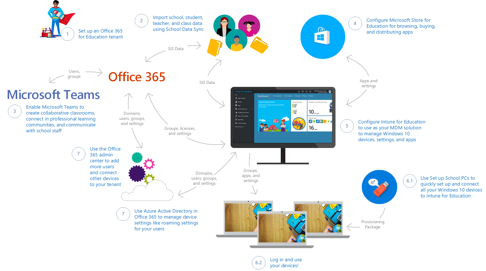

# Get started: Deploy and manage a full cloud IT solution with Microsoft Education

**Applies to:**

-   Office 365 for Education, School Data Sync, Microsoft Intune for Education, Microsoft Store for Education, Windows 10 Creators Update, Set up School PCs

Hello, IT administrators! In this walkthrough, we'll show you how you can quickly and easily use the new Microsoft Education system, consisting of new and existing cloud services and tools, to implement a full IT cloud solution for your school.

## What is Microsoft Education?
**Microsoft Education** consists of these new and existing services and tools from Microsoft:
- **Microsoft Intune for Education** for simple set up, control, and management of the resources for your school including apps, devices, and settings
- **Office 365 for Education** provides online apps for work from anywhere and desktop apps for advanced functionality, built for working together and available across devices, and it's free for schools, teachers, and students
  - **School Data Sync** to help automate the process for importing and integrating School Information System (SIS) data that you can use with Office 365
  - **OneNote Class Notebook** to organize course content, create and deliver interactive lessons to some or all students, collaborate and provide private feedback to individual students, and connect with major LMS and SIS partners for assignment workflow
- **Microsoft Teams** to bring conversations, content, and apps together in one place and create collaborate classrooms, connect in professional learning communities, and communicate with school staff 
- **Learning Tools** are moving beyond the OneNote desktop app and is now available in Office Lens, OneNote Online, Word Online, and Word desktop
- **Whiteboard** to create interactive lessons on the big screen, share and collaborate real-time by connecting to Class Notebook and Classroom
- **Windows 10, version 1703 (Creators Update)** which brings 3D for everyone and other new and updated Windows features
- **Minecraft: Education Edition** which provides an open and immersive environment to promote creativity, collaboration, and problem-solving 

With Microsoft Education, schools can:
- **Use affordable devices and simple setup** - Boost creativity and get started instantly with Windows 10 devices that support Windows Ink. Set up devices in minutes and stay in control with the new Intune for Education.
- **Collaborate in a modern classroom** - Help students become career-ready with Office apps like Word, Excel, PowerPoint, and OneNote. Increase comprehension and outcomes with the most advanced teaching apps like integrated Learning Tools.
- **Go beyond the browser with inspiring apps for classroom learning** - Inspire with Minecraft: Education Edition and innovative apps from the Microsoft Store for Education.

Go to the <a href="https://www.microsoft.com/en-us/education" target="_blank">Microsoft Education site</a> to learn more. See <a href="https://www.microsoft.com/en-us/education/buy-license/overview-of-how-to-buy/default.aspx?tabshow=schools" target="_blank">How to buy</a> to learn about pricing and purchasing options for schools, students, and teachers as well as academic pricing and offers for qualified K-12 and higher education institutions.

## What we're doing
In this walkthrough, we'll show you the basics on how to:
> [!div class="checklist"]
> * Acquire an Office 365 for Education tenant, if you don't already have one
> * Import school, student, teacher, and class data using School Data Sync (SDS)
> * Deploy Microsoft Teams to enable groups and teams in your school to communicate and collaborate
> * Manage apps and settings deployment with Intune for Education
> * Acquire additional apps in Microsoft Store for Education
> * Use the Set up School PCs app to quickly set up and provision your Windows 10 education devices
> * Log in and use the devices

This diagram shows a high-level view of what we cover in this walkthrough. The numbers correspond to the sections in the walkthrough and roughly correspond to the flow of the overall process; but, note that not all sections in this walkthrough are shown in the diagram.

**Figure 1** - Microsoft Education IT administrator workflow

## Prerequisites
Complete these tasks before you start the walkthrough:
- Make sure all the devices that you want to configure, such as student PCs, have the latest Windows 10, version 1703 image installed.

  We recommend Windows 10, version 1703 to take advantage of all the new features and functionality that Windows supports. This version of Windows is also compatible with the latest version of the Set up School PCs app and the versions must match in order for Set up School PCs to provision the devices. 

  If you don't have Windows 10, version 1703 installed on your devices, we recommend upgrading. This process takes a while so start this task before proceeding with this walkthrough. 

- Have an education-verified tenant to qualify for an Office 365 for Education subscription. You also need to be education-verified to use School Data Sync and Intune for Education.

  If you don't have an education-verified domain, don't worry. We'll show you the steps on how to do this. 

  > [!NOTE] 
  > If you need to get education-verified, it may take up to two weeks for the verification process to be completed.

## Setup options
 To make sure you have a successful experience with deploying and managing a full cloud IT solution with Microsoft Education, select the scenario that best describes your school or how you'd like to get started.

| [Get started with Microsoft Education in production environment](#noo365prodenv) | [Try out Microsoft Education in trial environment](#noo365trialenv) | [School uses Office 365, try out Intune for Education now](#schooluseso365tryi4e) | 
| ----------------------------------------- | ------------------------------------------------ | ---------------------------------------------- |
| * My school doesn't use Office 365 for Education | * My school doesn't use Office 365 for Education | * My school uses Office 365 for Education |
| * My school is not an education-verified tenant | * My school is not an education-verified tenant | * My school is an education-verified tenant |
| * I would like to get started with Microsoft Education in a production environment | * I would like to try out Microsoft Education in a trial environment | * I would like to apply the Intune for Education trial code to my school's production environment |
| * Longest, need to start from scratch | * Simplest, but may take longer to start | * Fastest, Office 365 and SDS already set up |

### Option 1: Get started with Microsoft Education in a production environment
Trying out Microsoft Education in a production environment means you'll be using real school data as you evaluate the features and tools. This requires more time to get fully set up and going. 

To get started with Microsoft Education in a production environment:

* Go to <a href="https://aka.ms/sdssignup" target="_blank">https://aka.ms/sdssignup</a> and fill out the form to sign up for School Data Sync and receive a free, one-on-one support from Microsoft.

  A team from Microsoft will contact you to help get started with Microsoft Education. 

If you want a quicker way to evaluate Microsoft Education, you can [use a trial environment instead](#noo365trialenv).

### Option 2: Try out Microsoft Education in a trial environment
Once you get an Office 365 education-verified tenant, trying out Microsoft Education in a trial environment is an easy way to evaluate all the features and tools. Here, you'll use promo codes and sample files as you follow the walkthrough. 

To get started with Microsoft Education in a trial environment, follow these steps.

1. [Set up a new Office 365 for Education tenant](#1-set-up-a-new-office-365-for-education-tenant).

  Wait for your tenant to be education-verified before proceeding with the next step. Verification can take up to a few days.

2. Once you have an education-verified tenant, click <a href="https://aka.ms/intuneforedupreviewtrial" target="_blank">https://aka.ms/intuneforedupreviewtrial</a> to apply the Intune for Education trial promo code. 
  1. In the Intune for Education Trial page, on the upper right, click **Sign in** next to **Want to add this to an existing subscription?**.
  2. Sign in with your global admin credentials. 

3. Sign in to <a href="https://portal.office.com/adminportal" target="_blank">Office 365 admin portal</a> and:
  1. Select **Admin > Users** and then search for your admin account. 
  2. In the user page, select **Product licenses** and expand the **Office 365 Education** license you assigned to yourself. 
  3. Confirm that School Data Sync is turned on.

3. Skip ahead and follow the rest of the instructions in this walkthrough beginning with [2. Use School Data Sync to import student data](#2-use-school-data-sync-to-import-student-data).

### Option 3: Try out Intune for Education
Already have an Office 365 for Education verified tenant? Just sign in with your global admin credentials to apply the Intune for Education preview trial code to your tenant and follow the rest of the walkthrough.

1. Click <a href="https://aka.ms/intuneforedupreviewtrial" target="_blank">https://aka.ms/intuneforedupreviewtrial</a> to get started.
2. In the **Intune for Education Trial** page, on the upper right, click **Sign in** next to **Want to add this to an existing subscription?**.

  **Figure 2** - Intune for Education trial sign in page

  

3. Enter your Office 365 global admin credentials to apply the Intune for Education trial to your tenant.
4. If you don't already have Microsoft Teams deployed to your tenant, you can start with [3. Enable Microsoft Teams for your school](#3-enable-microsoft-teams-for-your-school) and then follow the rest of the instructions in this walkthrough. 

## 1. Set up a new Office 365 for Education tenant
Schools can use Office 365 to save time and be more productive. Built with powerful tools and accessible from any device, setting it up is the first step in getting your school to the cloud. 

Don't have an Office 365 for Education verified tenant or just starting out? Follow these steps to set up an Office 365 for Education tenant. [Learn more about Office 365 for Education plans and pricing](https://products.office.com/en-us/academic/compare-office-365-education-plans).

1. Go to the <a href="https://signup.microsoft.com/Signup?OfferId=03ee83a5-5cb4-4545-aca9-33ead43f222a,d764709a-7763-45ef-a2a8-db5b8b6ae704&DL=ENTERPRISEPREMIUM_FACULTY" target="_blank">Office 365 for Education sign up page</a> to sign up for a free subscription for your school.
2. Create an account and a user ID and password to use to sign into your account. 

  **Figure 3** - Office 365 account creation

  

3. Save your sign-in info so you can use it to sign in to <a href="https://portal.office.com" target="_blank">https://portal.office.com</a> (the sign-in page). Click **You're ready to go...** 
4. In the **Verify eligibility for Microsoft Office 365 for Education** screen:
  1. Add your domain name and follow the steps to confirm ownership of the domain. 
  2. Choose your DNS hosting provider to see step-by-step instructions on how to confirm that you own the domain.
 
    In some cases, you may need to wait several hours for the DNS verification to complete. You can click **I'll verify later** and come back later and log into the Office 365 portal and then go to the **Admin** center and select **Domains** to check the status entry for your domain.

    You may need to fill in other information to provide that you qualify for an education tenant. Provide and submit the info to Microsoft to continue verification for your tenant.  

As part of setting up a basic cloud infrastructure, you don't need to complete the rest of the Office 365 for Education setup so we will skip the rest of setup for now and start importing school data. You can pick up where you left off with Office 365 for Education setup once you've completed the rest of the steps in the walkthrough. See [7.3 Complete Office 365 for Education setup](#73-complete-office-365-education-setup) for info.

## 2. Use School Data Sync to import student data
School Data Sync (SDS) helps you import Student Information System (SIS) data into Office 365. It helps automate the process for importing and integrating SIS data that you can use with Office 365 and apps like OneNote Class Notebooks. 

Follow all the steps in this section to use SDS and sample CSV files in a trial environment. To use SDS in a production environment, see step 2 in [Try out Microsoft Education in a production environment](#noo365prodenv) instead.

**Download sample school data**

1. Go to the <a href="https://aka.ms/sdsscripts" target="_blank">O365-EDU-Tools GitHub site</a>.
2. Click the green **Clone or download** button to download the SDS sample files.

  **Figure 4** - Download the SDS sample files from GitHub

  

3. In the **Clone with HTTPS** pop-up window, choose **Download ZIP** and note the location where you're saving the folder.
4. Go to the folder where you saved the .zip and unzip the files.
5. Open the **O365-EDU-Tools-master** folder and then open the **CSV Samples** subfolder. Confirm that you can see the following sample CSV files.

  **Figure 5** - Sample CSV files

  

  > [!NOTE] 
  > - The sample CSV files uses sample accounts and passwords. If you are using the sample files for testing, remember the accounts and their corresponding passwords. You may be asked to change the password during your first sign in. 
  > - If you are modifying the sample CSV files to use in your organization, change the accounts and passwords to match the user accounts and passwords in your organization.
  > - If you are using CSV files from your existing production environment, see the detailed instructions in step 5 in the next section.

To learn more about the CSV files that are required and the info you need to include in each file, see <a href="https://aka.ms/sdscsvattributes" target="_blank">CSV files for School Data Sync</a>. If you run into any issues, see <a href="https://aka.ms/sdserrors" target="_blank">School Data Sync errors and troubleshooting</a>.

**Use SDS to import student data**

1. If you haven't done so already, go to the SDS portal, <a href="http://sds.microsoft.com" target="_blank">https://sds.microsoft.com</a>.
2. Click **Sign in**. You will see the **Settings** option for **Manage School Data Sync**.

  **Figure 6** - Settings for managing SDS

  

3. Turn on **School Data Sync**. You will get a notification that it is turned on. Click **OK**.

  New menu options will appear on the left of the SDS portal.

  **Figure 7** - New menu options appear after SDS is turned on

  

4. Click **+ Add Profile** from the sync dashboard or from the menu on the left to start syncing school data.

  This opens up the new profile setup wizard within the main page.

  **Figure 8** - New SDS profile setup wizard

  

5. For the new profile, in the **How do you want to connect to your school?** screen:
  1. Enter a name for your profile, such as *Contoso_Elementary_Profile*.
  2. Select a sync method for your profile. For this walkthrough, select **Upload CSV Files**.
  3. Select the type of CSV files that you're using. For this walkthrough, select **CSV files: SDS Format**.  
  4. Click **Start**.

6. In the **Sync options** screen:
  1. In the **Select new or existing users** section, you can select either **Existing users** or **New users** based on the scenaro that applies to you. For this walkthrough, select **New users**.
  2. In the **Import data** section:
    1. Click **Upload Files** to bring up the **Select data files to be uploaded** window.
    2. In the **Select data files to be uploaded** window, click **+ Add Files** and navigate to the directory where you saved the six CSV files required for data import.
    3. In the File Explorer window, you will see a folder for the sample CSV files for the UK and six sample CSV files for the US. Select the CSV files that match your region/locale, and then click **Open**.
    4. In the **Select data files to be uploaded** window, confirm that all six CSV files (School.csv, Section.csv, Student.csv, StudentEnrollment.csv, Teacher.csv, and TeacherRoster.csv) are listed and then click **Upload**.

      > [!NOTE]
      > After you click **Upload**, the status in the **Select data files to be uploaded** window will indicate that files are being uploaded and verified.

    5. After all the files are successfully uploaded, click **OK**. 

  3. Select the domain for the schools/sections. This domain will be used for the Section email addresses created during setup. If you have more than one domain, make sure you select the appropriate domain for the sync profile and subsequent sections being created.
  4. In the **Select school and section properties** section, ensure the attributes that have been automatically selected for you align to your CSV files. If you select additional properties, or deselect any properties, make sure you have the properties and values contained within the CSV files. For the walkthrough, you don't have to change the default.
  5. In the **Sync option for Section Group Display Name**, check the box if you want to allow teachers to overwrite the section names. Otherwise, SDS will always reset the display name value for sections to the value contained within the CSV files.
  6. In the **Student enrollment option** section:
    * If you want to sync your student roster data immediately, leave the box unchecked.
    * If you prefer to sync student enrollment/rostering data at a later date, check this box and then pick a date by clicking the empty box and selecting the appropriate date in the calendar when you would like to begin syncing your student roster data. Some schools prefer to delay syncing student roster data so they don't expose rosters before the start of the new term, semester, or school year.  
  7. In the **License Options** section, check the box for **Intune for Education** to allow students and teachers to receive the Intune for Education license. This will also create the SDS dynamic groups and security groups, which will be used within Intune for Education.
  8. Click **Next**.

    **Figure 9** - Sync options for the new profile

    

7. In the **Teacher options** screen:
  1. Select the domain for the teachers. SDS appends the selected domain suffix to the teacher's username attribute contained in the CSV file, to build the UserPrincipalName for each user in Office 365/Azure Active Directory during the account creation process. The teacher will log in to Office 365 with the UserPrincipalName once the account is created.
  2. In the **Select teacher properties** section, make sure the attributes that have been automatically selected for you align to your CSV files. If you select additional properties or deselect any properties, make sure you have the corresponding properties and values contained within the CSV files. For this walkthrough, you don't have to change the default.
  3. In the **Teacher licenses** section, choose the SKU to assign licenses for teachers. For example, **STANDARDWOFFPACK_FACULTY**.
  4. Click **Next**.

    **Figure 10** - Specify options for teacher mapping

    

8. In the **Student options** screen:
  1. Select the domain for the students. SDS appends the selected domain suffix to the student's username attribute contained in the CSV file, to build the UserPrincipalName for each user in Office 365/Azure Active Directory during the account creation process. The student will log in to Office 365 with the UserPrincipalName once the account is created.
  2. In the **Select student properties** section, make sure the attributes that have been automatically selected for you align to your CSV files. If you select additional properties or deselect any properties, make sure you have the corresponding properties and values contained within the CSV files. For this walkthrough, you don't have to change the default.
  3. In the **Student licenses** section, choose the SKU to assign licenses for students. For example, **STANDARDWOFFPACK_STUDENT**.
  4. Click **Next**.

    **Figure 11** - Specify options for student mapping

    

9. In the profile **Review** page, review the summary and confirm that the options selected are correct. 
10. Click **Create profile**. You will see a notification that your profile is being submitted and then you will see a page for your profile. 

  **Figure 12** - SDS profile page

   

11. After the profile is created and the status indicates as **Setting up**, refresh the page until you see the status change to **Sync in progress**. Beneath the **Sync in progress** status, you will see which of the 5 sync stages SDS is working on:
  * Stage 1 - Validating data
  * Stage 2 - Processing schools and sections
  * Stage 3 - Processing students and teachers
  * Stage 4 - Adding students and teachers into sections
  * Stage 5 - Setting up security groups

  If you don't see a **Sync in progress** status on the sync profile, and receive an error message instead, this indicates that SDS has encountered data issues during the pre-sync validation check and has not started syncing your data. This gives you the opportunity to fix the errors identified by the pre-sync validation checks before continuing. Once you've fixed any errors or if you prefer to continue with the errors and begin syncing your data anyway, click the **Resume sync** button to start the sync process.

  Once you've completed all five sync stages, your profile status will update one final time. 
    * If you haven't encountered any errors, you will see a green check mark which states **Everything is ok**, and the profile status will change to **Sync complete. Ready for more data.** 
    * If SDS encountered sync errors, you will see a red status icon that indicates an error, and a profile status of **Sync complete. Profile contains multiple errors**. Download the available error report to identify and fix your sync errors. Once complete, upload new files as needed and re-sync your data until errors are resolved.

  Here are some examples of what the sync status can look like:

  **Figure 13** - New profile: Sync in progress

  

  **Figure 14** - New profile: Sync complete - no errors

  

  **Figure 15** - New profile: Sync complete - with errors

  

  Sync times, like file download times, can vary widely depending on when you start the sync, how much data you are syncing, the complexity of your data (such as the number of users, schools, and class enrollments), overall system/network load, and other factors. Two people who start a sync at the same time may not have their syncs complete at the same time.

  You can refresh the page to confirm that your profile synced successfully.

That's it for importing sample school data using SDS.

## 3. Enable Microsoft Teams for your school
Microsoft Teams is a digital hub that brings conversations, content, and apps together in one place. Because it's built on Office 365, schools benefit from integration with their familiar Office apps and services. Your institution can use Microsoft Teams to create collaborative classrooms, connect in professional learning communities, and communicate with school staff all from a single experience in Office 365 for Education. 

To get started, IT administrators need to use the Office 365 Admin Center to enable Microsoft Teams for your school. 

**Enable Microsoft Teams for your school**

1. Sign in to <a href="https://portal.office.com" target="_blank">Office 365</a> with your work or school account.
2. Click **Admin** to go to the Office 365 admin center.
3. Go to **Settings > Services & add-ins**.
4. On the **Services & add-ins** page, select **Microsoft Teams**.

  **Figure 16** - Select Microsoft Teams from the list of services & add-ins

  

5. On the Microsoft Teams settings screen, select the license that you want to configure, **Student** or **Faculty and Staff**. Select **Faculty and Staff**.

  **Figure 17** - Select the license that you want to configure

  

6. After you select the license type, set the toggle to turn on Microsoft Teams for your organization.

  **Figure 18** - Turn on Microsoft Teams for your organization

  

7. Click **Save**.

You can find more info about how to control which users in your school can use Microsoft Teams, turn off group creation, configure tenant-level settings, and more by reading the *Guide for IT admins* getting started guide in the <a href="https://aka.ms/MeetTeamsEdu" target="_blank">Meet Microsoft Teams</a> page.

## 4. Configure Microsoft Store for Education
You'll need to configure Microsoft Store for Education to accept the services agreement and make sure your Microsoft Store account is associated with Intune for Education.

**Associate your Microsoft Store account with Intune for Education**

1. Sign in to <a href="https://educationstore.microsoft.com" target="_blank">Microsoft Store for Education</a>.
2. Accept the Microsoft Store for Business and Education Services Agreement. 

  This will take you to the Microsoft Store for Education portal.

  **Figure 19** - Microsoft Store for Education portal

  

3. In the Microsoft Store portal, click **Manage** to go to the Microsoft Store **Overview** page.
4. Find the **Overview** page, find the **Store settings** tile and click **Management tools**.

  **Figure 20** - Select management tools from the list of Store settings options

  

4. In the **Management tools** page, find **Microsoft Intune** on the list and click **Activate** to get Intune for Education ready for use with Microsoft Store for Education.

  **Figure 21** - Activate Intune for Education as the management tool

   

Your Microsoft Store for Education account is now linked to Intune for Education so let's set that up next.

## 5. Use Intune for Education to manage groups, apps, and settings
Intune for Education is a streamlined device management solution for educational institutions that can be used to quickly set up and manage Windows 10 devices for your school. It provides a new streamlined UI with the enterprise readiness and resiliency of the Intune service. You can learn more about Intune for Education by reading the <a href="https://docs.microsoft.com/intune-education" target="_blank">Intune for Education documentation</a>. 

### Example - Set up Intune for Education, buy apps from the Store, and install the apps
In this walkthrough, we'll go through a sample scenario and walk you through the steps to:
- [Use express configuration to quickly set up Intune for Education](#setupintune)
- [Use Intune for Education to buy apps from the Microsoft Store for Education](#addappsfrommsfe)
- [Use Intune for Education to install the apps for all users in your tenant](#installappsallusers)

Note that for verified education tenants, Microsoft automatically provisions your app catalog with these apps so you will see them appear on your Intune for Education catalog even before you've bought any apps:
- Excel 
- Fresh Paint
- Minecraft: Education Edition
- OneNote
- PowerPoint
- Sway
- Word

  > [!NOTE]
  > Apps that you own in the Microsoft Store for Education are automatically available in Intune for Education. Any changes you make to your purchases get reflected in Intune for Education.

**Set up Intune for Education**

Intune for Education provides an **Express configuration** option so you can get going right away. We'll use that option here.

1. Log into the <a href="https://intuneeducation.portal.azure.com/" target="_blank">Intune for Education console</a>. You will see the Intune for Education dashboard once you're logged in.

  **Figure 22** - Intune for Education dashboard

  

2. On the dashboard, click **Launch Express Configuration**, or select the **Express configuration** option on the menu on the left.
3. In the **Welcome to Intune for Education** screen, click **Get started**.
  
  **Figure 23** - Click Get started to set up Intune for Education

  

4. In the **Get school information (optional)** screen, it should indicate that SDS is already configured. Click **Next**.

  **Figure 24** - SDS is configured

  

5. In the **Choose group** screen, select **All Users**. All apps and settings that we select during express setup will apply to this group. 

  You can choose another group during this step, but note that your experience may vary from what we show in the walkthrough.

6. The **Next** button will appear at the bottom of the screen after you select **All Users**. Click **Next**.

  > [!TIP]
  > At the top of the screen, did you notice the **Choose group** button change to a green check mark? This means we are done with that step. If you change your mind or need to make changes, simply click on the button to go back to that step. Try it!
  >
  > **Figure 25** - Click on the buttons to go back to that step
  >
  > 

7. In the **Choose apps** screen, you will see a selection of Web apps, Microsoft Store apps, and desktop (Win32) apps. You will also see a list of popular apps from each category. 

  - Add or remove apps by clicking on them. A blue checkmark means the app is added and will be installed for all members of the group selected in the **Choose group** step.
  
    In this walkthrough, it's up to you to select the apps you choose to install. Just remember what they are so that later in the walkthrough you can verify that the apps were installed correctly on the device.

    > [!TIP]
    > Web apps are pushed as links in the Windows Start menu under **All apps**. If you want apps to appear in Microsoft Edge browser tabs, use the **Homepages** setting for Microsoft Edge through **Express configuration** or **Manage Users and Devices**.

  **Figure 26** - Choose the apps that you want to install for the group

  

8. When you're done choosing apps, click **Next** at the bottom of the screen.

  If you select Microsoft Store apps, you will see a notification that Intune for Education is getting these apps.

8. In the **Choose settings** screen, we will set the settings to apply to the group. Click the reverse caret (downward-facing arrow) to expand the settings group and get more information about each setting in that settings group.

  **Figure 27** - Expand the settings group to get more details

  

9. For this walkthrough, set the following settings:
  - In the **Microsoft Edge settings** group, change the **Do-Not-Track headers** setting to **Require**.
  - In the **App settings** group, change the **Microsoft Store for Business apps** setting to **Block**, and then set the **Require Microsoft Store for Business apps to be installed from private store** to **Require**.

  **Figure 28** - Set some additional settings

  

10. Click **Next**. In the **Review** screen, you will see a summary of the apps and settings you selected to apply.

  **Figure 29** - Review the group, apps, and settings you configured

  

11. Click **Save** to end express configuration.
12. You will see the **You're done!** screen which lets you choose one of two options. 

  **Figure 30** - All done with Intune for Education express configuration

  

13. Click **All done** or click the **X** on the upper-right corner of the screen to dismiss this screen and go back to the dashboard.

**Add apps bought from Microsoft Store for Education**

- **Example 1 - Minecraft: Education Edition**

  If you would like to purchase Minecraft: Education Edition or want to learn how to get, distribute, and manage permissions for Minecraft: Education Edition, see <a href="https://docs.microsoft.com/education/windows/school-get-minecraft" target="_blank">For IT administrators - get Minecraft: Education Edition</a>.

- **Example 2 - Free educational/reference apps**

  1. In the <a href="https://intuneeducation.portal.azure.com/" target="_blank">Intune for Education console</a>, click **Apps** from the menu on the left.

    **Figure 31** - Click on **Apps** to see the list of apps for your tenant

    

  2. In the **Store apps** section, click **+ New app**. This will take you to the Microsoft Store for Education portal and you will already be signed in.

    **Figure 32** - Select the option to add a new Store app

    

  3. In the Microsoft Store page, check some of the categories for suggested apps or search the Store for a free educational or reference app. Find ones that you haven't already installed during express setup for Intune for Education.
  
    For example, these apps are free:
    - Duolingo - Learn Languages for Free
    - Flashcards Pro 
    - Khan Academy
    - My Study Life

  4. Find or select the app you want to install and click **Get the app**.
  5. In the app's Store page, click the **...** button and select **Add to private store**.
  6. Repeat steps 3-5 to install another app or move to the next step.
  7. In the Microsoft Store for Education portal, select **Manage > Apps & software > Manage apps** to verify that the apps you purchased appear in your inventory.

    For example, if you bought Duolingo and Khan Academy, they will show up in your inventory along with the apps that Microsoft automatically provisioned for your education tenant.

    **Figure 33** - Apps inventory in Microsoft Store for Education

    

    In the **Private store** column of the **Apps & software** page, the status for some apps will indicate that it's "In private store" while others will say "Not in private store". We won't go over this in the walkthrough, but you can learn more about this in <a href="https://docs.microsoft.com/microsoft-store/distribute-apps-from-your-private-store" target="_blank">Distribute apps using your private store</a>.

    > [!NOTE]  
    > You'll see in the above screenshot that some apps say that **Add is in progress**. Sync happens automatically, but it may take up to 24 hours for your organization's private store and 12 hours for Intune for Education to sync all your purchased apps. 

**Install apps for all users**

Now that you've bought the apps, use Intune for Education to specify the group to install the apps for. Here, we'll show you how to install the apps you bought for all devices used by all users in your tenant. 

1. In the <a href="https://intuneeducation.portal.azure.com/" target="_blank">Intune for Education console</a>, click the **Groups** option from the menu on the left.

  **Figure 34** - Groups page in Intune for Education

  

2. In the **Groups** page, select **All Users** from the list of groups on the left, and then click **Users** in the taskbar at the top of the **All Users** page. 

  **Figure 35** - List of all users in the tenant

  

3. In the taskbar at the top, select **Apps** and then click **Edit apps** to see a list of available apps.

  **Figure 36** - Edit apps to assign them to users

  

4. Select the apps to deploy to the group. A blue checkmark will appear next to the apps you select. 

  **Figure 37** - Select the apps to deploy to the group

  

5. Once you're done, click **Save** at the bottom of the page to deploy the selected apps to the group.
6. You'll be notified that app assignments are being updated. The updated **All Users** groups page now include the apps you selected. 

  **Figure 38** - Updated list of assigned apps

  

You're now done assigning apps to all users in your tenant. It's time to set up your Windows 10 device(s) and check that your cloud infrastructure is correctly set up and your apps are being pushed to your devices from the cloud.

## 6. Set up Windows 10 devices

### 6.1 Set up devices using Set up School PCs or Windows OOBE
We recommend using the latest build of Windows 10, version 1703 on your education devices. To set up new Windows 10 devices and enroll them to your education tenant, choose from one of these options:
- **Option 1: [Use the Set up School PCs app](#usesetupschoolpcs)** - You can use the app to create a setup file that you can use to quickly set up one or more Windows 10 devices.
- **Option 2: [Go through Windows OOBE and join the device to Azure AD](#usewindowsoobandjoinaad)** - You can go through a typical Windows 10 device setup or first-run experience to configure your device.

**Option 1: Set up a device using the Set up School PCs app**

IT administrators and technical teachers can use the Set up School PCs app to quickly set up PCs for students. A student PC set up using the app is tailored to provide students with the tools they need for learning while removing apps and features that they don't need.

Set up School PCs makes it easy to set up Windows 10 PCs with Microsoft's recommended education settings, using a quick USB setup. This app guides you through the creation of a student PC provisioning package and helps you save it to a USB drive. From there, just plug the USB drive into student PCs running Windows 10 Creators Update (version 1703). It automatically:
- Joins each student PC to your organization's Office 365 and Azure Active Directory tenant
- Enrolls each student PC into a mobile device management (MDM) provider, like Intune for Education, if licensed in your tenant. You can manage all the settings Set up School PCs sets later through MDM.
- Removes OEM preinstalled software from each student PC
- Auto-configures and saves a wireless network profile on each student PC
- Gives a friendly and unique name to each student device for future management
- Sets Microsoft-recommended school PC settings, including shared PC mode which provides faster sign-in and automatic account cleanup
- Enables optional guest account for younger students, lost passwords, or visitors
- Enables optional secure testing account
- Locks down the student PC to prevent mischievous activity:
    * Prevents students from removing the PC from the school's device management system
    * Prevents students from removing the Set up School PCs settings
- Keeps student PCs up-to-date without interfering with class time using Windows Update and maintenance hours
- Customizes the Start layout with Office
- Installs OneDrive for storing cloud-based documents and Sway for creating interactive reports, presentations, and more
- Uninstalls apps not specific to education, such as Solitaire
- Prevents students from adding personal Microsoft accounts to the PC

**To set up a device using the Set up School PCs app**

1. Follow the steps in <a href="https://docs.microsoft.com/en-us/education/windows/use-set-up-school-pcs-app" target="_blank">Use the Set up School PCs app</a> to quickly set up one or more student PCs.
2. Follow the steps in [5.2 Verify correct device setup](#52-verify-correct-device-setup).

**Option 2: Set up a device using Windows OOBE**

1. If you don't have a Wi-Fi network configured, make sure you connect the device to the Internet through a wired or Ethernet connection.
2. Go through the Windows device setup experience. On a new or reset device, this starts with the **Let's start with region. Is this right?** screen.

  **Figure 39** - Let's start with region

  

3. Continue with setup. In the **How would you like to set up?** screen, select **Set up for an organization**.

  **Figure 40** - Select setup for an organization

  

4. Sign in using the user's account and password. Depending on the user password setting, you may be prompted to update the password.
5. Choose privacy settings for the device. Location, speech recognition, diagnostics, and other settings are all on by default. Configure the settings based on the school's policies. 
6. Click **Accept** to go through the rest of device setup.

### 6.2 Verify correct device setup
Verify that the device is set up correctly and boots without any issues.

**Verify that the device was set up correctly**
1. Confirm that the Start menu contains a simple configuration.
2. Confirm that the Store and built-in apps are installed and working. The apps pushed down from Intune for Education will appear under **Recently added**. 

  > [!NOTE]  
  > It may take some time before some apps are pushed down to your device from Intune for Education. Check again later if you don't see some of the apps you provisioned for the user.

  **Figure 41** - Sample list of apps for a user

  

### 6.3 Verify the device is Azure AD joined
Let's now verify that the device is joined to your organization's Azure AD and shows up as being managed in Microsoft Intune for Education.

**Verify if the device is joined to Azure AD**
1. Log in to the <a href="https://intuneeducation.portal.azure.com/" target="_blank">Intune for Education console</a>.
2. Select **Groups** and select **All Devices**.
3. In the **All Devices** page, see the list of devices and verify that the device you're signed into appears on the list.

  **Figure 42** - List of all managed devices

  

4. On the Windows 10 education device, click **Start** and go to **Settings**. 
5. Select **Accounts > Access work or school**.
6. In the **Access work or school** page, confirm that the device is connected to the organization's Azure AD.

  **Figure 43** - Confirm that the Windows 10 device is joined to Azure AD

  

**That's it! You're done!** You've completed basic cloud setup, deployment, and management using Microsoft Education. You can continue follow the rest of the walkthrough to finish setup and complete other tasks.

## 7. Finish setup and other tasks

### 7.1 Update group settings in Intune for Education
If you need to make changes or updates to any of the apps or settings for the group(s), follow these steps.

1. Log in to the <a href="https://intuneeducation.portal.azure.com/" target="_blank">Intune for Education console</a>.
2. Click **Groups** and then choose **Settings** in the taskbar at the top of the page.
3. You will see the same settings groups that you saw in express setup for Intune for Education as well as other settings categories such as **Windows Defender settings**, **Device sharing**, **Edition upgrade**, and so on.

  **Figure 44** - See the list of available settings in Intune for Education

  

4. Keep the default settings or configure the settings according to your school's policies. 

  For example, you can configure the diagnostic data sent to Microsoft in **Basic device settings > Send diagnostic data**. 

5. Click **Save** or **Discard changes**.

### 7.2 Configure Azure settings
After completing the basic setup for your cloud infrastructure and confirming that it is up and running, it's time to prepare for additional devices to be added and enable capabilities for the user to use.

#### Enable many devices to be added by a single person 
When a device is owned by the school, you may need to have a single persion adding many devices to your cloud infrastructure. 

Follow the steps in this section to enable a single person to add many devices to your cloud infrastructure.

1. Sign in to the <a href="https://portal.office.com" target="_blank">Office 365 admin center</a>.
2. Configure the device settings for the school's Active Directory. To do this, go to the new Azure portal, <a href="https://portal.azure.com" target="_blank">https://portal.azure.com</a>.
3. Select **Azure Active Directory > Users and groups > Device settings**.

  **Figure 45** - Device settings in the new Azure portal

  

4. Find the setting **Maximum number of devices per user** and change the value to **Unlimited**.
5. Click **Save** to update device settings.

#### Enable roaming settings for users
When students move from using one device to another, they may need to have their settings roam with them and be made available on other devices. 

Follow the steps in this section to ensure that settings for the each user follow them when they move from one device to another.

1. Sign in to the <a href="https://portal.office.com" target="_blank">Office 365 admin center</a>.
3. Go to the new Azure portal, <a href="https://portal.azure.com" target="_blank">https://portal.azure.com</a>.
3. Select **Azure Active Directory > Users and groups > Device settings**.
4. Find the setting **Users may sync settings and enterprise app data** and change the value to **All**.

  **Figure 46** - Enable settings to roam with users

  

5. Click **Save** to update device settings.

### 7.3 Complete Office 365 for Education setup
Now that your basic cloud infrastructure is up and running, it's time to complete the rest of the Office 365 for Education setup. You can find detailed information about completing Office 365 setup, services and applications, troubleshooting, and more by reading the <a href="https://support.office.com/en-US/Article/set-up-Office-365-for-business-6a3a29a0-e616-4713-99d1-15eda62d04fa#ID0EAAAABAAA=Education" target="_blank">Office 365 admin documentation</a>.

### 7.4 Add more users
After your cloud infrastructure is set up and you have a device management strategy in place, you may need to add more users and you want the same policies to apply to these users. You can add new users to your tenant simply by adding them to the Office 365 groups. Adding new users to Office 365 groups automatically adds them to the corresponding groups in Intune for Education.

See <a href="https://support.office.com/en-us/article/Add-users-to-Office-365-for-business-435ccec3-09dd-4587-9ebd-2f3cad6bc2bc" target="_blank">Add users to Office 365</a> to learn more. Once you're done adding new users, go to the <a href="https://intuneeducation.portal.azure.com/" target="_blank">Intune for Education console</a> and verify that the same users were added to the Intune for Education groups as well.

### 7.5 Connect other devices to your cloud infrastructure
Adding a new device to your cloud-based tenant is easy. For new devices, you can follow the steps in [6. Set up Windows 10 devices](#6-set-up-windows-10-devices). For other devices, such as those personally-owned by teachers who need to connect to the school network to access work or school resources (BYOD), you can follow the steps in this section to get these devices connected.

  > [!NOTE]  
  > These steps enable users to get access to the organization's resources, but it also gives the organization some control over the device.

**To connect a personal device to your work or school**

1. On your Windows device, go to **Settings > Accounts**.
2. Select **Access work or school** and then click **Connect** in the **Connect to work or school** page.
3. In the **Set up a work or school account** window, enter the user's account info.

  For example, if a teacher connects their personal device to the school network, they'll see the following screen after typing in their account information.

  **Figure 47** - Device is now managed by Intune for Education

  

4. Enter the account password and then click **Sign in** to authenticate the user.

   Depending on the organization's policy, the user may be asked to update the password.

5. After the user's credentails are validated, the window will refresh and will now include an entry that shows the device is now connected to the organization's MDM. This means the device is now enrolled in Intune for Education MDM and the account should have access to the organization's resources.

  **Figure 48** - Device is connected to organization's MDM

  

6. You can confirm that the new device and user are showing up as Intune for Education-managed by going to the Intune for Education management portal and following the steps in [6.3 Verify the device is Azure AD joined](#63-verify-the-device-is-azure-ad-joined). 

  It may take several minutes before the new device shows up so check again later.

## Get more info

### Microsoft Education documentation and resources hub
See the <a href="https://docs.microsoft.com/education" target="_blank">Microsoft Education documentation and resources</a> hub for links to more content for IT admins, teachers, students, and education app developers.

### Info related to this walkthrough

**For IT admins**

To learn more about the services and tools mentioned in this walkthrough, and learn what other tasks you can do, follow these links:
- <a href="https://docs.microsoft.com/education/windows/education-scenarios-store-for-business" target="_blank">Working with Microsoft Store for Education</a>
- *Resources for anyone who uses Office 365* and *Resources for admins* in <a href="https://support.office.com/en-US/article/Get-started-with-Office-365-Education-AB02ABE5-A1EE-458C-B749-5B44416CCF14" target="_blank">Get started with Office 365 for Education</a>
- School Data Sync deployment options
  - Deployment using CSV files: <a href="https://aka.ms/sdscsv" target="_blank">How to deploy School Data Sync by using CSV files</a> and <a href="https://aka.ms/sdscsvattributes" target="_blank">CSV files for School Data Sync</a>
  - Deployment using PowerSchool Sync: <a href="https://aka.ms/sdspowerschool" target="_blank">How to deploy School Data Sync by using PowerSchool Sync</a> and <a href="https://aka.ms/sdspowerschoolattributes" target="_blank">School Data Sync required attributes for PowerSchool Sync</a>
  - Deployment using Clever Sync: <a href="https://aka.ms/sdsclever" target="_blank">How to deploy School Data Sync by using Clever Sync</a> and <a href="https://aka.ms/sdscleverattributes" target="_blank">School Data Sync required attributes for Clever sync</a>
  - Deployment using OneRoster CSV files: <a href="https://aka.ms/sdsoneroster" target="_blank">How to deploy School Data Sync by using OneRoster CSV files</a>

**For teachers**

Whether it's in the classroom, getting the most out of your devices, or learning some of the cool things you can do, we've got teachers covered. Follow these links for more info:
- *Resources for anyone who uses Office 365* in <a href="https://support.office.com/en-US/article/Get-started-with-Office-365-Education-AB02ABE5-A1EE-458C-B749-5B44416CCF14" target="_blank">Get started with Office 365 for Education</a>
- <a href="https://education.microsoft.com/windows-10-online-resources-for-teachers" target="_blank">Windows 10 online resources for teachers</a>

