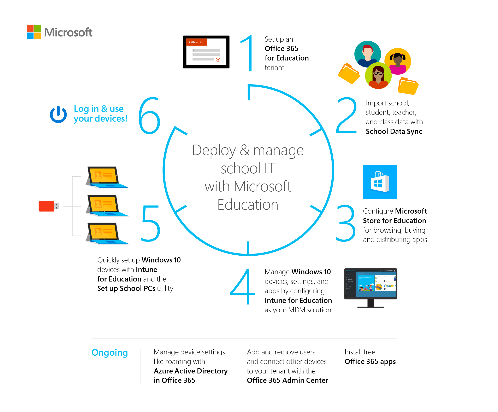

# Get started: Deploy and manage a full cloud IT solution with Microsoft Education

**Applies to:**

-   Office 365 for Education, School Data Sync, Microsoft Intune for Education, Microsoft Store for Education, Windows 10 Creators Update, Set up School PCs

Hello, IT administrators! In this walkthrough, we'll show you how you can quickly and easily use the new Microsoft Education system, consisting of new and existing cloud services and tools, to implement a full IT cloud solution for your school.

## What is Microsoft Education?
**Microsoft Education** consists of these new and existing services and tools from Microsoft:
- **Microsoft Intune for Education** for simple set up, control, and management of the resources for your school including apps, devices, and settings
- **Office 365 for Education** provides online apps for work from anywhere and desktop apps for advanced functionality, built for working together and available across devices, and it's free for schools, teachers, and students
  - **School Data Sync** to help automate the process for importing and integrating School Information System (SIS) data that you can use with Office 365
  - **OneNote Class Notebook** to organize course content, create and deliver interactive lessons to some or all students, collaborate and provide private feedback to individual students, and connect with major LMS and SIS partners for assignment workflow
- **Microsoft Teams** to bring conversations, content, and apps together in one place and create collaborate classrooms, connect in professional learning communities, and communicate with school staff 
- **Learning Tools** are moving beyond the OneNote desktop app and is now available in Office Lens, OneNote, and Word 
- **Whiteboard** to create interactive lessons on the big screen, share and collaborate real-time by connecting to Class Notebook and Classroom
- **Windows 10, version 1703 or later** which brings 3D for everyone and other new and updated Windows features
- **Minecraft: Education Edition** which provides an open and immersive environment to promote creativity, collaboration, and problem-solving 

With Microsoft Education, schools can:
- **Use affordable devices and simple setup** - Boost creativity and get started instantly with Windows 10 devices that support Windows Ink. Set up devices in minutes and stay in control with the new Intune for Education.
- **Collaborate in a modern classroom** - Help students become career-ready with Office apps like Word, Excel, PowerPoint, and OneNote. Increase comprehension and outcomes with the most advanced teaching apps like integrated Learning Tools.
- **Go beyond the browser with inspiring apps for classroom learning** - Inspire with Minecraft: Education Edition and innovative apps from the Microsoft Store for Education.

Go to the <a href="https://www.microsoft.com/education" target="_blank">Microsoft Education site</a> to learn more. See <a href="https://www.microsoft.com/education/buy-license/overview-of-how-to-buy/default.aspx?tabshow=schools" target="_blank">How to buy</a> to learn about pricing and purchasing options for schools, students, and teachers as well as academic pricing and offers for qualified K-12 and higher education institutions.

## What we're doing
The end-to-end process for deploying and managing a full cloud IT solution with Microsoft Education is outlined here. Depending on your [setup scenario](#setup-options), you may not need to implement all these steps. 

Click the link to watch the video or follow the step-by-step guidance for each.

1. [Set up an Office 365 education tenant](set-up-office365-edu-tenant.md)
2. [Use School Data Sync to import student data](use-school-data-sync.md)
3. [Configure Microsoft Store for Education](configure-microsoft-store-for-education.md)
4. [Use Intune for Education to manage groups, apps, and settings](use-intune-for-education.md)
5. [Set up Windows 10 education devices](set-up-windows-10-education-devices.md)
6. [Finish Windows 10 device setup and other tasks](finish-setup-and-other-tasks.md)

**Figure 1** - Microsoft Education IT administrator workflow

## Prerequisites
Complete these tasks before you start the walkthrough:
- Make sure all the devices that you want to configure, such as student PCs, have Windows 10 (version 1703 or later) image installed.

  We recommend Windows 10, version 1703 or later, to take advantage of all the new features and functionality that Windows supports. This version of Windows is also compatible with the latest version of the Set up School PCs app and the versions must match in order for Set up School PCs to provision the devices. 

  If you don't have Windows 10, version 1703 or later, installed on your devices, we recommend upgrading. This process takes a while so start this task before proceeding with this walkthrough. 

- Have an education-verified tenant to qualify for an Office 365 for Education subscription. You also need to be education-verified to use School Data Sync and Intune for Education.

  If you don't have an education-verified domain, don't worry. We'll show you the steps on how to do this. 

  > [!NOTE] 
  > If you need to get education-verified, it may take up to two weeks for the verification process to be completed.

## Setup options
 To make sure you have a successful experience with deploying and managing a full cloud IT solution with Microsoft Education, select the scenario that best describes your school or how you'd like to get started.

| [Get started with Microsoft Education in production environment](#noo365prodenv) | [Try out Microsoft Education in trial environment](#noo365trialenv) | [School uses Office 365, try out Intune for Education now](#schooluseso365tryi4e) | 
| ----------------------------------------- | ------------------------------------------------ | ---------------------------------------------- |
| * My school doesn't use Office 365 for Education | * My school doesn't use Office 365 for Education | * My school uses Office 365 for Education |
| * My school is not an education-verified tenant | * My school is not an education-verified tenant | * My school is an education-verified tenant |
| * I would like to get started with Microsoft Education in a production environment | * I would like to try out Microsoft Education in a trial environment | * I would like to apply the Intune for Education trial code to my school's production environment |
| * Longest, need to start from scratch | * Simplest, but may take longer to start | * Fastest, Office 365 and SDS already set up |

### Option 1: Get started with Microsoft Education in a production environment
Trying out Microsoft Education in a production environment means you'll be using real school data as you evaluate the features and tools. This requires more time to get fully set up and going. 

To get started with Microsoft Education in a production environment:

* Go to <a href="https://aka.ms/sdssignup" target="_blank">https://aka.ms/sdssignup</a> and fill out the form to sign up for School Data Sync and receive a free, one-on-one support from Microsoft.

  A team from Microsoft will contact you to help get started with Microsoft Education. 

If you want a quicker way to evaluate Microsoft Education, you can [use a trial environment instead](#noo365trialenv).

### Option 2: Try out Microsoft Education in a trial environment
Once you get an Office 365 education-verified tenant, trying out Microsoft Education in a trial environment is an easy way to evaluate all the features and tools. Here, you'll use promo codes and sample files as you follow the walkthrough. 

To get started with Microsoft Education in a trial environment, follow these steps.

1. [Set up a new Office 365 for Education tenant](set-up-office365-edu-tenant.md).

  Wait for your tenant to be education-verified before proceeding with the next step. Verification can take up to a few days.

2. Once you have an education-verified tenant, click <a href="https://aka.ms/intuneforedupreviewtrial" target="_blank">https://aka.ms/intuneforedupreviewtrial</a> to apply the Intune for Education trial promo code. 
  1. In the Intune for Education Trial page, on the upper right, click **Sign in** next to **Want to add this to an existing subscription?**.
  2. Sign in with your global admin credentials. 

3. Sign in to <a href="https://portal.office.com/adminportal" target="_blank">Office 365 admin portal</a> and:
  1. Select **Admin > Users** and then search for your admin account. 
  2. In the user page, select **Product licenses** and expand the **Office 365 Education** license you assigned to yourself. 
  3. Confirm that School Data Sync is turned on.

3. Skip ahead and follow the rest of the instructions in this walkthrough beginning with [Use School Data Sync to import student data](use-school-data-sync.md).

### Option 3: Try out Intune for Education
Already have an Office 365 for Education verified tenant? Just sign in with your global admin credentials to apply the Intune for Education preview trial code to your tenant and follow the rest of the walkthrough.

1. Click <a href="https://aka.ms/intuneforedupreviewtrial" target="_blank">https://aka.ms/intuneforedupreviewtrial</a> to get started.
2. In the **Intune for Education Trial** page, on the upper right, click **Sign in** next to **Want to add this to an existing subscription?**.

  **Figure 2** - Intune for Education trial sign in page

  

3. Enter your Office 365 global admin credentials to apply the Intune for Education trial to your tenant.
4. If you don't already have Microsoft Teams deployed to your tenant, you can start with [Enable Microsoft Teams for your school](enable-microsoft-teams.md) and then follow the rest of the instructions in this walkthrough. 

## Get more info

### Microsoft Education documentation and resources hub
See the <a href="https://docs.microsoft.com/education" target="_blank">Microsoft Education documentation and resources</a> hub for links to more content for IT admins, teachers, students, and education app developers.

### Info related to this walkthrough

**For IT admins**

To learn more about the services and tools mentioned in this walkthrough, and learn what other tasks you can do, follow these links:
- <a href="https://docs.microsoft.com/education/windows/education-scenarios-store-for-business" target="_blank">Working with Microsoft Store for Education</a>
- *Resources for anyone who uses Office 365* and *Resources for admins* in <a href="https://support.office.com/article/AB02ABE5-A1EE-458C-B749-5B44416CCF14" target="_blank">Get started with Office 365 for Education</a>
- School Data Sync deployment options
  - Deployment using CSV files: <a href="https://aka.ms/sdscsv" target="_blank">How to deploy School Data Sync by using CSV files</a> and <a href="https://aka.ms/sdscsvattributes" target="_blank">CSV files for School Data Sync</a>
  - Deployment using PowerSchool Sync: <a href="https://aka.ms/sdspowerschool" target="_blank">How to deploy School Data Sync by using PowerSchool Sync</a> and <a href="https://aka.ms/sdspowerschoolattributes" target="_blank">School Data Sync required attributes for PowerSchool Sync</a>
  - Deployment using Clever Sync: <a href="https://aka.ms/sdsclever" target="_blank">How to deploy School Data Sync by using Clever Sync</a> and <a href="https://aka.ms/sdscleverattributes" target="_blank">School Data Sync required attributes for Clever sync</a>
  - Deployment using OneRoster CSV files: <a href="https://aka.ms/sdsoneroster" target="_blank">How to deploy School Data Sync by using OneRoster CSV files</a>
- Azure Active Directory features used by Intune for Education, including: 
  - Single Sign-On (SSO) - Allow your Azure AD users to access SSO-enabled apps, so they don’t need to type in their credentials to access these apps. 
  - MDM auto-enrollment - Devices are automatically enrolled with Intune upon being joined with Azure AD join. 
- <a href="https://docs.microsoft.com/azure/active-directory/active-directory-windows-enterprise-state-roaming-overview" target="_blank">Enterprise state roaming</a> - Keep school data and personal data separate on your devices. 
  - Dynamic groups - You can use dynamic groups to create rules that populate your groups (for example, a group with all 9th graders) instead of having to manually add or remove members of the groups. The group stays updated by continually staying populated with members that fit the rules you pick. 
  - <a href="https://docs.microsoft.com/azure/active-directory/active-directory-passwords-writeback" target="_blank">Password write-back</a> - Allows you to configure Azure AD to write passwords back to your on-premises Active Directory. It removes the need to set up and manage a complicated on-premises self-service password reset solution, and it provides a convenient cloud-based way for your users to reset their on-premises passwords wherever they are. 
  - Administrative units
  - Additional local administrators
  - <a href="https://www.microsoft.com/download/details.aspx?id=53947" target="_blank">Self-service BitLocker recovery</a> - A self-service portal that allows your employees to retrieve their BitLocker recovery key and avoid support calls.

**For teachers**

Whether it's in the classroom, getting the most out of your devices, or learning some of the cool things you can do, we've got teachers covered. Follow these links for more info:
- *Resources for anyone who uses Office 365* in <a href="https://support.office.com/article/AB02ABE5-A1EE-458C-B749-5B44416CCF14" target="_blank">Get started with Office 365 for Education</a>
- <a href="https://education.microsoft.com/windows-10-online-resources-for-teachers" target="_blank">Windows 10 online resources for teachers</a>

