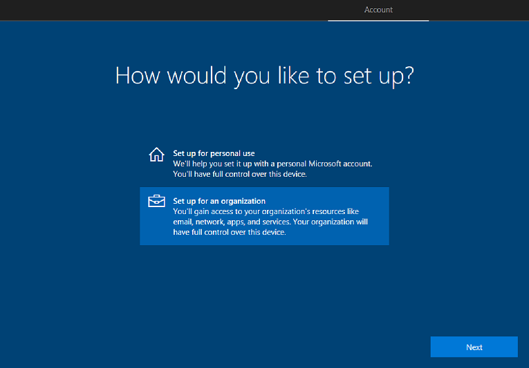

# Set up Windows 10 devices using Windows OOBE

If you are setting up a Windows 10 device invidividually, and network bandwidth is not an issue, you can go through the Windows 10 first-run setup experience, also known as OOBE (out-of-box-experience) to set up the device, and join it to your school's Office 365 and Azure Active Directory.

You can watch the video to see how this is done, or follow the step-by-step guide.  

> [!VIDEO https://www.youtube.com/embed/nADWqBYvqXk]

You can watch the descriptive audio version here: [Microsoft Education: Set up a new Windows 10 education devices using the Windows setup experience (DA)](https://www.youtube.com/watch?v=_UtS1Cz2Pno)

## To set up Windows 10 devices using OOBE

1. If you don't have a Wi-Fi network configured, make sure you connect the device to the Internet through a wired or Ethernet connection.
2. Go through the Windows device setup experience. On a new or reset device, this starts with the **Let's start with region. Is this right?** screen.

  **Figure 1** - Let's start with region

  

3. Continue with setup. In the **How would you like to set up?** screen, select **Set up for an organization**.

  **Figure 2** - Select setup for an organization

  

4. Sign in using the user's account and password. Depending on the user password setting, you may be prompted to update the password.
5. Choose privacy settings for the device. Location, speech recognition, diagnostics, and other settings are all on by default. Configure the settings based on the school's policies. 
6. Click **Accept** to go through the rest of device setup.

## Related topic
[Set up Windows 10 education devices](set-up-windows-10-education-devices.md)
