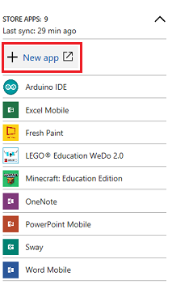
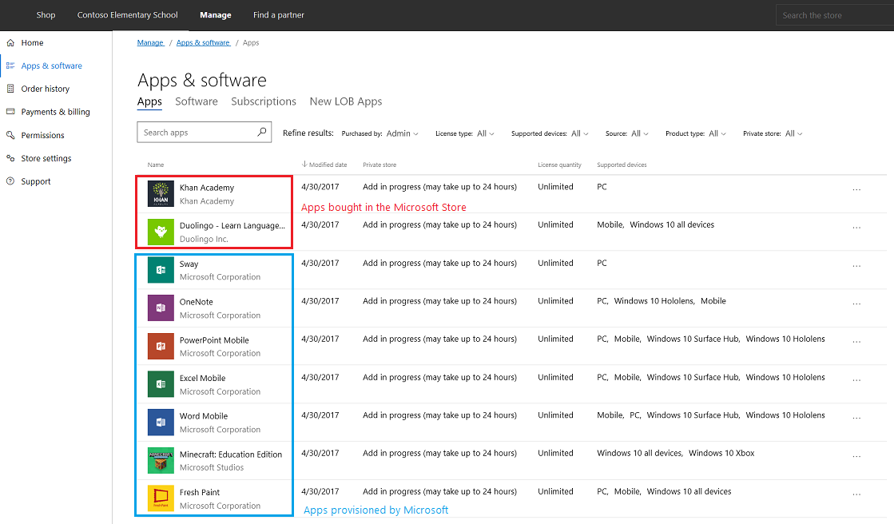
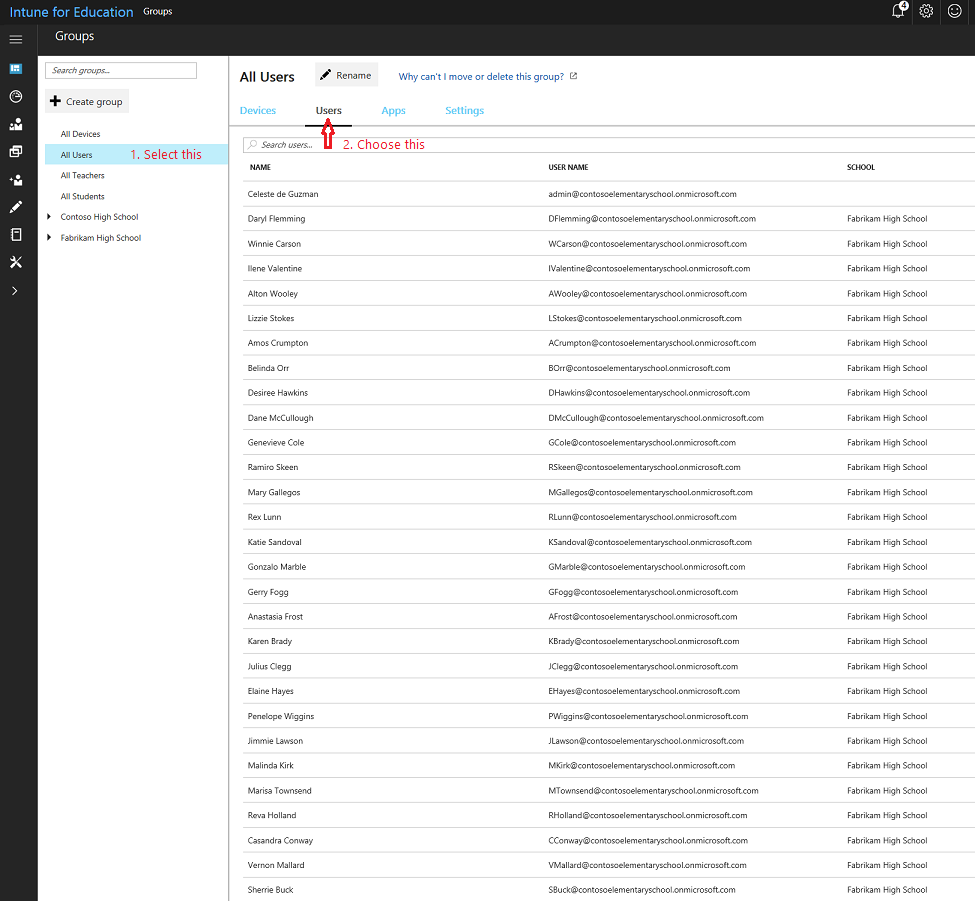
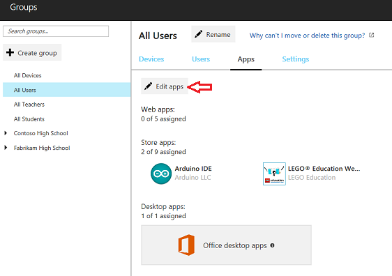

# Use Intune for Education to manage groups, apps, and settings

> [!div class="step-by-step"]
> [<< Configure Microsoft Store for Education](configure-microsoft-store-for-education.md)
> [Set up Windows 10 education devices >>](set-up-windows-10-education-devices.md)

Intune for Education is a streamlined device management solution for educational institutions that can be used to quickly set up and manage Windows 10 and iOS devices for your school. It provides a new streamlined UI with the enterprise readiness and resiliency of the Intune service. You can learn more about Intune for Education by reading the <a href="https://docs.microsoft.com/intune-education" target="_blank">Intune for Education documentation</a>. 

## Example - Set up Intune for Education, buy apps from the Store, and install the apps
In this walkthrough, we'll go through a sample scenario and walk you through the steps to:
- [Use express configuration to quickly set up Intune for Education](#set-up-intune-for-education)
- [Use Intune for Education to buy apps from the Microsoft Store for Education](#add-apps-bought-from-microsoft-store-for-education)
- [Use Intune for Education to install the apps for all users in your tenant](#install-apps-for-all-users)

Note that for verified education tenants, Microsoft automatically provisions your app catalog with these apps so you will see them appear on your Intune for Education catalog even before you've bought any apps:
- Excel 
- Fresh Paint
- Minecraft: Education Edition
- OneNote
- PowerPoint
- Sway
- Word

  > [!NOTE]
  > Apps that you own in the Microsoft Store for Education are automatically available in Intune for Education. Any changes you make to your purchases get reflected in Intune for Education.

You can watch the video to see how this is done, or follow the step-by-step guide.  

> [!VIDEO https://www.youtube.com/embed/c3BLoZZw3TQ]

You can watch the descriptive audio version here: [Microsoft Education: Use Intune for Education to manage groups, apps, and settings (DA)](https://youtu.be/Tejxfc4V7cQ)

## Set up Intune for Education
Intune for Education provides an **Express configuration** option so you can get going right away. We'll use that option here.

1. Log into the <a href="https://intuneeducation.portal.azure.com/" target="_blank">Intune for Education console</a>. You will see the Intune for Education dashboard once you're logged in.

   **Figure 1** - Intune for Education dashboard

   

2. On the dashboard, click **Launch Express Configuration**, or select the **Express configuration** option on the menu on the left.
3. In the **Welcome to Intune for Education** screen, click **Get started**.
  
   **Figure 2** - Click Get started to set up Intune for Education

   

4. In the **Get school information (optional)** screen, it should indicate that SDS is already configured. Click **Next**.

   **Figure 3** - SDS is configured

   

5. In the **Choose group** screen, select **All Users**. All apps and settings that we select during express setup will apply to this group. 

   You can choose another group during this step, but note that your experience may vary from what we show in the walkthrough.

6. The **Next** button will appear at the bottom of the screen after you select **All Users**. Click **Next**.

   > [!TIP]
   > At the top of the screen, did you notice the **Choose group** button change to a green check mark? This means we are done with that step. If you change your mind or need to make changes, simply click on the button to go back to that step. Try it!
   >
   > **Figure 4** - Click on the buttons to go back to that step
   >
   > 

7. In the **Choose apps** screen, you will see a selection of Web apps, Microsoft Store apps, and desktop (Win32) apps. You will also see a list of popular apps from each category. 

   - Add or remove apps by clicking on them. A blue checkmark means the app is added and will be installed for all members of the group selected in the **Choose group** step.
  
     In this walkthrough, it's up to you to select the apps you choose to install. Just remember what they are so that later in the walkthrough you can verify that the apps were installed correctly on the device.

     > [!TIP]
     > Web apps are pushed as links in the Windows Start menu under **All apps**. If you want apps to appear in Microsoft Edge browser tabs, use the **Homepages** setting for Microsoft Edge through **Express configuration** or **Manage Users and Devices**.

   **Figure 5** - Choose the apps that you want to install for the group

   

8. When you're done choosing apps, click **Next** at the bottom of the screen.

   If you select Microsoft Store apps, you will see a notification that Intune for Education is getting these apps.

9. In the **Choose settings** screen, we will set the settings to apply to the group. Click the reverse caret (downward-facing arrow) to expand the settings group and get more information about each setting in that settings group.

   **Figure 6** - Expand the settings group to get more details

   

10. For this walkthrough, set the following settings:
    - In the **Microsoft Edge settings** group, change the **Do-Not-Track headers** setting to **Require**.
    - In the **App settings** group, change the **Microsoft Store for Business apps** setting to **Block**, and then set the **Require Microsoft Store for Business apps to be installed from private store** to **Require**.

    **Figure 28** - Set some additional settings

    

11. Click **Next**. In the **Review** screen, you will see a summary of the apps and settings you selected to apply.

    **Figure 7** - Review the group, apps, and settings you configured

    

12. Click **Save** to end express configuration.
13. You will see the **You're done!** screen which lets you choose one of two options. 

    **Figure 8** - All done with Intune for Education express configuration

    

14. Click **All done** or click the **X** on the upper-right corner of the screen to dismiss this screen and go back to the dashboard.

## Add apps bought from Microsoft Store for Education

- **Example 1 - Minecraft: Education Edition**

  If you would like to purchase Minecraft: Education Edition or want to learn how to get, distribute, and manage permissions for Minecraft: Education Edition, see <a href="https://docs.microsoft.com/education/windows/school-get-minecraft" target="_blank">For IT administrators - get Minecraft: Education Edition</a>.

- **Example 2 - Free educational/reference apps**

  1. In the <a href="https://intuneeducation.portal.azure.com/" target="_blank">Intune for Education console</a>, click **Apps** from the menu on the left.

     **Figure 9** - Click on **Apps** to see the list of apps for your tenant

     

  2. In the **Store apps** section, click **+ New app**. This will take you to the Microsoft Store for Education portal and you will already be signed in.

     **Figure 10** - Select the option to add a new Store app

     

  3. In the Microsoft Store page, check some of the categories for suggested apps or search the Store for a free educational or reference app. Find ones that you haven't already installed during express setup for Intune for Education.
  
     For example, these apps are free:
     - Duolingo - Learn Languages for Free
     - Flashcards Pro 
     - Khan Academy
     - My Study Life

  4. Find or select the app you want to install and click **Get the app**.
  5. In the app's Store page, click the **...** button and select **Add to private store**.
  6. Repeat steps 3-5 to install another app or move to the next step.
  7. In the Microsoft Store for Education portal, select **Manage > Apps & software > Manage apps** to verify that the apps you purchased appear in your inventory.

     For example, if you bought Duolingo and Khan Academy, they will show up in your inventory along with the apps that Microsoft automatically provisioned for your education tenant.

     **Figure 11** - Apps inventory in Microsoft Store for Education

     

     In the **Private store** column of the **Apps & software** page, the status for some apps will indicate that it's "In private store" while others will say "Not in private store". We won't go over this in the walkthrough, but you can learn more about this in <a href="https://docs.microsoft.com/microsoft-store/distribute-apps-from-your-private-store" target="_blank">Distribute apps using your private store</a>.

     > [!NOTE]  
     > You'll see in the above screenshot that some apps say that **Add is in progress**. Sync happens automatically, but it may take up to 24 hours for your organization's private store and 12 hours for Intune for Education to sync all your purchased apps. 

## Install apps for all users

Now that you've bought the apps, use Intune for Education to specify the group to install the apps for. Here, we'll show you how to install the apps you bought for all devices used by all users in your tenant. 

1. In the <a href="https://intuneeducation.portal.azure.com/" target="_blank">Intune for Education console</a>, click the **Groups** option from the menu on the left.

   **Figure 12** - Groups page in Intune for Education

   

2. In the **Groups** page, select **All Users** from the list of groups on the left, and then click **Users** in the taskbar at the top of the **All Users** page. 

   **Figure 13** - List of all users in the tenant

   

3. In the taskbar at the top, select **Apps** and then click **Edit apps** to see a list of available apps.

   **Figure 14** - Edit apps to assign them to users

   

4. Select the apps to deploy to the group. A blue checkmark will appear next to the apps you select. 

   **Figure 15** - Select the apps to deploy to the group

   

5. Once you're done, click **Save** at the bottom of the page to deploy the selected apps to the group.
6. You'll be notified that app assignments are being updated. The updated **All Users** groups page now include the apps you selected. 

   **Figure 16** - Updated list of assigned apps

   

You're now done assigning apps to all users in your tenant. It's time to set up your Windows 10 device(s) and check that your cloud infrastructure is correctly set up and your apps are being pushed to your devices from the cloud.

<!--
> [!div class="nextstepaction"]
> [Set up Windows 10 devices](set-up-windows-10-education-devices.md)
-->

> [!div class="step-by-step"]
> [<< Configure Microsoft Store for Education](configure-microsoft-store-for-education.md)
> [Set up Windows 10 education devices >>](set-up-windows-10-education-devices.md)

## Related topic
[Set up iOS device management](https://docs.microsoft.com/en-us/intune-education/setup-ios-device-management)
