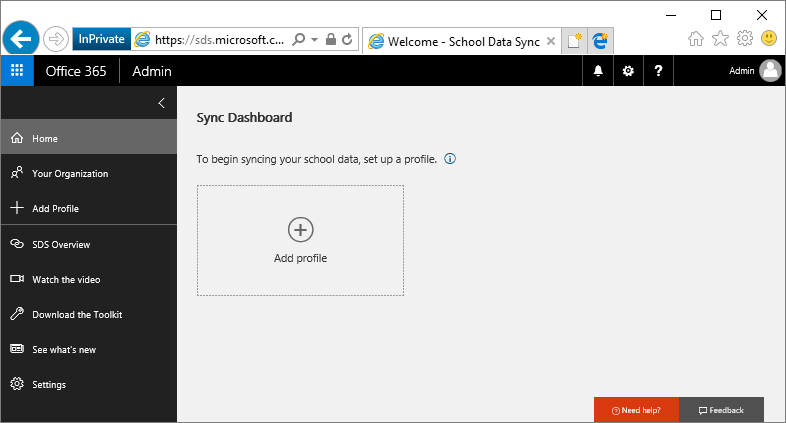
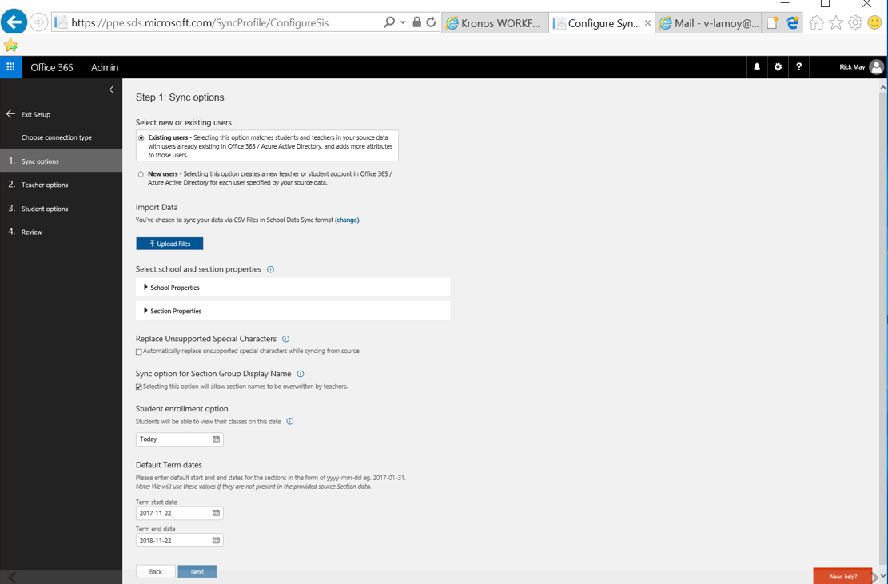
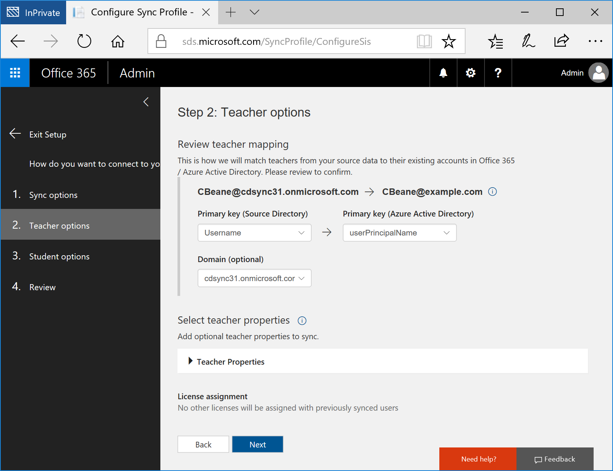
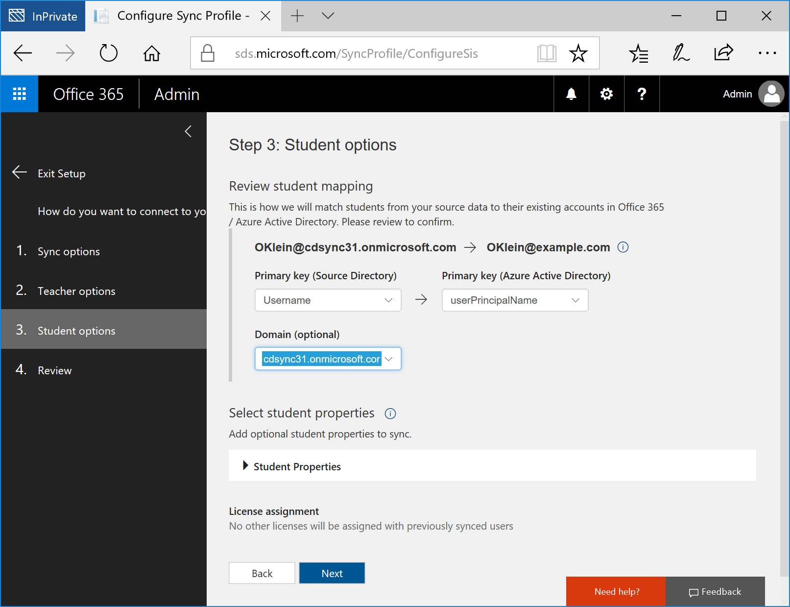
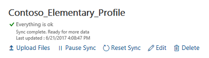

# Use School Data Sync to import student data

> [!div class="step-by-step"]
> [<< Set up an Office 365 education tenant](set-up-office365-edu-tenant.md)
> [Configure Microsoft Store for Education >>](configure-microsoft-store-for-education.md)

School Data Sync (SDS) helps you import Student Information System (SIS) data into Office 365. It helps automate the process for importing and integrating SIS data that you can use with Office 365 and apps like OneNote Class Notebooks. 

Follow all the steps in this section to use SDS and sample CSV files in a trial environment. To use SDS in a production environment, see step 2 in [Try out Microsoft Education in a production environment](https://docs.microsoft.com/education/get-started/get-started-with-microsoft-education#setup-options) instead.

You can watch the video to see how this is done, or follow the step-by-step guide. 

> [!VIDEO https://www.youtube.com/embed/ehSU8jr8T24]

You can watch the descriptive audio version here: [Microsoft Education: Use School Data Sync to import student data (DA)](https://www.youtube.com/watch?v=l4b086IMtvc)

## Download sample school data

1. Go to the <a href="https://aka.ms/sdsscripts" target="_blank">O365-EDU-Tools GitHub site</a>.
2. Click the green **Clone or download** button to download the SDS sample files.

   **Figure 1** - Download the SDS sample files from GitHub

   

3. In the **Clone with HTTPS** pop-up window, choose **Download ZIP** and note the location where you're saving the folder.
4. Go to the folder where you saved the .zip and unzip the files.
5. Open the **O365-EDU-Tools-master** folder and then open the **CSV Samples** subfolder. Confirm that you can see the following sample CSV files.

   **Figure 2** - Sample CSV files

   

   > [!NOTE] 
   > - The sample CSV files uses sample accounts and passwords. If you are using the sample files for testing, remember the accounts and their corresponding passwords. You may be asked to change the password during your first sign in. 
   > - If you are modifying the sample CSV files to use in your organization, change the accounts and passwords to match the user accounts and passwords in your organization.
   > - If you are using CSV files from your existing production environment, see the detailed instructions in step 5 in the next section.

To learn more about the CSV files that are required and the info you need to include in each file, see <a href="https://aka.ms/sdscsvattributes" target="_blank">CSV files for School Data Sync</a>. If you run into any issues, see <a href="https://aka.ms/sdserrors" target="_blank">School Data Sync errors and troubleshooting</a>.

## Use SDS to import student data

1. If you haven't done so already, go to the SDS portal, https://sds.microsoft.com.
2. Click Sign in. Then enter your O365 Global Admin account credentials. 
3. After logging in, click **+ Add Profile** in the left hand navigation pane to create a Sync Profile..  This opens up the new profile setup wizard within the main page.

   **Figure 3** - New SDS profile setup wizard
    
   

4. For the new profile, in the **How do you want to connect to your school?** screen:
  
    1. Enter a name for your profile, such as *Contoso_Elementary_Profile*.    
    2. Select a sync method for your profile. For this walkthrough, select **Upload CSV Files**.    
    3. Select the type of CSV files that you're using. For this walkthrough, select **CSV files: SDS Format**.     
    4. Click **Start**.

5. In the **Sync options** screen:

   1. In the **Select new or existing users** section, you can select either **Existing users** or **New users** based on the scenario that applies to you. For this walkthrough, select **New users**.
   2. In the **Import data** section, click **Upload Files** to bring up the **Select data files to be uploaded** window.  
   3. In the **Select data files to be uploaded** window, click **+ Add Files** and navigate to the directory where you saved the six CSV files required for data import.
   4. In the File Explorer window, you will see a folder for the sample CSV files for the UK and six sample CSV files for the US. Select the CSV files that match your region/locale, and then click **Open**.
   5. In the **Select data files to be uploaded** window, confirm that all six CSV files (School.csv, Section.csv, Student.csv, StudentEnrollment.csv, Teacher.csv, and TeacherRoster.csv) are listed and then click **Upload**.

      > [!NOTE]
      > After you click **Upload**, the status in the **Select data files to be uploaded** window will indicate that files are being uploaded and verified.

   6. After all the files are successfully uploaded, click **OK**. 
   7. In the **Select school and section properties** section, ensure the attributes that have been automatically selected for you align to your CSV files. If you select additional properties, or deselect any properties, make sure you have the properties and values contained within the CSV files. For the walkthrough, you don't have to change the default.
   8. In the Replace Unsupported Special Characters section, checking this box will allow SDS to automatically replace unsupported special characters while the sync is running. Special characters will be replaced with an "_", and no longer result in an error during the sync process for that object.
   9. In the **Sync option for Section Group Display Name**, check the box if you want to allow teachers to overwrite the section names. Otherwise, SDS will always reset the display name value for sections to the value contained within the CSV files.
   10. In the **Student enrollment option** section:
       * If you want to sync your student roster data immediately, leave the box unchecked.
       * If you prefer to sync student enrollment/rostering data at a later date, check this box and then pick a date by clicking the empty box and selecting the appropriate date in the calendar when you would like to begin syncing your student roster data. Some schools prefer to delay syncing student roster data so they don't expose rosters before the start of the new term, semester, or school year.  
   11. In the Default Term Dates section, You can set default start and end dates for Section terms. These dates will only be used if you do not provide these dates in your CSV files.  If you upload files with Section start and end dates, you will be asked to select the format of the dates provided. If the format that you enter does not match the format of start and end dates in your files, you will receive an error message and need to edit the date format so that it matches the format in your files.
   12. In the **License Options** section, check the box for **Intune for Education** to allow students and teachers to receive the Intune for Education license. This will also create the SDS dynamic groups and security groups, which will be used within Intune for Education.
   13. Click **Next**.

       **Figure 4** - Sync options for the new profile

       

6. In the **Teacher options** screen:

   1. Select the domain for the teachers. SDS appends the selected domain suffix to the teacher's username attribute contained in the CSV file, to build the UserPrincipalName for each user in Office 365/Azure Active Directory during the account creation process. The teacher will log in to Office 365 with the UserPrincipalName once the account is created.
      * Primary Key (Source Directory) - This is the Teacher attribute in the CSV file used for SDS Identity Matching. Watch the Identity Matching video for additional information on how to select the appropriate source directory attribute, and properly configure the identity matching settings for teacher.
      * Primary Key (Target Directory) - This is the User attribute in Azure AD used for SDS Identity Matching. Watch the Identity Matching video for additional information on how to select the appropriate target directory attribute, and properly configure the identity matching settings for the teacher.
      * Domain (optional) - This is an optional domain value that you can add to the selected Source Directory attribute to complete your Teacher Identity Matching. If you need to match to a UserPrincipalName or Mail attribute, you must have a domain included in the string. Your source attribute must either include the domain already or you can append the appropriate domain to the source attribute using this dropdown menu.

   2. In the **Select teacher properties** section, make sure the attributes that have been automatically selected for you align to your CSV files. If you select additional properties or deselect any properties, make sure you have the corresponding properties and values contained within the CSV files. For this walkthrough, you don't have to change the default.
    
   3. In the **License assignment** section, choose the SKU to assign licenses for teachers. 
    
   4. Click **Next**.

      **Figure 5** - Specify options for teacher mapping

      

7. In the **Student options** screen:

   1. Select the domain for the students. SDS appends the selected domain suffix to the student's username attribute contained in the CSV file, to build the UserPrincipalName for each user in Office 365/Azure Active Directory during the account creation process. The student will log in to Office 365 with the UserPrincipalName once the account is created.
   2. In the **Select student properties** section, make sure the attributes that have been automatically selected for you align to your CSV files. If you select additional properties or deselect any properties, make sure you have the corresponding properties and values contained within the CSV files. For this walkthrough, you don't have to change the default.
   3. In the **License assignment** section, choose the SKU to assign licenses for students. 
   4. Click **Next**.

      **Figure 6** - Specify options for student mapping

      

8. In the profile **Review** page, review the summary and confirm that the options selected are correct. 
9. Click **Create profile**. You will see a notification that your profile is being submitted and then you will see a page for your profile. 

   **Figure 7** - SDS profile page
 
   

10. After the profile is created and the status indicates as **Setting up**, refresh the page until you see the status change to **Sync in progress**. Beneath the **Sync in progress** status, you will see which of the 5 sync stages SDS is working on:
    * Stage 1 - Validating data
    * Stage 2 - Processing schools and sections
    * Stage 3 - Processing students and teachers
    * Stage 4 - Adding students and teachers into sections
    * Stage 5 - Setting up security groups

    If you don't see a **Sync in progress** status on the sync profile, and receive an error message instead, this indicates that SDS has encountered data issues during the pre-sync validation check and has not started syncing your data. This gives you the opportunity to fix the errors identified by the pre-sync validation checks before continuing. Once you've fixed any errors or if you prefer to continue with the errors and begin syncing your data anyway, click the **Resume sync** button to start the sync process.

    Once you've completed all five sync stages, your profile status will update one final time. 
    * If you haven't encountered any errors, you will see a green check mark which states **Everything is ok**, and the profile status will change to **Sync complete. Ready for more data.** 
    * If SDS encountered sync errors, you will see a red status icon that indicates an error, and a profile status of **Sync complete. Profile contains multiple errors**. Download the available error report to identify and fix your sync errors. Once complete, upload new files as needed and re-sync your data until errors are resolved.

    Here are some examples of what the sync status can look like:

    **Figure 8** - New profile: Sync in progress

    

    **Figure 9** - New profile: Sync complete - no errors

    

    **Figure 10** - New profile: Sync complete - with errors

    

    Sync times, like file download times, can vary widely depending on when you start the sync, how much data you are syncing, the complexity of your data (such as the number of users, schools, and class enrollments), overall system/network load, and other factors. Two people who start a sync at the same time may not have their syncs complete at the same time.

    You can refresh the page to confirm that your profile synced successfully.

That's it for importing sample school data using SDS.

> [!div class="step-by-step"]
> [<< Set up an Office 365 education tenant](set-up-office365-edu-tenant.md)
> [Configure Microsoft Store for Education >>](configure-microsoft-store-for-education.md)

## Related topic
[Get started: Deploy and manage a full cloud IT solution with Microsoft Education](get-started-with-microsoft-education.md)
