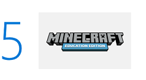

# Educator Trial in a Box Guide

This guide shows you how to quickly and easily try a few transformational tools from Microsoft Education in 5 quick steps.

|  |  |
| :---: |:--- |
|  | [Log in](#edu-task1) to **Device A** with your Teacher credentials and connect to the school network. |
|  | **Interested in significantly improving your students' reading speed and comprehension?[1](#footnote1)**  Try the [Learning Tools Immersive Reader](#edu-task2) to see how kids can learn to read faster, using text read aloud, and highlighting words for syntax. |
|  | **Looking to foster collaboration, communication, and critical thinking in the classroom?**  Launch [Microsoft Teams](#edu-task3) and learn how to set up digital classroom discussions, respond to student questions, and organize class content. |
|  | **Trying to expand classroom creativity and interaction between students?**  Open [OneNote](#edu-task4) and create an example group project for your class. |
|  | **Want to teach kids to further collaborate and problem solve?**  Play with [Minecraft: Education Edition](#edu-task5) to see how it can be used as a collaborative and versatile platform across subjects to encourage 21st century skills. |
|  |  |

 

> [!VIDEO https://www.youtube.com/embed/3nqooY9Iqq4]

 

 
## 1. Log in and connect to the school network
To try out the educator tasks, start by logging in as a teacher.

1. Turn on **Device A** and ensure you plug in the PC to an electrical outlet.
2. Log in to **Device A** using the **Teacher Username** and **Teacher Password** included in the **Credentials Sheet** located in your kit.
3. Connect to your school's Wi-Fi network or connect with a local Ethernet connection.

 

 
## 2. Significantly improve student reading speed and comprehension

> [!VIDEO https://www.youtube.com/embed/GCzSAslq_2Y]

 

Learning Tools and the Immersive Reader can be used in the Microsoft Edge browser, Microsoft Word, and Microsoft OneNote to:
* Increase fluency for English language learners
* Build confidence for emerging readers
* Provide text decoding solutions for students with learning differences such as dyslexia 

**Try this!**

1. On the **Start** menu, click the Word document titled **Design Think**.
2. Click **Edit Document** and select **Edit in Browser**.
3. Select the **View** menu.
4. Select the **Immersive Reader** button.  

  

5. Press the **Play** button to hear text read aloud.
6. Select these various settings to see different ways to configure Immersive Reader for your students.

  | Text to Speech | Text Preferences | Grammar Options | Line Focus |
  | :------------: | :--------------: | :-------------: | :--------: |
  |  |  |  |  |

 

 
## 3. Spark communication, critical thinking, and creativity in the classroom

> [!VIDEO https://www.youtube.com/embed/riQr4Dqb8B8]

 

Microsoft Teams is a digital hub that brings conversations, content, and apps together in one place. This guided tour walks you through the essential teaching features of the app. Then, through interactive prompts, experience how you can use this tool in your own classroom to spark digital classroom discussions, respond to student questions, organize content, and more!  

Take a guided tour of Microsoft Teams and test drive this digital hub.

**Try this!**

1. Take a guided tour of Microsoft Teams and test drive some teaching tasks. Open the Microsoft Edge browser and navigate to <a href="https://msteamsdemo.azurewebsites.net/" target="_blank">https://msteamsdemo.azurewebsites.net</a>.
2. Use your school credentials provided in the **Credentials Sheet**.

 

 
## 4. Expand classroom collaboration and interaction between students

> [!VIDEO https://www.youtube.com/embed/dzDSWMb_fIE]

 

Microsoft OneNote organizes curriculum and lesson plans for teachers and students to work together and at their own pace. It provides a digital canvas to store text, images, handwritten drawings, attachments, links, voice, and video.

**Try this!**
See how a group project comes together with opportunities to interact with other students and collaborate with peers. This one works best with the digital pen, included with your Trial in a Box.
When you're not using the pen, just use the magnet to stick it to the left side of the screen until you need it again. 

1. On the **Start** menu, click the OneNote shortcut named **Imagine Giza** to open the **Reimagine the Great Pyramid of Giza project**.
2. Take the digital pen out of the box and make notes or draw.
3. Follow the instructions for the project. Look for the **Try this!** callouts to experiment with these engaging activities.
  - Discover the power of digital ink by selecting the Draw tab. Choose your pen and get scribbling.

    

  - Type anywhere on the page! Just click your cursor where you want to place text. 
  - Use the checkmark in the **Home** tab to keep track of completed tasks. 

    

  - To find information without leaving OneNote, use the Researcher tool found under the Insert tab. 

    

 

 
## 5. Get kids to further collaborate and problem solve

> [!VIDEO https://www.youtube.com/embed/QI_bRNUugog]

 

Minecraft: Education Edition provides an immersive environment to develop creativity, collaboration, and problem-solving in an immersive environment where the only limit is your imagination.   

**Try this!**
Today, we'll explore a Minecraft world through the eyes of a student.

1. Connect the included mouse to your computer for optimal interaction. 
2. Open Microsoft Edge and visit <a href="https://aka.ms/lessonhub" target="_blank">https://aka.ms/lessonhub</a>.
3. Scroll down to the **Details** section and select **Download World**.

  

4. When prompted, save the world.
5. Enter your same teacher username and password and click **Accept**.
6. Click **OK** on the **Minecraft: Education Edition Free Trial** box.
7. Click **Play**.
8. Click **Lesson Hub Vol 1** to enter the downloaded world.
9. Explore the world by using the keys on your keyboard.
  * **W** moves forward.
  * **A** moves left.
  * **S** moves right.
  * **D** moves backward.
  

10. Use your mouse as your "eyes". Just move it to look around.
11. For a bird's eye view, double-tap the SPACE BAR. Now press the SPACE BAR to fly higher. And then hold the SHIFT key to safely land.

  To try more advanced movements or building within Minecraft, use the Minecraft Controls Diagram.

  

12. Access and adapt over 300 lesson plans, spanning all grades and subjects, to meet your needs. Enjoy exploring new worlds and happy crafting.

  **Try this!**

  1. Go to <a href="https://education.minecraft.net" target="_blank">education.minecraft.net/</a>.
  2. Click **Class Resources**.
  3. Click **Find a Lesson**.

  

 

**Watch what Educators say about Microsoft Education delivering better learning outcomes**
Bring out the best in students by providing a platform for collaborating, exploring, personalized learning, and getting things done across all devices.

|  |  |
|:--- |:--- |
| <iframe width="420" height="236" src="https://www.youtube-nocookie.com/embed/nt3hz2vVf8c" frameborder="0" allowfullscreen></iframe> See how one school improves reading skills using Learning Tools Immersive Reader | <iframe width="420" height="236" src="https://www.youtube-nocookie.com/embed/N7uiMs4dPcg" frameborder="0" allowfullscreen></iframe> Here's how Microsoft Teams creates more robust classroom experiences at all ages. |
| <iframe width="420" height="236" src="https://www.youtube-nocookie.com/embed/hMmRud4B54o" frameborder="0" allowfullscreen></iframe> Watch teachers elevate the education of students using OneNote. | <iframe width="420" height="236" src="https://www.youtube.com/embed/hl9ZQiektJE" frameborder="0" allowfullscreen></iframe> Here what other teachers say about using Minecraft: Education Edition in their classrooms. |
|  |  |

## Update your apps

Microsoft Education works hard to bring you the most current Trial in a Box program experience. As a result, you may need to update your apps to get our latest innovations. 

For more information about checking for updates, and how to optionally turn on automatic app updates, see the following articles:

- [Check updates for apps and games from Microsoft Store](https://support.microsoft.com/en-us/help/4026259/microsoft-store-check-updates-for-apps-and-games)

- [Turn on automatic app updates](https://support.microsoft.com/en-us/help/15081/windows-turn-on-automatic-app-updates)

## Get more info
* Learn more at <a href="https://www.microsoft.com/education" target="_blank">microsoft.com/education</a>
* Find out if your school is eligible for a device trial at <a href="https://aka.ms/EDUTrialInABox" target="_blank">aka.ms/EDUTrialInABox</a>
* <a href="https://www.microsoft.com/en-us/education/devices/default.aspx" target="_blank">Buy Windows 10 devices</a>

 
 
 
 
 
 
1 <small>OneNote in Education Learning Tools transform the student experience.</small>