# Educator Trial in a Box Guide

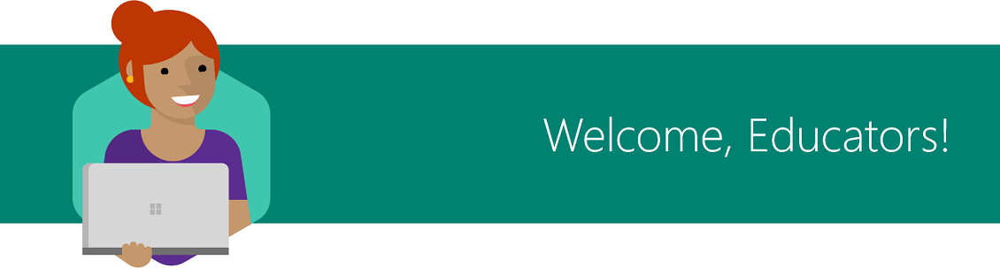

This guide shows you how to quickly and easily try a few transformational tools from Microsoft Education in 5 quick steps.

|  |  |
| :---: |:--- |
| [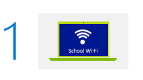](#edu-task1) | [Log in](#edu-task1) to **Device A** with your Teacher credentials and connect to the school network. |
| [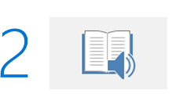](#edu-task2) | **Interested in significantly improving your students' reading speed and comprehension?[1](#footnote1)**  Try the [Learning Tools Immersive Reader](#edu-task2) to see how kids can learn to read faster, using text read aloud, and highlighting words for syntax. |
| [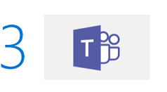](#edu-task3) | **Looking to foster collaboration, communication, and critical thinking in the classroom?**  Launch [Microsoft Teams](#edu-task3) and learn how to set up digital classroom discussions, respond to student questions, and organize class content. |
| [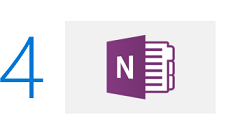](#edu-task4) | **Trying to expand classroom creativity and interaction between students?**  Open [OneNote](#edu-task4) and create an example group project for your class. |
|  | **Curious about telling stories through video?**  Try the [Photos app](#edu-task5) to make your own example video. |
| [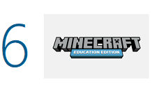](#edu-task6) | **Want to teach kids to further collaborate and problem solve?**  Play with [Minecraft: Education Edition](#edu-task6) to see how it can be used as a collaborative and versatile platform across subjects to encourage 21st century skills. |
| [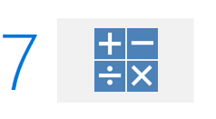](#edu-task7) | **Want to provide a personal math tutor for your students?**  Use [Windows Ink and the Math Assistant feature](#edu-task7) in OneNote to give students step-by-step instructions and interactive 2D graphs for math problems. |
|  |  |

 

> [!VIDEO https://www.youtube.com/embed/3nqooY9Iqq4]

 
 

## 1. Log in and connect to the school network
To try out the educator tasks, start by logging in as a teacher.

1. Turn on **Device A** and ensure you plug in the PC to an electrical outlet.
2. Connect **Device A** to your school's Wi-Fi network or connect with a local Ethernet connection using the Ethernet adapter included in this kit.
   >**Note**: If your Wi-Fi network requires a web browser login page to connect to the Internet, connect using the Ethernet port. If your Wi-Fi network has additional restrictions that will prevent the device from connecting to the internet without registration, consider connecting **Device A** to a different network.

3. Log in to **Device A** using the **Teacher Username** and **Teacher Password** included in the **Credentials Sheet** located in your kit.

 
 

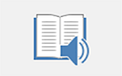
## 2. Significantly improve student reading speed and comprehension

> [!VIDEO https://www.youtube.com/embed/GCzSAslq_2Y]

 

Learning Tools and the Immersive Reader can be used in the Microsoft Edge browser, Microsoft Word, and Microsoft OneNote to:
* Increase fluency for English language learners
* Build confidence for emerging readers
* Provide text decoding solutions for students with learning differences such as dyslexia

**Try this!**

1. On the **Start** menu, click the Word document titled **Design Think**.

2. Click **Edit Document** and select **Edit in Browser**.

3. Select the **View** menu.

4. Select the **Immersive Reader** button.

   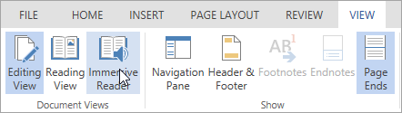

5. Press the **Play** button to hear text read aloud.

6. Select these various settings to see different ways to configure Immersive Reader for your students.

   | Text to Speech | Text Preferences | Grammar Options | Line Focus |
   | :------------: | :--------------: | :-------------: | :--------: |
   |  |  |  |  |

 
 

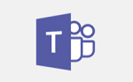
## 3. Spark communication, critical thinking, and creativity in the classroom

> [!VIDEO https://www.youtube.com/embed/riQr4Dqb8B8]

 

Microsoft Teams is a digital hub that brings conversations, content, and apps together in one place. This guided tour walks you through the essential teaching features of the app. Then, through interactive prompts, experience how you can use this tool in your own classroom to spark digital classroom discussions, respond to student questions, organize content, and more!

Take a guided tour of Microsoft Teams and test drive this digital hub.

**Try this!**

1. Take a guided tour of Microsoft Teams and test drive some teaching tasks. Open the Microsoft Edge browser and navigate to <a href="https://msteamsdemo.azurewebsites.net/" target="_blank">https://msteamsdemo.azurewebsites.net</a>.

2. Use your school credentials provided in the **Credentials Sheet**.

 
 

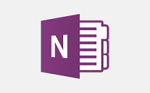
## 4. Expand classroom collaboration and interaction between students

> [!VIDEO https://www.youtube.com/embed/dzDSWMb_fIE]

 

Microsoft OneNote organizes curriculum and lesson plans for teachers and students to work together and at their own pace. It provides a digital canvas to store text, images, handwritten drawings, attachments, links, voice, and video.

**Try this!**
See how a group project comes together with opportunities to interact with other students and collaborate with peers. This one works best with the digital pen, included with your Trial in a Box.
When you're not using the pen, just use the magnet to stick it to the left side of the screen until you need it again.

1. On the **Start** menu, click the OneNote shortcut named **Imagine Giza** to open the **Reimagine the Great Pyramid of Giza project**.

2. Take the digital pen out of the box and make notes or draw.

3. Follow the instructions for the project. Look for the **Try this!** callouts to experiment with these engaging activities.
   - Discover the power of digital ink by selecting the Draw tab. Choose your pen and get scribbling.

     

   - Type anywhere on the page! Just click your cursor where you want to place text.
   - Use the checkmark in the **Home** tab to keep track of completed tasks.

     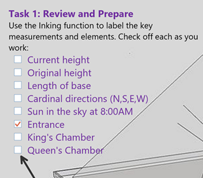

   - To find information without leaving OneNote, use the Researcher tool found under the Insert tab.

     

 
 

## 5. Engage with students by creating videos

> [!VIDEO https://www.youtube.com/embed/Ko7XLM1VBRE]

 

The Photos app now has a built-in video editor, making it easy for you and your students to create movies using photos, video clips, music, 3D models, and special effects.  Improve comprehension, unleash creativity, and capture your student’s imagination through video.

**Try this!**
Use video to create a project summary.

1. Check you have the latest version of Microsoft Photos. Open the **Start** menu and search for **Store**. Select the **See more** button (**…**) and select **Downloads and updates**. Select **Get updates**.

2. Open Microsoft Edge and visit <a href="https://aka.ms/PhotosTIB" target="_blank">https://aka.ms/PhotosTIB</a> to download a zip file of the project media.

3. Once the download has completed, open the zip file and select **Extract** > **Extract all**.  Select **Browse** and choose the **Pictures** folder as the destination, and then select **Extract**.

4. In the **Start** menu, search for **Photos** or select the Photos tile to launch the app.

5. Select the first video to preview it full screen. Select **Edit & Create**, then select **Create a video with text**.
   1. If you don't see the **Edit & Create** menu, select the video and the menu will appear at the top of the screen.

6. Name your project “Laser Maze Project.” Hit Enter to continue.

7. Select **Add photos and videos** and then **From my collection**. Scroll to select the 6 additional videos and select **Add**.

8. Drag the videos to the Storyboard, one by one. Your project should look roughly like this:

   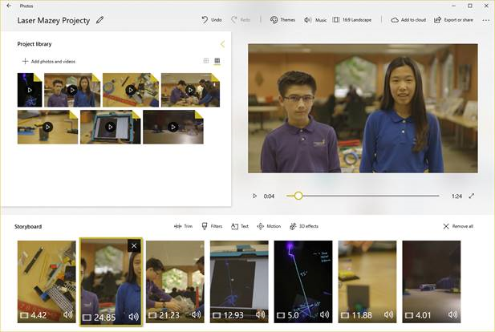

9. Select the first card in the Storyboard (the video of the project materials) and select **Text**, type a title in, a text style, a layout, and select **Done**.

10.	Select the third card in the Storyboard (the video of the children assembling the maze) and select **Trim**.  Drag the trim handle on the left to shorten the duration of the clip and select **Done**.

11.	Select the last card on the Storyboard and select **3D effects**.
    1. Position the playback indicator to be roughly 1 second into the video clip, or when the boy moves down to examine the laser.
    2. Find the **lightning bolt** effect and click or drag to add it to the scene.  Rotate, scale, and position the effect so it looks like the lightning is coming out of the laser beam and hitting the black back of the mirror.
    3. Position the blue anchor over the end of the laser pointer in the video and toggle on **Attach to a point** for the lightning bolt effect to anchor the effect in the scene.
    4. Play back your effect.
    5. Select **Done** when you have it where you want it.

    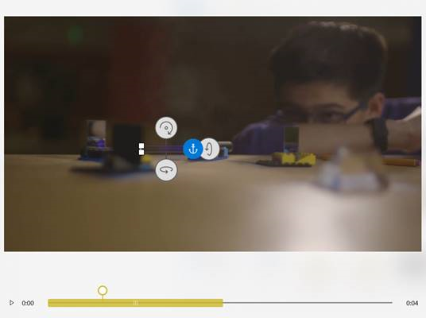

12. Select **Music** and select a track from the **Recommended** music collection.
    1. The music will update automatically to match the length of your video project, even as you make changes.
    2. If you don’t see more than a few music options, confirm that you’re connected to Wi-Fi and then close and re-open Microsoft Photos (returning to your project via the **Albums** tab). Additional music files should download in the background.

13. You can adjust the volume for the background music using the **Music volume** button.

14. Preview your video to see how it all came together.

15. Select **Export or share** and select either the **Small** or **Medium** file size. You can share your video to social media, email, or another apps.

Check out this use case video of the Photos team partnering with the Bureau Of Fearless Ideas in Seattle to bring the Photos app to local middle school students: <a href="https://www.youtube.com/watch?v=0dFFAu6XwPg" target="_blank">https://www.youtube.com/watch?v=0dFFAu6XwPg</a>
 
 
 

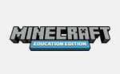
## 6. Get kids to further collaborate and problem solve

> [!VIDEO https://www.youtube.com/embed/QI_bRNUugog]

 

Minecraft: Education Edition provides an immersive environment to develop creativity, collaboration, and problem-solving in an immersive environment where the only limit is your imagination.

**Try this!**
Today, we'll explore a Minecraft world through the eyes of a student.

1. Connect the included mouse to your computer for optimal interaction.

2. Open Microsoft Edge and visit <a href="https://aka.ms/lessonhub" target="_blank">https://aka.ms/lessonhub</a>.

3. Scroll down to the **Details** section and select **Download World**.

   

4. When prompted, save the world.

5. Enter your same teacher username and password and click **Accept**.

6. Click **OK** on the **Minecraft: Education Edition Free Trial** box.

7. Click **Play**.

8. Click **Lesson Hub Vol 1** to enter the downloaded world.

9. Explore the world by using the keys on your keyboard.
   * **W** moves forward.
   * **A** moves left.
   * **S** moves right.
   * **D** moves backward.

10. Use your mouse as your "eyes". Just move it to look around.

11. For a bird's eye view, double-tap the SPACE BAR. Now press the SPACE BAR to fly higher. And then hold the SHIFT key to safely land.

    To try more advanced movements or building within Minecraft, use the Minecraft Controls Diagram.

    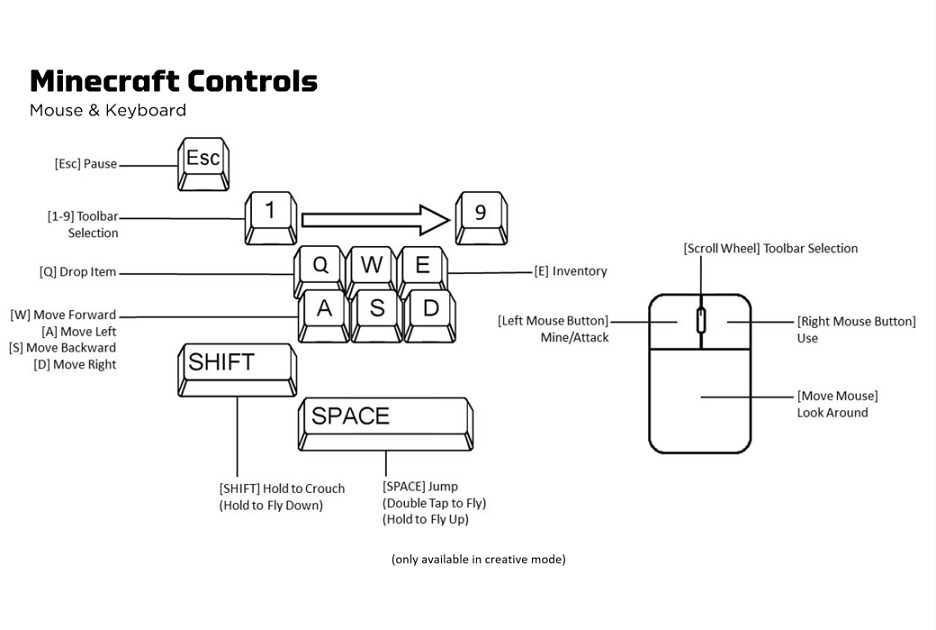

12. Access and adapt over 300 lesson plans, spanning all grades and subjects, to meet your needs. Enjoy exploring new worlds and happy crafting.

    **Try this!**

    1. Go to <a href="https://education.minecraft.net" target="_blank">education.minecraft.net/</a>.
    2. Click **Class Resources**.
    3. Click **Find a Lesson**.

    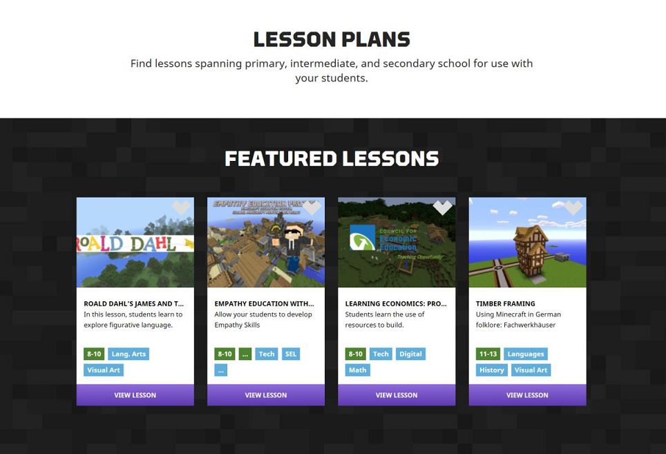

 
 
 

## 7. Use Windows Ink to provide a personal math tutor for your students

The **Math Assistant** and **Ink Replay** features available in the OneNote app give your students step-by-step instructions on how to solve their math problems and help them visualize math functions on an interactive 2D graph.

**Let's solve 3x+4=7 in OneNote using the pen!**
To get started:
1. Open the OneNote app for Windows 10 (not OneNote 2016).

   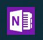

2. In the top left corner, click on the **<** arrow to access your notebooks and pages.

   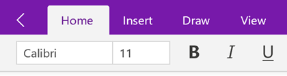

3. Click **Add Page** to launch a blank work space.

   

4. Make sure your pen is paired to the device. To pair, see <a href="https://support.microsoft.com/help/12383" target="_blank">Connect to Bluetooth devices</a>.

To solve the equation 3x+4=7, follow these instructions:
1. Write the equation 3x+4=7 in ink using the pen or type it in as text.

2. If you wrote the equation using digital ink, use the **Lasso tool** to circle the equation. If you typed the equation, highlight it using your mouse.

   

3. On the **Draw** tab, click the **Math** button.

   

4. From the drop-down menu in the **Math** pane, select the option to **Solve for x**. You can now see the final solution of the equation.

   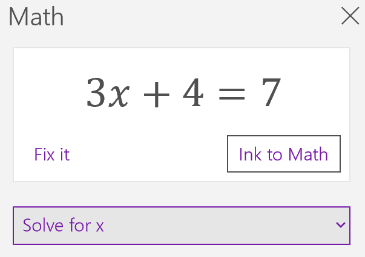

5. From the second drop-down below, choose **Steps for Solving Linear Formula**, which shows you the step-by-step solution of this equation.

6. On the **View** tab, click the **Replay** button. Use your mouse to select the written equation and watch your text in replay. Replay is great for students to review how the teacher solved the equation and for teachers to review how students approached a problem.

   

To graph the equation 3x+4=7, follow these instructions:
1. From the drop-down menu in the **Math** pane, select the option to **Graph Both Sides in 2D**. You can play with the interactive graph of your equation - use a single finger to move the graph position or two fingers to change the **zoom** level.

   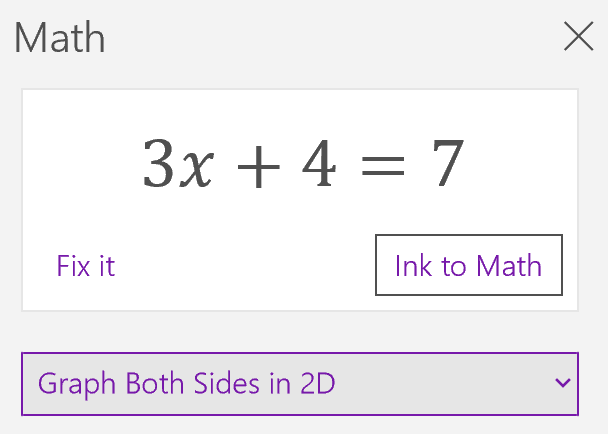

2. Click the **Insert on Page** button below the graph to add a screenshot of the graph to your page.
    
    

**Watch what Educators say about Microsoft Education delivering better learning outcomes**
Bring out the best in students by providing a platform for collaborating, exploring, personalized learning, and getting things done across all devices.

|  |  |
|:--- |:--- |
| <iframe width="420" height="236" src="https://www.youtube-nocookie.com/embed/nt3hz2vVf8c" frameborder="0" allowfullscreen></iframe> See how one school improves reading skills using Learning Tools Immersive Reader | <iframe width="420" height="236" src="https://www.youtube-nocookie.com/embed/N7uiMs4dPcg" frameborder="0" allowfullscreen></iframe> Here's how Microsoft Teams creates more robust classroom experiences at all ages. |
| <iframe width="420" height="236" src="https://www.youtube-nocookie.com/embed/hMmRud4B54o" frameborder="0" allowfullscreen></iframe> Watch teachers elevate the education of students using OneNote. | <iframe width="420" height="236" src="https://www.youtube.com/embed/hl9ZQiektJE" frameborder="0" allowfullscreen></iframe> Here what other teachers say about using Minecraft: Education Edition in their classrooms. |
|  |  |

## Update your apps

Microsoft Education works hard to bring you the most current Trial in a Box program experience. As a result, you may need to update your apps to get our latest innovations.

For more information about checking for updates, and how to optionally turn on automatic app updates, see the following articles:

- [Check updates for apps and games from Microsoft Store](https://support.microsoft.com/help/4026259/microsoft-store-check-updates-for-apps-and-games)

- [Turn on automatic app updates](https://support.microsoft.com/help/15081/windows-turn-on-automatic-app-updates)

## Get more info
* Learn more at <a href="https://www.microsoft.com/education" target="_blank">microsoft.com/education</a>
* Find out if your school is eligible for a device trial at <a href="https://aka.ms/EDUTrialInABox" target="_blank">aka.ms/EDUTrialInABox</a>
* <a href="https://www.microsoft.com/en-us/education/devices/default.aspx" target="_blank">Buy Windows 10 devices</a>

 
 
 
 
 
 
1 <small>OneNote in Education Learning Tools transform the student experience.</small>
