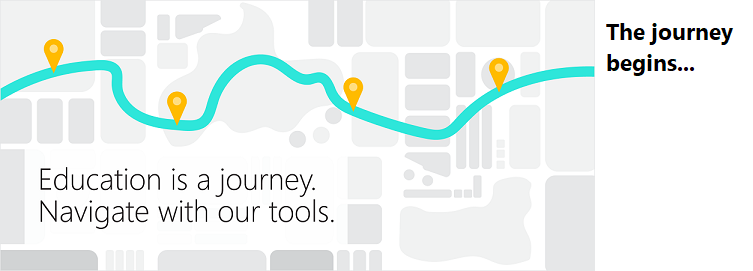

# Get started for Educators

## Learning tools
**With Microsoft Learning Tools**, students are supported in their literacy development. 
 
Learning Tools is a set of features available in Word, OneNote, and the Edge browser that helps increase fluency for English language learners, build confidence for emerging readers, and offer text decoding solutions for students with learning differences such as dyslexia. In this activity, launch Immersive Reader directly from a document to enter a full-screen reading mode and explore options to hear text read aloud, change the spacing on lines, and highlight for syntax. 

**[Watch this!](https://www.youtube.com/watch?v=nt3hz2vVf8c)** See how Microsoft Learning Tools change lives.

<iframe width="560" height="315" src="https://www.youtube-nocookie.com/embed/nt3hz2vVf8c?rel=0" frameborder="0" allowfullscreen></iframe>

**Try this!** Use Immersive Reader to read "Learning design thinking from the ancient Egyptians" in Word Online. 

1. Select Learning design thinking from the ancient Egyptians to open it in Word Online.  
2. Select the **View** tab, then **Immersive Reader**. Immersive Reader will launch into a full-screen experience.

  

3. Select these different settings to see what they do:

  | Text to Speech | Text Preferences | Grammar Options | Line Focus |
  | :------------: | :--------------: | :-------------: | :--------: |
  |  |  |  |  |

## Microsoft Teams
**With Microsoft Teams**, students collaborate in real-time.

Microsoft Teams is a digital hub that brings conversations, content, and apps together in one place. This guided tour walks you through the essential teaching features of the app. Then, through interactive prompts, experience how you can use this tool in your own classroom to spark classroom discussion, respond to student questions, organize content, and more!  

**[Watch this!](https://youtu.be/N7uiMs4dPcg)** See how Microsoft Teams for Education works in the classroom.

<iframe width="560" height="315" src="https://www.youtube-nocookie.com/embed/N7uiMs4dPcg?rel=0" frameborder="0" allowfullscreen></iframe>

**Try this!** Take a guided tour of Microsoft Teams and test drive some teaching tasks. 

1. Open your browser and visit <a href="http://teams-edustart.stagingk.1000heads.net/" target="_blank">http://teams-edustart.stagingk.1000heads.net/</a>.
2. Sign in using these credentials:
  - User: MSFT
  - Password: onStage!
3. Follow along with the guide.

## OneNote
**With OneNote**, students experience the power of inking and media-rich projects.  
  
OneNote acts as an unlimited digital canvas for the whole class to store text, images, handwritten drawings, attachments, links, voice, video, and more. See how a group project comes together with opportunities to interact with other students, multimedia, and sophisticated drawing tools. This one works best with your digital pen! 

**[Watch this!](https://www.youtube.com/watch?v=hMmRud4B54o&feature=youtu.be)** See how OneNote allows teachers to differentiate instruction allow for rich collaboration.

<iframe width="560" height="315" src="https://www.youtube-nocookie.com/embed/hMmRud4B54o?rel=0" frameborder="0" allowfullscreen></iframe>

**Try this!** Reimagine the Great Pyramids of Giza

1. Open the Windows **Start** menu  and select the OneNote for Windows 10 app. 
2. OneNote will automatically open to the **Reimagine the Great Pyramid of Giza** lesson page inside the 21st Century Learning notebook. 
3. Follow the instructions for the project.  Look for the **Try this!** call-outs to experiment with these engaging features: 
  - Discover the power of digital ink by selecting the Draw tab. Choose your pen and get scribbling.

    

  - Type anywhere on the page! Just click your cursor where you want to place text. 
  - Use the checkmark to keep track of completed tasks. 

    

  - The Researcher tool from the Insert tab can help find answers. 

    

## Minecraft: Education Edition
**With Minecraft: Education Edition**, students code, create, and visualize new worlds. 
  
Minecraft: Education Edition is an open-world game that promotes creativity, collaboration, and problem-solving in an immersive environment where the only limit is your imagination. This brief introduction to a Minecraft: Education Edition world reveals the myriad ways you can use Minecraft to teach core subject area concepts ranging from fractions to elements of storytelling.  

**[Watch this!](https://youtu.be/3rKuSlgqePo)** Learn about Code Builder for Minecraft: Education Edition.

<iframe width="560" height="315" src="https://www.youtube-nocookie.com/embed/3rKuSlgqePo?rel=0" frameborder="0" allowfullscreen></iframe>

**Try this!** Explore a Minecraft world 

1. Open your browser and visit <a href="https://aka.ms/lessonhub" target="_blank">https://aka.ms/lessonhub</a>.
2. Scroll down to the **Details** section and select **Download World**.

  

3. When prompted, save the world.
4. Double click on the world to launch it in Minecraft: Education Edition.
5. Once inside the world, use the guide to walk around and click on the different subject area examples to learn more about teaching and learning with Minecraft: Education Edition. 

  To visit a specific subject area section, right click on the button under the name of that subject area. Remember that the mouse works as your “eyes” in the game. Simply move your mouse around to take a look around the world. Use the Minecraft Controls key included below to walk forwards, backwards, left, and right in the game. Explore and have fun!

  

Stay in touch with us through our site at <a href="https://education.minecraft.net" target="_blank">https://education.minecraft.net</a> and follow @playcraftlearn on Twitter to keep up with our community news!

## Get more info
[Microsoft Education Trial in a Box](index.md)