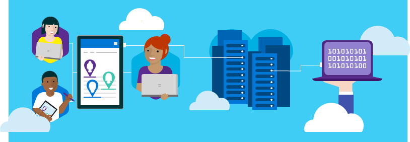

# Microsoft 365 Education Trial in a Box

**Applies to:**

-   Windows 10 S Fall Creators Update, Office 365 for Education, Microsoft Intune for Education, Microsoft Store for Education, Minecraft: Education Edition

Are you an IT admin, teacher, or student and you want to try out Microsoft 365 Education? Now you can with Microsoft 365 Education Trial in a Box. 

## What's Trial in a Box?
Microsoft 365 Education Trial in a Box lets you try out Microsoft 365 Education with new Windows 10 devices for education. With Trial in a Box, you:
* Try out two new devices running Windows 10 S Fall Creators Update for just $99
* Get a 12-month trial subscription to Microsoft 365 Education A3
* Get customer support for any questions related to Microsoft 365 Education
* Get a quick start guide and device reset tools in the box 
* Use preconfigured accounts so you can focus on the tasks you need to learn and get the most out of Microsoft 365 Education

And the devices are for your school to keep!

## What's in the IT admin box?
Your box should contain:
* A Getting Started guide
* Two new PCs:
    * A notebook running Windows 10 S, Fall Creators Update
    * A 2-in-1 laptop running Windows 10 S, Fall Creators Update and a digital pen
* Information about your 12-month trial subscription to Microsoft 365 Education A3, and the services and features included with it
* Information about how to get support for Microsoft 365 Education

## Get started!
Choose your role to get started.

|  |  |  |
| :---: | :---: | :---: |
| **[IT Admin](itadmin-tib-get-started.md)**  Log in, reset a user password, configure Intune for Education, buy and deploy apps, and add new settings. | **[Student](https://docs.microsoft.com/education)**  Learn how to use Microsoft Read Aloud, submit assignments, do something, etc etc TBD. | **[Teacher](https://docs.microsoft.com/education)**  Create a class notebook, collaborate with students in your classroom using Teams, and so on and so forth TBD. |

