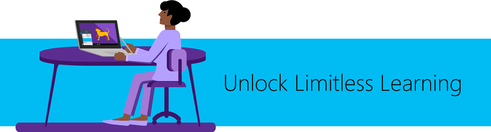

# Microsoft Education Trial in a Box

 

> [!VIDEO https://www.youtube.com/embed/azoxUYWbeGg]

 

Welcome to Microsoft Education Trial in a Box. We built this trial to make it easy to try our latest classroom technologies. We have two scenarios for you to try: one for educators and one for IT. We recommend starting with Educators. To begin, click **Get started** below. 

 

|  |  |
| :---: | :---: | 
| **Educator** Enhance students of all abilities by unleashing their creativity, collaboration, and improving problem-solving skills.  [Get started](educator-tib-get-started.md) | **IT Admin** Quickly implement and deploy a full cloud infrastructure that's secure and easy to manage.   [Get started](itadmin-tib-get-started.md) |

