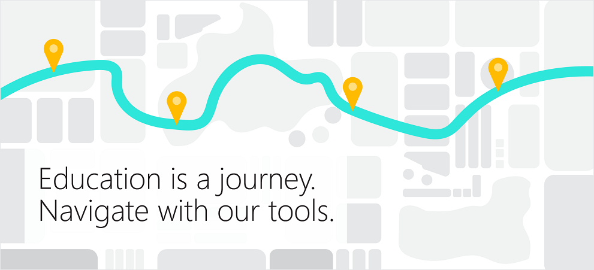

# Microsoft Education Trial in a Box

**Applies to:**

-   Windows 10 S Fall Creators Update, Office 365 for Education, Microsoft Intune for Education, Microsoft Store for Education, Minecraft: Education Edition

**Welcome to Microsoft Education Trial in a Box! Here's where you can get started.**

## What's Microsoft Education?
Microsoft Education empowers educators to unlock creativity, promote teamwork, and provide a simple and safe experience in a single, affordable solution built for education.

## What's Trial in a Box?
With Microsoft Education Trial in a Box:
* Educators can enhance independence for students of all abilities with intelligent tools like Office Lens and Learning Tools, spark creativity, collaboration, and problem-solving with Office, OneNote Class Notebook and Sway, amd connect with others
* Students can be more creative, collaborative, and improve problem-solving skills with Minecraft: Education Edition and bring ideas to live in 3D
* IT admins can learn about the tools they can use to implement and deploy a full cloud infrastructure for their school that's secure and easy to manage

And more! 

## What's in Trial in a Box?

* **Support** - A *Getting Started Guide* provides start-to-finish instructions so you can quickly begin using your PCs and live customer support in case you need it.
* **Two (2) Windows 10 S devices** - A 2-in-1 convertible PC that supports digital ink, and an affordable PC designed to survive the rigors of classroom life. Both PCs are running Windows 10 S[1](#footnote1), [2](#footnote2) with Fall Creators Update already installed.
* **Microsoft 365 Education Trial subscription** - A one-year trial subscription of Microsoft Education software to test both device experiences. This includes: Microsoft 365 Education, Minecraft: Education Edition, OneNote, Microsoft Teams for Education, and Intune for Education to enable easy setup and secure management of classroom devices.

Best of all, the devices are for your school to keep.

## Get started!
Choose your role to get started.

|  | **[Educator](https://docs.microsoft.com/education)**  - Use Immersive Reader to read in Word Online - Take a guided tour of Microsoft Teams and test drive some teaching tasks - Reimagine the Great Pyramids of Giza  - Explore a Minecraft world |
| :---: |:---| 
|  | |
|  | **[IT Admin](itadmin-tib-get-started.md)**  Learn these 5 easy tasks: - Log in with your IT admin credentials - Configure a new device with Set up School PCs - Go through Intune for Education express configuration - Buy apps from the Microsoft Store for Education and deploy it to devices in your tenant  - Add new settings for devices in your tenant  |

 
 
 
 
 
 
1 <small>Devices must be configured for educational use by applying **[SetEduPolicies](https://docs.microsoft.com/en-us/education/windows/configure-windows-for-education#setedupolicies)** using the Set up School PCs app.</small> 
2 <small>Streamlined for security and superior performance. Windows 10 S works exclusively with apps from the Microsoft Store. Some accessories and apps compatible with Windows 10 may not work, and performance may vary. Certain default settings, features, and apps cannot be changed.  </small> 
