# IT Admin Trial in a Box Guide

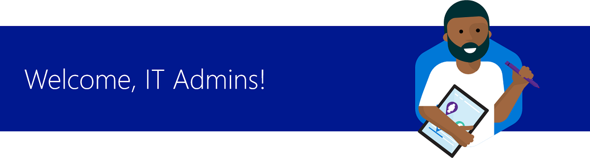

Learn how to quickly deploy and manage devices for your school in 5 quick steps.

|  |  |
| :---: |:--- |
| [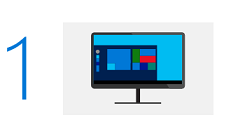](#it-task1) | [Log in](#it-task1) to **Device A** with your IT Admin credentials and connect to your school's network. |
| [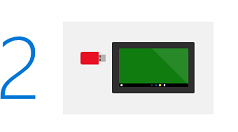](#it-task2) | [Configure Device B](#it-task2) with the Set up School PCs app. |
| [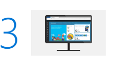](#it-task3) | [Express configure Intune for Education](#it-task3) to manage devices, users, and policies. |
| [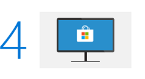](#it-task4) | [Find apps from the Microsoft Store for Education](#it-task4) and deploy them to manage devices in your tenant. |
| [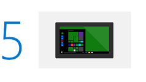](#it-task5) | [Create custom folders](#it-task5) that will appear on each managed device's **Start** menu. |
|  |  |

 
To get the most out of Microsoft Education, we&#39;ve pre-configured your tenant for you so you don&#39;t need to set it up. A tenant is representative of an organization. It is a dedicated instance of the Azure AD service that an organization receives and owns when it signs up for a Microsoft cloud service such as Azure, Microsoft Intune, or Office 365. We&#39;ve also pre-populated the tenant with fictitious Student Information System (SIS) data so you can work with this as you follow the guide.

If you run into any problems while following the steps in this guide, or you have questions about Trial in a Box or Microsoft Education, see [Microsoft Education Trial in a Box Support](support-options.md).

 

> [!VIDEO https://www.youtube.com/embed/cVVKCpO2tyI]

 

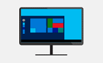 
## 1. Log in to Device A with your IT Admin credentials and connect to the school network
To try out the IT admin tasks, start by logging in as an IT admin.

1. Set up **Device A** first, then set up **Device B**.
2. Turn on **Device A** and ensure you plug in the PC to an electrical outlet.
3. Connect **Device A** to your school's Wi-Fi network or connect with a local Ethernet connection using the Ethernet adapter included in this kit.
   >**Note**: If your Wi-Fi network requires a web browser login page to connect to the Internet, connect using the Ethernet port. If your Wi-Fi network has additional restrictions that will prevent the device from connecting to the internet without registration, consider connecting **Device A** to a different network.

4. Log in to **Device A** using the **Administrator Username** and **Administrator Password** included in the **Credentials Sheet** located in your kit.
5. Note the serial numbers on the Trial in a Box devices and register both devices with the hardware manufacturer to activate the manufacturer's warranty.

 

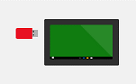 
## 2. Configure Device B with Set up School PCs
Now you're ready to learn how to configure a brand new device. You will start on **Device A** by downloading and running the Set up School PCs app. Then, you will configure **Device B**.

If you've previously used Set up School PCs to provision student devices, you can follow the instructions in this section to quickly configure **Device B**. Otherwise, we recommend you follow the instructions in [Use the Set up School PCs app](https://docs.microsoft.com/education/windows/use-set-up-school-pcs-app) for more detailed information, including tips for successfully running Set up School PCs.

### Download, install, and get ready

1. From the **Start** menu, find and then click **Microsoft Store** to launch the Store.

    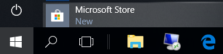

2. Search for the **Set up School PCs** app.

    

3. Click **Install**.

### Create the provisioning package

1. On **Device A**, launch the Set up School PCs app.

    

2. Click **Get started**.
3. Select **Sign-in**.
4. In **Let's get you signed in**, choose your Trial in a Box admin account. If you don't see it on the list, follow these steps:
    1. Select **Work or school account > Use another account** and then enter your Trial in a Box admin account email and password. 
    2. Click **Accept**.

5. Add a short name that Set up School PCs will use as a prefix to identify and easily manage the group of devices, apps, and other settings through Intune for Education.
  
    > [!NOTE]  
    > The name must be five (5) characters or less. Set up School PCs automatically appends `_%SERIAL%` to the prefix that you specify. `_%SERIAL%` ensures that all device names are unique. For example, if you add *Math4* as the prefix, the device names will be *Math4* followed by a random string of letters and numbers. 

6. In **Configure student PC settings**, you can specify other settings for the student PC.

    We recommend checking the highlighted settings below:

    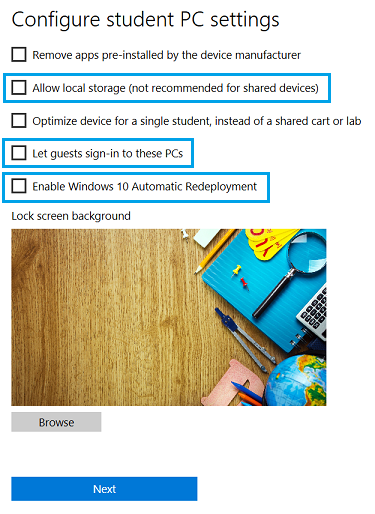

   - **Remove apps pre-installed by the device manufacturer** - If you select this option, this will reset the machine and the provisioning process will take longer (about 30 minutes).
   - **Allow local storage (not recommended for shared devices)** lets students save files to the **Desktop** and **Documents** folder on the student PC.
   - **Optimize device for a single student, instead of a shared cart or lab** optimizes the device for use by a single student (1:1). 
     - Set up School PCs will change some account management logic so that it sets the expiration time for an account to 180 days (without requiring sign-in). 
     - This setting also increases the maximum storage to 100% of the available disk space. This prevents the student's account from being erased if the student stores a lot of files or data or if the student doesn't use the PC over a prolonged period.
   - **Let guests sign-in to these PCs** allows guests to use student PCs without a school account. If you select this option, a **Guest** account button will be added in the PC's sign-in screen to allow anyone to use the PC.
   - **Enable Windows 10 Autopilot Reset** enables IT admins to quickly remove personal files, apps, and settings, and reset Windows 10 devices from the lock screen any time and apply original settings and management enrollment the student PC is returned to a fully configured or known approved state. For more info, see [Autopilot Reset](https://docs.microsoft.com/education/windows/autopilot-reset).
   - **Lock screen background** shows the default background used for student PCs provisioned by Set up School PCs. Select **Browse** to change the default.

7. **Set up the Take a Test app** configures the device for taking quizzes and high-stakes assessments by some providers like Smarter Balanced. Windows will lock down the student PC so that students can't access anything else while taking the test.

    

   1. Specify if you want to create a Take a Test button on the students' sign-in screens.
   2. Select **Advanced settings** to allow keyboard text suggestions to appear and to allow teachers to monitor online tests. 

      > [!NOTE]
      > The Take a Test app doesn't provide monitoring capabilities, but it allows tools like AssistX ClassPolicy to see what is going on in the app.

   3. Enter the assessment URL. 

8. **Add recommended apps** lets you choose from a set of recommended Microsoft Store apps to provision. 

    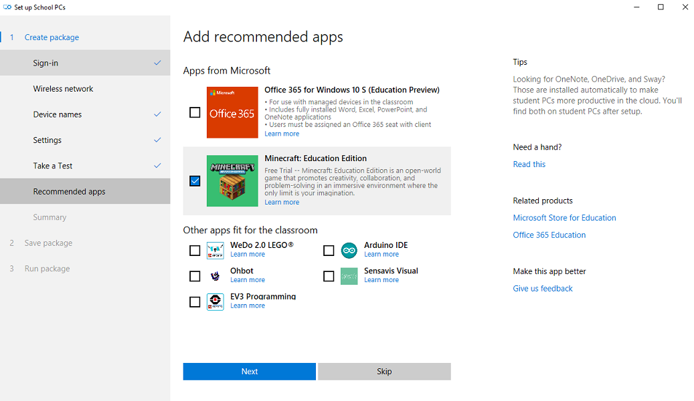

    The recommended apps include the following:
    * **Office 365 for Windows 10 S (Education Preview)** - Optional. This works well for the Trial in a Box PCs running Windows 10 S. However, if you try to install this app on other editions of Windows 10, setup will fail. Also note that if you select **Office 365 for Windows 10 S (Education Preview)**, it will take about 30-45 minutes longer for Set up School PCs to create the provisioning package as the app downloads Office 365 for Windows 10 S (Education Preview) from the Microsoft Store.
    * **Minecraft: Education Edition** - This is pre-provisioned in your tenant's app catalog, but it's not yet installed on a device. Select this option now to include it in the provisioning package.
    * **Other apps fit for the classroom** - Optional. You can choose other recommended apps to install on the PC.

9. **Review package summary**. 

    To change any of the settings, select the page or section (such as **Sign-in** or **Settings**) to go back to that page and make your changes.

    

10. Accept the summary and then insert a USB drive in **Device A**. Use the USB drive that came in the Trial in a Box accessories box to save the provisioning package.
11. Select the drive and then **Save** to create the provisioning package. 

    The provisioning package on your USB drive will be named SetUpSchoolPCs_*ABCDE* (Expires *MM-DD-YYYY*).ppkg, where *ABCDE* is the device name you added (if any), and *MM-DD-YYYY* is the month, day, and year when the package will expire.
    
    > [!NOTE]
    > If you selected **Office 365 for Windows 10 S (Education Preview)**, this step will take about 30-45 minutes. You can jump ahead to task 3, [Express configure Intune for Education to manage devices, users, and policies](#it-task3), and then finish the rest of task 2 afterwards.

12. Follow the instructions in the **Get the student PCs ready** page to start setting up **Device B**. 
13. Follow the instructions in the **Install the package** page to apply the provisioning package to **Device B**. For more guidance, you can follow the steps in [Apply the provisioning package](#apply-the-provisioning-package).

    Select **Create new package** if you need to create a new provisioning package. Otherwise, remove the USB drive.

### Apply the provisioning package
A provisioning package is a method for applying settings to Windows 10 without needing to reimage the device. 

**Set up Device B using the Set up School PCs provisioning package**

1. Start with **Device B** turned off or with the PC on the first-run setup screen. In Windows 10 S Fall Creators Update, the first-run setup screen says **Let's start with region. Is this right?**. 

    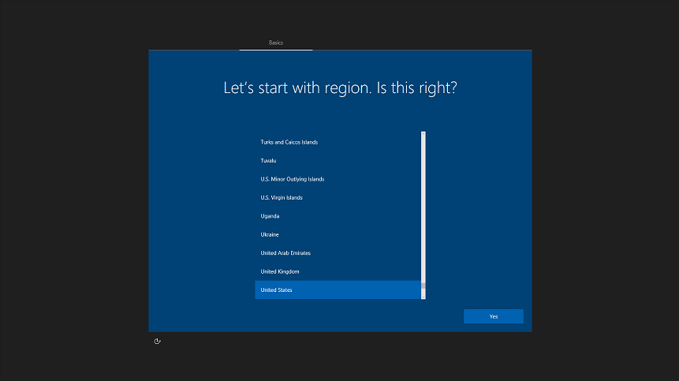

    If you go past the region selection screen, select **Ctrl + Shift + F3** which will prompt the "System Preparation Tool." Select **Okay** in the tool to return to the region selection screen. If this doesn't work, reset the PC by going to **Settings > Update & Security > Recovery > Reset this PC.**

2. Insert the USB drive into **Device B**. Windows will recognize the drive and automatically install the provisioning package. 
3. When prompted, remove the USB drive. You can then use the USB drive to start provisioning another student PC.

    After provisioning **Device B**, wait 1-2 minutes to allow the device to fully connect to the tenant. You can then select any one of the teacher or student accounts from the **User name and passwords** sheet provided in your Trial in a Box to test **Device B** and the Microsoft Education tools and services that are part of your 1-year trial.

You can complete the rest of the IT admin tasks using **Device A**.

 

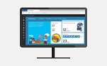 
## 3. Express configure Intune for Education to manage devices, users, and policies
Intune for Education provides an **Express configuration** option so you can get going right away. We'll use that option here.

1. Log into the <a href="https://intuneeducation.portal.azure.com/" target="_blank">Intune for Education console</a>. 
2. On the Intune for Education dashboard, click **Launch Express Configuration** or select the **Express configuration**.

    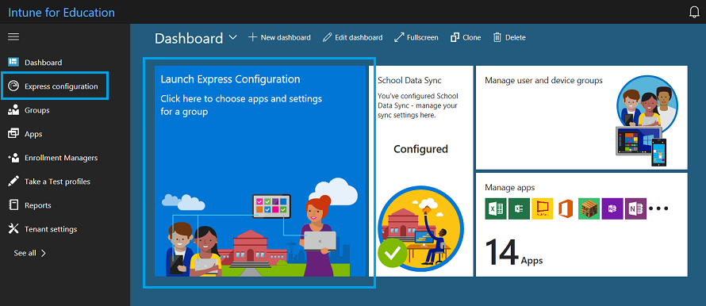

3. In the **Welcome to Intune for Education** screen, click **Get started** and follow the prompts until you get to the **Choose group** screen.
4. In the **Choose group** screen, select **All Users** so that all apps and settings that we select during express setup will apply to this group. 
5. In the **Choose apps** screen, you will see a selection of desktop (Win32) apps, Web apps, and Microsoft Store apps. 

    

6. Add or remove apps by clicking on them. A blue checkmark means the app is added and will be installed for all members of the group selected in step 5.

    > [!TIP]
    > Web apps are pushed as links in the Windows Start menu under **All apps**. If you want apps to appear in Microsoft Edge browser tabs, use the **Homepages** setting for Microsoft Edge through **Express configuration** or **Manage Users and Devices**.

7. In the **Choose settings** screen, set the settings to apply to the group. Expand each settings group to see all the configurable settings.

    For example, set these settings:
    - In the **Basic device settings** group, change the **Block changing language settings** and **Block changing device region settings** to **Block**.
    - In the **Microsoft Edge settings** group, change the **Block pop-ups** setting to **Block**.

8. Click **Next** and review the list of apps and settings you selected to apply.
9. Click **Save** and then click **All done** to go back to the dashboard.

 

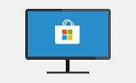 
## 4. Find apps from the Microsoft Store for Education and deploy them to managed devices in your tenant
The Microsoft Store for Education is where you can shop for more apps for your school.

1. In Intune for Education, select **Apps**. 
2. In the **Store apps** section, select **+ New app** to go to the <a href="https://educationstore.microsoft.com" target="_blank">Microsoft Store for Education</a>.
3. Select **Sign in** and start shopping for apps for your school.

    

4. Check some of the categories for suggested apps or search the Store for a free educational or reference app. Find ones that you haven't already installed during express configuration for Intune for Education. For example, these apps are free:
    - Duolingo - Learn Languages for Free
    - Khan Academy
    - My Study Life
    - Arduino IDE

5. Find or select the app you want to install and click **Get the app**.
6. In the app's Store page, click the **...** button and select **Add to private store**. 

    Repeat steps 3-5 to install another app or go to the next step.

7. Select **Manage > Products & services** to verify that the apps you purchased appear in your inventory.

    The apps will show up in your inventory along with the apps that Microsoft automatically provisioned for your education tenant.

    

    In the **Private store** column of the **Products & services** page, the status for some apps will indicate that it's "In private store" while others will say "Adding to private store" or "Not applicable". Learn more about this in <a href="https://docs.microsoft.com/microsoft-store/distribute-apps-from-your-private-store" target="_blank">Distribute apps using your private store</a>.

    > [!NOTE]  
    > Sync happens automatically, but it may take up to 36 hours for your organization's private store and 12 hours for Intune for Education to sync all your purchased apps.

 

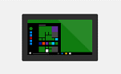 
## 5. Create custom folders that will appear on each managed device's Start menu
Update settings for all devices in your tenant by adding the **Documents** and **Downloads** folders to all devices managed in Intune for Education.

1. Go to the <a href="https://intuneeducation.portal.azure.com/" target="_blank">Intune for Education console</a>.
2. Select **Group > All Devices > Settings** and expand **Windows interface settings**.
3. In **Choose folders that appear in the Start menu**, select **Documents** and **Downloads**.

    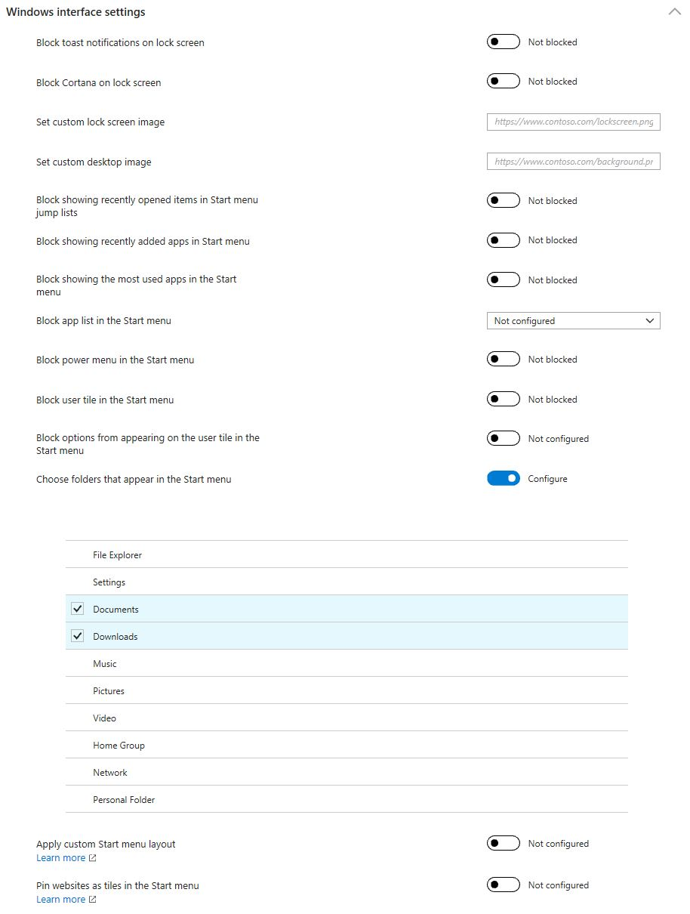

4. **Save** your changes.

## Verify correct device setup and other IT admin tasks
Follow these instructions to confirm if you configured your tenant correctly and the right apps and settings were applied to all users or devices on your tenant:

* [Verify correct device setup](https://docs.microsoft.com/education/get-started/finish-setup-and-other-tasks#verify-correct-device-setup) 

    1. Confirm that the apps you bought from the Microsoft Store for Education appear in the Windows Start screen's **Recently added** section.

        > [!NOTE]
        > It may take some time before the apps appear on your devices. When you select **Start**, some apps may show up under **Recently added** while others may say that **Add is in progress**. Sync happens automatically, but it may take up to 24 hours for your organization's private store and 12 hours for Intune for Education to sync all your purchased apps down to your devices. 

    2. Confirm that the folders you added, if you chose to customize the Windows interface from Intune for Education, appear in the Start menu.
    3. If you added **Office 365 for Windows 10 S (Education Preview)** to the package and provisioned **Device B** with it, you need to click on one of the Office apps in the **Start** menu to complete app registration. 

* [Verify the device is Azure AD joined](https://docs.microsoft.com/education/get-started/finish-setup-and-other-tasks#verify-the-device-is-azure-ad-joined) - Confirm that your devices are being managed in Intune for Education.
* [Add more users](https://docs.microsoft.com/education/get-started/finish-setup-and-other-tasks#add-more-users) - Go to the Microsoft 365 admin center to add more users.
* Get app updates (including updates for Office 365 for Windows 10 S)
    1. Open the **Start** menu and go to the **Microsoft Store**.
    2. From the **Microsoft Store**, click **...** (See more) and select **Downloads and updates**.
    3. In the **Downloads and updates** page, click **Get updates**.
* [Try the BYOD scenario](https://docs.microsoft.com/education/get-started/finish-setup-and-other-tasks#connect-other-devices-to-your-cloud-infrastructure) 

## Update your apps

Microsoft Education works hard to bring you the most current Trial in a Box program experience. As a result, you may need to update your apps to get our latest innovations. 

For more information about checking for updates, and how to optionally turn on automatic app updates, see the following articles:

- [Check updates for apps and games from Microsoft Store](https://support.microsoft.com/help/4026259/microsoft-store-check-updates-for-apps-and-games)

- [Turn on automatic app updates](https://support.microsoft.com/help/15081/windows-turn-on-automatic-app-updates)

## Get more info
* Learn more at <a href="https://www.microsoft.com/education" target="_blank">microsoft.com/education</a>
* Find out if your school is eligible for a device trial at <a href="https://aka.ms/EDUTrialInABox" target="_blank">aka.ms/EDUTrialInABox</a>
* <a href="https://www.microsoft.com/en-us/education/devices/default.aspx" target="_blank">Buy Windows 10 devices</a>
