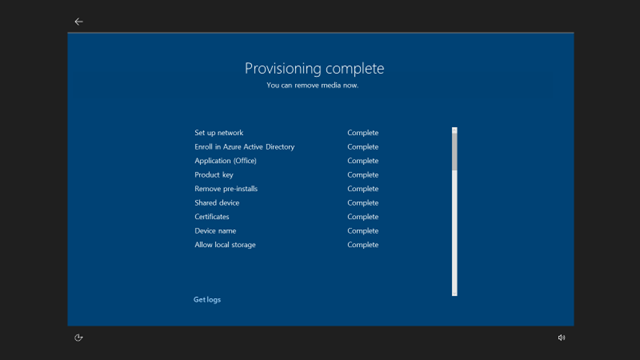

# Reset devices with Autopilot Reset 
**Applies to:**

-   Windows 10, version 1709 

IT admins or technical teachers can use Autopilot Reset to quickly remove personal files, apps, and settings, and reset Windows 10 devices from the lock screen any time and apply original settings and management enrollment (Azure Active Directory and device management) so the devices are ready to use. With Autopilot Reset, devices are returned to a fully configured or known IT-approved state.

To enable Autopilot Reset in Windows 10, version 1709 (Fall Creators Update), you must:

1. [Enable the policy for the feature](#enable-autopilot-reset)
2. [Trigger a reset for each device](#trigger-autopilot-reset)

## Enable Autopilot Reset

To use Autopilot Reset, [Windows Recovery Environment (WinRE) must be enabled on the device](#winre).

**DisableAutomaticReDeploymentCredentials** is a policy that enables or disables the visibility of the credentials for Autopilot Reset. It is a policy node in the [Policy CSP](https://docs.microsoft.com/windows/client-management/mdm/policy-csp-credentialproviders), **CredentialProviders/DisableAutomaticReDeploymentCredentials**. By default, this policy is set to 1 (Disable). This ensures that Autopilot Reset isn't triggered by accident.

You can set the policy using one of these methods:

- MDM provider

    - Autopilot Reset in Intune for Education is coming soon. In a future update of Intune for Education, new tenants will automatically have the Autopilot Reset setting enabled by default on the **All devices** group as part of initial tenant configuration. You will also be able to manage this setting to target different groups in the admin console.
    - If you're using an MDM provider other than Intune for Education, check your MDM provider documentation on how to set this policy. If your MDM provider doesn't explicitly support this policy, you can manually set this policy if your MDM provider allows specific OMA-URIs to be manually set.

        For example, in Intune, create a new configuration policy and add an OMA-URI. 
        - OMA-URI:  ./Vendor/MSFT/Policy/Config/CredentialProviders/DisableAutomaticReDeploymentCredentials
        - Data type:  Integer
        - Value:  0

- Windows Configuration Designer
    
    You can [use Windows Configuration Designer](https://docs.microsoft.com/windows/configuration/provisioning-packages/provisioning-create-package) to set the **Runtime settings > Policies > CredentialProviders > DisableAutomaticReDeploymentCredentials** setting and create a provisioning package.

- Set up School PCs app

    Autopilot Reset in the Set up School PCs app is available in the latest release of the app. Make sure you are running Windows 10, version 1709 on the student PCs if you want to use Autopilot Reset through the Set up School PCs app. You can check the version several ways:
    - Reach out to your device manufacturer.
    - If you manage your PCs using Intune or Intune for Education, you can check the OS version by checking the **OS version** info for the device. If  you are using another MDM provider, check the documentation for the MDM provider to confirm the OS version.
    - Log into the PCs, go to the **Settings > System > About** page, look in the **Windows specifications** section and confirm **Version** is set to 1709.

    To use the Autopilot Reset setting in the Set up School PCs app:
    * When using [Set up School PCs](use-set-up-school-pcs-app.md), in the **Configure student PC settings** screen, select **Enable Windows 10 Autopilot Reset** among the list of settings for the student PC as shown in the following example:

    
    
## Trigger Autopilot Reset
Autopilot Reset is a two-step process: trigger it and then authenticate. Once you've done these two steps, you can let the process execute and once it's done, the device is again ready for use. 

**To trigger Autopilot Reset**

1. From the Windows device lock screen, enter the keystroke: **CTRL +  + R**. 

    

    This will open up a custom login screen for Autopilot Reset. The screen serves two purposes:
    1. Confirm/verify that the end user has the right to trigger Autopilot Reset
    2. Notify the user in case a provisioning package, created using Windows Configuration Designer or Set up School PCs, will be used as part of the process.

    

2. Sign in with the admin account credentials. If you created a provisioning package, plug in the USB drive and trigger Autopilot Reset.

>[!IMPORTANT] 
>To reestablish Wi-Fi connectivity after reset, make sure the **Connect automatically** box is checked for the device's wireless network connection. 

    Once Autopilot Reset is triggered, the reset process starts. 
    
    After reset, the device:
    - Sets the region, language, and keyboard.
    - Connects to Wi-Fi.
    - If you provided a provisioning package when Autopilot Reset is triggered, the system will apply this new provisioning package. Otherwise, the system will re-apply the original provisioning package on the device. 
    - Is returned to a known good managed state, connected to Azure AD and MDM.

     

    Once provisioning is complete, the device is again ready for use.

<span id="winre"/>
## Troubleshoot Autopilot Reset

Autopilot Reset will fail when the [Windows Recovery Environment (WinRE)](https://docs.microsoft.com/windows-hardware/manufacture/desktop/windows-recovery-environment--windows-re--technical-reference) is not enabled on the device. You will see `Error code: ERROR_NOT_SUPPORTED (0x80070032)`.

To make sure WinRE is enabled, use the [REAgentC.exe tool](https://docs.microsoft.com/windows-hardware/manufacture/desktop/reagentc-command-line-options) to run the following command:

```
reagentc /enable
```

If Autopilot Reset fails after enabling WinRE, or if you are unable to enable WinRE, please contact [Microsoft Support](https://support.microsoft.com) for assistance.

## Related topics

[Set up Windows devices for education](set-up-windows-10.md)


