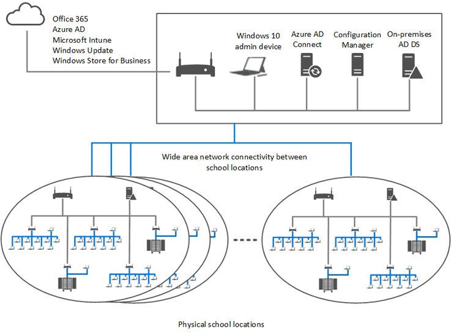
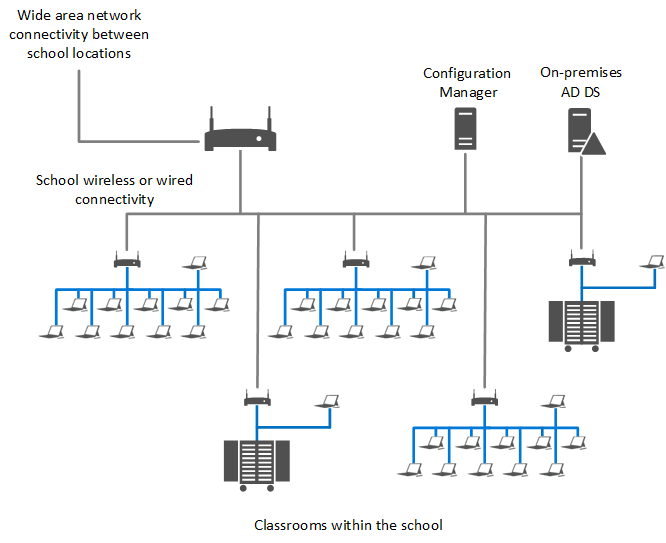
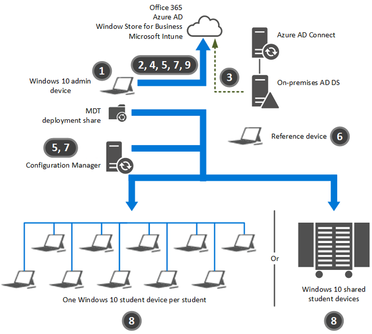

# Deploy Windows 10 in a school district

This guide shows you how to deploy the Windows 10 operating system in a school district. You learn how to deploy Windows 10 in classrooms; integrate the school environment with Microsoft Office 365, Active Directory Domain Services (AD DS), and Microsoft Azure Active Directory (Azure AD); and deploy Windows 10 and your apps to new devices or upgrade existing devices to Windows 10. This guide also describes how to use Microsoft Configuration Manager, Microsoft Intune, and Group Policy to manage devices. Finally, the guide discusses common, ongoing maintenance tasks that you'll perform after initial deployment and the automated tools and built-in features of the operating system.

## Prepare for district deployment

Proper preparation is essential for a successful district deployment. To avoid common mistakes, your first step is to plan a typical district configuration. As with building a house, you need a blueprint for what your district and individual schools should look like when it’s finished. The second step in preparation is to learn how you'll manage the users, apps, and devices in your district. Just as a builder needs to have the right tools to build a house, you need the right set of tools to deploy your district.

> [!NOTE]
> This guide focuses on Windows 10 deployment and management in a district. For management of other devices and operating systems in education environments, see [Manage BYOD and corporate-owned devices with MDM solutions](https://www.microsoft.com/cloud-platform/mobile-device-management).

### Plan a typical district configuration

As part of preparing for your district deployment, you need to plan your district configuration — the focus of this guide. Figure 1 illustrates a typical finished district configuration that you can use as a model (the blueprint in our builder analogy) for the finished state.

> [!div class="mx-imgBorder"]
> 

*Figure 1. Typical district configuration for this guide*

A *district* consists of multiple schools, typically at different physical locations. Figure 2 illustrates a typical school configuration within the district that this guide uses.

> [!div class="mx-imgBorder"]
> 

*Figure 2. Typical school configuration for this guide*

Finally, each school consists of multiple classrooms. Figure 3 shows the classroom configuration this guide uses.

> [!div class="mx-imgBorder"]
> 

*Figure 3. Typical classroom configuration in a school*

This district configuration has the following characteristics:

* It contains one or more admin devices.

* It contains two or more schools.

* Each school contains two or more classrooms.

* Each classroom contains one teacher device.

* The classrooms connect to each other through multiple subnets.

* All devices in each classroom connect to a single subnet.

* All devices have high-speed, persistent connections to each other and to the Internet.

* All teachers and students have access to Microsoft Store or Microsoft Store for Business.

* You install a 64-bit version of Windows 10 on the admin device.

* You install the Windows Assessment and Deployment Kit (Windows ADK) on the admin device.

* You install the 64-bit version of the Microsoft Deployment Toolkit (MDT) 2013 Update 2 on the admin device.

  > [!NOTE]
  > In this guide, all references to MDT refer to the 64-bit version of MDT 2013 Update 2.
  
* The devices use Azure AD in Office 365 Education for identity management.

* If you've on-premises AD DS, you can [integrate Azure AD with on-premises AD DS](/azure/active-directory/hybrid/whatis-hybrid-identity).

* Use [Intune](/intune/), [Mobile Device Management for Office 365](/microsoft-365/admin/basic-mobility-security/set-up), or [Group Policy in AD DS](/previous-versions/windows/it-pro/windows-server-2008-R2-and-2008/cc725828(v=ws.10)) to manage devices.

* Each device supports a one-student-per-device or multiple-students-per-device scenario.

* The devices can be a mixture of different make, model, and processor architecture (32-bit or 64-bit) or be identical.

* To initiate Windows 10 deployment, use a USB flash drive, DVD-ROM or CD-ROM, or Pre-Boot Execution Environment (PXE) boot.

* The devices can be a mixture of different Windows 10 editions, such as Windows 10 Pro, Windows 10 Enterprise, or Windows 10 Education.

Use these characteristics at a minimum as you deploy your schools. If your district deployment is less complex, you may want to review the guidance in [Deploy Windows 10 in a school](./deploy-windows-10-in-a-school.md).

> [!NOTE]
> This guide focuses on Intune as the mobile device management (MDM) solution. If you want to use an MDM solution other than Intune, ignore the Intune-specific content in this guide. For each section, contact your MDM provider to determine the features and management capabilities for your institution.

Office 365 Education allows:

* Students and faculty to use Microsoft Office to create and edit Microsoft Word, OneNote, PowerPoint, and Excel documents in a browser.

* Teachers to use the [OneNote Class Notebook app](https://www.onenote.com/classnotebook) to share content and collaborate with students.

* Faculty to use the [OneNote Staff Notebooks app](https://www.onenote.com/staffnotebookedu) to collaborate with other teachers, the administration, and faculty.

* Teachers to employ Sway to create interactive educational digital storytelling.

* Students and faculty to use email and calendars, with mailboxes up to 50 GB per user.

* Faculty to use advanced email features like email archiving and legal hold capabilities.

* Faculty to help prevent unauthorized users from accessing documents and email by using Microsoft Azure Rights Management.

* Faculty to use advanced compliance tools on the unified eDiscovery pages in the Microsoft Purview compliance portal.

* Faculty to host online classes, parent–teacher conferences, and other collaboration in Skype for Business.

* Students and faculty to access up to 1 TB of personal cloud storage that users inside and outside the educational institution can share through OneDrive for Business.

* Teachers to provide collaboration in the classroom through Microsoft SharePoint Online team sites.

* Students and faculty to use Office 365 Video to manage videos.

* Students and faculty to use Yammer to collaborate through private social networking.

* Students and faculty to access classroom resources from anywhere on any device (including iOS and Android devices).

For more information about Office 365 Education features and an FAQ, go to [Office 365 Education plans and pricing](https://www.microsoft.com/microsoft-365/academic/compare-office-365-education-plans).

### How to configure a district

Now that you've the plan (blueprint) for your district and individual schools and classrooms, you’re ready to learn about the tools you'll use to deploy it. There are many tools you could use to accomplish the task, but this guide focuses on using those tools that require the least infrastructure and technical knowledge.

The primary tool you'll use to deploy Windows 10 in your school is MDT, which uses Windows ADK components to make deployment easier. You could just use the Windows ADK to perform your deployment, but MDT simplifies the process by providing an intuitive, wizard-driven user interface (UI).

You can use MDT as a stand-alone tool or integrate it with Microsoft Configuration Manager. As a stand-alone tool, MDT performs Lite Touch Installation (LTI) deployments—deployments that require minimal infrastructure and allow you to control the level of automation. When integrated with Configuration Manager, MDT performs Zero Touch Installation (ZTI) deployments, which require more infrastructure (such as Configuration Manager) but result in fully automated deployments.

This guide focuses on LTI deployments to deploy the reference device. You can use ZTI deployments with Configuration Manager or LTI deployments to deploy the reference images to your faculty and student devices. If you want to only use MDT, see [Deploy Windows 10 in a school](./deploy-windows-10-in-a-school.md).

MDT includes the Deployment Workbench, a console from which you can manage the deployment of Windows 10 and your apps. You configure the deployment process in the Deployment Workbench, including the management of operating systems, device drivers, apps, and migration of user settings on existing devices.

LTI performs deployment from a *deployment share* — a network-shared folder on the device on which you installed MDT. You can perform over-the-network deployments from the deployment share or perform deployments from a local copy of the deployment share on a USB drive or DVD. You'll learn more about MDT in [Prepare the admin device](#prepare-the-admin-device), earlier in this article.

The focus of MDT is deployment, so you also need tools that help you manage your Windows 10 devices and apps. You can manage Windows 10 devices and apps with Intune, the Compliance Management feature in Office 365, or Group Policy in AD DS. You can use any combination of these tools based on your school requirements.

ZTI performs fully automated deployments using Configuration Manager and MDT. Although you could use Configuration Manager by itself, using Configuration Manager with MDT provides an easier process for deploying operating systems. MDT works with the operating system deployment feature in Configuration Manager.

The configuration process requires the following devices:

* **Admin device.** This device is the one you use for your day-to-day job functions. It’s also the one you use to create and manage the Windows 10 and app deployment process. You install the Windows ADK, MDT, and the Configuration Manager Console on this device.

* **Reference devices.** These devices are the ones that you'll use as a template for the faculty and student devices. You install Windows 10 and Windows desktop apps on these devices, and then capture an image (.wim file) of the devices.

  You'll have a reference device for each type of device in your district. For example, if your district has Surface, HP Stream, Dell Inspiron, and Lenovo Yoga devices, then you would have a reference device for each model. For more information about approved Windows 10 devices, see [Explore devices](https://www.microsoft.com/windows/view-all).
  
* **Faculty and staff devices.** These devices are the ones that the teachers, faculty, and staff use for their day-to-day job functions. You use the admin device to deploy (or upgrade) Windows 10 and apps to these devices.

* **Student devices.** The students will use these devices. You'll use the admin device deploy (or upgrade) Windows 10 and apps to them.

The high-level process for deploying and configuring devices within individual classrooms, individual schools, and the district as a whole is as follows and illustrated in Figure 4:

1. Prepare the admin device for use, which includes installing the Windows ADK, MDT, and the Configuration Manager console.

2. On the admin device, create and configure the Office 365 Education subscription that you'll use for the district’s classrooms.

3. On the admin device, configure integration between on-premises AD DS and Azure AD (if you've an on premises AD DS configuration).

4. On the admin device, create and configure a Microsoft Store for Business portal.

5. On the admin device, prepare for management of the Windows 10 devices after deployment.

6. On the reference devices, deploy Windows 10 and the Windows desktop apps on the device, and then capture the reference image from the devices.

7. Import the captured reference images into MDT or Microsoft Configuration Manager.

8. On the student and faculty devices, deploy Windows 10 to new or existing devices, or upgrade eligible devices to Windows 10.

9. On the admin device, manage the Windows 10 devices and apps, the Office 365 subscription, and the AD DS–Azure AD integration.

> [!div class="mx-imgBorder"]
> 

*Figure 4. How district configuration works*

Each step illustrated in Figure 4 directly corresponds to the remaining high-level sections in this guide.

#### Summary

In this district, you looked at the final configuration of your individual classrooms, individual schools, and the district as a whole upon completion of this guide. You also learned the high-level steps for deploying the faculty and student devices in your district.

## Select deployment and management methods

Now that you know what a typical district looks like and how to configure the devices in your district, you need to make a few decisions. You must select the methods you’ll use to deploy Windows 10 to the faculty and student devices in your district. Next, you must select the method you’ll use to manage configuration settings for your users and devices. Finally, you must select the method you’ll use to manage Windows desktop apps, Microsoft Store apps, and software updates.

### Typical deployment and management scenarios

Before you select the deployment and management methods, you need to review the typical deployment and management scenarios (the cloud-centric scenario and the on-premises and cloud scenario). Table 1 lists the scenario feature and the corresponding products and technologies for that feature in each scenario.

|Scenario feature |Cloud-centric|On-premises and cloud|
|---|---|---|
|Identity management | Azure AD (stand-alone or integrated with on-premises AD DS)  |  AD DS integrated with Azure AD |
|Windows 10 deployment   | MDT only  |  Microsoft Configuration Manager with MDT |
|Configuration setting management  | Intune  |  Group Policy  Intune|
|App and update management |  Intune |Microsoft Configuration Manager  Intune|

*Table 1. Deployment and management scenarios*

These scenarios assume the need to support:

* Institution-owned and personal devices.
* AD DS domain-joined and nondomain-joined devices.

Some constraints exist in these scenarios. As you select the deployment and management methods for your device, keep the following constraints in mind:

* You can use Group Policy or Intune to manage configuration settings on a device but not both.
* You can use Configuration Manager or Intune to manage apps and updates on a device but not both.
* You can't  manage multiple users on a device with Intune if the device is AD DS domain joined.

Use the cloud-centric scenario and on-premises and cloud scenario as a guide for your district. You may need to customize these scenarios, however, based on your district. As you go through the [Select the deployment methods](#select-the-deployment-methods), [Select the configuration setting management methods](#select-the-configuration-setting-management-methods), and the [Select the app and update management products](#select-the-app-and-update-management-products) sections, remember these scenarios and use them as the basis for your district.

### Select the deployment methods

To deploy Windows 10 and your apps, you can use MDT by itself or Microsoft Configuration Manager and MDT together. For a district, there are a few ways to deploy Windows 10 to devices. Table 2 lists the methods that this guide describes and recommends. Use this information to determine which combination of deployment methods is right for your institution.

|Method|Description|
|--- |--- |
|MDT|MDT is an on-premises solution that supports initial operating system deployment and upgrade. You can use MDT to deploy and upgrade Windows 10. In addition, you can initially deploy Windows desktop and Microsoft Store apps and software updates.  Select this method when you: <li> Want to deploy Windows 10 to institution-owned and personal devices. (Devices need not be domain joined.) <li> Don’t have an existing AD DS infrastructure. <li> Need to manage devices regardless of where they are (on or off premises).  The advantages of this method are that:   <li> You can deploy Windows 10 operating systems <li> You can manage device drivers during initial deployment. <li>You can deploy Windows desktop apps (during initial deployment)<li> It doesn’t require an AD DS infrastructure.<li>It doesn’t have extra infrastructure requirements.<li>MDT doesn’t incur extra cost: it’s a free tool.<li>You can deploy Windows 10 operating systems to institution-owned and personal devices.   The disadvantages of this method are that it:  <li>Can’t manage applications throughout entire application life cycle (by itself).<li>Can’t manage software updates for Windows 10 and apps (by itself).<li>Doesn’t provide antivirus and malware protection (by itself).<li>Has limited scaling to large numbers of users and devices.|
|Microsoft Configuration Manager|<li> Configuration Manager is an on-premises solution that supports operating system management throughout the entire operating system life cycle <li>You can use Configuration Manager to deploy and upgrade Windows 10. In addition, you can manage Windows desktop and Microsoft Store apps and software updates as well as provide antivirus and antimalware protection.   Select this method when you: <li> Want to deploy Windows 10 to institution-owned devices that are domain joined (personal devices are typically not domain joined). <li>Have an existing AD DS infrastructure (or plan to deploy an AD DS infrastructure). <li>Typically deploy Windows 10 to on-premises devices.   The advantages of this method are that: <li>You can deploy Windows 10 operating systems.<li>You can manage (deploy) Windows desktop and Microsoft Store apps throughout entire application life cycle.<li>You can manage software updates for Windows 10 and apps.<li>You can manage antivirus and malware protection.<li>It scales to large number of users and devices.  The disadvantages of this method are that it:<li>Carries an extra cost for Microsoft Configuration Manager server licenses (if the institution doesn't  have Configuration Manager already).<li>Can deploy Windows 10 only to domain-joined (institution-owned devices).<li>Requires an AD DS infrastructure (if the institution doesn't  have AD DS already).|

*Table 2. Deployment methods*

Record the deployment methods you selected in Table 3.

|Selection | Deployment method|
|--------- | -----------------|
|   |MDT by itself |
|   |Microsoft Configuration Manager and MDT|

*Table 3. Deployment methods selected*

### Select the configuration setting management methods

If you've only one device to configure, manually configuring that one device is tedious but possible. When you've multiple classrooms of devices to configure, however, manually configuring each device becomes overwhelming. In addition, maintaining an identical configuration on every device will become impossible as the number of devices in the district increases.

For a district, there are many ways to manage the configuration setting for users and devices. Table 4 lists the methods that this guide describes and recommends. Use this information to determine which combination of configuration setting management methods is right for your institution.

|Method|Description|
|--- |--- |
|Group Policy|Group Policy is an integral part of AD DS and allows you to specify configuration settings for Windows 10 and previous versions of Windows.   Select this method when you <li>Want to manage institution-owned devices that are domain joined (personal devices are typically not domain joined).<li> Want more granular control of device and user settings. <li>Have an existing AD DS infrastructure.<li>Typically manage on-premises devices.<li>Can manage a required setting only by using Group Policy.  The advantages of this method include: <li>No cost beyond the AD DS infrastructure. <li>A larger number of settings (compared to Intune). The disadvantages of this method are that it:<li>Can only manage domain-joined (institution-owned devices).<li>Requires an AD DS infrastructure (if the institution doesn't  have AD DS already).<li>Typically manages on-premises devices (unless devices use a virtual private network [VPN] or Microsoft DirectAccess to connect).<li> Has rudimentary app management capabilities.<li> can't  deploy Windows 10 operating systems.|
|Intune|Intune is a cloud-based management system that allows you to specify configuration settings for Windows 10, previous versions of Windows, and other operating systems (such as iOS or Android). Intune is a subscription-based cloud service that integrates with Office 365 and Azure AD. Intune is the cloud-based management system described in this guide, but you can use other MDM providers. If you use an MDM provider other than Intune, integration with Configuration Manager is unavailable. Select this method when you:<li> Want to manage institution-owned and personal devices (doesn't require that the device be domain joined).<li>Don’t need granular control over device and user settings (compared to Group Policy).<li>Don’t have an existing AD DS infrastructure.<li>Need to manage devices regardless of where they are (on or off premises).<li>Want to provide application management for the entire application life cycle.<li>Can manage a required setting only by using Intune. The advantages of this method are that:<li>You can manage institution-owned and personal devices.<li>It doesn’t require that devices be domain joined.<li>It doesn’t require any on-premises infrastructure.<li>It can manage devices regardless of their location (on or off premises). The disadvantages of this method are that it:<li>Carries an extra cost for Intune subscription licenses.<li>Doesn’t offer granular control over device and user settings (compared to Group Policy).<li>can't  deploy Windows 10 operating systems.|

*Table 4. Configuration setting management methods*

Record the configuration setting management methods you selected in Table 5. Although you can use both Group Policy and Intune to manage devices, to manage a device, you must choose either Group Policy or Intune (but not both).

|Selection |Configuration setting management method |
|----------|--------------|
|   |Group Policy  |
|   |Intune   |

*Table 5. Configuration setting management methods selected*

#### Select the app and update management products

For a district, there are many ways to manage apps and software updates. Table 6 lists the products that this guide describes and recommends. Although you could manage updates by using [Windows Updates or Windows Server Update Services (WSUS)](/windows/deployment/deploy-whats-new), you still need to Configuration Manager or Intune to manage apps. Therefore, it only makes sense to use one or both of these tools for update management.

Use the information in Table 6 to determine which combination of app and update management products is right for your district.

|Selection|Management method|
|--- |--- |
|Microsoft Configuration Manager|Configuration Manager is an on-premises solution that allows you to specify configuration settings for Windows 10; previous versions of Windows; and other operating systems, such as iOS or Android, through integration with Intune.Configuration Manager supports application management throughout the entire application life cycle. You can deploy, upgrade, manage multiple versions, and retire applications by using Configuration Manager. You can also manage Windows desktop and Microsoft Store applications. Select this method when you:<li>Selected Configuration Manager to deploy Windows 10.<li>Want to manage institution-owned devices that are domain joined (personally owned devices are typically not domain joined).<li>Want to manage AD DS domain-joined devices.<li>Have an existing AD DS infrastructure.<li>Typically manage on-premises devices.<li>Want to deploy operating systems.<li>Want to provide application management for the entire application life cycle. The advantages of this method are that:<li>You can deploy Windows 10 operating systems.<li>You can manage applications throughout the entire application life cycle.<li>You can manage software updates for Windows 10 and apps.<li>You can manage antivirus and malware protection.<li>It scales to large numbers of users and devices. The disadvantages of this method are that it:<li>Carries an extra cost for Configuration Manager server licenses (if the institution doesn't  have Configuration Manager already).<li>Carries an extra cost for Windows Server licenses and the corresponding server hardware.<li>Can only manage domain-joined (institution-owned devices).<li>Requires an AD DS infrastructure (if the institution doesn't  have AD DS already).<li>Typically manages on-premises devices (unless devices through VPN or DirectAccess).|
|Intune|Intune is a cloud-based solution that allows you to manage apps and software updates for Windows 10, previous versions of Windows, and other operating systems (such as iOS or Android). Intune is a subscription-based cloud service that integrates with Office 365 and Azure AD. Select this method when you:<li>Selected MDT only to deploy Windows 10.<li>Want to manage institution-owned and personal devices that aren't  domain joined.<li>Want to manage Azure AD domain-joined devices.<li>Need to manage devices regardless of where they are (on or off premises).<li>Want to provide application management for the entire application life cycle. The advantages of this method are that:<li>You can manage institution-owned and personal devices.<li>It doesn’t require that devices be domain joined.<li>It doesn’t require on-premises infrastructure.vIt can manage devices regardless of their location (on or off premises).<li>You can deploy keys to perform in-place Windows 10 upgrades (such as upgrading from Windows 10 Pro to Windows 10 Education edition). The disadvantages of this method are that it:<li>Carries an extra cost for Intune subscription licenses.<li>can't  deploy Windows 10 operating systems.|
|Microsoft Configuration Manager and Intune (hybrid)|Configuration Manager and Intune together extend Configuration Manager from an on-premises management system for domain-joined devices to a solution that can manage devices regardless of their location and connectivity options. This hybrid option provides the benefits of both Configuration Manager and Intune.  Configuration Manager and Intune in the hybrid configuration allows you to support application management throughout the entire application life cycle. You can deploy, upgrade, manage multiple versions, and retire applications by using Configuration Manager, and you can manage Windows desktop and Microsoft Store applications for both institution-owned and personal devices.   Select this method when you: <li>Selected Microsoft Configuration Manager to deploy Windows 10.<li>Want to manage institution-owned and personal devices (doesn't require that the device be domain joined).<li>Want to manage domain-joined devices.<li>Want to manage Azure AD domain-joined devices.<li>Have an existing AD DS infrastructure.<li>Want to manage devices regardless of their connectivity.vWant to deploy operating systems.<li>Want to provide application management for the entire application life cycle.  The advantages of this method are that:<li>You can deploy operating systems.<li>You can manage applications throughout the entire application life cycle.<li>You can scale to large numbers of users and devices.<li>You can support institution-owned and personal devices.<li>It doesn’t require that devices be domain joined.<li>It can manage devices regardless of their location (on or off premises).  The disadvantages of this method are that it:<li>Carries an extra cost for Configuration Manager server licenses (if the institution doesn't  have Configuration Manager already).<li>Carries an extra cost for Windows Server licenses and the corresponding server hardware.<li>Carries an extra cost for Intune subscription licenses.<li>Requires an AD DS infrastructure (if the institution doesn't  have AD DS already).|

*Table 6. App and update management products*

Record the app and update management methods that you selected in Table 7.

|Selection | Management method|
|----------|------------------|
|   |Microsoft Configuration Manager by itself|
|   |Intune by itself|
|   |Microsoft Configuration Manager and Intune (hybrid mode)|

*Table 7. App and update management methods selected*

#### Summary
In this section, you selected the methods that you'll use to deploy Windows 10 to the faculty and student devices in your district. You selected the methods that you'll use to manage configuration settings. Finally, you selected the methods that you'll use to manage Windows desktop apps, Microsoft Store apps, and software updates.

## Prepare the admin device

Now, you’re ready to prepare the admin device for use in the district. This process includes installing the Windows ADK, installing MDT, creating the MDT deployment share, installing the Configuration Manager console, and configuring Configuration Manager console integration.

### Install the Windows ADK

The first step in preparing the admin device is to install the Windows ADK. The Windows ADK contains the deployment tools that MDT uses, including the Windows Preinstallation Environment (Windows PE), the Windows User State Migration Tool (USMT), and Deployment Image Servicing and Management.

When you install the Windows ADK on the admin device, select the following features:
* Deployment Tools
* Windows PE
* USMT

For more information about installing the Windows ADK, see [Step 2-2: Install Windows ADK](/mem/configmgr/mdt/lite-touch-installation-guide#InstallWindowsADK).

### Install MDT

Next, install MDT. MDT uses the Windows ADK to help you manage and perform Windows 10 and app deployment. It's a free tool available directly from Microsoft.
You can use MDT to deploy 32-bit or 64-bit versions of Windows 10. Install the 64-bit version of MDT to support deployment of 32-bit and 64-bit operating systems.

> [!NOTE]
> If you install the 32-bit version of MDT, you can install only 32-bit versions of Windows 10. Ensure that you download and install the 64-bit version of MDT so that you can install 64-bit and 32-bit versions of the operating system.

For more information about installing MDT on the admin device, see [Installing a New Instance of MDT](/mem/configmgr/mdt/use-the-mdt#InstallingaNewInstanceofMDT).

Now, you’re ready to create the MDT deployment share and populate it with the operating system, apps, and device drivers you want to deploy to your devices.

### Create a deployment share

MDT includes the Deployment Workbench, a graphical UI that you can use to manage MDT deployment shares. A *deployment share* is a shared folder that contains all the MDT deployment content. The LTI Deployment Wizard accesses the deployment content over the network or from a local copy of the deployment share (known as MDT *deployment media*).

For more information about how to create a deployment share, see [Step 3-1: Create an MDT Deployment Share](/mem/configmgr/mdt/lite-touch-installation-guide#CreateMDTDeployShare).

### Install the Configuration Manager console

> [!NOTE]
> If you selected Microsoft Configuration Manager to deploy Windows 10 or manage your devices (in the [Select the deployment methods](#select-the-deployment-methods) and [Select the configuration setting management methods](#select-the-configuration-setting-management-methods) sections, respectively), perform the steps in this section. Otherwise, skip this section and continue to the next.

You can use Configuration Manager to manage Windows 10 deployments, Windows desktop apps, Microsoft Store apps, and software updates. To manage Configuration Manager, you use the Configuration Manager console. You must install the Configuration Manager console on every device you use to manage Configuration Manager (specifically, the admin device). The Configuration Manager console is automatically installed when you install Configuration Manager primary site servers.

For more information about how to install the Configuration Manager console, see [Install Microsoft Configuration Manager consoles](/mem/configmgr/core/servers/deploy/install/installing-sites#bkmk_InstallConsole).

### Configure MDT integration with the Configuration Manager console

> [!NOTE]
> If you selected MDT only to deploy Windows 10 and your apps (and not Microsoft Configuration Manager) in [Select the deployment methods](#select-the-deployment-methods), earlier in this article, then skip this section and continue to the next.

You can use MDT with Configuration Manager to make ZTI operating system deployment easier. To configure MDT integration with Configuration Manager, run the Configure ConfigMgr Integration Wizard. This wizard is installed when you install MDT.

In addition to the admin device, run the Configure ConfigMgr Integration Wizard on each device that runs the Configuration Manager console to ensure that all Configuration Manager console installation can use the power of MDT–Configuration Manager integration.

For more information, see [Enable Configuration Manager Console Integration for Configuration Manager](/mem/configmgr/mdt/use-the-mdt#EnableConfigurationManagerConsoleIntegrationforConfigurationManager).

#### Summary

In this section, you installed the Windows ADK and MDT on the admin device. You also created the MDT deployment share that you'll configure and use later to capture a reference image. You can also use the MDT deployment share to deploy Windows 10 and your apps to faculty and students (if that’s the method you selected in [Select the deployment methods](#select-the-deployment-methods), earlier in this article). Finally, you installed the Configuration Manager console and configured MDT integration with the Configuration Manager console.

## Create and configure Office 365

Office 365 is one of the core components of your classroom environment. You create and manage student identities in Office 365, and students and teachers use the suite as their email, contacts, and calendar system. They also use Office 365 collaboration features such as SharePoint, OneNote, and OneDrive for Business.

As a first step in deploying your classroom, create an Office 365 Education subscription, and then configure Office 365 for the classroom. For more information about Office 365 Education deployment, see [School deployment of Office 365 Education](https://www.microsoft.com/education/products/office-365-deployment-resources/default.aspx).

### Select the appropriate Office 365 Education license plan

Complete the following steps to select the appropriate Office 365 Education license plan for your school:

1. Determine the number of faculty members and students who will use the classroom. Office 365 Education licensing plans are available specifically for faculty and students. You must assign faculty and students the correct licensing plan.</li>

2. Determine the faculty members and students who need to install Microsoft Office applications on devices (if any). Faculty and students can use Office applications online (standard plans) or run them locally (Microsoft 365 Apps for enterprise plans). Table 8 lists the advantages and disadvantages of standard and Microsoft 365 Apps for enterprise plans.

    |Plan  |Advantages  |Disadvantages |
    |----- |----------- |------------- |
    |Office 365 Education |<ul><li>Less expensive than Microsoft 365 Apps for enterprise</li><li>Can be run from any device</li><li>No installation necessary</li></ul> | <ul><li>Must have an Internet connection to use it</li><li>Doesn't  support all the features found in Microsoft 365 Apps for enterprise</li></ul> |
    |Microsoft 365 Apps for enterprise |<ul><li>Only requires an Internet connection every 30 days (for activation)</li><li>Supports the full set of Office features</li><li>Can be installed on five devices per user (there's no limit to the number of devices on which you can run Office apps online)</li></ul> |<ul><li>Requires installation</li><li>More expensive than Office 365 Education</li></ul>|

    *Table 8. Comparison of standard and Microsoft 365 Apps for enterprise plans*

    The best user experience is to run Microsoft 365 Apps for enterprise or use native Office apps on mobile devices. If neither of these options is available, use Office applications online. In addition, all Office 365 plans provide a better user experience by storing documents in OneDrive for Business, which is included in all Office 365 plans. OneDrive for Business keeps content in sync among devices and helps ensure that users always have access to their documents on any device.

3. Determine whether students or faculty need Azure Rights Management.

    You can use Azure Rights Management to protect classroom information against unauthorized access. Azure Rights Management protects your information inside or outside the classroom through encryption, identity, and authorization policies, securing your files and email. You can retain control of the information, even when it’s shared with people outside the classroom or your educational institution. Azure Rights Management is free to use with all Office 365 Education license plans. For more information, see [Azure Rights Management Documentation](/rights-management/).

4. Record the Office 365 Education license plans needed for the classroom in Table 9.

    |Quantity |Plan |
    |---------|-----|
    |   |Office 365 Education for students|
    |   |Office 365 Education for faculty|
    |   |Azure Rights Management for students|
    |   |Azure Rights Management for faculty|

    *Table 9. Office 365 Education license plans needed for the classroom*

You'll use the Office 365 Education license plan information you record in Table 9 in [Create user accounts in Office 365](#create-user-accounts-in-office-365) later in this guide.

### Create a new Office 365 Education subscription

To create a new Office 365 Education subscription for use in the classroom, use your educational institution’s email account. There are no costs to you or to students for signing up for Office 365 Education subscriptions.

> [!NOTE]
> If you already have an Office 365 Education subscription, you can use that subscription and continue to the next section, [Create user accounts in Office 365](#create-user-accounts-in-office-365).

#### To create a new Office 365 subscription

1. In Microsoft Edge or Internet Explorer, type `https://portal.office.com/start?sku=faculty` in the address bar.

   > [!NOTE]
   > If you've already used your current sign-in account to create a new Office 365 subscription, you'll be prompted to sign in. If you want to create a new Office 365 subscription, start an In-Private Window by using one of the following methods:
   > 
   > - In Microsoft Edge, open the Microsoft Edge app (press Ctrl+Shift+P, or click or tap <strong>More actions</strong>), and then click or tap <strong>New InPrivate window</strong>.
   > 
   > - In Internet Explorer 11, open Internet Explorer 11 (press Ctrl+Shift+P, or click or tap <strong>Settings</strong>), click or tap <strong>Safety</strong>, and then click or tap <strong>InPrivate Browsing</strong>.

2. On the **Get started** page, in **Enter your school email address**, type your school email address, and then click **Sign up**.

   You'll receive an email in your school email account.
3. Click the hyperlink in the email in your school email account.

4. On the **One last thing** page, complete your user information, and then click **Start**.

The wizard creates your new Office 365 Education subscription, and you’re automatically signed in as the administrative user you specified when you created the subscription.

### Add domains and subdomains

Now that you've created your new Office 365 Education subscription, add the domains and subdomains that your institution uses. For example, if your institution has contoso.edu as the primary domain name but you've subdomains for students or faculty (such as students.contoso.edu and faculty.contoso.edu), then you need to add the subdomains.

#### To add more domains and subdomains

1. In the admin center, in the list view, click **DOMAINS**.

2. In the details pane, above the list of domains, on the menu bar, click **Add domain**.

3. In the Add a New Domain in Office 365 Wizard, on the **Verify domain** wizard page, click **Let’s get started**.

4. On the **Verify domain** wizard page, in **Enter a domain you already own**, type your domain name, and then click **Next**.

5. Sign in to your domain name management provider (for example, Network Solutions or GoDaddy), and then complete the steps for your provider.

6. Repeat these steps for each domain and subdomain you want faculty and students to use for your institution.

### Configure automatic tenant join

To make it easier for faculty and students to join your Office 365 Education subscription (or *tenant*), allow them to automatically sign up to your tenant (*automatic tenant join*). In automatic tenant join, when a faculty member or student signs up for Office 365, Office 365 automatically adds (joins) the user to your Office 365 tenant.

> [!NOTE]
> By default, automatic tenant join is enabled in Office 365 Education, with the exception of certain areas in Europe, the Middle East, and Africa. These countries/regions require opt-in steps to add new users to existing Office 365 tenants. Check your country/region requirements to determine the automatic tenant join default configuration. Also, if you use Azure AD Connect, then automatic tenant join is disabled. For more information, see [Office 365 Education Self-Sign up FAQ](/microsoft-365/education/deploy/office-365-education-self-sign-up).

Office 365 uses the domain portion of the user’s email address to know which Office 365 tenant to join. For example, if a faculty member or student provides an email address of user@contoso.edu, then Office 365 automatically performs one of the following tasks:

* If an Office 365 tenant with that domain name (contoso.edu) exists, Office 365 automatically adds the user to that tenant.
* If an Office 365 tenant with that domain name (contoso.edu) doesn't  exist, Office 365 automatically creates a new Office 365 tenant with that domain name and adds the user to it.

You'll always want faculty and students to join the Office 365 tenant that you created. Ensure that you perform the steps in the [Create a new Office 365 Education subscription](#create-a-new-office-365-education-subscription) and [Add domains and subdomains](#add-domains-and-subdomains) sections before you allow other faculty and students to join Office 365.

> [!NOTE]
> You can't  merge multiple tenants, so any faculty or students who create their own tenant will need to abandon their existing tenant and join yours.

By default, all new Office 365 Education subscriptions have automatic tenant join enabled, but you can enable or disable automatic tenant join by using the Windows PowerShell commands in Table 10. For more information about how to run these commands, see [How can I prevent students from joining my existing Office 365 tenant](/microsoft-365/education/deploy/office-365-education-self-sign-up).

|Action |Windows PowerShell command|
|-------|--------------------------|
|Enable   |`Set-MsolCompanySettings -AllowEmailVerifiedUsers $true` |
|Disable |`Set-MsolCompanySettings -AllowEmailVerifiedUsers $false`  |

*Table 10. Windows PowerShell commands to enable or disable automatic tenant join*

> [!NOTE]
> If your institution has AD DS, then disable automatic tenant join. Instead, use Azure AD integration with AD DS to add users to your Office 365 tenant.

### Disable automatic licensing

To reduce your administrative effort, automatically assign Office 365 Education or Office 365 Education Plus licenses to faculty and students when they sign up (automatic licensing). Automatic licensing also enables Office 365 Education or Office 365 Education Plus features that don't  require administrative approval.

> [!NOTE]
> By default, automatic licensing is enabled in Office 365 Education. If you want to use automatic licensing, then skip this section and go to the next section.

Although all new Office 365 Education subscriptions have automatic licensing enabled by default, you can enable or disable it for your Office 365 tenant by using the Windows PowerShell commands in Table 11. For more information about how to run these commands, see [How can I prevent students from joining my existing Office 365 tenant](/microsoft-365/education/deploy/office-365-education-self-sign-up).

|Action |Windows PowerShell command|
|-------|--------------------------|
|Enable |`Set-MsolCompanySettings -AllowAdHocSubscriptions $true` |
|Disable|`Set-MsolCompanySettings -AllowAdHocSubscriptions $false`|

*Table 11. Windows PowerShell commands to enable or disable automatic licensing*

### Enable Azure AD Premium

When you create your Office 365 subscription, you create an Office 365 tenant that includes an Azure AD directory, the centralized repository for all your student and faculty accounts in Office 365, Intune, and other Azure AD-integrated apps. Azure AD is available in Free, Basic, and Premium editions. Azure AD Free, which is included in Office 365 Education, has fewer features than Azure AD Basic, which in turn has fewer features than Azure AD Premium.

Educational institutions can obtain Azure AD Basic edition licenses at no cost if they have a volume license agreement. After your institution obtains its licenses, activate your Azure AD access by completing the steps in [Step 3: Activate your Azure Active Directory access](/azure/active-directory/fundamentals/active-directory-get-started-premium#step-3-activate-your-azure-active-directory-access).

The following Azure AD Premium features aren't  in Azure AD Basic:

* Allow designated users to manage group membership
* Dynamic group membership based on user metadata
* Azure AD Multi-Factor Authentication (MFA; see [What is Azure AD Multi-Factor Authentication](/azure/active-directory/authentication/concept-mfa-howitworks))
* Identify cloud apps that your users run
* Self-service recovery of BitLocker
* Add local administrator accounts to Windows 10 devices
* Azure AD Connect health monitoring
* Extended reporting capabilities

You can assign Azure AD Premium licenses to the users who need these features. For example, you may want the users who have access to confidential student information to use MFA. In this example, you could assign Azure AD Premium to only those users.

You can sign up for Azure AD Premium, and then assign licenses to users. In this section, you sign up for Azure AD Premium. You'll assign Azure AD Premium licenses to users later in the deployment process.

For more information about:

* Azure AD editions and the features in each, see [Azure Active Directory editions](/azure/active-directory/fundamentals/active-directory-whatis).
* How to enable Azure AD premium, see [Associate an Azure AD directory with a new Azure subscription](/previous-versions/azure/azure-services/jj573650(v=azure.100)#create_tenant3).

#### Summary

You provision and initially configure Office 365 Education as part of initial configuration. With the subscription in place, automatic tenant join configured, automatic licensing established, and Azure AD Premium enabled (if necessary), you’re ready to select the method you'll use to create user accounts in Office 365.

## Select an Office 365 user account–creation method

Now that you've an Office 365 subscription, you must determine how you’ll create your Office 365 user accounts. Use one of the following methods to make your decision:

* Method 1: Automatically synchronize your on-premises AD DS domain with Azure AD. Select this method if you've an on-premises AD DS domain.
* Method 2: Bulk-import the user accounts from a .csv file (based on information from other sources) into Azure AD. Select this method if you don’t have an on-premises AD DS domain.

### Method 1: Automatic synchronization between AD DS and Azure AD

In this method, you've an on-premises AD DS domain. As shown in Figure 5, the Azure AD Connector tool automatically synchronizes AD DS with Azure AD. When you add or change any user accounts in AD DS, the Azure AD Connector tool automatically updates Azure AD.

> [!NOTE]
> Azure AD Connect also supports synchronization from any Lightweight Directory Access Protocol version 3 (LDAPv3)–compliant directory by using the information provided in [Generic LDAP Connector for FIM 2010 R2 Technical Reference](/previous-versions/mim/dn510997(v=ws.10)).

> [!div class="mx-imgBorder"]
> 

*Figure 5. Automatic synchronization between AD DS and Azure AD*

For more information about how to perform this step, see the [Integrate on-premises AD DS with Azure AD](#integrate-on-premises-ad-ds-with-azure-ad) section later in this guide.

### Method 2: Bulk import into Azure AD from a .csv file

In this method, you've no on-premises AD DS domain. As shown in Figure 6, you manually prepare a .csv file with the student information from your source, and then manually import the information directly into Azure AD. The .csv file must be in the format that Office 365 specifies.

> [!div class="mx-imgBorder"]
> 

*Figure 6. Bulk import into Azure AD from other sources*

To implement this method, perform the following steps:

1. Export the student information from the source.

   Put the student information in the format the bulk-import feature requires.
2. Bulk-import the student information into Azure AD.

   For more information about how to perform this step, see the [Bulk-import user and group accounts into Office 365](#bulk-import-user-and-group-accounts-into-office-365) section.

#### Summary

In this section, you selected the method for creating user accounts in your Office 365 subscription. Ultimately, these user accounts are in Azure AD (which is the identity management system for Office 365). Now, you’re ready to create your Office 365 accounts.

## Integrate on-premises AD DS with Azure AD

You can integrate your on-premises AD DS domain with Azure AD to provide identity management for your Office 365 tenant. With this integration, you can synchronize the users, security groups, and distribution lists in your AD DS domain with Azure AD with the Azure AD Connect tool. Users will be able to sign in to Office 365 automatically by using their email account and the same password they use to sign in to AD DS.

> [!NOTE]
> If your institution doesn't  have an on-premises AD DS domain, you can skip this section.

### Select a synchronization model

Before you deploy AD DS and Azure AD synchronization, determine where you want to deploy the server that runs Azure AD Connect.

You can deploy the Azure AD Connect tool:

- **On premises.** As shown in Figure 7, Azure AD Connect runs on premises which has the advantage of not requiring a VPN connection to Azure. It does, however, require a virtual machine (VM) or physical server.

  > [!div class="mx-imgBorder"]
  > 

  *Figure 7. Azure AD Connect on premises*

- **In Azure.** As shown in Figure 8, Azure AD Connect runs on a VM in Azure AD, which has the advantages of being faster to provision (than a physical, on-premises server), offers better site availability, and helps reduce the number of on-premises servers. The disadvantage is that you need to deploy a VPN gateway on premises.

  > [!div class="mx-imgBorder"]
  > 

  *Figure 8. Azure AD Connect in Azure*

This guide describes how to run Azure AD Connect on premises. For information about running Azure AD Connect in Azure, see [Deploy Office 365 Directory Synchronization (DirSync) in Microsoft Azure](/microsoft-365/enterprise/deploy-microsoft-365-directory-synchronization-dirsync-in-microsoft-azure).

### Deploy Azure AD Connect on premises

In this synchronization model (illustrated in Figure 7), you run Azure AD Connect on premises on a physical device or in a VM. Azure AD Connect synchronizes AD DS user and group accounts with Azure AD and includes a wizard that helps you configure Azure AD Connect for your AD DS domain and Office 365 subscription. First, you install Azure AD Connect; then, you run the wizard to configure it for your institution.

#### To deploy AD DS and Azure AD synchronization

1. Configure your environment to meet the prerequisites for installing Azure AD Connect by performing the steps in [Prerequisites for Azure AD Connect](/azure/active-directory/cloud-sync/how-to-prerequisites).

2. In the VM or on the physical device that will run Azure AD Connect, sign in with a domain administrator account.

3. Install Azure AD Connect by performing the steps in [Install Azure AD Connect](/azure/active-directory/hybrid/whatis-hybrid-identity#install-azure-ad-connect).

4. Configure Azure AD Connect features based on your institution’s requirements by performing the steps in [Configure sync features](/azure/active-directory/hybrid/whatis-hybrid-identity#configure-sync-features).

Now that you've used on premises Azure AD Connect to deploy AD DS and Azure AD synchronization, you’re ready to verify that Azure AD Connect is synchronizing AD DS user and group accounts with Azure AD.

### Verify synchronization

Azure AD Connect should start synchronization immediately. Depending on the number of users in your AD DS domain, the synchronization process can take some time. To monitor the process, view the number of AD DS users and groups the tool has synchronized with Azure AD in the Office 365 admin console.

#### To verify AD DS and Azure AD synchronization

1. Open https://portal.office.com in your web browser.

2. Using the administrative account that you created in the [Create a new Office 365 Education subscription](#create-a-new-office-365-education-subscription) section, sign in to Office 365.

3. In the list view, expand USERS, and then click **Active Users**.

4. In the details pane, view the list of users.

   The list of users should mirror the users in AD DS.
5. In the list view, click **GROUPS**.

6. In the details pane, view the list of security groups.

   The list of users should mirror the security groups in AD DS.
7. In the details pane, double-click one of the security groups.

   The list of security group members should mirror the group membership for the corresponding security group in AD DS.
8. Close the browser.

Now that you've verified Azure AD Connect synchronization, you’re ready to assign user licenses for Azure AD Premium.

#### Summary

In this section, you selected your synchronization model, deployed Azure AD Connect, and verified that Azure AD is synchronizing properly.

## Bulk-import user and group accounts into AD DS

You can bulk-import user and group accounts into your on-premises AD DS domain. Bulk-importing accounts helps reduce the time and effort needed to create users compared to creating the accounts manually in the Office 365 Admin portal. First, you select the appropriate method for bulk-importing user accounts into AD DS. Next, you create the .csv file that contains the user accounts. Finally, you use the selected method to import the .csv file into AD DS.

> [!NOTE]
> If your institution doesn’t have an on-premises AD DS domain, you can skip this section.

### Select the bulk import method

Several methods are available to bulk-import user accounts into AD DS domains. Table 12 lists the methods that the Windows Server operating system supports natively. In addition, you can use partner solutions to bulk-import user and group accounts into AD DS.

|Method |Description and reason to select this method |
|-------|---------------------------------------------|
|Ldifde.exe|This command-line tool allows you to import and export objects (such as user accounts) from AD DS. Select this method if you aren't comfortable with Microsoft Visual Basic Scripting Edition (VBScript), Windows PowerShell, or other scripting languages. For more information about using Ldifde.exe, see [Step-by-Step Guide to Bulk Import and Export to Active Directory](/previous-versions/windows/it-pro/windows-2000-server/bb727091(v=technet.10)), [LDIFDE—Export/Import data from Active Directory—LDIFDE commands](https://support.microsoft.com/kb/555636), [Import or Export Directory Objects Using Ldifde](/previous-versions/windows/it-pro/windows-server-2008-R2-and-2008/cc816781(v=ws.10)), and [LDIFDE](/previous-versions/orphan-topics/ws.10/cc755456(v=ws.10)).|
|VBScript|This scripting language uses the Active Directory Services Interfaces (ADSI) Component Object Model interface to manage AD DS objects, including user and group objects. Select this method if you’re comfortable with VBScript. For more information about using VBScript, see [Step-by-Step Guide to Bulk Import and Export to Active Directory](/previous-versions/windows/it-pro/windows-2000-server/bb727091(v=technet.10)).|
|Windows PowerShell|This scripting language natively supports cmdlets to manage AD DS objects, including user and group objects. Select this method if you’re comfortable with Windows PowerShell scripting. For more information about using Windows PowerShell, see [Import Bulk Users to Active Directory](/archive/blogs/technet/bettertogether/import-bulk-users-to-active-directory) and [PowerShell: Bulk create AD Users from CSV file](https://social.technet.microsoft.com/wiki/contents/articles/24541.powershell-bulk-create-ad-users-from-csv-file.aspx).|

*Table 12. AD DS bulk-import account methods*

### Create a source file that contains the user and group accounts

After you've selected your user and group account bulk import method, you’re ready to create the source file that contains the user and group account. You’ll use the source file as the input to the import process. The source file format depends on the method you selected. Table 13 lists the source file format for the bulk import methods.

|Method |Source file format |
|-------|-------------------|
|Ldifde.exe |Ldifde.exe requires a specific format for the source file. Use Ldifde.exe to export existing user and group accounts so that you can see the format. For examples of the format that Ldifde.exe requires, see [Step-by-Step Guide to Bulk Import and Export to Active Directory](/previous-versions/windows/it-pro/windows-2000-server/bb727091(v=technet.10)), [LDIFDE—Export/Import data from Active Directory—LDIFDE commands](https://support.microsoft.com/kb/555636), [Import or Export Directory Objects Using Ldifde](/previous-versions/windows/it-pro/windows-server-2008-R2-and-2008/cc816781(v=ws.10)), and [LDIFDE](/previous-versions/orphan-topics/ws.10/cc755456(v=ws.10)).|
|VBScript |VBScript can use any .csv file format to create a source file for the bulk-import process. To create the .csv file, use software such as Excel. For examples of how to format your source file in comma-separated values (CSV) format, see [Step-by-Step Guide to Bulk Import and Export to Active Directory](/previous-versions/windows/it-pro/windows-2000-server/bb727091(v=technet.10)).|
|Windows PowerShell |Windows PowerShell can use any .csv file format you want to create as a source file for the bulk-import process. To create the .csv file, use software such as Excel. For examples of how to format your source file in CSV format, see [Import Bulk Users to Active Directory](/archive/blogs/technet/bettertogether/import-bulk-users-to-active-directory) and [PowerShell: Bulk create AD Users from CSV file](https://social.technet.microsoft.com/wiki/contents/articles/24541.powershell-bulk-create-ad-users-from-csv-file.aspx). |

*Table 13. Source file format for each bulk import method*

### Import the user accounts into AD DS

With the bulk-import source file finished, you’re ready to import the user and group accounts into AD DS. The steps for importing the file are slightly different for each method.

> [!NOTE]
> Bulk-import your group accounts first, and then import your user accounts. Importing in this order allows you to specify group membership when you import your user accounts.

For more information about how to import user accounts into AD DS by using:

* Ldifde.exe, see [Step-by-Step Guide to Bulk Import and Export to Active Directory](/previous-versions/windows/it-pro/windows-2000-server/bb727091(v=technet.10)), [LDIFDE—Export/Import data from Active Directory—LDIFDE commands](https://support.microsoft.com/kb/555636), [Import or Export Directory Objects Using Ldifde](/previous-versions/windows/it-pro/windows-server-2008-R2-and-2008/cc816781(v=ws.10)), and [LDIFDE](/previous-versions/orphan-topics/ws.10/cc755456(v=ws.10)).
* VBScript, see [Step-by-Step Guide to Bulk Import and Export to Active Directory](/previous-versions/windows/it-pro/windows-2000-server/bb727091(v=technet.10)).
* Windows PowerShell, see [Import Bulk Users to Active Directory](/archive/blogs/technet/bettertogether/import-bulk-users-to-active-directory) and [PowerShell: Bulk create AD Users from CSV file](https://social.technet.microsoft.com/wiki/contents/articles/24541.powershell-bulk-create-ad-users-from-csv-file.aspx).

#### Summary

In this section, you selected the bulk-import method, created the source file that contains the user and group accounts, and imported the user and group accounts into AD DS. If you've Azure AD Connect, it automatically synchronizes the new AD DS user and group accounts to Azure AD. Now, you’re ready to assign user licenses for Azure AD Premium in the [Assign user licenses for Azure AD Premium](#assign-user-licenses-for-azure-ad-premium) section later in this guide.

## Bulk-import user and group accounts into Office 365

You can bulk-import user and group accounts directly into Office 365, reducing the time and effort required to create users. First, you bulk-import the user accounts into Office 365. Then, you create the security groups for your institution. Finally, you create the email distribution groups your institution requires.

### Create user accounts in Office 365

Now that you've created your new Office 365 Education subscription, you need to create user accounts. You can add user accounts for the teachers, other faculty, and students who will use the classroom.

> [!NOTE]
> If your institution has AD DS, don’t create security accounts in Office 365. Instead, create the security groups in AD DS, and then use Azure AD integration to synchronize the security groups with your Office 365 tenant.

You can use the Microsoft 365 admin center to add individual Office 365 accounts manually—a reasonable process when you’re adding only a few users. If you've many users, however, you can automate the process by creating a list of those users, and then use that list to create user accounts (that is, bulk-add users).

The bulk-add process assigns the same Office 365 Education license plan to all users on the list. Therefore, you must create a separate list for each license plan you recorded in Table 9. Depending on the number of faculty members who need to use the classroom, you may want to add the faculty Office 365 accounts manually; however, use the bulk-add process to add student accounts.

For more information about how to bulk-add users to Office 365, see [Add several users at the same time to Microsoft 365](/microsoft-365/enterprise/add-several-users-at-the-same-time).

> [!NOTE]
> If you encountered errors during bulk add, resolve them before you continue the bulk-add process. You can view the log file to see which users caused the errors, and then modify the .csv file to correct the problems. Click **Back** to retry the verification process.

The email accounts are assigned temporary passwords on creation. You must communicate these temporary passwords to your users before they can sign in to Office 365.

### Create Office 365 security groups

Assign SharePoint Online resource permissions to Office 365 security groups, not individual user accounts. For example, create one security group for faculty members and another for students. Then, you can assign unique SharePoint Online resource permissions to faculty members and a different set of permissions to students. Add or remove users from the security groups to grant or revoke access to SharePoint Online resources.

> [!NOTE]
> If your institution has AD DS, don’t create security accounts in Office 365. Instead, create the security groups in AD DS, and then use Azure AD integration to synchronize the security groups with your Office 365 tenant.

For information about creating security groups, see [Create an Office 365 Group in the admin center](/microsoft-365/admin/create-groups/create-groups).

You can add and remove users from security groups at any time.

> [!NOTE]
> Office 365 evaluates group membership when users sign in. If you change group membership for a user, that user may have to sign out, and then sign in again for the change to take effect.

### Create email distribution groups

Microsoft Exchange Online uses an email distribution group as a single email recipient for multiple users. For example, you could create an email distribution group that contains all students. Then, you could send a message to the email distribution group instead of individually addressing the message to each student.

You can create email distribution groups based on job role (such as teacher, administration, or student) or specific interests (such as robotics, drama club, or soccer team). You can create any number of distribution groups, and users can be members of more than one group.

> [!NOTE]
> Office 365 can take some time to complete the Exchange Online creation process. You'll have to wait until the creation process ends before you can perform the following steps.

For information about creating email distribution groups, see [Create a Microsoft 365 group in the admin center](/microsoft-365/admin/create-groups/create-groups).

#### Summary

You've bulk-imported the user accounts into Office 365. First, you selected the bulk-import method. Next, you created the Office 365 security groups in Office 365. Finally, you created the Office 365 email distribution groups. Now, you’re ready to assign user licenses for Azure AD Premium.

## Assign user licenses for Azure AD Premium

If you enabled Azure AD Premium in the [Enable Azure AD Premium](#enable-azure-ad-premium) section, you must now assign Azure AD Premium licenses to the users who need the features this edition offers. For example, you may want the users who have access to confidential student information to use MFA. In this example, you could assign Azure AD Premium only to those users.

For more information about assigning user licenses for Azure AD Premium, see [How to assign EMS/Azure AD Premium licenses to user accounts](https://channel9.msdn.com/Series/Azure-Active-Directory-Videos-Demos/How-to-assign-Azure-AD-Premium-Licenses-to-user-accounts).

## Create and configure a Microsoft Store for Business portal

Microsoft Store for Business allows you to create your own private portal to manage Microsoft Store apps in your institution. With Microsoft Store for Business, you can:

* Find and acquire Microsoft Store apps.
* Manage apps, app licenses, and updates.
* Distribute apps to your users.

For more information about Microsoft Store for Business, see [Microsoft Store for Business overview](/microsoft-store/microsoft-store-for-business-overview).

This section shows you how to create a Microsoft Store for Business portal and configure it for your school.

### Create and configure your Microsoft Store for Business portal

To create and configure your Microsoft Store for Business portal, use the administrative account for your Office 365 subscription to sign in to Microsoft Store for Business. Microsoft Store for Business automatically creates a portal for your institution and uses your account as its administrator.

#### To create and configure a Microsoft Store for Business portal

1. In Microsoft Edge or Internet Explorer, type `https://microsoft.com/business-store` in the address bar.

2. On the **Microsoft Store for Business** page, click **Sign in with an organizational account**.

3. On the Microsoft Store for Business sign-in page, use the administrative account for the Office 365 subscription you created in the [Create a new Office 365 Education subscription](#create-a-new-office-365-education-subscription) section to sign in.

4. On the **Microsoft Store for Business Services Agreement** page, review the agreement, select the **I accept this agreement and certify that I have the authority to bind my organization to its terms** check box, and then click **Accept**.

5. In the **Welcome to the Microsoft Store for Business** dialog box, click **OK**.

After you create the Microsoft Store for Business portal, configure it by using the commands in the **Settings** menu listed in Table 14. Depending on your institution, you may (or may not) need to change these settings to further customize your portal.

|Menu selection|What can you do in this menu|
|--------------|----------------------------|
|Account information |Displays information about your Microsoft Store for Business account (no settings can be changed). You make changes to this information in Office 365 or the Azure Management Portal. For more information, see [Update Microsoft Store for Business account settings](/microsoft-store/update-microsoft-store-for-business-account-settings).|
|Device Guard signing |Allows you to upload and sign Device Guard catalog and policy files. For more information about Device Guard, see [Device Guard deployment guide](/windows/security/threat-protection/windows-defender-application-control/windows-defender-application-control-deployment-guide).|
|LOB publishers |Allows you to add line-of-business (LOB) publishers that can then publish apps to your private store. LOB publishers are internal developers or software vendors that are working with your institution. For more information, see [Working with line-of-business apps](/microsoft-store/working-with-line-of-business-apps).|
|Management tools |Allows you to add tools that you can use to distribute (deploy) apps in your private store. For more information, see [Distribute apps with a management tool](/microsoft-store/distribute-apps-with-management-tool).|
|Offline licensing|Allows you to show (or not show) offline licensed apps to people shopping in your private store. For more information, see the “Licensing model: online and offline licenses” section in [Apps in Microsoft Store for Business](/microsoft-store/apps-in-microsoft-store-for-business#licensing-model).|
|Permissions |Allows you to grant other users in your organization the ability to buy, manage, and administer your Microsoft Store for Business portal. You can also remove permissions you've previously granted. For more information, see [Roles and permissions in Microsoft Store for Business](/microsoft-store/roles-and-permissions-microsoft-store-for-business).|
|Private store |Allows you to change the organization name used in your Microsoft Store for Business portal. When you create your portal, the private store uses the organization name that you used to create your Office 365 subscription. For more information, see [Distribute apps using your private store](/microsoft-store/distribute-apps-from-your-private-store).|

*Table 14. Menu selections to configure Microsoft Store for Business settings*

### Find, acquire, and distribute apps in the portal

Now that you've created your Microsoft Store for Business portal, you’re ready to find, acquire, and distribute apps that you'll add to your portal. You do this task from the **Inventory** page in Microsoft Store for Business.

> [!NOTE]
> Your educational institution can now use a credit card or purchase order to pay for apps in Microsoft Store for Business.

You can deploy apps to individual users or make apps available to users through your private store. Deploying apps to individual users restricts the app to those specified users. Making apps available through your private store allows all your users to install the apps.

For more information about how to find, acquire, and distribute apps in the portal, see [App inventory management for Microsoft Store for Business](/microsoft-store/app-inventory-management-microsoft-store-for-business).

#### Summary

At the end of this section, you should have a properly configured Microsoft Store for Business portal. You've also found and acquired your apps from Microsoft Store. Finally, you should have deployed all your Microsoft Store apps to your users. Now, you’re ready to deploy Microsoft Store apps to your users.

## Plan for deployment

You'll use the LTI deployment process in MDT to deploy Windows 10 to devices or to upgrade devices to Windows 10. Prior to preparing for deployment, you must make some deployment planning decisions, including selecting the operating systems you'll use, the approach you'll use to create your Windows 10 images, and the method you'll use to initiate the LTI deployment process.

### Select the operating systems

Later in the process, you'll import the versions of Windows 10 you want to deploy. You can deploy the operating system to new devices, refresh existing devices, or upgrade existing devices. In the case of:

* New devices or refreshing existing devices, you'll completely replace the existing operating system on a device with Windows 10.
* Upgrading existing devices, you'll upgrade the existing operating system (the Windows 8.1 or Windows 7 operating system) to Windows 10.

Depending on your school’s requirements, you may need any combination of the following Windows 10 editions:

- **Windows 10 Pro.** Use this operating system to:
  * Upgrade existing eligible institution-owned and personal devices running Windows 8.1 Pro or Windows 7 Professional to Windows 10 Pro.
  * Deploy new instances of Windows 10 Pro to devices so that new devices have a known configuration.

- **Windows 10 Education.** Use this operating system to:
  * Upgrade institution-owned devices to Windows 10 Education.
  * Deploy new instances of Windows 10 Education so that new devices have a known configuration.

> [!NOTE]
> Although you can use Windows 10 Home on institution-owned devices, Microsoft recommends that you use Windows 10 Pro or Windows 10 Education, instead. Windows 10 Pro and Windows 10 Education provide support for MDM, policy-based management, and Microsoft Store for Business—features not available in Windows 10 Home. For more information about how to upgrade Windows 10 Home to Windows 10 Pro or Windows 10 Education, see [Windows 10 edition upgrade](/windows/deployment/upgrade/windows-10-edition-upgrades).

For more information about the Windows 10 editions, see [Compare Windows 10 Editions](https://www.microsoft.com/WindowsForBusiness/Compare).

One other consideration is the mix of processor architectures you'll support. If you can, support only 64-bit versions of Windows 10. If you've devices that can run only 32-bit versions of Windows 10, you'll need to import both 64-bit and 32-bit versions of the Windows 10 editions listed above.

> [!NOTE]
> On devices that have minimal system resources (such as devices with only 2 GB of memory or 32 GB of storage), use 32-bit versions of Windows 10 because 64-bit versions of Windows 10 place more stress on device system resources.

Finally, as a best practice, minimize the number of operating systems that you deploy and manage. If possible, standardize institution-owned devices on one Windows 10 edition (such as a 64-bit version of Windows 10 Education or Windows 10 Pro). Of course, you can't  standardize personal devices on a specific operating system version or processor architecture.

### Select an image approach

A key operating system image decision is whether to use a thin or thick image. *Thin images* contain only the operating system, and MDT installs the necessary device drivers and apps after the operating system has been installed. *Thick images* contain the operating system, “core” apps (such as Office), and device drivers. With thick images, MDT installs any device drivers and apps not included in the thick image after the operating system has been installed.

The advantage to a thin image is that the final deployment configuration is dynamic: you can easily change the configuration without having to capture another image. The disadvantage of a thin image is that it takes longer to complete the deployment.

The advantage of a thick image is that the deployment takes less time than it would for a thin image. The disadvantage of a thick image is that you need to capture a new image each time you want to make a change to the operating system, apps, or other software in the image.

This guide discusses thick image deployment. For information about thin image deployments, see [Deploy Windows 10 in a school](./deploy-windows-10-in-a-school.md).

### Select a method to initiate deployment
The LTI deployment process is highly automated: it requires minimal information to deploy or upgrade Windows 10. The ZTI deployment process is fully automated, but you must manually initiate it. To do so, use the method listed in Table 15 that best meets the needs of your institution.

|Method|Description and reason to select this method|
|--- |--- |
|Windows Deployment Services|This method:<li>Uses diskless booting to initiate LTI and ZTI deployments.<li>Works only with devices that support PXE boot.<li>Deploys Windows 10 over the network, which consumes more network bandwidth than deployment from local media.<li>Deploys images more slowly than when you use local media.<li>Requires that you deploy a Windows Deployment Services server.  Select this method when you want to deploy Windows over-the-network and perform diskless booting. The advantage of this method is that the diskless media are generic and typically don’t require updates after you create them (LTI and ZTI access the centrally located deployment content over the network). The disadvantage of this method is that over-the-network deployments are slower than deployments from local media, and you must deploy a Windows Deployment Services server.|
|Bootable media|This method:<li>Initiates LTI or ZTI deployment by booting from local media, including from USB drives, DVD, or CD.<li>Deploys Windows 10 over the network, which consumes more network bandwidth than deployment from local media.<li>Deploys images more slowly than when using local media.<li>Requires no extra infrastructure.   Select this method when you want to deploy Windows over the network and are willing to boot the target device from local media. The advantage of this method is that the media are generic and typically don’t require updates after you create them (LTI and ZTI access the centrally located deployment content over the network). The disadvantage of this method is that over-the-network deployments are slower than deployment from local media.|
|Deployment media|This method:<li>Initiates LTI or ZTI deployment by booting from a local USB hard disk.<li>Deploys Windows 10 from local media, which consumes less network bandwidth than over-the-network methods.<li>Deploys images more quickly than network-based methods do.<li>Requires a USB hard disk because of the deployment share’s storage requirements (up to 100 GB).   Select this method when you want to perform local deployments and are willing to boot the target device from a local USB hard disk. The advantage of this method is that local deployments are faster than over-the-network deployments. The disadvantage of this method is that each time you change the deployment share or distribution point content, you must regenerate the deployment media and update the USB hard disk.

*Table 15. Methods to initiate LTI and ZTI deployments*

#### Summary
At the end of this section, you should know the Windows 10 editions and processor architecture that you want to deploy (and will import later in the process). You also determined whether you want to use thin or thick images. Finally, you selected the method for initiating your LTI or ZTI deployment. Now, you can prepare for Windows 10 deployment.

## Prepare for deployment

Before you can deploy Windows 10 and your apps to devices, you need to prepare your MDT environment, Windows Deployment Services, and Microsoft Configuration Manager (if you selected it to do operating system deployment in the [Select the deployment methods](#select-the-deployment-methods) section). In this section, you ensure that the deployment methods you selected in the [Select the deployment methods](#select-the-deployment-methods) section have the necessary Windows 10 editions and versions, Windows desktop apps, Microsoft Store apps, and device drivers.

### Configure the MDT deployment share

The first step in preparing for Windows 10 deployment is to configure—that is, *populate*—the MDT deployment share. Table 16 lists the MDT deployment share configuration tasks that you must perform. Perform the tasks in the order represented in Table 16.

|Task|Description|
|--- |--- |
|1. Import operating systems|Import the operating systems that you selected in the [Select the operating systems](#select-the-operating-systems) section into the deployment share. For more information about how to import operating systems, see [Import Device Drivers into the Deployment Workbench](/mem/configmgr/mdt/use-the-mdt#ImportDeviceDriversintotheDeploymentWorkbench)|
|2. Import device drivers|Device drivers allow Windows 10 to know a device’s hardware resources and connected hardware accessories. Without the proper device drivers, certain features may be unavailable. For example, without the proper audio driver, a device can't  play sounds; without the proper camera driver, the device can't  take photos or use video chat. Import device drivers for each device in your institution. For more information about how to import device drivers, see [Import Device Drivers into the Deployment Workbench](/mem/configmgr/mdt/use-the-mdt#ImportDeviceDriversintotheDeploymentWorkbench)|
|3. Create MDT applications for Microsoft Store apps|Create an MDT application for each Microsoft Store app you want to deploy. You can deploy Microsoft Store apps by using sideloading, which allows you to use the **Add-AppxPackage** Windows PowerShell cmdlet to deploy the .appx files associated with the app (called provisioned apps). Use this method to deploy up to 24 apps to Windows 10. Prior to sideloading the .appx files, obtain the Microsoft Store .appx files that you'll use to deploy (sideload) the apps in your provisioning package. For apps in Microsoft Store, you'll need to obtain the .appx files by performing one of the following tasks:<li>For offline-licensed apps, download the .appx files from the Microsoft Store for Business.<li>For apps that aren't  offline licensed, obtain the .appx files from the app software vendor directly.    If you are unable to obtain the .appx files from the app software vendor, then you or the students will need to install the apps on the student devices directly from Microsoft Store or Microsoft Store for Business. If you've Intune or Microsoft Configuration Manager, you can deploy Microsoft Store apps after you deploy Windows 10, as described in the [Deploy and manage apps by using Intune](#deploy-and-manage-apps-by-using-intune) and [Deploy and manage apps by using Microsoft Configuration Manager](#deploy-and-manage-apps-by-using-microsoft-configuration-manager). This method provides granular deployment of Microsoft Store apps, and you can use it for ongoing management of Microsoft Store apps. This is the preferred method of deploying and managing Microsoft Store apps. In addition, you must prepare your environment for sideloading Microsoft Store apps. For more information about how to:<li>Prepare your environment for sideloading, see [Try it out: sideload Microsoft Store apps](/previous-versions/windows/).<li>Create an MDT application, see [Create a New Application in the Deployment Workbench](/mem/configmgr/mdt/use-the-mdt#CreateaNewApplicationintheDeploymentWorkbench).|
|4. Create MDT applications for Windows desktop apps|You need to create an MDT application for each Windows desktop app you want to deploy. You can obtain the Windows desktop apps from any source, but ensure that you've sufficient licenses for them. To help reduce the effort needed to deploy Microsoft Office 2016 desktop apps, use the Office Deployment Tool, as described in[Deploy Click-to-Run for Office 365 products by using the Office Deployment Tool](/deployoffice/deploy-microsoft-365-apps-local-source).  If you've Intune, you can [Deploy and manage apps by using Intune](#deploy-and-manage-apps-by-using-intune), as described in the Deploy and manage apps by using Intune section. This method provides granular deployment of Windows desktop apps, and you can use it for ongoing management of the apps. This is the preferred method for deploying and managing Windows desktop apps. **Note:**  You can also deploy Windows desktop apps after you deploy Windows 10, as described in the [Deploy and manage apps by using Intune](#deploy-and-manage-apps-by-using-intune)  For more information about how to create an MDT application for Windows desktop apps, see [Create a New Application in the Deployment Workbench](/mem/configmgr/mdt/use-the-mdt).|
|5. Create task sequences|You must create separate task sequences for each Windows 10 edition, processor architecture, operating system upgrade process, and new operating system deployment process. Minimally, create a task sequence for each Windows 10 operating system you imported in step 1—for example, (1) if you want to deploy Windows 10 Education to new devices or refresh existing devices with a new deployment of Windows 10 Education, (2) if you want to upgrade existing devices running Windows 8.1 or Windows 7 to Windows 10 Education, or (3) if you want to run deployments and upgrades for both 32-bit and 64-bit versions of Windows 10. To do so, you must create task sequences that will:<li>Deploy 64-bit Windows 10 Education to devices.<li>Deploy 32-bit Windows 10 Education to devices.<li>Upgrade existing devices to 64-bit Windows 10 Education.<li>Upgrade existing devices to 32-bit Windows 10 Education.   Again, you'll create the task sequences based on the operating systems that you imported in step 1. For more information about how to create a task sequence, see [Create a New Task Sequence in the Deployment Workbench](/mem/configmgr/mdt/use-the-mdt#CreateaNewTaskSequenceintheDeploymentWorkbench).|
|6. Update the deployment share|Updating a deployment share generates the MDT boot images you use to initiate the Windows 10 deployment process. You can configure the process to create 32-bit and 64-bit versions of the .iso and .wim files you can use to create bootable media or in Windows Deployment Services. For more information about how to update a deployment share, see [Update a Deployment Share in the Deployment Workbench](/mem/configmgr/mdt/use-the-mdt#UpdateaDeploymentShareintheDeploymentWorkbench).|

*Table 16. Tasks to configure the MDT deployment share*

### Configure Microsoft Configuration Manager

> [!NOTE]
> If you've already configured your Microsoft Configuration Manager infrastructure to support the operating system deployment feature or if you selected to deploy Windows 10 by using MDT only, then skip this section and continue to the next section.

Before you can use Configuration Manager to deploy Windows 10 and manage your apps and devices, you must configure Configuration Manager to support the operating system deployment feature. If you don’t have an existing Configuration Manager infrastructure, you'll need to deploy a new infrastructure.

Deploying a new Configuration Manager infrastructure is beyond the scope of this guide, but the following resources can help you deploy a new Configuration Manager infrastructure:

* [Get ready for Configuration Manager](/mem/configmgr/core/plan-design/get-ready)
* [Start using Configuration Manager](/mem/configmgr/core/servers/deploy/start-using)

#### To configure an existing Microsoft Configuration Manager infrastructure for operating system deployment

1. Perform any necessary infrastructure remediation.

    Ensure that your existing infrastructure can support the operating system deployment feature. For more information, see [Infrastructure requirements for operating system deployment in Microsoft Configuration Manager](/mem/configmgr/osd/plan-design/infrastructure-requirements-for-operating-system-deployment).
2. Add the Windows PE boot images, Windows 10 operating systems, and other content.

    You need to add the Windows PE boot images, Windows 10 operating system images, and other deployment content that you'll use to deploy Windows 10 with ZTI. To add this content, use the Create MDT Task Sequence Wizard.

    You can add this content by using Microsoft Configuration Manager only (without MDT), but the Create MDT Task Sequence Wizard is the preferred method because the wizard prompts you for all the deployment content you need for a task sequence and provides a much more intuitive user experience. For more information, see [Create ZTI Task Sequences Using the Create MDT Task Sequence Wizard in Configuration Manager](/mem/configmgr/mdt/use-the-mdt#CreateZTITaskSequencesUsingtheCreateMDTTaskSequenceWizardinConfigurationManager).
3. Add device drivers.

    You must add device drivers for the different device types in your district. For example, if you've a mixture of Surface, HP Stream, Dell Inspiron, and Lenovo Yoga devices, then you must have the device drivers for each device.

    Create a Microsoft Configuration Manager driver package for each device type in your district. For more information, see [Manage drivers in Configuration Manager](/mem/configmgr/osd/get-started/manage-drivers).
4. Add Windows apps.

    Install the Windows apps (Windows desktop and Microsoft Store apps) that you want to deploy after the task sequence deploys your customized image (a thick, reference image that includes Windows 10 and your core Windows desktop apps). These apps are in addition to the apps included in your reference image. You can only deploy Microsoft Store apps after you deploy Windows 10 because you can't capture Microsoft Store apps in a reference image. Microsoft Store apps target users, not devices.

    Create a Configuration Manager application for each Windows desktop or Microsoft Store app that you want to deploy after you apply the reference image to a device. For more information, see [Deploy and manage applications with Configuration Manager](/mem/configmgr/apps/deploy-use/deploy-applications).

### Configure Windows Deployment Services for MDT

You can use Windows Deployment Services in conjunction with MDT to automatically initiate boot images on target devices. These boot images can be Windows PE images (which you generated in step 6 in Table 16) or custom images that can deploy operating systems directly to the target devices.

#### To configure Windows Deployment Services for MDT

1. Set up and configure Windows Deployment Services.

    Windows Deployment Services is a server role available in all Windows Server editions. You can enable the Windows Deployment Services server role on a new server or on any server running Windows Server in your institution.

    For more information about how to perform this step, see the following resources:

    * [Windows Deployment Services Overview](/previous-versions/windows/it-pro/windows-server-2012-R2-and-2012/hh831764(v=ws.11))
    * The Windows Deployment Services Help file, included in Windows Deployment Services
    * [Windows Deployment Services Getting Started Guide for Windows Server 2012](/previous-versions/windows/it-pro/windows-server-2012-R2-and-2012/jj648426(v=ws.11))

2. Add LTI boot images (Windows PE images) to Windows Deployment Services.

    The LTI boot images (.wim files) that you'll add to Windows Deployment Services are in the MDT deployment share. Locate the .wim files in the deployment share’s Boot subfolder.

    For more information about how to perform this step, see [Add LTI Boot Images to Windows Deployment Services](/mem/configmgr/mdt/use-the-mdt#AddLTIBootImagestoWindowsDeploymentServices).

### Configure Windows Deployment Services for Microsoft Configuration Manager

> [!NOTE]
> If you've already configured your Microsoft Configuration Manager infrastructure to support PXE boot or selected to deploy Windows 10 by using MDT only, then skip this section and continue to the next.

You can use Windows Deployment Services in conjunction with Configuration Manager to automatically initiate boot images on target devices. These boot images are Windows PE images that you use to boot the target devices, and then initiate Windows 10, app, and device driver deployment.

#### To configure Windows Deployment Services for Microsoft Configuration Manager

1. Set up and configure Windows Deployment Services.

    Windows Deployment Services is a server role available in all Windows Server editions. You can enable the Windows Deployment Services server role on a new server or on any server running Windows Server in your institution.

    For more information about how to perform this step, see the following resources:
    * [Windows Deployment Services Overview](/previous-versions/windows/it-pro/windows-server-2012-R2-and-2012/hh831764(v=ws.11))
    * The Windows Deployment Services Help file, included in Windows Deployment Services
    * [Windows Deployment Services Getting Started Guide for Windows Server 2012](/previous-versions/windows/it-pro/windows-server-2012-R2-and-2012/jj648426(v=ws.11))

2. Configure a distribution point to accept PXE requests in Configuration Manager.

    To support PXE boot requests, you install the PXE service point site system role. Then, you must configure one or more distribution points to respond to PXE boot request.
    For more information about how to perform this step, see [Install site system roles for Configuration Manager](/mem/configmgr/core/servers/deploy/configure/install-site-system-roles), [Use PXE to deploy Windows over the network with Configuration Manager](/mem/configmgr/osd/deploy-use/use-pxe-to-deploy-windows-over-the-network), and [Configuring distribution points to accept PXE requests](/mem/configmgr/osd/get-started/prepare-site-system-roles-for-operating-system-deployments#BKMK_PXEDistributionPoint).
3. Configure the appropriate boot images (Windows PE images) to deploy from the PXE-enabled distribution point.

    Before a device can start a boot image from a PXE-enabled distribution point, you must change the properties of the boot image to enable PXE booting. Typically, you create this boot image when you created your MDT task sequence in the Configuration Manager console.

    For more information about how to perform this step, see [Configure a boot image to deploy from a PXE-enabled distribution point](/mem/configmgr/osd/get-started/manage-boot-images#BKMK_BootImagePXE) and [Manage boot images with Configuration Manager](/mem/configmgr/osd/get-started/manage-boot-images).

#### Summary

Your MDT deployment share and Microsoft Configuration Manager are now ready for deployment. Windows Deployment Services is ready to initiate the LTI or ZTI deployment process. You've set up and configured Windows Deployment Services for MDT and for Configuration Manager. You've also ensured that your boot images are available to Windows Deployment Services (for LTI) or the distribution points (for ZTI and Configuration Manager). Now, you’re ready to capture the reference images for the different devices you've in your district.

## Capture the reference image

The reference device is a device that you use as the template for all the other devices in your district. On this device, you install any Windows desktop apps the classroom needs. For example, install the Windows desktop apps for Microsoft 365 Apps for enterprise if you selected that student license plan.

After you deploy Windows 10 and the desktop apps to the reference device, you capture an image of the device (the reference image). You import the reference image to an MDT deployment share or into Configuration Manager. Finally, you create a task sequence to deploy the reference image to faculty and student devices.

You'll capture multiple reference images, one for each type of device that you've in your organization. You perform the steps in this section for each image (device) that you've in your district. Use LTI in MDT to automate the deployment and capture of the reference image.

> [!NOTE]
> You can use LTI in MDT or Configuration Manager to automate the deployment and capture of the reference image, but this guide only discusses how to use LTI in MDT to capture the reference image.

### Customize the MDT deployment share

You initially configured the MDT deployment share in the [Configure the MDT deployment share](#configure-the-mdt-deployment-share) section earlier in this guide. In that section, you configured the deployment share for generic use. Now, you need to customize the deployment share to deploy the appropriate Windows 10 edition, desktop apps, and device drivers to each reference device.

#### To customize the MDT deployment share

1. Create a task sequence to deploy the appropriate Windows 10 edition.

    A task sequence can deploy only one Windows 10 edition or version, which means that you must create a task sequence for each Windows 10 edition and version you selected in the [Select the operating systems](#select-the-operating-systems) section earlier in this guide. To create task sequences, use the New Task Sequence Wizard.

    For more information, see [Create a New Task Sequence in the Deployment Workbench](/mem/configmgr/mdt/use-the-mdt#CreateaNewTaskSequenceintheDeploymentWorkbench).
2. Create an MDT application for each desktop app you want to include in your reference image.

    You create MDT applications by using the New Application Wizard in the Deployment Workbench. As part of creating the MDT application, specify the command-line parameters used to install the app without user intervention (unattended installation). For more information, see [Create a New Application in the Deployment Workbench](/mem/configmgr/mdt/use-the-mdt#CreateaNewApplicationintheDeploymentWorkbench).
3. Customize the task sequence to install the MDT applications that you created in step 2.

    You can add an **Install Application** task sequence step to your task sequence. Then, you can customize the **Install Application** task sequence step to install a specific app, which automatically installs the app with no user interaction required when your run the task sequence.

    You need to add an **Install Application** task sequence step for each app you want to include in your reference image. For more information, see [Customize Application Installation in Task Sequences](/mem/configmgr/mdt/use-the-mdt#CustomizeApplicationInstallationinTaskSequences).
4. Create a selection profile that contains the drivers for the device.

    A *selection profile* lets you select specific device drivers. For example, if you want to deploy the device drivers for a Surface Pro 4 device, you can create a selection profile that contains only the Surface Pro 4 device drivers.

    First, in the Out-of-Box Drivers node in the Deployment Workbench, create a folder that will contain your device drivers. Next, import the device drivers into the folder you created. Finally, create the selection profile and specify the folder that contains the device drivers. For more information, see the following resources:

    * [Create Folders to Organize Device Drivers for LTI Deployments](/mem/configmgr/mdt/use-the-mdt#CreateFolderstoOrganizeDeviceDriversforLTIDeployments)
    * [Create Selection Profiles to Select the Device Drivers for LTI Deployments](/mem/configmgr/mdt/use-the-mdt#CreateSelectionProfilestoSelecttheDeviceDriversforLTIDeployments)

5. Customize the task sequence to use the selection profile that you created in step 4.

    You can customize the **Inject Driver** task sequence step in the **Preinstall** task sequence group in your task sequence to deploy only the device drivers in the selection profile. For more information, see [Configure Task Sequences to Deploy Device Drivers in Selection Profiles for LTI Deployments](/mem/configmgr/mdt/use-the-mdt#ConfigureTaskSequencestoDeployDeviceDriversinSelectionProfilesforLTIDeployments).

### Capture reference image

To capture the reference image, run the LTI task sequence that you created in the previous section. The LTI task sequence will allow you to specify a storage location and file name for the .wim file, which contains the captured image.

Use the Deployment Wizard to deploy Windows 10, your apps, and device drivers to the device, and then capture the .wim file. The LTI deployment process is almost fully automated: you provide only minimal information to the Deployment Wizard at the beginning of the process. After the wizard collects the necessary information, the remainder of the process is fully automated.

> [!NOTE]
> To fully automate the LTI deployment process, complete the steps in the “Fully Automated LTI Deployment Scenario” section of [Microsoft Deployment Toolkit Samples Guide](/mem/configmgr/mdt/samples-guide#Anchor_6).

In most instances, deployments occur without incident. Only in rare occasions do deployments experience problems.

#### To deploy Windows 10

1. **Initiate the LTI deployment process.** Initiate the LTI deployment process booting over the network (PXE boot) or from local media. You selected the method for initiating the LTI deployment process in the [Select method to initiate deployment](#select-a-method-to-initiate-deployment) section earlier in this guide.

2. **Complete the Deployment Wizard.** For more information about how to complete the Deployment Wizard, see the “Running the Deployment Wizard” section in [Using the Microsoft Deployment Toolkit](/mem/configmgr/mdt/use-the-mdt#Anchor_5).

### Import reference image

After you've captured the reference image (.wim file), import the image into the MDT deployment share or into Configuration Manager (depending on which method you selected to perform Windows 10 deployments). You'll deploy the reference image to the student and faculty devices in your district.

Both the Deployment Workbench and the Configuration Manager console have wizards that help you import the reference image. After you import the reference image, you need to create a task sequence that will deploy the reference image.

For more information about how to import the reference image into:

* An MDT deployment share, see [Import a Previously Captured Image of a Reference Computer](/mem/configmgr/mdt/use-the-mdt#ImportaPreviouslyCapturedImageofaReferenceComputer).
* Microsoft Configuration Manager, see [Manage operating system images with Microsoft Configuration Manager](/mem/configmgr/osd/get-started/manage-operating-system-images) and [Customize operating system images with Microsoft Configuration Manager](/mem/configmgr/osd/get-started/customize-operating-system-images).

### Create a task sequence to deploy the reference image

You created an LTI task sequence in the Deployment Workbench earlier in this process to deploy Windows 10 and your desktop apps to the reference device. Now that you've captured and imported your reference image, you need to create a tasks sequence to deploy it.

As you might expect, both the Deployment Workbench and the Configuration Manager console have wizards that help you create a starting task sequence. After you create your task sequence, in most instances you'll need to customize it to deploy more apps, device drivers, and other software.

For more information about how to create a task sequence in the:

* Deployment Workbench for a deployment share, see [Create a New Task Sequence in the Deployment Workbench](/mem/configmgr/mdt/use-the-mdt#CreateaNewTaskSequenceintheDeploymentWorkbench).
* Configuration Manager console, see [Create a task sequence to install an operating system in Microsoft Configuration Manager](/mem/configmgr/osd/deploy-use/create-a-task-sequence-to-install-an-operating-system).

#### Summary
In this section, you customized the MDT deployment share to deploy Windows 10 and desktop apps to one or more reference devices by creating and customizing MDT applications, device drivers, and applications. Next, you ran the task sequence, which deploys Windows 10, deploys your apps, deploys the appropriate device drivers, and captures an image of the reference device. Then, you imported the captured reference image into a deployment share or Microsoft Configuration Manager. Finally, you created a task sequence to deploy your captured reference image to faculty and student devices. At this point in the process, you’re ready to deploy Windows 10 and your apps to your devices.

## Prepare for device management

Before you deploy Windows 10 in your district, you must prepare for device management. You'll deploy Windows 10 in a configuration that complies with your requirements, but you want to help ensure that your deployments remain compliant.

You also want to deploy apps and software updates after you deploy Windows 10. You need to manage apps and updates by using Configuration Manager, Intune, or a combination of both (hybrid model).

### Select Microsoft-recommended settings

Microsoft has several recommended settings for educational institutions. Table 17 lists them, provides a brief description of why you need to configure them, and recommends methods for configuring the settings. Review the settings in Table 17 and evaluate their relevancy to your institution.

> [!NOTE]
> The settings for Intune in Table 17 also apply to the Configuration Manager and Intune management (hybrid) method.

Use the information in Table 17 to help you determine whether you need to configure the setting and which method you'll use to do so. At the end, you'll have a list of settings that you want to apply to the Windows 10 devices and know which management method you'll use to configure the settings.

|Recommendation|Description|
|--- |--- |
|Use of Microsoft accounts|You want faculty and students to use only Azure AD accounts for institution-owned devices. For these devices, don't  use Microsoft accounts or associate a Microsoft account with the Azure AD accounts. **Note**  Personal devices typically use Microsoft accounts. Faculty and students can associate their Microsoft account with their Azure AD account on these devices.  **Group Policy.** Configure the [Accounts: Block Microsoft accounts](/previous-versions/windows/it-pro/windows-server-2012-R2-and-2012/jj966262(v=ws.11)) Group Policy setting to use the **Users can’t add Microsoft accounts** setting option. ****Intune**.** To enable or disable the use of Microsoft accounts, use the **Allow Microsoft account**, **Allow adding non-Microsoft accounts manually**, and **Allow settings synchronization for Microsoft accounts** policy settings under the **Accounts and Synchronization** section of a **Windows 10 General Configuration** policy.|
|Restrict the local administrator accounts on the devices|Ensure that only authorized users are local administrators on institution-owned devices. Typically, you don’t want students to be administrators on instruction-owned devices. Explicitly specify the users who will be local administrators on a group of devices. **Group Policy**. Create a Local Group Policy preference to limit the local administrators group membership. Select the Delete all member users and Delete all member groups check boxes to remove any existing members. For more information about how to configure Local Group preferences, see Configure a Local Group Item.  **Intune**. Not available.|
|Manage the built-in administrator account created during device deployment|When you use MDT to deploy Windows 10, the MDT deployment process automatically creates a local Administrator account with the password you specified. As a security best practice, rename the built-in Administrator account and (optionally) disable it.  **Group Policy**. To rename the built-in Administrator account, use the Accounts: Rename administrator account Group policy setting. For more information about how to rename the built-in Administrator account, see [To rename the Administrator account using the Group Policy Management Console](/previous-versions/windows/it-pro/windows-server-essentials-sbs/cc747484(v=ws.10)). You specify the new name for the Administrator account. To disable the built-in Administrator account, use the Accounts: Administrator account status Group policy setting. For more information about how to disable the built-in Administrator account, see [Accounts: Administrator account status](/previous-versions/windows/it-pro/windows-server-2012-R2-and-2012/jj852165(v=ws.11)).  **Intune**. Not available.|
|Control Microsoft Store access|You can control access to Microsoft Store and whether existing Microsoft Store apps receive updates. You can only disable the Microsoft Store app in Windows 10 Education and Windows 10 Enterprise. **Group policy**. To disable the Microsoft Store app, use the Turn off the Store Application group policy setting. To prevent Microsoft Store apps from receiving updates, use the Turn off Automatic Download and Install of updates Group Policy setting. For more information about configuring these settings, see Can I use Group Policy to control the Microsoft Store in my enterprise environment? **Intune**. To enable or disable Microsoft Store access, use the Allow application store policy setting in the Apps section of a Windows 10 General Configuration policy.|
|Use of Remote Desktop connections to devices|Remote Desktop connections could allow unauthorized access to the device. Depending on your institution’s policies, you may want to disable Remote Desktop connections on your devices. **Group policy**. To enable or disable Remote Desktop connections to devices, use the Allow Users to connect remotely using Remote Desktop setting in Computer Configuration\Policies\Administrative Templates\Windows Components\Remote Desktop Services\Remote Desktop Session Host\Connections. **Intune**. Not available.|
|Use of camera|A device’s camera can be a source of disclosure or privacy issues in an education environment. Depending on your institution’s policies, you may want to disable the camera on your devices. **Group policy**. Not available. **Intune**. To enable or disable the camera, use the Allow camera policy setting in the Hardware section of a Windows 10 General Configuration policy.|
|Use of audio recording|Audio recording (by using the Sound Recorder app) can be a source of disclosure or privacy issues in an education environment. Depending on your institution’s policies, you may want to disable the Sound Recorder app on your devices. **Group policy**. To disable the Sound Recorder app, use the don't  allow Sound Recorder to run Group Policy setting. You can disable other audio recording apps by using AppLocker policies. To create AppLocker policies, use the information in [Editing an AppLocker Policy](/previous-versions/windows/it-pro/windows-server-2008-R2-and-2008/ee791894(v=ws.10)) and [Create Your AppLocker Policies](/previous-versions/windows/it-pro/windows-server-2012-R2-and-2012/ee791899(v=ws.11)). **Intune**. To enable or disable audio recording, use the Allow voice recording policy setting in the Features section of a Windows 10 General Configuration policy.|
|Use of screen capture|Screen captures can be a source of disclosure or privacy issues in an education environment. Depending on your institution’s policies, you may want to disable the ability to perform screen captures on your devices. **Group policy**. Not available. **Intune**. To enable or disable screen capture, use the Allow screen capture policy setting in the System section of a Windows 10 General Configuration policy.|
|Use of location services|Providing a device’s location can be a source of disclosure or privacy issues in an education environment. Depending on your institution’s policies, you may want to disable the location service on your devices. **Group policy**. To enable or disable location services, use the Turn off location group policy setting in User Configuration\Windows Components\Location and Sensors. **Intune**. To enable or disable location services, use the Allow geolocation policy setting in the Hardware section of a Windows 10 General Configuration policy.|
|Changing wallpaper|Custom wallpapers can be a source of disclosure or privacy issues in an education environment (if the wallpaper displays information about the user or device). Depending on your institution’s policies, you may want to prevent users from changing the wallpaper on institution-owned devices. **Group policy**. To configure the wallpaper, use the Desktop WallPaper setting in User Configuration\Administrative Templates\Desktop\Desktop. **Intune**. Not available.|

 
<em>Table 17. Recommended settings for educational institutions</em>

### Configure settings by using Group Policy

Now, you’re ready to use Group Policy to configure settings. The steps in this section assume that you've an AD DS infrastructure. Here, you configure the Group Policy settings you selected in the [Select Microsoft-recommended settings](#select-microsoft-recommended-settings) section.

For more information about Group Policy, see [Group Policy Planning and Deployment Guide](/previous-versions/windows/it-pro/windows-server-2008-R2-and-2008/cc754948(v=ws.10)).

#### To configure Group Policy settings

1. Create a Group Policy object (GPO) to contain your Group Policy settings by completing the steps in [Create a new Group Policy object](/previous-versions/windows/it-pro/windows-server-2003/cc738830(v=ws.10)).

2. Configure the settings in the GPO by completing the steps in [Edit a Group Policy object](/previous-versions/windows/it-pro/windows-server-2003/cc739902(v=ws.10)).

3. Link the GPO to the appropriate AD DS site, domain, or organizational unit by completing the steps in [Link a Group Policy object to a site, domain, or organizational unit](/previous-versions/windows/it-pro/windows-server-2003/cc738954(v=ws.10)).

### Configure settings by using Intune

Now, you’re ready to use Intune to configure settings. The steps in this section assume that you've an Office 365 subscription. Here, you configure the Intune settings that you selected in the [Select Microsoft-recommended settings](#select-microsoft-recommended-settings) section.

For more information about Intune, see [Microsoft Intune Documentation](/intune/).

#### To configure Intune settings

1. Add Intune to your Office 365 subscription by completing the steps in [Manage Intune licenses](/mem/intune/fundamentals/licenses-assign).

2. Enroll devices with Intune by completing the steps in [Get ready to enroll devices in Microsoft Intune](/mem/intune/enrollment/quickstart-enroll-windows-device).

3. Configure the settings in Intune Windows 10 policies by completing the steps in [Manage settings and features on your devices with Microsoft Intune policies](/mem/intune/configuration/device-profiles).

4. Manage Windows 10 devices by completing the steps in [Manage Windows PCs with Microsoft Intune](/mem/intune/remote-actions/device-management).

### Deploy and manage apps by using Intune

If you selected to deploy and manage apps by using Microsoft Configuration Manager and Intune in a hybrid configuration, then skip this section and continue to the [Deploy and manage apps by using Microsoft Configuration Manager](#deploy-and-manage-apps-by-using-microsoft-configuration-manager) section.

You can use Intune to deploy Microsoft Store and Windows desktop apps. Intune provides improved control over which users receive specific apps. In addition, Intune allows you to deploy apps to companion devices (such as iOS or Android devices). Finally, Intune helps you manage app security and features, such as mobile application management policies that let you manage apps on devices that aren't enrolled in Intune or that another solution manages.

For more information about how to configure Intune to manage your apps, see the following resources:

- [Add apps with Microsoft Intune](/mem/intune/apps/apps-add)
- [Deploy apps with Microsoft Intune](/mem/intune/apps/apps-windows-10-app-deploy)
- [Protect apps and data with Microsoft Intune](/mem/intune/apps/app-protection-policy)
- [Help protect your data with full or selective wipe using Microsoft Intune](/mem/intune/remote-actions/devices-wipe)

### Deploy and manage apps by using Microsoft Configuration Manager

You can use  Microsoft Configuration Manager to deploy Microsoft Store and Windows desktop apps. Configuration Manager allows you to create a Configuration Manager application that you can use to deploy apps to different devices (such as Windows 10 desktop, iOS, or Android devices) by using *deployment types*. You can think of a Configuration Manager application as a box. You can think of deployment types as one or more sets of installation files and installation instructions within that box.

For example, you could create a Skype application that contains a deployment type for Windows 10 desktop, iOS, and Android. You can deploy the one application to multiple device types.

> [!NOTE]
> When you configure Configuration Manager and Intune in a hybrid model, you deploy apps by using Configuration Manager as described in this section.

Configuration Manager helps you manage apps by monitoring app installation. You can determine how many of your devices have a specific app installed. Finally, you can allow users to install apps at their discretion or make apps mandatory.

For more information about how to configure Configuration Manager to deploy and manage your apps, see [Deploy and manage applications with Configuration Manager](/mem/configmgr/apps/deploy-use/deploy-applications).

### Manage updates by using Intune

If you selected to manage updates by using Configuration Manager and Intune in a hybrid configuration, then skip this section and continue to the [Manage updates by using Microsoft Configuration Manager](#manage-updates-by-using-microsoft-configuration-manager) section.

To help ensure that your users have the most current features and security protection, keep Windows 10 and your apps current with updates. To configure Windows 10 and app updates, use the **Updates** workspace in Intune.

> [!NOTE]
> You can only manage updates (including antivirus and antimalware updates) for Windows 10 desktop operating systems (not iOS or Android).

For more information about how to configure Intune to manage updates and malware protection, see the following resources:

- [Keep Windows PCs up to date with software updates in Microsoft Intune](/mem/intune/protect/windows-update-for-business-configure)
- [Help secure Windows PCs with Endpoint Protection for Microsoft Intune](/mem/intune/protect/endpoint-protection-configure)

### Manage updates by using Microsoft Configuration Manager

To ensure that your users have the most current features and security protection, use the software updates feature in Configuration Manager to manage updates. The software updates feature works in conjunction with WSUS to manage updates for Windows 10 devices.

You configure the software updates feature to manage updates for specific versions of Windows and apps. Then, the software updates feature obtains the updates from Windows Updates by using the WSUS server in your environment. This integration provides greater granularity of control over updates and more specific targeting of updates to users and devices (compared to WSUS alone or Intune alone), which allows you to ensure that the right user or device gets the right updates.

> [!NOTE]
> When you configure Configuration Manager and Intune in a hybrid model, you  use Configuration manager to manage updates as described in this section.

For more information about how to configure Configuration Manager to manage Windows 10 and app updates, see [Deploy and manage software updates in Configuration Manager](/mem/configmgr/sum/understand/software-updates-introduction).

#### Summary

In this section, you prepared your institution for device management. You identified the configuration settings that you want to use to manage your users and devices. You configured Group Policy or Intune to manage these configuration settings. You configured Intune or Microsoft Configuration Manager to manage your apps. Finally, you configured Intune or Microsoft Configuration Manager to manage software updates for Windows 10 and your apps.

## Deploy Windows 10 to devices

You’re ready to deploy Windows 10 to faculty and student devices. You must complete the steps in this section for each student device in the classrooms and for any new student devices you add in the future. You can also perform these actions for any device that’s eligible for a Windows 10 upgrade. This section discusses deploying Windows 10 to new devices, refreshing Windows 10 on existing devices, and upgrading existing devices that are running eligible versions of Windows 8.1 or Windows 7 to Windows 10.

### Prepare for deployment

Prior to deployment of Windows 10, complete the tasks in Table 18. Most of these tasks are already complete, but use this step to make sure.

|    | Task |
|:---|:---|
|**1.** |Ensure that the target devices have sufficient system resources to run Windows 10.|
|**2.** |Identify the necessary devices drivers, and then import them into the MDT deployment share or Microsoft Configuration Manager.|
|**3.** |For each Microsoft Store and Windows desktop app, create an MDT application or Configuration Manager application.|
|**4.** |Notify the students and faculty about the deployment.|

*Table 18. Deployment preparation checklist*

### Perform the deployment

Use the Deployment Wizard to deploy Windows 10. With the LTI deployment process, you provide only minimal information to the Deployment Wizard at the beginning of the process. After the wizard collects the necessary information, the remainder of the process is fully automated.

> [!NOTE]
> To fully automate the LTI deployment process, complete the steps in the “Fully Automated LTI Deployment Scenario” section in the [Microsoft Deployment Toolkit Samples Guide](/mem/configmgr/mdt/samples-guide#Anchor_6).

In most instances, deployments occur without incident. Only in rare occasions do deployments experience problems.

#### To use LTI to deploy Windows 10

1. **Initiate the LTI deployment process.** Initiate the LTI deployment process by booting over the network (PXE boot) or from local media. You selected the method for initiating the LTI deployment process in the [Select a method to initiate deployment](#select-a-method-to-initiate-deployment) section earlier in this guide.

2. **Complete the Deployment Wizard.** For more information about how to complete the Deployment Wizard, see the “Running the Deployment Wizard” section of [Using the Microsoft Deployment Toolkit](/mem/configmgr/mdt/use-the-mdt#Anchor_5).

#### To use ZTI to deploy Windows 10

1.	**Initiate the ZTI deployment process.** Initiate the ZTI deployment process by booting over the network (PXE boot) or from local media. You selected the method for initiating the ZTI deployment process in the [Select a method to initiate deployment](#select-a-method-to-initiate-deployment) section earlier in this guide.

### Set up printers

After you've deployed Windows 10, the devices are almost ready for use. First, you must set up the printers that each classroom will use. Typically, you connect the printers to the same network as the devices in the same classroom. If you don’t have printers in your classrooms, skip this section and proceed to [Verify deployment](#verify-deployment).

> [!NOTE]
> If you’re performing an upgrade instead of a new deployment, the printers remain configured as they were in the previous version of Windows. As a result, you can skip this section and proceed to [Verify deployment](#verify-deployment).

#### To set up printers

1. Review the printer manufacturer’s instructions for installing the printer drivers.

2. On the admin device, download the printer drivers.

3. Copy the printer drivers to a USB drive.

4. On a device, use the same account you used to set up Windows 10 in the [Prepare for deployment](#prepare-for-deployment) section to sign in to the device.

5. Plug the USB drive into the device.

6. Follow the printer manufacturer’s instructions to install the printer drivers from the USB drive.

7. Verify that the printer drivers were installed correctly by printing a test page.

8. Complete steps 1–8 for each printer.

### Verify deployment

As a final quality control step, verify the device configuration to ensure that all apps run. Microsoft recommends that you perform all the tasks that the user would perform. Specifically, verify that:

* The device can connect to the Internet and view the appropriate web content in Microsoft Edge.
* Windows Update is active and current with software updates.
* Windows Defender is active and current with malware Security intelligence.
* Windows Defender SmartScreen is active.
* All Microsoft Store apps are properly installed and updated.
* All Windows desktop apps are properly installed and updated.
* Printers are properly configured.

When you've verified that the first device is properly configured, you can move to the next device and perform the same steps.

#### Summary

You prepared the devices for deployment by verifying that they have adequate system resources and that the resources in the devices have corresponding Windows 10 device drivers. You performed device deployment over the network or by using local MDT media. Next, you configured the appropriate printers on the devices. Finally, you verified that the devices are properly configured and ready for use.

## Maintain Windows devices and Office 365

After the initial deployment, you need to perform certain tasks to maintain the Windows 10 devices and your Office 365 Education subscription. You should perform these tasks on the following schedule:

- **Monthly.** These tasks help ensure that the devices are current with software updates and properly protected against viruses and malware.
- **New semester or academic year.** Perform these tasks prior to the start of a new curriculum—for example, at the start of a new academic year or semester. These tasks help ensure that the classroom environments are ready for the next group of students.
- **As required (ad hoc).** Perform these tasks as necessary in a classroom. For example, a new version of an app may be available, or a student may inadvertently corrupt a device so that you must restore it to the default configuration.

Table 19 lists the school and individual classroom maintenance tasks, the resources for performing the tasks, and the schedule (or frequency) on which you should perform the tasks.

|Task and resources|Monthly|New semester or academic year|As required|
|--- |--- |--- |--- |
|Verify that Windows Update is active and current with operating system and software updates. For more information about completing this task when you have:<li>Intune, see [Keep Windows PCs up to date with software updates in Microsoft Intune](/mem/intune/protect/windows-update-for-business-configure)<li>Group Policy, see [Windows Update for Business](/windows/deployment/update/waas-manage-updates-wufb).<li>WSUS, see [Windows Server Update Services](/windows/deployment/deploy-whats-new). Neither Intune, Group Policy, nor WSUS, see "Install, upgrade, & activate" in Windows 10 help.|✔️|✔️|✔️|
|Verify that Windows Defender is active and current with malware Security intelligence. For more information about completing this task, see [Turn Windows Defender on or off](/mem/intune/user-help/turn-on-defender-windows) and [Updating Windows Defender](/mem/intune/user-help/turn-on-defender-windows).|✔️|✔️|✔️|
|Verify that Windows Defender has run a scan in the past week and that no viruses or malware were found. For more information about completing this task, see the “How do I find and remove a virus?” topic in [Protect my PC from viruses](https://support.microsoft.com/help/17228/windows-protect-my-pc-from-viruses).|✔️|✔️|✔️|
|Download and approve updates for Windows 10, apps, device driver, and other software. For more information, see:<li>[Manage updates by using Intune](#manage-updates-by-using-intune)<li>[Manage updates by using Microsoft Configuration Manager](#manage-updates-by-using-microsoft-configuration-manager)|✔️|✔️|✔️|
|Verify that you’re using the appropriate Windows 10 servicing options for updates and upgrades (such as selecting whether you want to use Current Branch or Current Branch for Business). For more information about Windows 10 servicing options for updates and upgrades, see [Windows 10 servicing options](/windows/deployment/update/).||✔️|✔️|
|Refresh the operating system and apps on devices. For more information about completing this task, see the following resources:<li>[Prepare for deployment](#prepare-for-deployment)<li>[Capture the reference image](#capture-the-reference-image)<li>[Deploy Windows 10 to devices](#deploy-windows-10-to-devices)||✔️|✔️|
|Install any new Windows desktop apps, or update any Windows desktop apps used in the curriculum. For more information, see:<li>[Deploy and manage apps by using Intune](#deploy-and-manage-apps-by-using-intune)<li>[Deploy and manage apps by using Microsoft Configuration Manager](#deploy-and-manage-apps-by-using-microsoft-configuration-manager)||✔️|✔️|
|Install new or update existing Microsoft Store apps used in the curriculum. Microsoft Store apps are automatically updated from Microsoft Store. The menu bar in the Microsoft Store app shows whether any Microsoft Store app updates are available for download. You can also deploy Microsoft Store apps directly to devices by using Intune, Microsoft Configuration Manager, or both in a hybrid configuration.  For more information, see:<li>[Deploy and manage apps by using Intune](#deploy-and-manage-apps-by-using-intune)<li>[Deploy and manage apps by using Microsoft Configuration Manager](#deploy-and-manage-apps-by-using-microsoft-configuration-manager)||✔️|✔️|
|Remove unnecessary user accounts (and corresponding licenses) from AD DS and Office 365 (if you've an on-premises AD DS infrastructure). For more information about how to:<li>Remove unnecessary user accounts, see [Active Directory Administrative Center](/windows-server/identity/ad-ds/get-started/adac/active-directory-administrative-center) <li>Remove licenses, see [Add users and assign licenses](/microsoft-365/admin/add-users/add-users)||✔️|✔️|
|Add new accounts (and corresponding licenses) to AD DS (if you've an on-premises AD DS infrastructure). For more information about how to:<li>Add user accounts, see [Bulk-import user and group accounts into AD DS](#bulk-import-user-and-group-accounts-into-ad-ds)<li>Assign licenses, see [Add users and assign licenses](/microsoft-365/admin/add-users/add-users)||✔️|✔️|
|Remove unnecessary user accounts (and corresponding licenses) from Office 365 (if you don't have an on-premises AD DS infrastructure). For more information about how to:<li>Remove unnecessary user accounts, see [Delete or restore users](/microsoft-365/admin/add-users/delete-a-user)<li> Remove licenses, [Assign or remove licenses for Microsoft 365](/microsoft-365/admin/add-users/add-users).||✔️|✔️|
|Add new accounts (and corresponding licenses) to Office 365 (if you don’t have an on-premises AD DS infrastructure). For more information about how to:<li>Add user accounts, see [Add users to Microsoft 365](/microsoft-365/admin/add-users/add-users) and [Add users individually or in bulk to Office 365](https://www.youtube.com/watch?v=zDs3VltTJps).<li>Assign licenses, see [Add users to Microsoft 365](/microsoft-365/admin/add-users/add-users).||✔️|✔️|
|Create or modify security groups, and manage group membership in Office 365. For more information about how to:<li>Create or modify security groups, see [Create a Microsoft 365 group](/microsoft-365/admin/create-groups/create-groups)<li>Manage group membership, see [Manage Group membership](/microsoft-365/admin/create-groups/add-or-remove-members-from-groups).||✔️|✔️|
|Create or modify Exchange Online or Microsoft Exchange Server distribution lists in Office 365. For more information about how to create or modify Exchange Online or Exchange Server distribution lists in Office 365, see [Create and manage distribution groups](/exchange/recipients-in-exchange-online/manage-distribution-groups/manage-distribution-groups) and [Create, edit, or delete a security group](/microsoft-365/admin/email/create-edit-or-delete-a-security-group).||✔️|✔️|
|Install new student devices.  Follow the same steps you followed in the[Deploy Windows 10 to devices](#deploy-windows-10-to-devices) section.|||✔️|

*Table 19. School and individual classroom maintenance tasks, with resources and the schedule for performing them*

#### Summary

You've now identified the tasks you need to perform monthly, at the end of an academic year or semester, and as required. Your district and individual school configuration should match the typical school configuration you saw in the [Plan a typical district configuration](#plan-a-typical-district-configuration) section. By performing these maintenance tasks, you help ensure that your district as a whole stays secure and is configured as you specified.

## Related topics

* [Try it out: Windows 10 deployment (for educational institutions)](../index.yml)
* [Try it out: Windows 10 in the classroom](../index.yml)
* [Chromebook migration guide](./chromebook-migration-guide.md)
* [Deploy Windows 10 in a school](./deploy-windows-10-in-a-school.md)
* [Automate common Windows 10 deployment and configuration tasks for a school environment (video)](./index.yml)
* [Deploy a custom Windows 10 Start menu layout for a school (video)](./index.yml)
* [Manage Windows 10 updates and upgrades in a school environment (video)](./index.yml)
* [Reprovision devices at the end of the school year (video)](./index.yml)
* [Use MDT to deploy Windows 10 in a school (video)](./index.yml)
* [Use Microsoft Store for Business in a school environment (video)](./index.yml)
