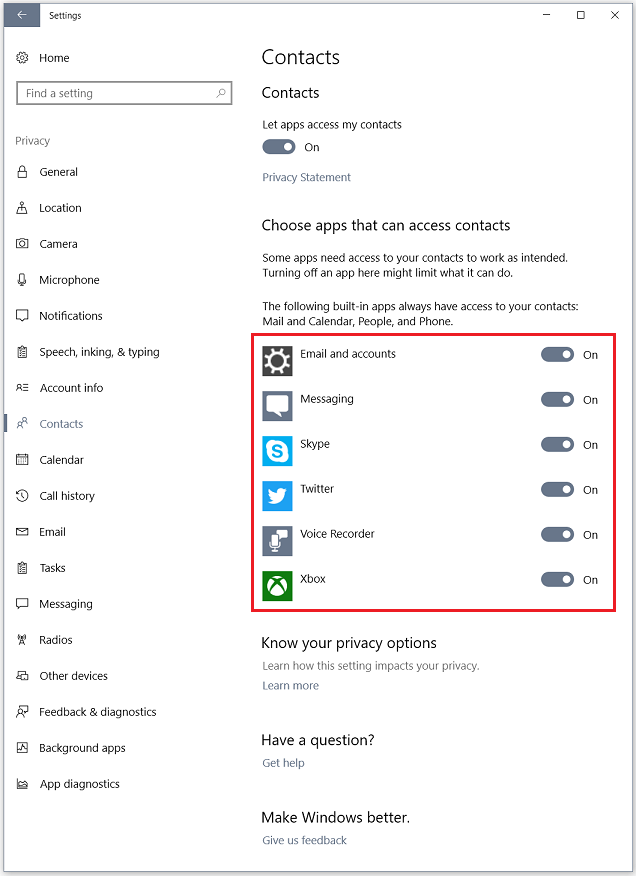

# Deployment recommendations for school IT administrators
**Applies to:**

-   Windows 10

Your privacy is important to us, so we want to provide you with ways to customize the OS privacy settings, as well as some of the apps, so that you can choose what information is shared with Microsoft. To learn more about Microsoft’s commitment to privacy, see [Windows 10 and privacy](https://go.microsoft.com/fwlink/?LinkId=809305). The following sections provide some best practices and specific privacy settings we’d like you to be aware of. Also see [Windows 10 configuration recommendations for education customers](configure-windows-for-education.md) for more information about ways to customize the OS diagnostic data, consumer experiences, Cortana, and search.

We want all students to have the chance to use the apps they need for success in the classroom and all school personnel to have apps they need for their job. Students and school personnel who use assistive technology apps not available in the Microsoft Store for Education, and use devices running Windows 10 S, will be able to configure the device at no additional charge to Windows 10 Pro Education. To learn more about the steps to configure this, see [Switch to Windows 10 Pro Education from Windows 10 Pro or Windows 10 S](change-to-pro-education.md).

## Deployment best practices

Keep these best practices in mind when deploying any edition of Windows 10 in schools or districts:
* A Microsoft account is only intended for consumer services. Enterprises and educational institutions should use enterprise versions where possible, such as Skype for Business, OneDrive for Business, and so on. For schools, consider using mobile device management (MDM) or Group Policy to block students from adding a Microsoft account as a secondary account.
* If schools allow the use of personal accounts by their students to access personal services, schools should be aware that these accounts belong to individuals, not the school.
* IT administrators, school officials, and teachers should also consider ratings when picking apps from the Microsoft Store.
* If you have students or school personnel who rely on assistive technology apps that are not available in the Microsoft Store for Education, and who are using a Windows 10 S device, configure their device to Windows 10 Pro Education to allow the download and use of non-Microsoft Store assistive technology apps. See [Switch to Windows 10 Pro Education from Windows 10 Pro or Windows 10 S](change-to-pro-education.md) for more info.

## Windows 10 Contacts privacy settings

If you’re an IT administrator who deploys Windows 10 in a school or district, we recommend that you review these deployment resources to make informed decisions about how you can configure telemetry for your school or district:
* [Configure Windows telemetry in your organization](https://go.microsoft.com/fwlink/?LinkId=817241) - Describes the types of telemetry we gather and the ways you can manage this data.
* [Manage connections from Windows operating system components to Microsoft services](https://go.microsoft.com/fwlink/?LinkId=817240) - Learn about network connections that Windows components make to Microsoft and also the privacy settings (such as location, camera, messaging, and more) that affect data that is shared with either Microsoft or apps and how you can manage this data.

In particular, the **Contacts** area in the **Settings** > **Privacy** section lets you choose which apps can access a student’s contacts list. By default, this setting is turned on.

To change the setting, you can:
* [Turn off access to contacts for all apps](#turn-off-access-to-contacts-for-all-apps)
* [Choose the apps that you want to allow access to contacts](#choose-the-apps-that-you-want-to-allow-access-to-contacts)

### Turn off access to contacts for all apps
To turn off access to contacts for all apps on individual Windows devices:
1. On the computer, go to **Settings** and select **Privacy**.

   

2. Under the list of **Privacy** areas, select **Contacts**.

   

3. Turn off **Let apps access my contacts**.

For IT-managed Windows devices, you can use a Group Policy to turn off the setting. To do this:
1. Apply the Group Policy: **Computer Configuration** > **Administrative Templates** > **Windows Components** > **App Privacy** > **Let Windows apps access contacts**.
2. Set the **Select a setting** box to **Force Deny**.

### Choose the apps that you want to allow access to contacts
If you want to allow only certain apps to have access to contacts, you can use the switch for each app to specify which ones you want on or off.

The list of apps on the Windows-based device may vary from the above example. The list depends on what apps you have installed and which of these apps access contacts.

To allow only certain apps to have access to contacts, you can:
* Configure each app individually using the **Settings** > **Contacts** option in the Windows UI
* Apply the Group Policy: **Computer Configuration** > **Administrative Templates** > **Windows Components** > **App Privacy** > **Let Windows apps access contacts** and then specify the default for each app by adding the app's Package Family Name under the default behavior you want to enforce.

   

## Skype and Xbox settings

Skype (a Universal Windows Platform [UWP]) and Xbox are preinstalled as part of Windows 10.

The Skype app replaces the integration of Skype features into Skype video and Messaging apps on Windows PCs and large tablets. The Skype app provides all these features in one place and lets users have a single place to manage both their chat and voice conversations so they can take better advantage of their screen. For information about the new Skype UWP app preview, see this [FAQ](https://go.microsoft.com/fwlink/?LinkId=821441).

With the Xbox app, students can use their Xbox profiles to play and make progress on their games using their Windows-based device. They can also unlock achievements and show off to their friends with game clips and screenshots. The Xbox app requires a Microsoft account, which is a personal account.

Both Skype and Xbox include searchable directories that let students find other people to connect to. The online privacy and security settings for Skype and Xbox are not manageable through Group Policy so we recommend that school IT administrators and school officials let parents and students know about these searchable directories.

If the school allows the use of personal or Microsoft account in addition to organization accounts, we also recommend that IT administrators inform parents and students that they can optionally remove any identifying information from the directories by:
* [Managing the user profile](#managing-the-user-profile)
* [Deleting the account if the user name is part of the identifying information](#delete-an-account-if-username-is-identifying)

### Managing the user profile
#### Skype
Skype uses the user’s contact details to deliver important information about the account and it also lets friends find each other on Skype.

To manage and edit your profile in the Skype UWP app, follow these steps:
1.	In the Skype UWP app, select the user profile icon   to go to the user’s profile page.
2.	In the account page, select **Manage account** for the Skype account that you want to change. This will take you to the online Skype portal.
3.	In the online Skype portal, scroll down to the **Account details** section. In **Settings and preferences**, click **Edit profile**.

    The profile page includes these sections:

        * Personal information
        * Contact details
        * Profile settings

4. Review the information in each section and click **Edit profile** in either or both the **Personal information** and **Contact details** sections to change the information being shared. You can also remove the checks in the **Profile settings** section to change settings on discoverability, notifications, and staying in touch.
5.	If you do not wish the name to be included, edit the fields and replace the fields with **XXX**.
6.	To change the profile picture, go to the Skype app and click on the current profile picture or avatar. The **Manage Profile Picture** window pops up.

   

   * To take a new picture, click the camera icon in the pop up window. To upload a new picture, click the three dots (**...**).
   * You can also change the visibility of the profile picture between public (everyone) or for contacts only. To change the profile picture visibility, select the dropdown under **Profile picture** and choose between **Show to everyone** or **Show to contacts only**.

#### Xbox
A user’s Xbox friends and their friends’ friends can see their real name and profile. By default, the Xbox privacy settings enforce that no personal identifying information of a minor is shared on the Xbox Live network, although adults in the child’s family can change these default settings to allow it to be more permissive.

To learn more about how families can manage security and privacy settings on Xbox, see this [Xbox article on security](https://go.microsoft.com/fwlink/?LinkId=821445).

### Delete an account if username is identifying
If you want to delete either (or both) the Skype and the Xbox accounts, here’s how to do it.

#### Skype
To delete a Skype account, you can follow the instructions here: [How do I close my Skype account?](https://go.microsoft.com/fwlink/?LinkId=816515)

If you need help deleting the account, you can contact Skype customer service by going to the [Skype support request page](https://go.microsoft.com/fwlink/?LinkId=816519). You may need to sign in and specify a Skype account. Once you’ve signed in, you can:
1.	Select a help topic (**Account and Password**)
2.	Select a related problem (**Deleting an account**)
3.	Click **Next**.
4.	Select a contact method to get answers to your questions.

#### Xbox
To delete an Xbox account, you can follow the instructions here: [How to delete your Microsoft account and personal information associated with it](https://go.microsoft.com/fwlink/?LinkId=816521).

## Related topics
[Deploy Windows 10 in a school](deploy-windows-10-in-a-school.md)
