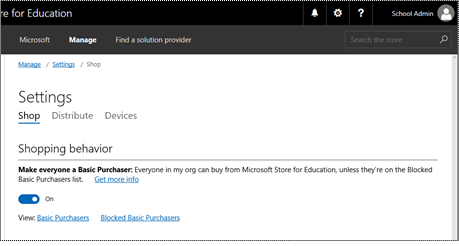
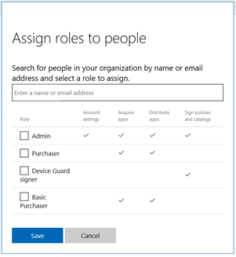

# Working with Microsoft Store for Education

Learn about education scenarios for Microsoft Store for Education. IT admins and teachers can use Microsoft Store to find, acquire, distribute, and manage apps.

Many of the [settings in Microsoft Store for Business](https://docs.microsoft.com/microsoft-store/settings-reference-microsoft-store-for-business) also apply in Microsoft Store for Education. Several of the items in this topic are unique to Microsoft Store for Education.  

## Basic Purchaser role
Applies to: IT admins

By default, when a teacher with a work or school account signs up for Microsoft Store for Education, the **Basic Purchaser** role is assigned to them. **Basic Purchaser** role allows teachers to: 
- View the Minecraft: Education Edition product description page 
- Acquire and manage Minecraft: Education Edition, and other apps from Store for Education
- Use info on **Support** (including links to documentation and access to support through customer service)

> [!NOTE]
> People with the **Basic Purchaser** role can only manage (assign and reclaim licenses) for apps that they purchased. They can't manage apps purchased by people with **Purchaser** or **Admin** roles. 

Admins can control whether or not teachers are automatically assigned the **Basic Purchaser** role. You can configure this with **Make everyone a Basic Purchaser**. You'll find this on **Settings**, with **Shop** settings. 

**To manage Make everyone a Basic Purchaser**
1. Sign in to [Microsoft Store for Education](https://educationstore.microsoft.com)
2. Click **Manage**, and then click **Settings**. 
3. On **Shop**, select or clear **Make everyone a Basic Purchaser**.

> [!NOTE]
> **Make everyone a Basic Purchaser** is on by default. 

When **Make everyone a Basic Purchaser** is turned off, admins can manually assign the role to teachers. 

**To assign Basic Purchaser role**

1. Sign in to [Microsoft Store for Education](https://educationstore.microsoft.com)
2. Click **Manage**, and then choose **Permissions**.
3. On **Roles**, click **Assign roles**, type and select a name, choose the role you want to assign, and then click **Save**.

    

**Blocked Basic Purchasers**

When **Make everyone a Basic Purchaser** is on, admins can still manage which users have the **Basic Purchaser** role. An admin can unassign the **Basic Purchaser** role from a user, and the user is added to a list of **Blocked Basic Purchasers**. Admins can review who are **Basic Purchasers** and **Blocked Basic Purchasers** on **Permissions**. 

## Private store

Applies to: IT admins

When you create your Microsoft Store for Education account, you'll have a set of apps included for free in your private store. Apps in your private store are available for all people in your organization to install and use. 

These apps will automatically be in your private store:
- Word mobile
- Excel mobile
- PowerPoint mobile
- OneNote
- Sway
- Fresh Paint
- Minecraft: Education Edition

As an admin, you can remove any of these apps from the private store if you'd prefer to control how apps are distributed.

## Manage domain settings 

Applies to: IT admins

### Self-service sign up
Self-service sign up makes it easier for teachers and students in your organization to get started with **Minecraft: Education Edition**. If you have self-service sign up enabled in your tenant, teachers can assign **Minecraft: Education Edition** to students before they have a work or school account. Students receive an email that steps them through the process of signing up for a work or school account. For more information on self-service sign up, see [Using self-service sign up in your organization](https://support.office.com/article/Using-self-service-sign-up-in-your-organization-4f8712ff-9346-4c6c-bb63-a21ad7a62cbd?ui=en-US&rs=en-US&ad=US).

### Domain verification
For education organizations, domain verification ensures you are on the academic verification list. As an admin, you might need to verify your domain using the Office 365 portal. For more information, see [Verify your Office 365 domain to prove ownership, nonprofit or education status](https://support.office.com/article/Verify-your-Office-365-domain-to-prove-ownership-nonprofit-or-education-status-or-to-activate-Yammer-87d1844e-aa47-4dc0-a61b-1b773fd4e590?ui=en-US&rs=en-US&ad=US).

## Acquire apps
Applies to: IT admins and teachers

Find apps for your school using Microsoft Store for Business. Admins in an education setting can use the same processes as Admins in an enterprise setting to find and acquire apps.
 
**To acquire apps**
- For info on how to acquire apps, see [Acquire apps in Microsoft Store for Business](https://docs.microsoft.com/microsoft-store/acquire-apps-windows-store-for-business#acquire-apps) 

**To add a payment method - debit or credit card**

If the app you purchase has a price, you’ll need to provide a payment method. 
- During your purchase, click **Get started! Add a way to pay.** Provide the info needed for your debit or credit card.
 
For more information on payment options, see [payment options](https://docs.microsoft.com/microsoft-store/acquire-apps-windows-store-for-business#payment-options). 

For more information on tax rates, see [tax information](https://docs.microsoft.com/microsoft-store/update-windows-store-for-business-account-settings#organization-tax-information). 

### Get started with Minecraft: Education Edition
Teachers and IT administrators can now get trials or subscriptions to Minecraft: Education Edition and add it to Microsoft Store for Business for distribution.
- [Get started with Minecraft: Education Edition](https://docs.microsoft.com/education/windows/get-minecraft-for-education)
- [For IT admins – Minecraft: Education Edition](https://docs.microsoft.com/education/windows/school-get-minecraft)
- [For teachers – Minecraft: Education Edition](https://docs.microsoft.com/education/windows/teacher-get-minecraft)

## Manage apps and software
Applies to: IT admins and teachers

## Manage purchases
IT admins and teachers in educational settings can purchase apps from Microsoft Store for Education. Teachers need to have the Basic purchaser role, but if they've acquired Minecraft: Education Edition, they have the role by default. 

While both groups can purchase apps, they can't manage purchases made by the other group. 

Admins can:
- Manage and distribute apps they purchased and apps purchased by other admins in the organization. 
- View apps purchased by teachers.
- View and manage apps on **Manage**, under **Apps & software**. 

Teachers can:
- Manage and distribute apps they purchased.
- View and manage apps on **Manage**, under **Apps & software**. 

> [!NOTE]
> Teachers with the Basic purchaser role can't manage or view apps purchased by other teachers, or purchased by admins. Teachers can only work with the apps they purchased.
 
## Distribute apps

Manage and distribute apps to students and others in your organization. Different options are avaialble for admins and teachers. 

Applies to: IT admins

**To manage and distribute apps**
- For info on how to distribute **Minecraft: Education Edition**, see [For IT admins – Minecraft: Education Edition](https://docs.microsoft.com/education/windows/school-get-minecraft#distribute-minecraft)
- For info on how to manage and distribute other apps, see [App inventory management - Microsoft Store for Business](https://docs.microsoft.com/microsoft-store/app-inventory-management-windows-store-for-business)

Applies to: Teachers

For info on how to distribute **Minecraft: Education Edition**, see [For teachers – Minecraft: Education Edition](https://docs.microsoft.com/education/windows/teacher-get-minecraft#distribute-minecraft). 

**To assign an app to a student**

1. Sign in to [Microsoft Store for Education](https://educationstore.microsoft.com).
2. Click **Manage**, and then choose **Apps & software**.
3. Find an app, click the ellipses under **Action**, and then choose **Assign to people**.
4. Type the email address, or name for the student that you're assigning the app to, and click **Assign**.

Employees will receive an email with a link that will install the app on their device. Click the link to start the Microsoft Store app, and then click **Install**. Also, in the Microsoft Store app, they can find the app under **My Library**.

### Purchase additional licenses
Applies to: IT admins and teachers

You can manage current app licenses, or purchase more licenses for apps in **Apps & software**. 

**To purchase additional app licenses**
1. Click **Manage**, click **Apps & software**, and then click an app. 
2. Click **Buy more** to purchase more licenses 

You'll have a summary of current license availability.  

**Minecraft: Education Edition subscriptions**

Similarly, you can purchase additional subscriptions of **Minecraft: Education Edition** through Microsoft Store for Business. Find **Minecraft: Education Edition** in your inventory and use the previous steps for purchasing additional app licenses. 

## Manage order history
Applies to: IT admins and teachers

You can manage your orders through Microsoft Store for Business. For info on order history and how to refund an order, see [Manage app orders in Microsoft Store for Business](https://technet.microsoft.com/itpro/windows/manage/manage-orders-windows-store-for-business). 

It can take up to 24 hours after a purchase, before a receipt is available on your **Order history page**. 

> [!NOTE]
For **Minecraft: Education Edition**, you can request a refund through Microsoft Store for Business for two months from the purchase date. After two months, refunds require a support call. 
