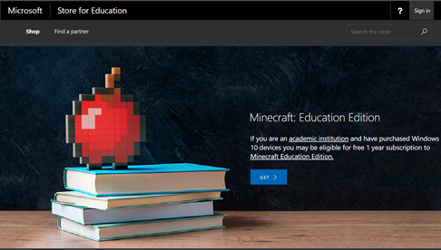
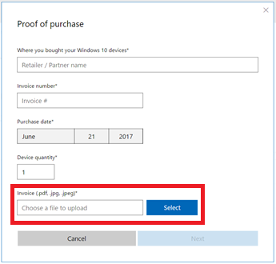
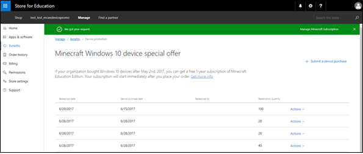

# Get Minecraft: Education Edition with Windows 10 device promotion

**Applies to:**

-   Windows 10  

The **Minecraft: Education Edition** with Windows 10 device promotion ended January 31, 2018.

Qualifying customers that received one-year subscriptions for Minecraft: Education Edition as part of this program and wish to continue using the game in their schools can purchase new subscriptions in Microsoft Store for Education. 
For more information on purchasing Minecraft: Education Edition, see [Add Minecraft to your Store for Education](https://docs.microsoft.com/education/windows/school-get-minecraft?toc=/microsoft-store/education/toc.json). 

>[!Note]
>**Minecraft: Education Edition** with Windows 10 device promotion subscriptions are valid for 1 year from the time 
of redemption. At the end of 1 year, the promotional subscriptions will expire and any people using these subscriptions will be reverted to a trial license of **Minecraft: Education Edition**. 

To prevent being reverted to a trial license, admins or teachers need to purchase new **Minecraft: Education Edition** subscriptions from Store for Education, and assign licenses to users who used a promotional subscription. 

<!---
For qualifying customers, receive a one-year, single-user subscription for Minecraft: Education Edition for each Windows 10 device you purchase for your K-12 school. You’ll need your invoice or receipt, so be sure to keep track of that. For more information including terms of use, see [Minecraft: Education Edition promotion](https://info.microsoft.com/Minecraft-Education-Edition-Signup.html). 

## Requirements
- Qualified Educational Users in K-12 education institutions
- Windows 10 devices purchased from May 2, 2017 - January 31, 2018
- Redeem Minecraft: Education Edition licenses from July 1, 2017 - March 17, 2018
- Microsoft Store for Education admin must submit request for Minecraft: Education Edition licenses
- Proof of device purchase is required (invoice required) 

Full details available at [Minecraft: Education Edition promotion](https://info.microsoft.com/Minecraft-Education-Edition-Signup.html). 

## Redeem Minecraft: Education Edition licenses
Redeeming your licenses takes just a few steps:
- Visit the device promotion page
- Submit a device purchase statement
- Provide proof of your device purchase

After that, we’ll add the appropriate number of Minecraft: Education Edition licenses to your product inventory in **Microsoft Store for Education** as **Minecraft: Education Edition [subscription]**.

**To redeem Minecraft: Education Edition licenses**
1. Visit [Minecraft: Education Edition and Windows 10 device promotion](https://educationstore.microsoft.com/store/mee-device-promo?setflight=wsfb_devicepromo) in **Microsoft Store for Education**. 

     
     
2. Sign in to **Microsoft Store for Education** using a school account. If you don’t have one, we’ll help you set one up.  
-or-

    If you're already signed in to Microsoft Store for Education, the device special offer is available on **Benefits**.   
    Click **Manage**, **Benefits**, and then click **Minecraft: Education Edition Device Promotion**.
    
3. **On Minecraft Windows 10 device special offer**, click **Submit a device purchase**. 

    
    
4. Provide info for **Proof of Purchase**. Be sure to include a .pdf or .jpg of your invoice, and then click **Next**.

    > [!NOTE]
    > Your one-year subscription starts when you submit your proof-of-purchase info. Be sure to submit your request when you'll be using licenses in the classroom. 

    

5. Accept the **Promotion Terms of use**, and then click **Submit**.  
    
    Success look like this!
    
    
      
6. Click **Actions** and then click **Manage** to go to the management page for **Minecraft: Education Edition** and distribute licenses.   

## Distribute Minecraft: Education Edition licenses      
Teachers or admins can distribute the licenses:
- [Learn how teachers can distribute **Minecraft: Education Edition**](teacher-get-minecraft.md#distribute-minecraft)
- [Learn how IT administrators can distribute **Minecraft: Education Edition**](school-get-minecraft.md#distribute-minecraft)
-->
