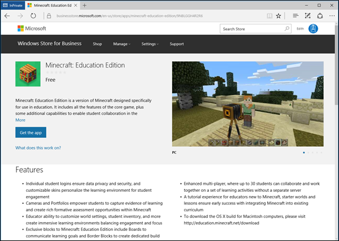
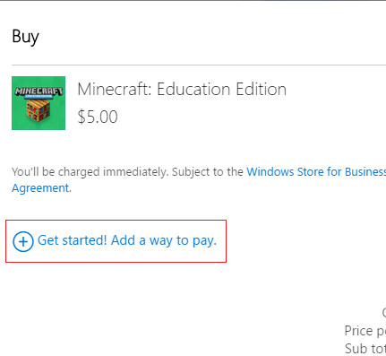
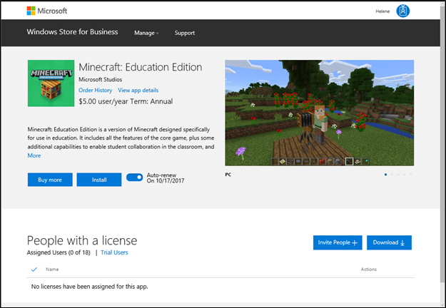
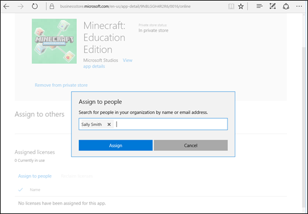
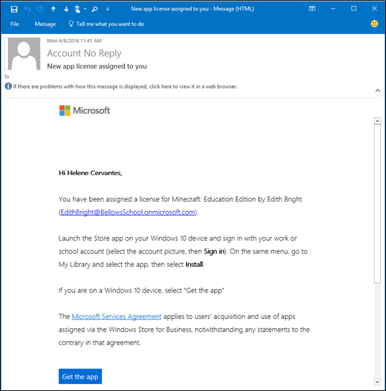
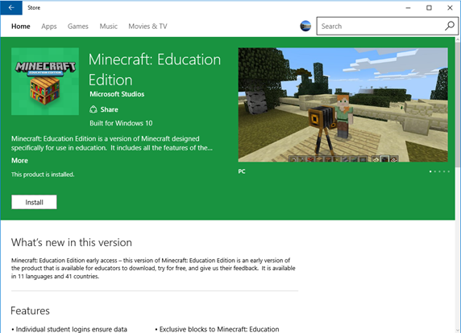
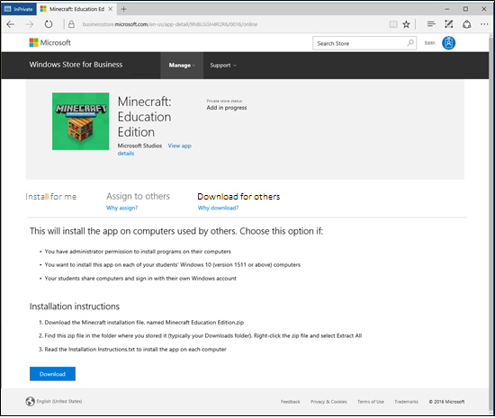
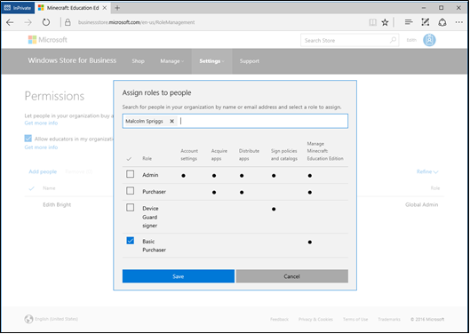

# For IT administrators - get Minecraft: Education Edition

**Applies to:**

-   Windows 10  

When you sign up for a [Minecraft: Education Edition](https://education.minecraft.net) trial, or purchase a [Minecraft: Education Edition](https://education.minecraft.net) subscription. Minecraft will be added to the inventory in your Microsoft Store for Education which is associated with your Azure Active Directory (Azure AD) tenant. Your Microsoft Store for Education is only displayed to members of your organization.

>[!Note]
>If you don't have an Azure AD or Office 365 tenant, you can set up a free Office 365 Education subscription when you request Minecraft: Education Edition. For more information see [Office 365 Education plans and pricing](https://products.office.com/academic/compare-office-365-education-plans).

## Settings for Office 365 A3 or Office 365 A5 customers

Schools that purchased these products have an extra option for making Minecraft: Education Edition available to their students:
- Office 365 A3 or Office 365 A5
- Enterprise Mobility + Security E3 or Enterprise Mobility + Security E5
- Minecraft: Education Edition

If your school has these products in your tenant, admins can choose to enable Minecraft: Education Edition for students using Office 365 A3 or Office 365 A5. On your Office 365 A3 or Office 365 A5 details page in **Microsoft Store for Education**, under **Settings & actions**, you can select **Allow access to Minecraft: Education Edition for users of Office 365 A3 or Office 365 A5**. 

When this setting is selected, students in your tenant can use Minecraft: Education Edition even if they do not have a trial or a direct license assigned to them. 

If you turn off this setting after students have been using Minecraft: Education Edition, they will have 25 more days to use Minecraft: Education Edition before they do not have access. 

## Add Minecraft to your Microsoft Store for Education 

You can start with the Minecraft: Education Edition trial to get individual copies of the app. For more information, see [Minecraft: Education Edition - direct purchase](#individual-copies). 

If you’ve been approved and are part of the Enrollment for Education Solutions volume license program, you can purchase a volume licenses for Minecraft: Education Edition. For more information, see [Minecraft: Education Edition - volume license](#volume-license). 

### Minecraft: Education Edition - direct purchase

1. Go to [https://education.minecraft.net/](https://education.minecraft.net/) and select **GET STARTED**.

    <!--  --> 

2. Enter your email address, and select Educator, Administrator, or Student.   If your email address isn't associated to an Azure AD or Office 365 Education tenant, you'll be asked to create one.

    <!--  -->
    
3. Select **Get the app**. This will take you to the Microsoft Store for Education to download the app. You will also receive an email with instructions and a link to the Store.

    <!--  -->

4. Sign in to Microsoft Store for Education with your email address.

5. Read and accept the Microsoft Store for Education Service Agreement, and then select **Next**.

6. **Minecraft: Education Edition** opens in the Microsoft Store for Education. Select **Get the app**. This places **Minecraft: Education Edition** in your Store inventory.

    <!--  -->

Now that the app is in your Microsoft Store for Education inventory, you can choose how to distribute Minecraft. For more information on distribution options, see [Distribute Minecraft](#distribute-minecraft).

If you need additional licenses for **Minecraft: Education Edition**, see [Purchase additional licenses](https://technet.microsoft.com/edu/windows/education-scenarios-store-for-business#purchase-additional-licenses).

### Minecraft: Education Edition - volume licensing
Qualified education institutions can purchase Minecraft: Education Edition licenses through their Microsoft channel partner. Schools need to be part of the Enrollment for Education Solutions (EES) volume licensing program. Educational institutions should work with their channel partner to determine which Minecraft: Education Edition licensing offer is best for their institution. The process looks like this: 

- Your channel partner will submit and process your volume license order, your licenses will be shown on [Volume Licensing Service Center](https://www.microsoft.com/Licensing/servicecenter/default.aspx), and the licenses will be available in your [Microsoft Store for Education](https://www.microsoft.com/business-store) inventory. 
- You’ll receive an email with a link to Microsoft Store for Education. 
- Sign in to [Microsoft Store for Education](https://educationstore.microsoft.com) to distribute and manage the Minecraft: Education Edition licenses. For more information on distribution options, see [Distribute Minecraft](#distribute-minecraft)

## Minecraft: Education Edition payment options
You can pay for Minecraft: Education Edition with a debit or credit card, or with an invoice. 

### Debit or credit cards
During the purchase, click **Get started! Add a way to pay.** Provide the info needed for your debit or credit card.

### Invoices
Invoices are now a supported payment method for Minecraft: Education Edition. There are a few requirements:
- Admins only (not supported for Teachers)
- $500 invoice minimum for your initial purchase
- $15,000 invoice maximum (for all invoices within your organization)

**To pay with an invoice**

1. During the purchase, click **Get started! Add a way to pay.**  

    

2. Select the Invoice option, and provide the info needed for an invoice. The **PO number** item allows you to add a tracking number or info that is meaningful to your organization.

    

### Find your invoice

After you've finished the purchase, you can find your invoice by checking **Minecraft: Education Edition** in your **Apps & software**. 

> [!NOTE]
> After you complete a purchase, it can take up to twenty-four hours for the app to appear in **Apps & software**.

**To view your invoice**
1. In Microsoft Store for Education, click **Manage** and then click **Apps & software**. 
2. Click **Minecraft: Education Edition** in the list of apps. 
3. On **Minecraft: Education Edition**, click **View Bills**.

     

4. On **Invoice Bills**, click the invoice number to view and download your invoice. It downloads as a .pdf.

  

The **Payment Instructions** section on the first page of the invoice has information on invoice amount, due date, and how to pay with electronic funds transfer, or with a check. 

## Distribute Minecraft
After Minecraft: Education Edition is added to your Microsoft Store for Education inventory, you have three options:

- You can install the app on your PC.
- You can assign the app to others. 
- You can download the app to distribute.

Admins can also add Minecraft: Education Edition to the private store. This allows people in your organization to install the app from the private store. For more information, see [Distribute apps using your private store](https://technet.microsoft.com/itpro/windows/manage/distribute-apps-from-your-private-store). 

<!---
Here's the page you'll see for Minecraft: Education Edition licenses purchased directly through the Microsoft Store for Business. 

Here's the page you'll see for Minecraft: Education Edition licenses purchased through volume licensing.

--->

### Configure automatic subscription assignment

For Minecraft: Education Edition, you can use auto assign subscription to control whether or not you assign a subscription when a member of your organization signs in to the app. When auto assign subscription is on, people from your organization who don’t have a subscription will automatically get one when they sign in to Minecraft: Education Edition. When auto assign subscription is off, people from your organization will get the trial version when they sign in to Minecraft: Education Edition. This allows you to control which people use the trial version, and which people are assigned a full subscription. You can always reassign subscriptions, but planning ahead will reduce time spent managing apps and subscriptions. By default, automatic subscription assignment is turned on.

**How to turn off automatic subscription assignment**

> [!Note]
> The version of the Minecraft: Education Edition page in the Microsoft Store will be different depending on which Microsoft Store for Education flight you are using. 

1. Sign in to [Microsoft Store for Education](https://educationstore.microsoft.com)
2. Click Manage.
    
    You'll see Minecraft: Education Edition product page.
     
    
 
 -Or-
 
    
    
3. Slide the **Auto assign subscription** or click **Turn off auto assign subscription**.     

### Install for me
You can install the app on your PC. This gives you a chance to test the app and know how you might help others in your organization use the app.   

1. Sign in to [Microsoft Store for Education](https://educationstore.microsoft.com). 
2. Click **Manage**, and then click **Install**.

    <!--  -->

3. Click **Install**.  

### Assign to others
Enter email addresses for your students, and each student will get an email with a link to install the app. This option is best for older, more tech-savvy students who will always use the same PC at school. You can assign the app to individuals, groups, or add it to your private store, where students and teachers in your organization can download the app. 

**To assign to others**
1. Sign in to [Microsoft Store for Education](https://educationstore.microsoft.com). 
2. Click **Manage**.

    
3. Click **Invite people**.
 
4. Type the name, or email address of the student or group you want to assign the app to, and then click **Assign**. 

    You can only assign the app to students with work or school accounts. If you don't find the student, you might need to add a work or school account for the student.    
   
    

**To finish Minecraft install (for students)**

1. Students will receive an email with a link that will install the app on their PC. 

    

2. Click **Get the app** to start the app install in Microsoft Store app. 
3. In Microsoft Store app, click **Install**. 

    

    After installing the app, students can find Minecraft: Education Edition in Microsoft Store app under **My Library**. Microsoft Store app is preinstalled with Windows 10.

     

    When students click **My Library** they'll find apps assigned to them.

     

### Download for others
Download for others allows teachers or IT admins to download an app that they can install on PCs. This will install Minecraft: Education Edition on the PC, and allows anyone with a Windows account to use the app on that PC. This option is best for students, and for shared computers. Choose this option when:
- You have administrative permissions to install apps on the PC. 
- You want to install this app on each of your student's Windows 10 (at least version 1511) PCs. 
- Your students share Windows 10 computers, but sign in with their own Windows account. 

**Requirements**
- Administrative permissions are required on the PC. If you don't have the correct permissions, you won't be able to install the app. 
- Windows 10 (at least version 1511) is required for PCs running Minecraft: Education Edition.

**Check for updates** 
Minecraft: Education Edition will not install if there are updates pending for other apps on the PC. Before installing Minecraft, check to see if there are pending updates for Microsoft Store apps. 

**To check for app updates**
1. Start Microsoft Store app on the PC (click **Start**, and type **Store**).
2. Click the account button, and then click **Downloads and updates**.

      
      
3. Click **Check for updates**, and install all available updates. 

      
      
4. Restart the computer before installing Minecraft: Education Edition.  

**To download for others** 
You'll download a .zip file, extract the files, and then use one of the files to install Minecraft: Education Edition on each PC. 

1. **Download Minecraft Education Edition.zip**. From the **Minecraft: Education Edition** page, click **Download for others** tab, and then click **Download**.

    
 
2. **Extract files**. Find the .zip file that you downloaded and extract the files. This is usually your **Downloads** folder, unless you chose to save the .zip file to a different location. Right-click the file and choose **Extract all**.
3. **Save to USB drive**. After you've extracted the files, save the Minecraft: Education Edition folder to a USB drive, or to a network location that you can access from each PC.  
4. **Install app**. Use the USB drive to copy the Minecraft folder to each Windows 10 PC where you want to install Minecraft: Education Edition. Open Minecraft: Education Edition folder, right-click **InstallMinecraftEducationEdition.bat** and click **Run as administrator**. 
5. **Quick check**. The install program checks the PC to make sure it can run Minecraft: Education Edition. If your PC passes this test, the app will automatically install.
6. **Restart**. Once installation is complete, restart each PC. Minecraft: Education Edition app is now ready for any student to use.

<!--- ## Manage Minecraft: Education Edition -->

<!--- ### Access to Microsoft Store for Business
By default, when a teacher with a work or school account acquires Minecraft: Education Edition, they are automatically signed up for Window Store for Business, and the **Basic Purchaser** role is assigned to them. **Basic Purchaser** role allows teachers to acquire Minecraft: Education Edition and to distribute it to students. 

However, tenant admins can control whether or not teachers automatically sign up for Microsoft Store for Business, and get the **Basic Purchaser** role. You can configure this with the **Allow educators in my organization to sign up for the Microsoft Store for Business.** You'll find this on the **Permissions** page. 

To prevent educators from automatically signing up for Microsoft Store for Business
1.  In Microsoft Store for Business, click **Settings**, and then click **Permissions**. 

    

2. Click **Allow educators in my organization to sign up for the Microsoft Store for Business.**

-->

<!--- ### Roles and permissions
Minecraft: Education Edition adds a new role for teachers: **Basic Purchaser**. When a teacher has been granted this role, they can:
- View the Minecraft product description page 
- Acquire and manage the app
- Info on Support page (including links to documentation and access to support through customer service)

    

**To assign Basic Purchaser role**

1. Sign in to Store for Business

    **Note** 
    You need to be a Global Administrator, or have the Store for Business Admin role to access the Permissions page.

2. Click **Settings**, and then choose **Permissions**.

    

3. Click **Add people**, type a name, select the correct person, choose the role you want to assign, and click **Save**.

    
    
    Microsoft Store for Business updates the list of people and permissions. 
    
    

-->

<!--- ## Private store

When you create you Microsoft Store for Business account, you'll have a set of apps included for free in your private store. Apps in your private store are available for all people in your organization to install and use. 

These apps will automatically be in your private store:
- Word mobile
- Excel mobile
- PowerPoint mobile
- OneNote
- Sway
- Fresh Paint
- Minecraft: Education Edition

As an admin, you can remove any of these apps from the private store if you'd prefer to control how apps are distributed. --> 

<!--- ## Need more copies of Minecraft: Education Edition?
You can purchase more licenses by working with your channel partner. Licenses are available at a lower rate than the price for individual copies that are available through Microsoft Store for Business. Individual copies are also available through Microsoft Store for Business. 

If you’ve purchased a volume license, be sure to let other basic purchasers in your organization know about the volume license. That should help prevent unnecessary purchases of individual copies. -->

## Learn more
[Working with Microsoft Store for Education – education scenarios](education-scenarios-store-for-business.md)  
Learn about overall Microsoft Store for Education management: manage settings, shop for apps, distribute apps, manage inventory, and manage order history.  
[Roles and permissions in Microsoft Store for Business and Education](https://technet.microsoft.com/itpro/windows/manage/roles-and-permissions-windows-store-for-business)
[Troubleshoot Microsoft Store for Business and Education](https://technet.microsoft.com/itpro/windows/manage/troubleshoot-windows-store-for-business)

## Related topics

[Get Minecraft: Education Edition](get-minecraft-for-education.md)
[For teachers get Minecraft: Education Edition](teacher-get-minecraft.md)
