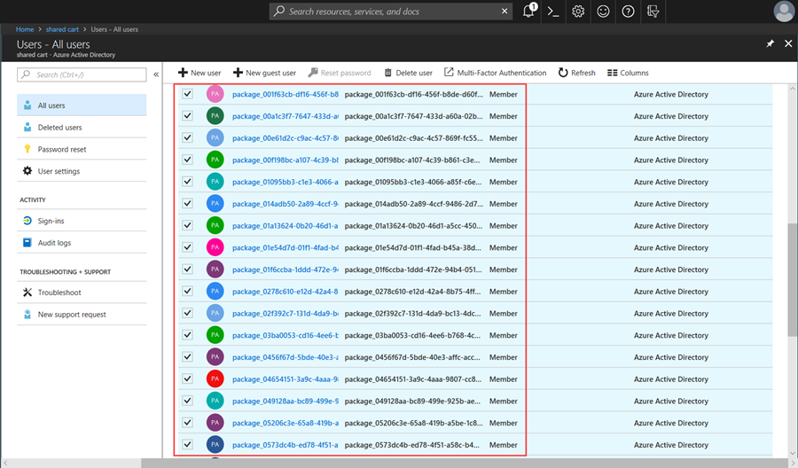

---  
title: Azure AD Join with Set up School PCs app  
description: Describes how Azure AD Join is configured in the Set up School PCs app.  
keywords: shared cart, shared PC, school, set up school pcs  
ms.prod: w10  
ms.mktglfcycl: plan  
ms.sitesec: library  
ms.pagetype: edu  
ms.localizationpriority: medium  
author: levinec
ms.author: ellevin
ms.date: 01/11/2019
ms.reviewer: 
manager: dansimp
---  

# Azure AD Join for school PCs  

> [!NOTE]
>   Set up School PCs app uses Azure AD Join to configure PCs. The app is helpful if you use the cloud based directory, Azure Active Directory (AD). If your organization uses Active Directory or requires no account to connect, install and use [Windows Configuration
>   Designer](set-up-students-pcs-to-join-domain.md) to 
>   join your PCs to your school's domain.

Set up School PCs lets you create a provisioning package that automates Azure AD
Join on your devices. This feature eliminates the need to manually:

-   Connect to your school’s network.

-   Join your organization's domain.

## Automated connection to school domain  

During initial device setup, Azure AD Join automatically connects your PCs to your school's Azure AD domain. You can skip all of the Windows setup experience that is typically a part of the out-of-the-box-experience (OOBE). Devices that are managed by a mobile device manager, such as Intune, are automatically enrolled with the provider upon initial device startup.

Students who sign in to their PCs with their Azure AD credentials get access to on-premises apps and the following cloud apps:
* Office 365
* OneDrive 
* OneNote.

## Enable Azure AD Join  

Learn how to enable Azure AD Join for your school. After you configure this setting, you'll be able to request an automated Azure AD bulk token, which you need to create a provisioning package.   

1. Sign in to the Azure portal with your organization's credentials. 
2. Go to **Azure
Active Directory** \> **Devices** \> **Device settings**.  
3. Enable the setting
for Azure AD by selecting **All** or **Selected**. If you choose the latter
option, select the teachers and IT staff to allow them to connect to Azure AD.  

  

You can also create an account that holds the exclusive rights to join devices. When a student PC needs to be set up, provide the account credentials to the appropriate teachers or staff.

## All Device Settings  

The following table describes each setting within **Device Settings**.

| Setting                                                    | Description                                                                                                                                                                                                                                                                                                            |
|------------------------------------------------------------|------------------------------------------------------------------------------------------------------------------------------------------------------------------------------------------------------------------------------------------------------------------------------------------------------------------------|
| Users may join devices to Azure AD                         | Choose the scope of people in your organization that are allowed to join devices to Azure AD. **All** allows all users and groups within your tenant to join devices. **Selected** prompts you to choose specific users or groups to allow. **None** allows no one in your tenant to join devices to Azure AD. |  
| Additional local administrators on Azure AD joined devices | Only applicable to Azure AD Premium tenants. Grant additional local administrator rights on devices, to selected users. Global administrators and the device owner are granted local administrator rights by default.                                                                                                  |
| Users may register their devices with Azure AD             | Allow all or none of your users to register their devices with Azure AD (Workplace Join). If you are enrolled in Microsoft Intune or Mobile Device Management for Office 365, your devices are required to be registered. In this case, **All** is automatically selected for you.                                     |
| Require Multi-Factor Authentication to join devices                  | Recommended when adding devices to Azure AD. When set to **Yes**, users that are setting up devices must enter a second method of authentication.                                                                                                             |
| Maximum number of devices per user                         | Set the maximum number of devices a user is allowed to have in Azure AD. If the maximum is exceeded, the user must remove one or more existing devices before additional ones are added.                                                                                                                               |
| Users may sync settings and enterprise app data            | Allow all or none of your users to sync settings and app data across multiple devices. Tenants with Azure AD Premium are permitted to select specific users to allow.                                                                                                                                                  |

## Clear Azure AD tokens  

Your Intune tenant can only have 500 active Azure AD tokens, or packages, at a time. You'll receive a notification in the Intune portal when you reach 500 active tokens.

To reduce your inventory, clear out all unnecessary and inactive tokens.
1. Go to **Azure Active Directory** \> **Users** \> **All users**  
2. In the **User Name** column, select and delete all accounts with a **package\ _**
prefix. These accounts are created at a 1:1 ratio for every token and are safe
to delete.   
3. Select and delete inactive and expired user accounts. 

### How do I know if my package expired?
Automated Azure AD tokens expire after 180 days. The expiration date for each token is appended to the end of the saved provisioning package, on the USB drive. After this date, you must create a new package. Be careful that you don't delete active accounts.  

  

## Next steps    
Learn more about setting up devices with the Set up School PCs app.  
* [What's in my provisioning package?](set-up-school-pcs-provisioning-package.md)
* [Shared PC mode for schools](set-up-school-pcs-shared-pc-mode.md)
* [Set up School PCs technical reference](set-up-school-pcs-technical.md)
* [Set up Windows 10 devices for education](set-up-windows-10.md) 

When you're ready to create and apply your provisioning package, see [Use Set up School PCs app](use-set-up-school-pcs-app.md).

