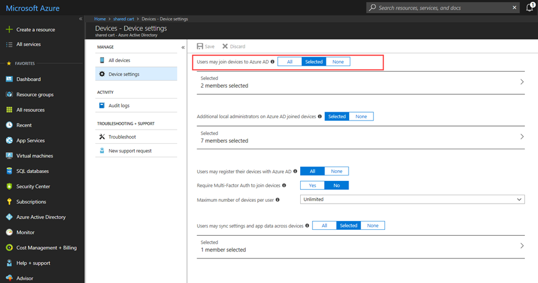

---
title: Microsoft Entra join with Set up School PCs app
description: Learn how Microsoft Entra join is configured in the Set up School PCs app.
ms.topic: reference
ms.date: 08/10/2022
appliesto:
  - ✅ <a href="https://learn.microsoft.com/windows/release-health/supported-versions-windows-client" target="_blank">Windows 10</a>
---  

# Microsoft Entra join for school PCs  

> [!NOTE]
>   Set up School PCs app uses Microsoft Entra join to configure PCs. The app is helpful if you use the cloud based directory, Microsoft Entra ID. If your organization uses Active Directory or requires no account to connect, install and use [Windows Configuration
>   Designer](set-up-students-pcs-to-join-domain.md) to 
>   join your PCs to your school's domain.

Set up School PCs lets you create a provisioning package that automates Microsoft Entra ID
Join on your devices. This feature eliminates the need to manually:

-   Connect to your school's network.
-   Join your organization's domain.

## Automated connection to school domain  

During initial device setup, Microsoft Entra join automatically connects your PCs to your school's Microsoft Entra domain. You can skip all of the Windows setup experience that is typically a part of the out-of-the-box-experience (OOBE). Devices that are managed by a mobile device manager, such as Intune, are automatically enrolled with the provider upon initial device startup.

Students who sign in to their PCs with their Microsoft Entra credentials get access to on-premises apps and the following cloud apps:
* Office 365
* OneDrive
* OneNote

## Enable Microsoft Entra join  

Learn how to enable Microsoft Entra join for your school. After you configure this setting, you'll be able to request an automated Microsoft Entra bulk token, which you need to create a provisioning package.   

1. Sign in to the Azure portal with your organization's credentials. 
2. Go to **Azure
Active Directory** \> **Devices** \> **Device settings**.  
3. Enable the setting
for Microsoft Entra ID by selecting **All** or **Selected**. If you choose the latter
option, select the teachers and IT staff to allow them to connect to Microsoft Entra ID.  

  

You can also create an account that holds the exclusive rights to join devices. When a student PC has to be set up, provide the account credentials to the appropriate teachers or staff.

## All Device Settings  

The following table describes each setting within **Device Settings**.

| Setting                                                    | Description                                                                                                                                                                                                                                                                                                            |
|------------------------------------------------------------|------------------------------------------------------------------------------------------------------------------------------------------------------------------------------------------------------------------------------------------------------------------------------------------------------------------------|
| Users may join devices to Microsoft Entra ID                         | Choose the scope of people in your organization that are allowed to join devices to Microsoft Entra ID. **All** allows all users and groups within your tenant to join devices. **Selected** prompts you to choose specific users or groups to allow. **None** allows no one in your tenant to join devices to Microsoft Entra ID. |  
| More local administrators on Microsoft Entra joined devices | Only applicable to Microsoft Entra ID P1 or P2 tenants. Grant extra local administrator rights on devices, to selected users. Global administrators and the device owner are granted local administrator rights by default.                                                                                                  |
| Users may register their devices with Microsoft Entra ID             | Allow all or none of your users to register their devices with Microsoft Entra ID (Workplace Join). If you're enrolled in Microsoft Intune or Mobile Device Management for Office 365, your devices are required to be registered. In this case, **All** is automatically selected for you.                                     |
| Require Multi-Factor Authentication to join devices                  | Recommended when adding devices to Microsoft Entra ID. When set to **Yes**, users that are setting up devices must enter a second method of authentication.                                                                                                             |
| Maximum number of devices per user                         | Set the maximum number of devices a user is allowed to have in Microsoft Entra ID. If the maximum is exceeded, the user must remove one or more existing devices before more devices are added.                                                                                                                               |
| Users may sync settings and enterprise app data            | Allow all or none of your users to sync settings and app data across multiple devices. Tenants with Microsoft Entra ID P1 or P2 are permitted to select specific users to allow.                                                                                                                                                  |

## Clear Microsoft Entra tokens  

Your Intune tenant can only have 500 active Microsoft Entra tokens, or packages, at a time. You'll receive a notification in the Intune portal when you reach 500 active tokens.

To reduce your inventory, clear out all unnecessary and inactive tokens.
1. Go to **Microsoft Entra ID** > **Users** > **All users**  
2. In the **User Name** column, select and delete all accounts with a **package\ _**
prefix. These accounts are created at a 1:1 ratio for every token and are safe
to delete.   
3. Select and delete inactive and expired user accounts. 

### How do I know if my package expired?
Automated Microsoft Entra tokens expire after 180 days. The expiration date for each token is appended to the end of the saved provisioning package, on the USB drive. After this date, you must create a new package. Be careful that you don't delete active accounts.  

  

## Next steps    
Learn more about setting up devices with the Set up School PCs app.  
* [What's in my provisioning package?](set-up-school-pcs-provisioning-package.md)
* [Set up School PCs technical reference](set-up-school-pcs-technical.md)
* [Set up Windows 10 devices for education](set-up-windows-10.md) 

When you're ready to create and apply your provisioning package, see [Use Set up School PCs app](use-set-up-school-pcs-app.md).
