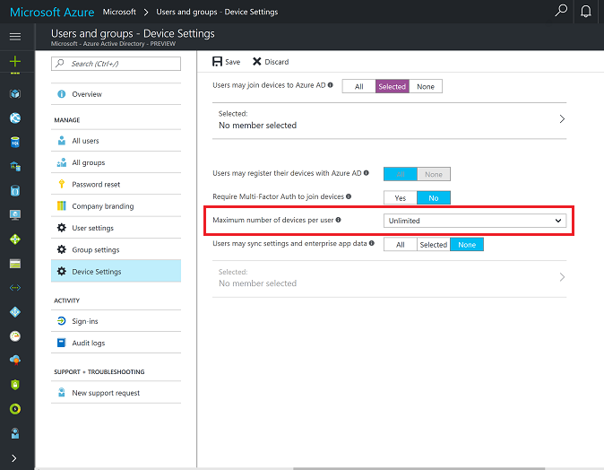

# Technical reference for the Set up School PCs app 
**Applies to:**

-   Windows 10 


The **Set up School PCs** app helps you set up new Windows 10 PCs that work great in your school by configuring shared PC mode. The latest Set up School PCs app is available for Windows 10, version 1703 (Creators Update). Set up School PCs also configures school-specific settings and policies, described in this topic.

If your school uses Azure Active Directory (Azure AD) or Office 365, the Set up School PCs app will create a setup file that joins the PC to your Azure Active Directory tenant. You can also use the app to set up school PCs that anyone can use, with or without Internet connectivity. 

Here's a list of what you get when using the Set up School PCs app in your school. 

| Feature | No Internet | Azure AD | Office 365 | Azure AD Premium |
| --- | :---: | :---: | :---: | :---: |
| **Fast sign-in**<br/>Each student can sign in and start using the computer in less than a minute, even on their first sign-in. | X | X | X | X |
| **Custom Start experience**<br/>The apps students need are pinned to Start, and unnecessary apps are removed. | X | X | X | X |
| **Guest account, no sign-in required**<br/>This option sets up computers for common use. Anyone can use the computer without an account. | X | X | X | X |
| **School policies**<br/>Settings specific to education create a useful learning environment and the best computer performance. | X | X | X | X |
| **Azure AD Join**<br/>The computers are  joined to your Azure AD or Office 365 subscription for centralized management. |   | X | X | X |
| **Single sign-on to Office 365**<br/>By signing on with student IDs, students have fast access to Office 365 web apps or installed Office apps. |   |    | X | X |
| **Take a Test**<br/>Configure the Take a Test app and use it for taking quizzes and high-stakes assessments by some providers like Smarter Balanced. |   |    |  | X |
| **[Settings roaming](https://azure.microsoft.com/en-us/documentation/articles/active-directory-windows-enterprise-state-roaming-overview/) via Azure AD**<br/>Student user and application settings data can be synchronized across devices for a personalized experience. |   |    |    | X |


> [!NOTE]  
> If your school uses Active Directory, use [Windows Configuration Designer](set-up-students-pcs-to-join-domain.md) to configure your PCs to join the domain. You can only use the Set up School PCs app to set up PCs that are connected to Azure AD.

## Automated Azure AD join
One of the most important features in Set up School PCs is the ability to create a provisioning package that performs automated Azure AD join. With this feature, you no longer have to spend minutes going through Windows setup, manually connecting to a network, and manually joining your Azure AD domain. With the automated Azure AD join feature in Set up School School PCs, this process is reduced to zero clicks! You can skip all of the Windows setup experience and the OS automatically joins the PC to your Azure AD domain and enrolls it into MDM if you have a MDM provider activated.

To make this as seamless as possible, in your Azure AD tenant:
- Allow your teacher and other IT staff to join devices to Azure AD so they can sucessfully request an automated Azure AD join token. 

    In the Azure portal, select **Azure Active Directory**. Go to **Users and groups > Device Settings** and in **Users may join devices to Azure AD**, click **Selected** and choose the members you want to enable to join devices to Azure AD.

    **Figure 1** - Select the users you want to enable to join devices to Azure AD

    

- Consider creating a special account that uses a username and password that you provide, and which has the rights to join devices if you don't want to add all teachers and IT staff.
    - When teachers or IT staff need to set up PCs, they can use this account in the Set up School PCs app.
    - If you use a service to set up PCs for you, you can give them this special account so they can deliver PCs to you that are already Azure AD joined and ready to be given to a student.

- Turn off multifactor authentication.

    In the Azure portal, select **Azure Active Directory**. Go to **Users and groups > Device Settings** and set **Require Multi-Factor Auth to join devices** to **No**.

    **Figure 2** - Turn off multi-factor authentication in Azure AD

    

- Set the maximum number of devices a user can add to unlimited.

    In the Azure portal, select **Azure Active Directory**. Go to **Users and groups > Device Settings** and set **Maximum number of devices per user** to **Unlimited**.

    **Figure 3** - Set maximum number of devices per user to unlimited

    

- Clear your Azure AD tokens from time to time. Your tenant can only have 50 automated Azure AD tokens active at any one time.

    In the Azure portal, select **Azure Active Directory**. Go to **Users and groups > All users** and look at the list of user names. User names that start with **package_** followed by a string of letters and numbers. These are the user accounts that are created automatically for the tokens and you can safely delete these. 

    **Figure 4** - Delete the accounts automatically created for the Azure AD tokens

    

- Note that automated Azure AD tokens have expiration dates. Set up School PCs creates them with an expiration date of one month. You will see the specific expiration date for the package in the **Review package summary** page in Set up School PCs.

    **Figure 5** - Sample summary page showing the expiration date

    


<!-- When the MSES Get Started goes live, add a link to it from here -->


## Information about Windows Update

Shared PC mode helps ensure that computers are always up-to-date. If a PC is configured using the Set up School PCs app, shared PC mode sets the power states and Windows Update to: 
* Wake nightly
* Check and install updates
* Forcibly reboot if necessary to finish applying updates

The PC is also configured to not interrupt the user during normal daytime hours with updates or reboots. Notfications are also blocked.

## Guidance for accounts on shared PCs

* We recommend no local admin accounts on the PC to improve the reliability and security of the PC.
* When a PC is set up in shared PC mode with the default deletion policy, accounts will be cached automatically until disk space is low. Then, accounts will be deleted to reclaim disk space. This account management happens automatically. Both Azure AD and Active Directory domain accounts are managed in this way. Any accounts created through **Guest** or **Kiosk** will also be deleted automatically at sign out.
* On a Windows PC joined to Azure Active Directory:
    * By default, the account that joined the PC to Azure AD will have an admin account on that PC. Global administrators for the Azure AD domain will also have admin accounts on the PC.
    * With Azure AD Premium, you can specify which accounts have admin accounts on a PC using the **Additional administrators on Azure AD Joined devices** setting on the Azure portal.
* Local accounts that already exist on a PC won’t be deleted when turning on shared PC mode. New local accounts created through **Settings > Accounts > Other people > Add someone else to this PC** after shared PC mode is turned on won't be deleted. However, any new local accounts created by the **Guest** or **Kiosk** selection on the sign-in screen, if enabled, will automatically be deleted at sign-out.
* If admin accounts are necessary on the PC
    * Ensure the PC is joined to a domain that enables accounts to be signed on as admin, or
    * Create admin accounts before setting up shared PC mode, or 
    * Create exempt accounts before signing out.
* The account management service supports accounts that are exempt from deletion.
    * An account can be marked exempt from deletion by adding the account SID to the `HKEY_LOCAL_MACHINE\SOFTARE\Microsoft\Windows\CurrentVersion\SharedPC\Exemptions\` registry key.
    * To add the account SID to the registry key using PowerShell:

        ```
        $adminName = "LocalAdmin"
        $adminPass = 'Pa$$word123'
        iex "net user /add $adminName $adminPass"
        $user = New-Object System.Security.Principal.NTAccount($adminName) 
        $sid = $user.Translate([System.Security.Principal.SecurityIdentifier]) 
        $sid = $sid.Value;
        New-Item -Path "HKLM:\Software\Microsoft\Windows\CurrentVersion\SharedPC\Exemptions\$sid" -Force
        ``` 

## Custom images
Shared PC mode is fully compatible with custom images that may be created by IT departments. Create a custom image and then use sysprep with the `/oobe` flag to create an image that teachers can then apply the Set up School PCs provisioning package to. [Learn more about sysprep](https://technet.microsoft.com/en-us/library/cc721940(v=ws.10).aspx).

## Provisioning package details

The Set up School PCs app produces a specialized provisioning package that makes use of the [SharedPC configuration service provider (CSP)](https://msdn.microsoft.com/en-us/library/windows/hardware/mt723294%28v=vs.85%29.aspx). 

### Education customizations set by local MDM policy

- By default, saving content locally to the PC is blocked, but you can choose to enable it. This prevents data loss by forcing students to save to the cloud.
- A custom Start layout, taskbar layout, and lock screen image are set.
- Prohibits unlocking the PC to developer mode.
- Prohibits untrusted Windows Store apps from being installed.
- Prohibits students from removing MDM.
- Prohibits students from adding new provisioning packages.
- Prohibits student from removing existing provisioning packages (including the one set by Set up School PCs).
- Sets Windows Update to update nightly.


### Uninstalled apps 

- 3D Builder (Microsoft.3DBuilder_8wekyb3d8bbwe)
- Weather (Microsoft.BingWeather_8wekyb3d8bbwe)
- Tips (Microsoft.Getstarted_8wekyb3d8bbwe)
- Get Office (Microsoft.MicrosoftOfficeHub_8wekyb3d8bbwe)
- Microsoft Solitaire Collection (Microsoft.MicrosoftSolitaireCollection_8wekyb3d8bbwe)
- Paid Wi-Fi & Cellular (Microsoft.OneConnect_8wekyb3d8bbwe)
- Feedback Hub (Microsoft.WindowsFeedbackHub_8wekyb3d8bbwe)
- Xbox (Microsoft.XboxApp_8wekyb3d8bbwe)
- Mail/Calendar (microsoft.windowscommunicationsapps_8wekyb3d8bbwe)

### Local Group Policies

> [!IMPORTANT]  
> We do not recommend setting additional policies on PCs configured with the Set up School PCs app. The shared PC mode is optimized to be fast and reliable over time with minimal to no manual maintenance required.

<table border="1"> 
<thead><tr><th colspan="2"><p>Policy path</p></th></tr>
<tr><th><p>Policy name</p></th><th><p>Value</p></th> 
</tr> </thead>
<tbody>
<tr><td colspan="2"><p><strong>Admin Templates</strong> > <strong>Control Panel</strong> > <strong>Personalization</strong></p></td> 
</tr> 
<tr><td><p>Prevent enabling lock screen slide show</p></td><td><p>Enabled</p></td>
</tr> 
<tr><td><p>Prevent changing lock screen and logon image</p></td><td><p>Enabled</p></td>
</tr> 
<tr><td colspan="2"><p><strong>Admin Templates</strong> > <strong>System</strong> > <strong>Power Management</strong> > <strong>Button Settings</strong></p></td> 
</tr> 
<tr><td><p>Select the Power button action (plugged in)</p></td><td><p>Sleep</p></td> 
</tr> 
<tr><td><p>Select the Power button action (on battery)</p></td><td><p>Sleep</p></td> 
</tr> 
<tr><td><p>Select the Sleep button action (plugged in)</p></td><td><p>Sleep</p></td> 
</tr> 
<tr><td><p>Select the lid switch action (plugged in)</p></td><td><p>Sleep</p></td>
</tr> 
<tr><td><p>Select the lid switch action (on battery)</p></td><td><p>Sleep</p></td>
</tr> 
<tr><td colspan="2"><p><strong>Admin Templates</strong> > <strong>System</strong> > <strong>Power Management</strong> > <strong>Sleep Settings</strong></p></td> 
</tr> 
<tr><td><p>Require a password when a computer wakes (plugged in)</p></td><td><p>Enabled</p></td>
</tr> 
<tr><td><p>Require a password when a computer wakes (on battery)</p></td><td><p>Enabled</p></td>
</tr>
<tr><td><p>Specify the system sleep timeout (plugged in)</p></td><td><p>1 hour</p></td>
</tr> 
<tr><td><p>Specify the system sleep timeout (on battery)</p></td><td><p>1 hour</p></td>
</tr> 
<tr> <td> <p> Turn off hybrid sleep (plugged in) </p> </td> <td> <p> Enabled</p> </td>
</tr> 
<tr> <td> <p> Turn off hybrid sleep (on battery) </p> </td> <td> <p> Enabled</p> </td>
</tr> 
<tr> <td> <p> Specify the unattended sleep timeout (plugged in) </p> </td> <td> <p> 1 hour</p> </td>
</tr> 
<tr> <td> <p> Specify the unattended sleep timeout (on battery) </p> </td> <td> <p> 1 hour</p> </td> 
</tr> 
<tr> <td> <p> Allow standby states (S1-S3) when sleeping (plugged in) </p> </td> <td> <p> Enabled</p> </td>
</tr> 
<tr> <td> <p> Allow standby states (S1-S3) when sleeping (on battery) </p> </td> <td> <p> Enabled</p> </td> 
</tr> 
<tr> <td> <p> Specify the system hibernate timeout (plugged in) </p> </td> <td> <p> Enabled, 0</p> </td> 
</tr> 
<tr> <td> <p> Specify the system hibernate timeout (on battery) </p> </td> <td> <p> Enabled, 0</p> </td> 
</tr> 
<tr> <td colspan="2"> <p> <strong>Admin Templates</strong>><strong>System</strong>><strong>Power Management</strong>><strong>Video and Display Settings</strong></p> </td> </tr> 
<tr> <td> <p> Turn off the display (plugged in) </p> </td> <td> <p> 1 hour</p> </td> 
</tr>
 <tr> <td> <p> Turn off the display (on battery </p> </td> <td> <p> 1 hour</p> </td>
</tr> 
<tr> <td colspan="2"> <p> <strong>Admin Templates</strong>><strong>System</strong>><strong>Power Management</strong>><strong>Energy Saver Settings</strong></p> </td> </tr> 
<tr> <td> <p> Energy Saver Battery Threshold (on battery) </p> </td> <td> <p> 70</p> </td> 
</tr>
<tr> <td colspan="2"> <p> <strong>Admin Templates</strong>><strong>System</strong>><strong>Logon</strong></p> </td> 
</tr> 
<tr> <td> <p> Show first sign-in animation </p> </td> <td> <p> Disabled</p> </td>
</tr> 
<tr> <td> <p> Hide entry points for Fast User Switching </p> </td> <td> <p> Enabled</p> </td> 
</tr> 
<tr> <td> <p> Turn on convenience PIN sign-in </p> </td> <td> <p> Disabled</p> </td>
</tr> 
<tr> <td> <p> Turn off picture password sign-in </p> </td> <td> <p> Enabled</p> </td>
</tr> 
<tr> <td> <p> Turn off app notification on the lock screen </p> </td> <td> <p> Enabled</p> </td>
</tr> 
<tr> <td> <p> Allow users to select when a password is required when resuming from connected standby</p> </td> <td> <p> Disabled</p> </td> 
</tr> 
<tr> <td> <p> Block user from showing account details on sign-in </p> </td> <td> <p> Enabled</p> </td>
</tr> 
<tr> <td colspan="2"> <p> <strong>Admin Templates</strong>><strong>System</strong>><strong>User Profiles</strong></p> </td> 
</tr> 
<tr> <td> <p> Turn off the advertising ID </p> </td> <td> <p> Enabled</p> </td>
</tr> 
<tr> <td colspan="2"> <p> <strong>Admin Templates</strong>><strong>Windows Components</strong>><strong>Biometrics</strong></p> </td> 
</tr> 
<tr> <td> <p> Allow the use of biometrics </p> </td> <td> <p> Disabled</p> </td>
</tr> 
<tr> <td> <p> Allow users to log on using biometrics </p> </td> <td> <p> Disabled</p> </td> 
</tr> 
<tr> <td> <p> Allow domain users to log on using biometrics </p> </td> <td> <p> Disabled</p> </td> 
</tr> 
<tr><td colspan="2"><strong>Admin Templates</strong>><strong>Windows Components</strong>><strong>Cloud Content</strong></td></tr>
<tr> <td> <p> Do not show Windows Tips </p> </td> <td> <p> Enabled</p> </td> 
</tr> 
<tr> <td> <p> Turn off Microsoft consumer experiences </p> </td> <td> <p> Enabled</p> </td> 
</tr> 
<tr> <td colspan="2"> <p> <strong>Admin Templates</strong>><strong>Windows Components</strong>><strong>Data Collection and Preview Builds</strong></p> </td> 
</tr> 
<tr> <td> <p> Toggle user control over Insider builds </p> </td> <td> <p> Disabled</p> </td>
</tr> 
<tr> <td> <p> Disable pre-release features or settings </p> </td> <td> <p> Disabled</p> </td> 
</tr> 
<tr> <td> <p> Do not show feedback notifications </p> </td> <td> <p> Enabled</p> </td> 
</tr> 
<tr> <td> <p> Allow Telemetry </p> </td> <td> <p> Basic, 0</p> </td> 
</tr> 
<tr> <td colspan="2"> <p> <strong>Admin Templates</strong> > <strong>Windows Components</strong> > <strong>File Explorer</strong></p> </td> 
</tr> 
<tr> <td> <p> Show lock in the user tile menu </p> </td> <td> <p> Disabled</p> </td>
</tr> 
<tr> <td colspan="2"> <p> <strong>Admin Templates</strong> > <strong>Windows Components</strong> > <strong>Maintenance Scheduler</strong></p> </td> 
</tr> 
<tr> <td> <p> Automatic Maintenance Activation Boundary </p> </td> <td> <p> *MaintenanceStartTime*</p> </td>
</tr> 
<tr> <td> <p> Automatic Maintenance Random Delay </p> </td> <td> <p> Enabled, 2 hours</p> </td> 
</tr> 
<tr> <td> <p> Automatic Maintenance WakeUp Policy </p> </td> <td> <p> Enabled</p> </td> 
</tr> 
<tr> <td colspan="2"> <p> <strong>Admin Templates</strong> > <strong>Windows Components</strong> > <strong>OneDrive</strong></p> </td> 
</tr> 
<tr> <td> <p> Prevent the usage of OneDrive for file storage </p> </td> <td> <p> Enabled</p> </td>
</tr> 
<tr> <td colspan="2"> <p> <strong>Admin Templates</strong> > <strong>Windows Components</strong> > <strong>Windows Hello for Business</strong></p> </td> 
</tr> 
<tr> <td> <p> Use phone sign-in </p> </td> <td> <p> Disabled</p> </td>
</tr> 
<tr> <td> <p> Use Windows Hello for Business </p> </td> <td> <p> Disabled</p> </td>
</tr> 
<tr> <td> <p> Use biometrics </p> </td> <td> <p> Disabled</p> </td>
</tr> 
<tr> <td colspan="2"> <p> <strong>Windows Settings</strong> > <strong>Security Settings</strong> > <strong>Local Policies</strong> > <strong>Security Options</strong></p> </td> 
</tr> 
<tr><td><p>Accounts: Block Microsoft accounts</p><p>**Note** Microsoft accounts can still be used in apps.</p></td><td><p>Enabled</p></td></tr>
<tr> <td> <p> Interactive logon: Do not display last user name </p> </td> <td> <p> Enabled</p> </td>
</tr> 
<tr> <td> <p> Interactive logon: Sign-in last interactive user automatically after a system-initiated restart</p> </td> <td> <p> Disabled</p> </td> 
</tr> 
<tr> <td> <p> Shutdown: Allow system to be shut down without having to log on </p> </td> <td> <p> Disabled</p> </td> 
</tr> 
<tr> <td> <p> User Account Control: Behavior of the elevation prompt for standard users </p> </td> <td> <p> Auto deny</p> </td>
</tr> 
</tbody>
</table> </br>

## Use the app
When you're ready to use the app, see [Use Set up School PCs app](use-set-up-school-pcs-app.md). 

## Related topics

[Set up Windows devices for education](set-up-windows-10.md)


