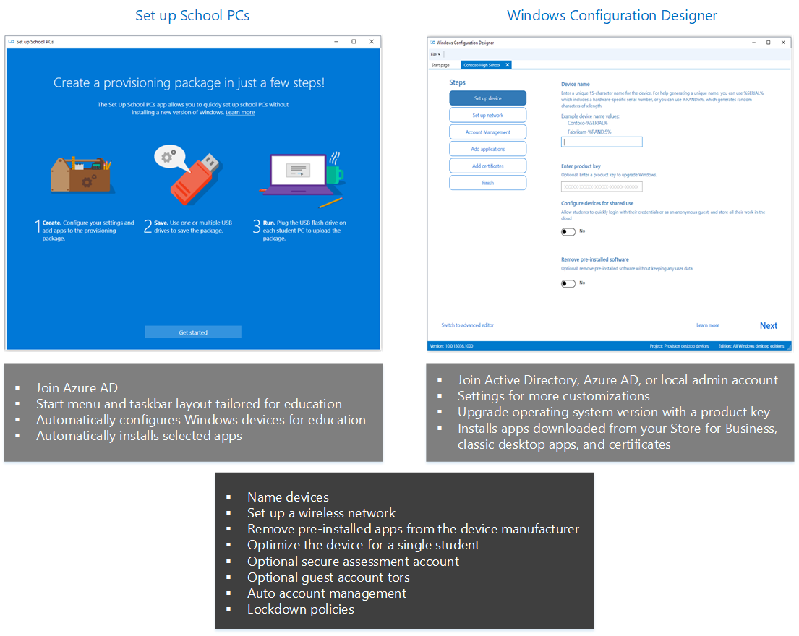

# Set up Windows devices for education

You have two tools to choose from to set up PCs for your classroom:

- Set up School PCs 
- Windows Configuration Designer

Choose the tool that is appropriate for how your students will sign in (Active Directory, Azure Active Directory, or no account).

You can use the following diagram to compare the tools.

## In this section

- [Use the Set up School PCs app](use-set-up-school-pcs-app.md)
- [Technical reference for the Set up School PCs app](set-up-school-pcs-technical.md)
- [Set up student PCs to join domain](set-up-students-pcs-to-join-domain.md)
- [Provision student PCs with apps](set-up-students-pcs-with-apps.md)

## Related topics

[Take tests in Windows](take-tests-in-windows.md)
[Deploy Windows 10 in a school](deploy-windows-10-in-a-school.md)S