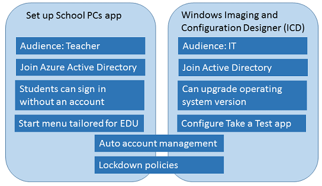

# Provisioning options for Windows 10
**Applies to:**

-   Windows 10 

You have two tools to choose from to set up PCs for your classroom: **Set up School PCs** app and the **Provision school devices** option in Windows Imaging and Configuration Designer (ICD). Choose the tool that is appropriate for how your students will sign in (Active Directory, Azure Active Directory, or no account). The following diagram compares the tools.

## In this section

- [Use the Set up School PCs app (Preview)](use-set-up-school-pcs-app.md)
- [Technical reference for the Set up School PCs app (Preview)](set-up-school-pcs-technical.md)
- [Set up student PCs to join domain](set-up-students-pcs-to-join-domain.md)
- [Provision student PCs with apps](set-up-students-pcs-with-apps.md)

## Related topics

[Take tests in Windows 10](take-tests-in-windows-10.md)

[Deploy Windows 10 in a school](deploy-windows-10-in-a-school.md)

