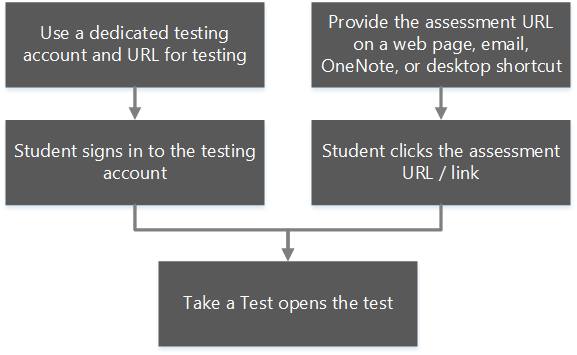

# Take tests in Windows 10
**Applies to:**

-   Windows 10   

Many schools use online testing for formative and summative assessments. It's critical that students use a secure browser that prevents them from using other computer or Internet resources during the test. The **Take a Test** app in Windows 10 creates the right environment for taking a test:

- Take a Test shows just the test and nothing else.
- Take a Test clears the clipboard.
- Students aren’t able to go to other websites.
- Students can’t open or access other apps.
- Students can't share, print, or record their screens unless enabled by the teacher or IT administrator
- Students can’t change settings, extend their display, see notifications, get updates, or use autofill features.
- Cortana is turned off.

## How to use Take a Test

There are several ways to configure devices for assessments. You can:
- **Configure an assessment URL and a dedicated testing account**

    In this configuration, a user signs into in to the account and the **Take a Test** app automatically launches the pre-configured assessment URL in Microsoft Edge in a single-app, kiosk mode. A student will never have access to the desktop in this configuration. We recommend this configuration for high stakes testing.

    There are different methods to configure the assessment URL and a dedicated testing account depending on whether you're setting up Take a Test on a single PC or multiple PCs.

  - **For a single PC**
        
      You can use the Windows 10 **Settings** application. For more info, see [Set up Take a Test on a single PC](take-a-test-single-pc.md).

  - **For multiple PCs**
    
      You can use any of these methods:
    - Mobile device management (MDM) or Microsoft System Center Configuration Manager
    - A provisioning package created in Windows Configuration Designer
    - Group Policy to deploy a scheduled task that runs a Powershell script

      Beginning with Windows 10 Creators Update (version 1703), you can also configure Take a Test using these options:
    - Set up School PCs app
    - Intune for Education

      For more info about these methods, see [Set up Take a Test on multiple PCs](take-a-test-multiple-pcs.md).

- **Distribute the assessment URL through the web, email, OneNote, or any other method of your choosing. You can also create shortcuts to distribute the link**

    This allows teachers and test administrators an easier way to deploy assessments. We recommend this method for lower stakes assessments.

    You can enable this using a schema activation.

## How to exit Take a Test
To exit the Take a Test app at any time, press Ctrl+Alt+Delete.

## Get more info
- Teachers can use Microsoft Forms to create tests. See [Create tests using Microsoft Forms](https://support.microsoft.com/help/4000711/windows-10-create-tests-using-microsoft-forms) to find out how.
- To learn more about the policies and settings set by the Take a Test app, see [Take a Test app technical reference](take-a-test-app-technical.md).
