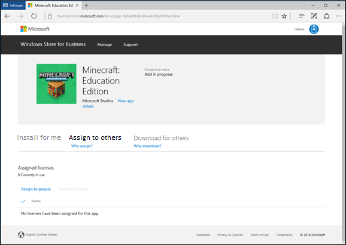
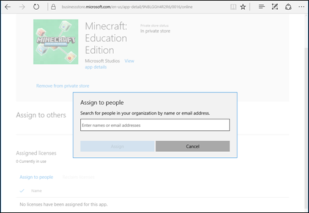

# For teachers: get Minecraft Education Edition

**Applies to:**

-   Windows 10 

Learn how teachers can get and distribute Minecraft: Education Edition.

## Add Minecraft to your Windows Store for Business 

1. Go to [http://education.minecraft.net/](http://education.minecraft.net/) and select **Get the app**.

     

2. Enter your email address.

    
    
3. Select **Get the app**. This will take you to the Windows Store for Business to download the app. You will also receive an email with instructions and a link to the Store.

    

4. Sign in to Windows Store for Business with your email address.

5. Read and accept the Windows Store for Business Service Agreement, and then select **Next**.

6. **Minecraft Education Edition** opens in the Windows Store for Business. Select **Get the app**. This places **Minecraft Education Edition** in your Store inventory.

    
    
## Distribute Minecraft

After Minecraft Education Edition is added to your Windows Store for Business, you have three options:

- You can install the app on your PC.
- You can assign the app to others.  
- You can download the app to distribute. 

### Install for me
You can install the app on your PC. This gives you a chance to work with the app before using it with your students.   

1. Sign in to Windows Store for Business. 
2. Click **Manage**, and then click **Install for me**.

    

3. Click **Install**. 

### Assign to others
Enter email addresses for your students, and each student will get an email with a link to install the app. This option is best for older, more tech-savvy students who will always use the same PC at school. 

**To assign to others**
1. Sign in to Windows Store for Business. 
2. Click **Manage**.

    

3. Click **Assign to people**.
 
    
    
4. Type the name, or email address of the student you want to assign the app to, and then click **Assign**.

   You can only assign the app to students with work or school accounts. If you don't find the student, contact your IT admin to add a work or school account for the student.

    

**To finish Minecraft install (for students)**

Students will receive an email with a link that will install the app on their PC.

1. Click **Get the app** to start the app install in Windows Store app. 
2. In Windows Store app, click **Install**. 

     

      After installing the app, students can find Minecraft: Education Edition in Windows Store app under **My Library**.

     

      When students click **My Libarary** they'll find apps assigned to them.

      

### Download for others
Download for others allows teachers or IT admins to download a packages that they can install on student PCs. This will install Minecraft: Education Edition on the PC, and allows anyone with a Windows account to use the app on that PC. This option is best for younger students, and for shared computers. Choose this option when:
- You have administrative permissions to install apps on the PC. 
- You want to install this app on each of your student's Windows 10 (at least version 1511) PCs. 
- Your students share Windows 10 computers, but sign in with their own Windows account. 

#### Requirements
- Administrative permissions are required on the PC. If you don't have the correct permissions, you won't be able to install the app. 
- Windows 10 (at least version 1511) is required for PCs running Minecraft: Education Edition.

#### Check for updates
Minecraft: Education Edition will not install if there are updates pending for other apps on the PC. Before installing Minecraft, check to see if there are pending updates for Windows Store apps. 

**To check for app updates**
1. Start Windows Store app on the PC (click **Start**, and type **Store**).
2. Click the account button, and then click **Downloads and updates**.

      
      
3. Click **Check for updates**, and install all available updates. 

      
      
4. Restart the computer before installing Minecraft: Education Edition. 
   
#### To download for others
You'll download a .zip file, extract the files, and then use one of the files to install Minecraft: Education Edition on each PC. 

1. **Download Minecraft Education Edition.zip**. From the **Minecraft: Education Edition** page, click **Download for others** tab, and then click **Download**.

    
 

2. **Extract files**. Find the .zip file that you downloaded and extract the files. This is usually your **Downloads** folder, unless you chose to save the .zip file to a different location. Right-click the file and choose **Extract all**.
3. **Save to USB drive**. After you've extracted the files, save the Minecraft: Education Edition folder to a USB drive, or to a network location that you can access from each PC.  
4. **Install app**. Use the USB drive to copy the Minecraft folder to each Windows 10 PC where you want to install Minecraft: Education Edition. Open Minecraft: Education Edition folder, right-click **InstallMinecraftEducationEdition.bat** and click **Run as administrator**. 
5. **Quick check**. The install program checks the PC to make sure it can run Minecraft: Education Edition. If your PC passes this test, the app will automatically install.
6. **Restart**. Once installation is complete, restart each PC. Minecraft: Education Edition app is now ready for any student to use.

#### Troubleshoot 

If you ran **InstallMinecraftEducationEdition.bat** and Minecraft: Education Edition isn't available, there are a few things that might have happened.  

| Problem | Possible cause | Solution |
|---------|----------------|----------|
| Script ran, but it doesn't look like the app installed. | There might be pending app updates. | Check for app updates (see steps earlier in this topic).   Install updates.   Restart PC.    Run **InstallMinecraftEducationEdition.bat** again.  | 
| App won't install. | AppLocker is configured and preventing app installs.  |      Contact IT Admin.  | 
| App won't install. | Policy prevents users from installing apps on the PC. |  Contact IT Admin. | 
| Script starts, but stops quickly. | Policy prevents scripts from running on the PC.  | Contact IT Admin. |
| App isn't available for other users. | No restart after install. If you don't restart the PC, and just switch users the app will not be available.| Restart PC.   Run **InstallMinecraftEducationEdition.bat** again.   If a restart doesn't work, contact your IT Admin.  | 

If you are still having trouble installing the app, you can get more help on our [Support page](http://go.microsoft.com/fwlink/?LinkID=799757). 

## Related topics

[Get Minecraft Education Edition](get-minecraft-for-education.md)

[For IT admins: get Minecraft Education Edition](school-get-minecraft.md)

