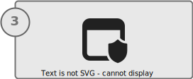

# Applications deployment considerations

:::row:::
   :::column span="":::
     
    [**Deploy an application via Microsoft Intune**](deploy-apps.md)
   :::column-end:::
   :::column span="":::
     
    [**Validate the application**](validate-apps.md)
   :::column-end:::
   :::column span="":::
     
    [**Create additional policies 2 (optional)**](create-policies.md)
   :::column-end:::
:::row-end:::

The process to deploy applications to Windows SE devices via Microsoft Intune is the same used for non-SE devices. Applications must be defined in Intune, and then assigned to the correct groups.\
However, on Windows SE devices, apps may successfully install, but they need validation to be certain that they're functional.

The following table provides an overview of the applications types that can be deployed to Windows devices via Intune, and considerations about the installation on Windows SE:

|**Installer/App type**|**Installer extensions**|**Available installation methods via Intune**|**Considerations for Windows 11 SE**|
|-|-|-|-|
|[Win32][WIN-1]|`.exe` `.msi`|- Intune Management Extension (IME)  - Microsoft Store integration|⚠️ There are known limitations that might prevent an app to install or run.|
|[Universal Windows Platform (UWP)][WIN-2]|`.appx` `.appxbundle` `.msix` |- For public apps: Microsoft Store integration - For private apps: line-of-business (LOB) apps|⛔ UWP apps are currently unsupported.<!--⚠️ LOB apps require a supplemental policy.-->|
|[Progressive Web Apps (PWAs)][EDGE-2] |`.msix`|- Settings catalog policies - Microsoft Store integration|✅ PWAs are supported.|
|Web links| n/a |- Windows web links|✅ Web links are supported.|

<!--after Intune 2307 update the table above with ✅ UWP public apps are supported.  ⛔ UWP private apps are currently unsupported.-->

> [!IMPORTANT]
> Store apps must be installed in device context. Deploying apps in user context fails with error code `0x800711C7`.

> [!IMPORTANT]
> Although you'll be able to install apps on Windows 11 SE devices via Intune, some apps may not perform well on these devices due those apps' minimum spec requirements.
> Before deploying apps, first check which apps will be targeting your Windows 11 SE devices, and ensure that they meet the requirements.

## Win32 apps

The addition of Win32 applications to Intune consists of repackaging the apps and defining the commands to silently install them. The process is described in the article [Add, assign, and monitor a Win32 app in Microsoft Intune][MEM-1].

> [!IMPORTANT]
> If you have Windows 11 SE devices that already have apps deployed through Intune, the apps will not get retroactively tagged with the *managed installer* mark. The reason is to avoid making any security assumptions for these apps. You may need to redeploy the apps through Intune to get them properly tagged with managed installer and allowed to run.

There are known limitations that might prevent applications to install or execute. For more information, see the next section [validate applications](validate-apps.md).

## UWP apps

UWP apps are currently unsupported for Windows 11 SE.

<!-- 2307
### Microsoft Store apps

Public UWP apps available in the Microsoft Store are supported for Windows 11 SE.

### Line of business apps

Private UWP apps are currently unsupported for Windows 11 SE.

<!--### Line of business apps

For private, line-of-business (LOB) UWP apps, [deploy as line-of-business apps][MEM-2]

> [!IMPORTANT]
> UWP apps require the creation and deployment of supplemental policies. For more information, see the next section [validate applications](validate-apps.md).

-->
## PWA apps

PWAs can be deployed using the [Force-installed web Apps][EDGE-1] option via [settings catalog policies][MEM-3], or using the Microsoft Store integration with Intune.

## Web links

Web link can be deployed via Intune using [Windows web links][MEM-4], and will be available in the Start menu of the targeted devices.

## Section review

Before moving on to the next section, ensure that you've completed the following tasks:

> [!div class="checklist"]
> - `.intunewin` package created (for Win32 apps)
> - App uploaded via Intune (for Win32 and UWP LOB apps)
> - App assigned to the correct groups

## Next steps

Advance to the next article to learn how to validate the applications deployed to Windows 11 SE devices.

> [!div class="nextstepaction"]
> [Next: validate apps >](validate-apps.md)

[EDGE-1]: /deployedge/microsoft-edge-policies#configure-list-of-force-installed-web-apps
[EDGE-2]: /microsoft-edge/progressive-web-apps-chromium
[MEM-1]: /mem/intune/apps/apps-win32-add
[MEM-2]: /mem/intune/apps/lob-apps-windows
[MEM-3]: /mem/intune/configuration/settings-catalog
[MEM-4]: /mem/intune/apps/web-app
[WIN-1]: /windows/win32
[WIN-2]: /windows/uwp/get-started/universal-application-platform-guide