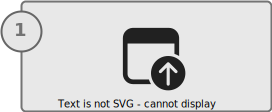

# Validate the applications deployed to Windows SE devices

:::row:::
   :::column span="":::
     
    [**Deploy an application via Microsoft Intune**](deploy-apps.md)
   :::column-end:::
   :::column span="":::
     
    [**Validate the application**](validate-apps.md)
   :::column-end:::
   :::column span="":::
     
    [**Create additional policies (optional)**](create-policies.md)
   :::column-end:::
:::row-end:::

A fundamental step in deploying apps to Windows 11 SE devices is to validate that the apps work as expected.

Application validation consists of the following steps:

1. Wait for the application to install
1. Verify that the app installed successfully
1. Open the app and exercise all user workflows
1. Inspect the app and take note of any potential problems

> [!NOTE]
> Apps must be validated on a case-by-case basis. A successful installation doesn't mean that the app will run properly. A successful execution of the app, doesn't mean it will *always* run properly.

## Wait for the application to install

Application installation depends on two factors:

- When the managed installer policies are applied to the device. These policies are automatically applied to Windows SE devices when they are enrolled in Intune
- When the apps are deployed to a device

> [!IMPORTANT]
> The Intune management extension agent checks every hour (or on service or device restart) for any new Win32 app assignments.

If the Windows 11 SE base policy doesn't block the application that you're trying to deploy, the process to deploy the app to Windows SE devices should be consistent with non-SE devices.

## Check for installation

There are two ways to verify that an app installed successfully:

- Intune portal
- On the device

Both options are worth checking. Installation in Intune can be used to check the installation status remotely and to ensure that the installation detection rules are configured correctly. Checking on the device can indicate if the app  installed and if it runs properly.

### Check for installation from Intune

To check the installation status of an app from the Intune portal:

1. Sign in to the <a href="https://intune.microsoft.com/" target="_blank"><b>Microsoft Intune admin center</b></a>
1. Select **App > All apps**
1. Select the application you want to check
1. From the **Overview** page, you can verify the overall installation status
    
    :::image type="content" source="./images/intune-app-install-overview.png" alt-text="Screenshot of the Microsoft Intune admin center - App installation details." lightbox="./images/intune-app-install-overview.png":::

1. From the **Device install status** page, you can verify the installation status for each device, and the status code that indicates the cause of the failure
    
    :::image type="content" source="./images/intune-app-install-status.png" alt-text="Screenshot of the Microsoft Intune admin center - App installation status for each device." lightbox="./images/intune-app-install-status.png":::

> [!NOTE]
> A Win32 application may install correctly, but report to Intune as failed.\
> A Win32 app may also fail to install, but report as installed to Intune.
>
> In both cases, the issue may be in the detection rules defined in Intune, which must be configured correctly to detect the installation of the app.

### Check for installation on the device

On a Windows SE device, open the **Settings** app and select **Apps** > **Installed apps**. You can see the list of installed apps and validate that your targeted app is listed.

Another way to validate that the app has installed is to check its installation directory. The path is usually `C:\Program Files` or `C:\Program Files (x86)`, but can vary from app to app.

Lastly, launch the app to ensure that it has installed correctly.

## Check for compatibility

Checking for compatibility often means to execute the app and verify its functionalities. Here are some things to try while testing the behavior of your app:

- Open the app
- Test the core functionality and common user scenarios. Exercise a common workflow that a user would do with the app
- Force an update of the app

Here are things to pay attention to:

- Know how the apps you deploy are updated, and if they offer controls for automatic updates
- Dialogs may pop up during the app use, indicating that something is blocked
- Multiple apps are installed, especially if one app appears to be a launcher/updater. For example, Adobe Photoshop includes the Adobe Creative Cloud launcher, which updates Photoshop and other apps
- Any messages indicating that the app is doing pre-installation work or downloading more content
- Logs in the Event Viewer

### Compatible apps

If an app appears to be functioning correctly without being blocked, it's likely compatible with managed installer installation.
However, just because an app works initially doesn't mean it will *always* work. Self-updates or separate launchers/clients may update the apps.

### Semi-compatible apps

Semi-compatible apps may run without problems initially, but in the future they can be restricted to run after it self-updates or another installer/updater app installs over it.

### Incompatible apps

Incompatible apps may launch initially, but immediately begin to download more resources.\
These apps are eventually blocked before any of their functionalities can be accessed. Or, these apps may not launch due to a dependent file blocked by the Windows 11 SE base policy.

### Visual error notifications

You may see a dialog indicating **This app won't run on your PC**. Check the indicated executable and verify that it matches the executable of the installed application.

:::image type="content" source="images/winse-app-block.png" alt-text="Screenshot of Windows SE - error window while opening an app.":::

### Event Viewer

More detail can be obtained when looking for events indicating blocked executables in the Event Viewer.\
The event logs are:

- **CodeIntegrity > Operational**
- **AppLocker > MSI and Script**

For more information, see the [Troubleshoot](troubleshoot.md) section.

## Known limitations

Not all apps are compatible with managed installers, even after installation.

To learn about known limitations with apps deployed via a managed installer, see [Known limitations with managed installer][WIN-1].

<!--
> [!NOTE]
> UWP LOB apps aren't installed using the Intune Management Extension and thus aren't tracked by the managed installer heuristic. LOB apps must be authorized separately in your WDAC policy.
-->

## Section review

Before moving on to the next section, ensure that you've completed the following tasks:

> [!div class="checklist"]
> - Verified any installation errors from Intune
> - Verified the app installation on the device
> - Checked for any errors when opening the app from the device
> - Checked for any errors in the Event Viewer

## Next steps

Select one of the following options to learn the next steps:

<!--- If the apps don't work as expected, you must create and deploy WDAC or AppLocker policies to allow the apps to run-->
- If the apps don't work as expected, you must create and deploy AppLocker policies to allow the apps to run
  > [!div class="nextstepaction"]
  > [Next: Create policies>](create-policies.md)
- If the applications you are deploying don't have any issues, you can skip to important considerations when deploying apps and policies
  > [!div class="nextstepaction"]
  > [Next: Important deployment considerations>](considerations.md)

[M365-1]: /microsoft-365/education/deploy/microsoft-store-for-education

[WIN-1]: /windows/security/threat-protection/windows-defender-application-control/configure-authorized-apps-deployed-with-a-managed-installer#known-limitations-with-managed-installer
[WIN-2]: /windows/msix/
[WIN-3]: /windows/security/threat-protection/windows-defender-application-control/manage-packaged-apps-with-windows-defender-application-control