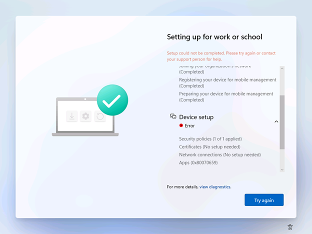

## Autopilot and Enrollment Status Page
Autopilot and the Enrollment Status Page are compatible with Windows 11 SE. However, due to the E-Mode policy, devices can be blocked from completing enrollment if:
1. You have the enrollment status page to block device use until required apps are installed.
2. You are deploying an app that is blocked by the existing E-Mode policy, not installable via a managed installer (without additional policies), and not allowed by any supplemental policies or AppLocker policies. 
An example of this is if you deployed an app via the Store for Education, but have not written a supplemental policy to allow that app's PackageFamilyName.
In summary, if you choose to block device use on the installation of apps, you must ensure that apps are also not blocked from installation.

To ensure that you don't run into installation or enrollment blocks, you can do the following in accordance with your internal policies:
1. Ensure that all apps are unblocked from installation. Apps must be compatible with the Windows 11 SE managed installer flow, and if they are not compatible out-of-box, they either have a supplemental policy or AppLocker policy written for them.
If you need help writing a policy, see <section>.
2. Do not deploy apps that you have not validated. See here for more information.
3. Set your Enrollment Status Page configuration to not block device use based on required apps.

See more on:
- Autopilot: [Overview of Windows Autopilot | Microsoft Learn][MEM-1]
- Enrollment [Status Page: Windows Autopilot Enrollment Status Page | Microsoft Learn][MEM-2]

## Existing apps deployed in Intune
If you have Windows 11 SE machines that already have apps deployed through Intune, these apps will not get retroactively tagged with the mark of the "managed installer". This is to avoid making any security assumptions for these apps. You may need to redeploy these apps through Intune to get properly tagged with Managed Installer and allowed to run.
See [Windows 10 app deployment by using Microsoft Intune | Microsoft Docs][MEM-3] for more details on how to deploy Windows 10 apps through Microsoft Intune.

## Potential impact to events collected by any Log Analytics integrations
Log Analytics is a tool in the Azure Portal which customers may be using to collect data from AppLocker policy events. With this private preview, AppLocker policy will automatically be deployed on Win11 SE devices enrolled into an Intune EDU tenant. This will result in an increase in events generated by AppLocker policy (see [here][WIN-1]). If your organization is using Log Analytics, our recommendation is to please review your Log Analytics setup to:
- Understand your Log Analytics setup and ensure there is an appropriate data collection cap in place to avoid unexpected billing costs
- Turn off the collection of AppLocker events in Log Analytics (Error, Warning, Information) with the exception of MSI and Script logs

---

[MEM-1]: https://learn.microsoft.com/mem/autopilot/windows-autopilot
[MEM-2]: https://learn.microsoft.com/mem/autopilot/enrollment-status
[MEM-3]: https://docs.microsoft.com/mem/intune/apps/apps-windows-10-app-deploy

[WIN-1]: https://learn.microsoft.com/windows/security/threat-protection/windows-defender-application-control/applocker/using-event-viewer-with-applocker