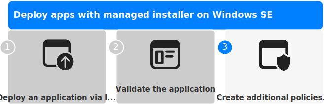
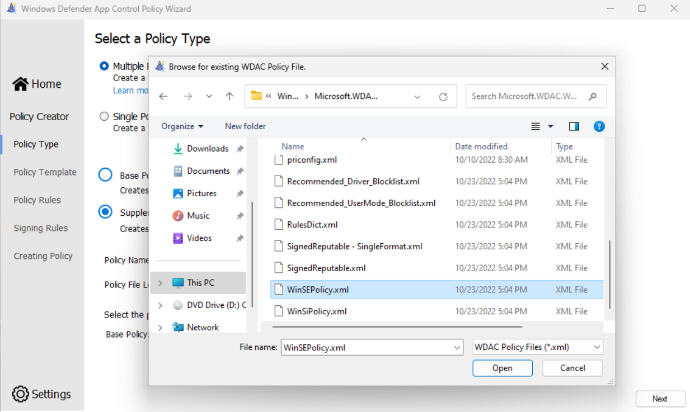

Additional policies can be written to allow applications that are [semi-compatible](./Validate-applications#compatible-apps) or [incompatible](Validate-applications#incompatible-apps) with the managed installer.

The following table details the two policy types to allow apps to run:

| **Policy type** | **How it works** | **When should I use this policy?** | **Security risk** |
|---|---|---|---|
| WDAC Supplemental policy | Directly allows apps meeting the rule criteria to run | For executables that are blocked by the E-Mode policy (Visible from the Event Viewer in the [CodeIntegrity events](./Troubleshooting#codeintegrity--operational-event-log)) | Low |
| AppLocker policy | Sets an app to be considered as a managed installer | Only for executables that do installations or updates which are blocked by the E-Mode policy | High |

> **Note**
>
> The specifics of the policy you will need to write vary from app to app. Public documentation can help you determine which rules would be useful for your app.

## WDAC supplemental policies

WDAC supplemental policies can be created and then deployed through Intune.\
[🎬 Watch the **WDAC supplemental policy** video.](https://github.com/microsoft/WinSE_TAP/wiki/images/WDAC-Supplemental-Policy.mp4)

Follow the instructions below for authoring and deploying these policies.

To allow apps to install and run by effectively overriding the Windows 11 SE E-Mode policy, supplemental policies you write must target the correct base policy. The base policy that you need to target has a PolicyID of `{82443E1E-8A39-4B4A-96A8-F40DDC00B9F3}`.

- Policy creation: [Policy creation for common WDAC usage scenarios (Windows) - Windows security | Microsoft Docs][WIN-1]
- Supplemental Policy creation: [Creating a new Supplemental Policy with the Wizard][WIN-2]
- [WDAC Policy Wizard][EXT-1]

### Writing a supplemental policy

To write a policy, you can use [audit events][WIN-3], as they allow you to observe the actions that would be blocked by Windows 11 SE. From the audit events, you can create a policy to allow those actions.

1. On a **non-Windows SE** device, apply an audit mode WDAC Base policy. The WDAC Wizard includes a template policy called *WinSEPolicy.xml based on Windows 11 SE E mode* that you can use:
   - Open the **WDAC Wizard** and select **Policy Editor**
   - In the Policy Path to Edit field, browse for *%ProgramFiles%\WindowsApps\Microsoft.WDAC* and select the file called WinSEPolicy.xml. Select **Next**
     
   - Toggle the option for **Audit Mode** and complete the Wizard.
   - Note the location of the .cip and .xml files shown on the final page of the wizard.
   - From an elevated PowerShell session, run the following command to activate the policy:
     ```
     Citool.exe -up <Path to the .cip file>
     ```
1. With the *Base audit mode policy* for Windows 11 SE in place:
    - Download and run the app install for your app
    - Launch the app and exercise the app's capabilities
    - Uninstall the app
1. Use the WDAC Wizard to create a policy from audit events:
   - Open the **WDAC Wizard** and select **Policy Editor**
   - Select **Convert Event Log to a WDAC Policy** then select **Parse Event Log** to parse from the system Event Viewer. Select **Next**
   - Review each row in the table and choose the type of rule to create. You may want to sort the table by FileName to group duplicate rows together. You need only create a rule on one entry if the values are all duplicates
   - Complete the wizard to generate the policy (this will be a *Base* policy). Note the location of the .xml shown (you will use this in the next step).
   - Check the event log **AppLocker** > **MSI and Script** for any events
       - If any events are shown, you can use the **WDAC Wizard** to edit the policy and add additional rules
       - Alternatively, you can save all events to *.evtx* file and create a policy from audit events, but browse for the saved *.evtx* file rather than parsing events from the system Event Viewer
1. Convert the policy created in the previous step to a supplemental policy, specifying the E mode audit policy you created in the first step as its *Base*.

   ```PowerShell
   Set-CiPolicyIdInfo -FilePath <"Path to.xml file from previous step"> -BasePolicyToSupplementPath <"Path to the E mode .xml created in the first step">
   ```

1. From an elevated PowerShell session, run the following command to activate the policy:

   ```
   citool.exe -up <"Path to the .cip file">
   ```

1. Clear the two event logs:
    - **CodeIntegrity** > **Operational**
    - **AppLocker** > **MSI and Script**
1. Repeat the app testing from step 2. Repeat these steps as needed until no further events are generated.
1. Once you have a policy that works for your app, reset the supplemental policy's Base policy to the official Windows 11 SE BasePolicyId. From an elevated PowerShell session, run the following command:

```PowerShell
Set-CiPolicyIdInfo - FilePath <"Path to .xml from step 3"> -SupplementsBasePolicyId "{82443E1E-8A39-4B4A-96A8-F40DDC00B9F3}"
```
> **Note**
>
> If you have created multiple supplemental policies for different apps, it's recommended to merge all supplemental policies together before deploying. You can merge policies using the WDAC Wizard.


### Writing a supplemental policy for a UWP Store app
UWP Microsoft Store apps unfortunately do not work out-of-box due to the Windows 11 SE E-Mode policy. A supplemental policy can be created and deployed to allow a Store app to run. UWP Store apps are somewhat simpler to write supplemental policies for.
1. On a non-Windows SE device, download, install, and launch the [WDAC Policy Wizard](https://webapp-wdac-wizard.azurewebsites.net/).
2. After launching choose "Policy Creator", then choose to create a Supplemental policy.
3. Choose a policy name and policy file location.
4. To set a Base policy that the supplemental policy will apply to, the WDAC Wizard includes a template policy called WinSEPolicy.xml based on Windows 11 SE E mode:
    - Open the WDAC Wizard and select Policy Editor
    - In the Policy Path to Edit field, browse for %ProgramFiles%\WindowsApps\Microsoft.WDAC and select the file called WinSEPolicy.xml. Click the Next button.
5. On Policy Rules, click the Next button.
6. On Signing Rules, click Add Custom Rule.
7. In the custom rules wizard, choose:
  - Rule scope: Usermode Rule only
    - Rule action: Allow
    - Rule type: Packaged App
    - Package Name: Package name of app  
This is available on the app's standard [Microsoft Store page](https://apps.microsoft.com/store/apps) in the "Configuration Manager ID" dialog of the Endpoint Manager link.  
E.g. LEGOEducation.EV3ClassroomLEGOEducation_by3p0hsm2jzfy is the package name for the [EV3 Classroom LEGO Education](https://educationstore.microsoft.com/en-us/store/details/ev3-classroom-lego-education/9P8SJVZM63SZ) app, which can be found [here](https://apps.microsoft.com/store/detail/spike%E2%84%A2-3-lego%C2%AE-education/9NG9WXQ85LZM).
    - If the app is not installed on your current PC, check the "Use Custom Package Family" box.
8. Click the Create button to the right of the Package Name. You should see the package added into the box below.
9. Click the Create Rule button.
10. Back in the WDAC Policy Wizard, click the Next button.
11. The policy should be created and output a .xml and .cip file to the policy file location that you specified earlier.
12. The policy is not yet targeting the right base policy so run the following from PowerShell:  
Set-CiPolicyIdInfo - FilePath <"Path to .xml from step 8"> -SupplementsBasePolicyId "{82443E1E-8A39-4B4A-96A8-F40DDC00B9F3}"
13. Creation of the supplemental policy is complete; you still need to have the policy signed by Microsoft and uploaded into Intune to take effect.
    - For review and signing of your policy, follow the instructions at [Create additional policies - Review and sign WDAC supplemental policies (TAP-only)](https://github.com/microsoft/WinSE_TAP/wiki/Create-additional-policies#review-and-sign-wdac-supplemental-policies-tap-only)
    - For deployment of your policy after receiving back the signed policy, follow the instructions at: [Create additional policies - Deploy WDAC policies](https://github.com/microsoft/WinSE_TAP/wiki/Create-additional-policies#deploy-wdac-policies)

### Guidelines for authoring WDAC supplemental policy rules

Here are some general guidelines to follow when writing WDAC supplemental policies:

- For packaged apps (AppX or MSIX), choose *PackagedApp* and allow the file by its *PackageFamilyName*
- For other apps, try to create *Publisher* rules wherever possible, combining the *Publisher* with other properties like *Product*, *Filename*, and *Version*

  > **Note**
  > 
  > The *WDAC Wizard* defaults to use all of the properties, if present. In some cases, you may want to combine a subset of the properties to allow multiple files. For example: Publisher + ProductName + Version.

- When a *Publisher* rule is not an option (e.g. when the file is unsigned), use *Hash* as the most restrictive option
- You might have to opt for a *FileAttribute* rule, but it can be easily spoofed

### Review and sign WDAC supplemental policies (TAP-only)

  > **Note**
  > 
  > During the TAP program, Microsoft will need to sign WDAC supplemental policies. This will not be required after the TAP program ends.

Follow the instructions below when you want to sign and deploy your custom-made WDAC supplemental policy.

- Create a supplemental policy with the instructions found above
- Email your .xml policy to [haileyapps@microsoft.com](mailto:haileyapps@microsoft.com)
- Microsoft will review the policy, provide feedback on it, and send it back for changes if needed with suggestions for modifications. You can expect a back-and-forth discussion with Microsoft about the supplemental policy that you've written. Microsoft may take up to 2 business days to respond
- Once adequate, Microsoft will sign the policies on behalf of the customer and return the policy
- Using the signed policies, you can deploy the signed policy file via Intune to your Windows 11 SE devices

The goals of this process during TAP are to:

- Sign the policy so that it can be deployed
- Learn how IT admins are writing policies, and work with educating them on how to write policies
- Review the policies being written to understand if they are over-authorizing unintended executables

### Deploy WDAC policies

Policies can be deployed via MDM using a custom OMA-URI.

To prevent these policies from being applied to non-Windows 11 SE devices, you can create and target a group with only Windows 11 SE devices in it.

[Deploy WDAC policies using Mobile Device Management][WIN-4]

### Troubleshoot WDAC policies

For information how to troubleshoot WDAC supplemental policies, see [WDAC supplemental policy validation](./troubleshooting#wdac-supplemental-policy-validation)

---

## AppLocker policies

> **Warning**
>
> It's recommended to use AppLocker policies for processes that perform **updates** or **install as managed installers** only. The preferred method to allow incompatible applications or other executables to run, is to write **WDAC supplemental policies** instead of modifying AppLocker policies.

Additional AppLocker policies work by setting other apps to be managed installers.

However, since anything downloaded or installed by a managed installer is trusted to run, this creates a significant risk for security. For example, if the executable for a third-party browser (e.g. Chrome or Firefox) is set as a managed installer, anything downloaded from that third-party browser will be allowed to run.\
Using a WDAC supplemental policy instead allows you to have more control over what is allowed to run without the risk of those permissions propagating unintentionally.

If you want to allow apps to run by setting their installers as managed installers, follow the guidance here:

- [Edit an AppLocker policy][WIN-5]
- [Allow apps deployed with a WDAC managed installer][WIN-6]
- [Microsoft WDAC Wizard][EXT-1]

### Deploy AppLocker policies

Intune doesn't currently offer the option to modify AppLocker policies. The deployment of AppLocker policies can be done using PowerShell scripts deployed via Intune.

You can create a PowerShell script that stores the contents of the policy in a variable, then use the Set-AppLockerPolicy command to merge it in. Here's a sample function that does that:

```PowerShell
function MergeAppLockerPolicy([string]$policyXml)
{
  $policyFile = '.\AppLockerPolicy.xml'
  $policyXml | Out-File $policyFile
  Write-Host "Merging and setting AppLocker policy"
  Set-AppLockerPolicy -XmlPolicy $policyFile -Merge -ErrorAction SilentlyContinue
  Remove-Item $policyFile
}
```

> **Warning**
>
> Intune deploys a script with the AppLocker policy to set Intune Management Extension as a managed installer on all Windows 11 SE devices enrolled into an Intune EDU tenant. If an EDU customer wishes to deploy their own AppLocker policy to set another Managed Installer (in addition to Intune), please be sure to ensure the `-Merge` parameter is used with `Set-AppLockerPolicy`. This will ensure that it plays well with Intune's AppLocker policy. Without using the `-Merge` parameter when deploying to Windows 11 SE devices, it will result in issues with apps getting tagged properly and their ability to run on impacted devices. Learn more about AppLocker Merge policy: Merge AppLocker policies by using [Set-ApplockerPolicy (Windows) | Microsoft Learn][WIN-7]

Once finished, you can deploy the script via Intune. For more information, see [Add PowerShell scripts to Windows devices in Microsoft Intune][MEM-1].

### Troubleshoot AppLocker policies

For information how to troubleshoot AppLocker policies, see [WDAC supplemental policy validation](./troubleshooting#applocker---msi-and-script)

---

[WIN-1]: https://learn.microsoft.com/windows/security/threat-protection/windows-defender-application-control/types-of-devices
[WIN-2]: https://learn.microsoft.com/windows/security/threat-protection/windows-defender-application-control/wdac-wizard-create-supplemental-policy
[WIN-3]: https://learn.microsoft.com/windows/security/threat-protection/windows-defender-application-control/audit-windows-defender-application-control-policies
[WIN-4]: https://learn.microsoft.com/windows/security/threat-protection/windows-defender-application-control/deployment/deploy-windows-defender-application-control-policies-using-intune
[WIN-5]: https://learn.microsoft.com/windows/security/threat-protection/windows-defender-application-control/applocker/edit-an-applocker-policy
[WIN-6]: https://learn.microsoft.com/windows/security/threat-protection/windows-defender-application-control/configure-authorized-apps-deployed-with-a-managed-installer
[WIN-7]: https://learn.microsoft.com/windows/security/threat-protection/windows-defender-application-control/applocker/merge-applocker-policies-by-using-set-applockerpolicy

[EXT-1]: https://webapp-wdac-wizard.azurewebsites.net/

[MEM-1]: https://docs.microsoft.com/en-us/mem/intune/apps/intune-management-extension