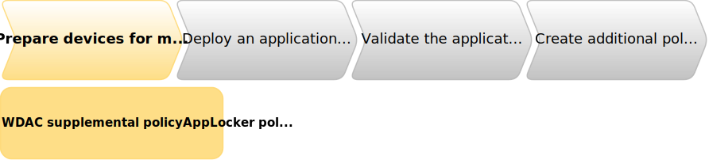

> **Note**
> 
> The managed installer features are only available on 22H2 builds and later. Previous builds are not compatible.
>

Before applications get deployed, two policies need to be configured and deployed to the Windows 11 SE devices.\
These policies establish a baseline that allow managed installers to run on Windows 11 SE devices, and set the Intune Management Extension (IME) as a managed installer. Once both policies are deployed, applications can be deployed from Intune via IME.

- **WDAC Supplemental policy** - Allows code installed by managed installers to run on Windows 11 SE
- **AppLocker policy** - Sets the IME as a managed installer

During the TAP program:
- The WDAC supplemental policy is deployed automatically
- IT admins must deploy the AppLocker policy manually

After the TAP program:
- IT admins won't need to deploy neither of these policies, as they will be configured automatically for all Windows 11 SE devices

> **Warning**
> 
> During TAP, these policies are _not_ guaranteed to apply in any particular order and are not guaranteed to apply before apps are attempted to be installed.
>
> Because of this, it may take some time for these policies (and apps) to be deployed. If you have troubleshooted and confirmed that both the WDAC supplemental policy and the AppLocker policy have been applied, a reboot of the target device can help ensure that the policies and affected services have applied correctly.
>
> Additionally, you should _not_ configure devices receiving the managed installer policies to use Autopilot for provisioning devices. Autopilot may prevent devices from being set up and being used.
> 
>

> **Note**
> 
> These policies need to be applied only once per device, when the device is initially set up and connected to Intune. Once deployed, the policies will remain on the device, allowing you to deploy applications via Intune.
>
>When an application is incompatible with these policies, an IT admin can create and deploy additional *WDAC supplemental policies* or additional *AppLocker policies* to allow those apps. For more information, see [Create additional policies](create-additional-policies).

## WDAC Supplemental policy deployment

The WDAC supplemental policy that allows managed installers to run is automatically deployed to Windows 11 SE devices without additional effort; no action is needed from the IT admin.

You can check that the supplemental policy is configured correctly by following the steps described in [WDAC Supplemental policy validation](troubleshooting#wdac-supplemental-policy-validation)

## AppLocker policy deployment

Windows 11 SE devices that are enrolled within an Intune EDU tenant will receive an AppLocker policy automatically via Intune. This is a script that will set Intune as the Managed Installer on Windows 11 SE devices within an Intune EDU tenant without admins needing to do an extra script deployment. After this, any apps deployed through the Intune Management Extension on Windows 11 SE devices within an Intune EDU tenant will be tagged with the Managed Installer Extended Attribute. 

AppLocker policy will be applied on Win11 SE devices minimum version 10.0.22621.819 and later.

> **WARNING**
>
> You may experience some problems with these scripts if you downloaded and deployed them prior to November 17, 2022.
> 
> If you are experiencing problems with the scripts or using the Intune Management Extension as a managed installer, download the latest version of the scripts from the [*scripts folder*][SCRIPTS] in this repository, install them via the proactive remediation flow below, and reboot your device.
>

The AppLocker policy deployment involves two scripts, which you can find in the [*scripts folder*][SCRIPTS] in this repository:

- **managedinstallerapplocker.ps1** - Sets the IME as a managed installer and enables AppLocker services
- **detection.ps1** - Validates that the policies set by managedinstallerapplocker.ps1 have been set correctly

You can use *Proactive remediations* to apply these policies, following the instructions here: [Tutorial - Proactive remediations][MEM-2]. The benefit of using remediation scripts is that it will allow to periodically deploy these policies and ensure that they have applied correctly.

- You can enroll in proactive remediations via https://aka.ms/endpointanalytics
- While the documentation for using proactive remediations suggests that you should set "Run script in 64 bit PowerShell Host" to No, this should instead be set to Yes to allow use of managed installers.
- There is a filter so that these scripts are only deployed to Windows 11 SE devices; if you want to install to a subset of your Windows 11 SE devices, you can instead target a specific group.
- The remediation script file is `managedinstallerapplocker.ps1` and the detection script file is `detection.ps1`.

To validated that the policies were deployed correctly see the [AppLocker policy validation](Troubleshooting#applocker-policy-validation).

## Scenarios to validate
| # | **Scenario** | **Description** |
| --- | --- | --- |
| 1 | Win32 apps can be installed via Intune on a Windows SE device. | When connected to an EDU tenant and AppLocker policy has been deployed, a Win32 app can be provisioned in Intune and installed on device. Note that **Store UWP apps, MSIX apps, and auto-updating apps are not directly compatible with this solution.** A current workaround for Store apps to use the Store for Education flow with a supplemental policy. Refer to Managed Installer specific documentation for instructions on Store app installation. |
| 2 | Apps are installed after AppLocker policy is applied. | Check that apps do not attempt installing before AppLocker policy is applied. |
| 3 | Additional AppLocker managed installer policies can be applied without interrupting the Sidecar policy deployed by Intune | Set an additional managed installer using AppLocker policies via uploading a PowerShell script using the -Merge parameter is used with Set-AppLockerPolicy. **Deploying additional apps should not be blocked or interrupted.** |
| 4 | AppLocker Sidecar managed installer policies will re-deploy if removed by non-Merge policy. | Set an additional managed installer using AppLocker policies via uploading a PowerShell script without using the the -Merge parameter is used with Set-AppLockerPolicy. **The Sidecar managed installer policy should be re-applied.** |

---
[SCRIPTS]: https://github.com/microsoft/WinSE_TAP/tree/main/scripts

[MEM-1]: https://learn.microsoft.com/mem/intune/apps/intune-management-extension
[MEM-2]: https://learn.microsoft.com/mem/analytics/proactive-remediations
[MEM-3]: https://learn.microsoft.com/mem/intune/fundamentals/groups-add