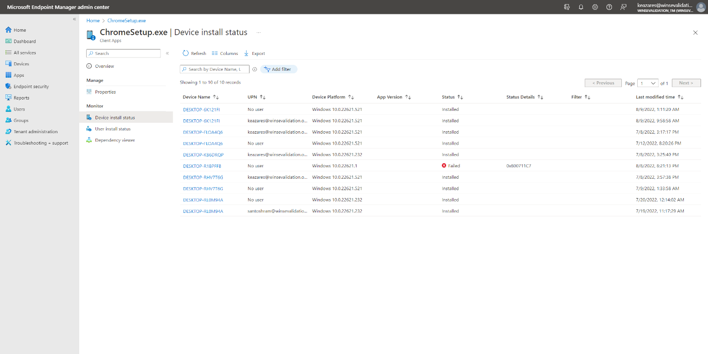
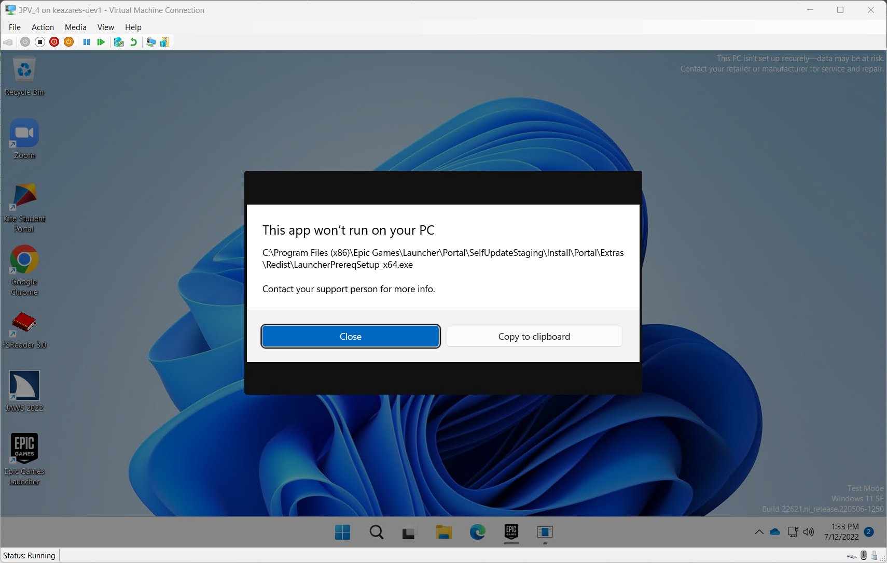

# Validate the applications deployed to Windows SE devices

:::image type="content" source="./images/validate-app.svg" alt-text="Diagram showing the three tutorial steps, highlighting the app validation step." border="false":::

A fundamental step in deploying apps to Windows 11 SE devices is to validate that the apps work as expected.

Application validation consists of the following steps:

1. Wait for the application to install
1. Verify that the app has installed successfully
1. Open the app and exercise all user workflows
1. Inspect the app and take note of any potential problems
1. If necessary, [create an additional policy](./create-additional-policies)

> [!NOTE]
> Apps must be validated on a case-by-case basis. A successful installation doesn't mean that the app will run properly. A successful execution of the app, doesn't mean it will *always* run properly. More details about these behaviors are provided below.

## Wait for the application to install

Application installation depends on two factors:

- when the initial managed installer policies are applied to the device
- when the apps are deployed to a device

> [!IMPORTANT]
> The Intune management extension agent checks every hour (or on service or device restart) for any new Win32 app assignments.

Unless applications are blocked by the E-Mode policy, the process to deploy apps to Windows SE devices should be consistent with the experience that you have with non-SE devices.

## Check for installation

There are two ways to check that your app has installed successfully:

- Intune portal
- On the device

Both options are worth checking. Installation in Intune can be used to check the installation status remotely and to ensure that the installation detection rules are coonfigured correctly. Checking on the device can indicate if the app  installed and if it can be executed correctly.

### Check for installation from Intune

To check the installation status of an app from the Intune portal, follow these steps:

1. Sign in to the <a href="https://intune.microsoft.com/" target="_blank"><b>Microsoft Intune admin center</b></a>
1. Select **App > All apps**
1. Select the application you want to check
1. From the **Overview** page, you can verify the overall installation status
    
    :::image type="content" source="./images/intune-app-install-overview.png" alt-text="App installation details from Intune admin center.":::

1. From the **Device install status** page, you can verify the installation status for each device
    
    :::image type="content" source="./images/intune-app-install-status.png" alt-text="App installation status for each device from Intune admin center.":::

When reviewing an app, you can navigate to **Monitor** > **Device install status** to see which devices are failing and the status code for why it has failed to install.

An application may have installed correctly, but reported as failed due to its Detection rules which were defined at the time when the app was added into Intune.\
If you find that the app is being reported as having a failure but it has been installed successfully when checking for its presence on a device, you may need to adjust the app's detection rules in Intune.

Also, consider the opposite case. If an app is reported as being installed but has actually failed to install on a target, it's possible that a reinstall would not be retried from Intune and you will need to ensure that you have the correct detection rules set for that app in Intune.

### Check for installation on the device

From the Settings app, go to **Apps** > **Installed apps**. You can see the list of installed apps and validate that your targeted app is present here.

Additionally, if your app was not installed via an msi (and therefore visible in the MEM portal), you can see the version number of the installed app in this list in Settings.

You can also validate that the app has been installed by checking its installation directory. This is usually in `C:\Program Files` or `C:\Program Files (x86)`, but can vary from app to app.

Lastly, you may want to launch the app to be sure that it has installed correctly.

### Known limitations

Not all apps are compatible with managed installers even after installation; there are known limitations.

This resource lists known limitations with apps deployed via a managed installer: [Allow apps deployed with a WDAC managed installer][WIN-1].

Additionally, when using Intune, [**Packaged apps (MSIX)**][WIN-2] aren't installed using the Intune Management Extension and thus aren't tracked by the managed installer heuristic. These will need to be separately authorized in your WDAC policy. See [Manage packaged apps with WDAC][WIN-3].

## Check for compatibility

Checking for compatibility will often mean opening the app up and checking its core functionality. Obviously, the core functionality varies from app to app, so signals that an app is or isn't working will also differ.

Here are some things you should try while testing the behavior of your app:

- Open the app.
- Test the core functionality and common user scenarios. Exercise a common workflow that a user would do.
- Force an update of the app.

Here are things to pay attention to and watch out for:

- Know how apps you deploy are updated, whether it auto-updates and if it offers controls for auto-updating.
- Dialogs show during use indicating something was blocked.
- Multiple apps are installed, especially if one app appears to be a launcher/updater. (e.g. Downloading Adobe Photoshop includes the Adobe Creative Cloud launcher, which updates Photoshop)
- Any messages indicating that the app is doing pre-installation work or downloading additional content.
- Event logs found in CodeIntegrity - Operational, and AppLocker - MSI and Script. For more information, see [Troubleshooting - Event Viewer](./Troubleshooting#event-viewer).

### Compatible apps

If an app appears to be functioning correctly without being blocked, it is likely compatible with managed installer installation. Again, you should follow the recommendations above to test the behavior of your app.

However, just because an app works initially does not mean it will *always* work. Apps can be updated by self-updating or done through a separate launcher/client. See more about this in the [Semi-compatible apps](#) section below.

### Semi-compatible apps

Semi-compatible apps may run without problems initially, but in the future they can be restricted to run after it self-updates or another installer/updater app installs over it.

### Incompatible apps

Incompatible apps may launch initially but immediately begin downloading additional resources, and eventually are blocked before any of their key functionality can be accessed. Alternatively, these apps may not launch due to another file being blocked by the base policy on Windows 11 SE.

See [here][WIN-1] for the common classes of incompatible apps.

### Visual error notifications

You may see a dialog indicating *This app won't run on your PC*. Check the indicated executable and verify that it matches the one of the installed application.

### Event Viewer

More detail can be obtained when looking for events where executables were blocked in the Event Viewer. For more information, see [Troubleshooting - Event Viewer](./Troubleshooting#event-viewer).

---

[M365-1]: https://learn.microsoft.com/microsoft-365/education/deploy/microsoft-store-for-education

[WIN-1]: https://learn.microsoft.com/windows/security/threat-protection/windows-defender-application-control/configure-authorized-apps-deployed-with-a-managed-installer
[WIN-2]: https://learn.microsoft.com/windows/msix/
[WIN-3]: https://learn.microsoft.com/windows/security/threat-protection/windows-defender-application-control/manage-packaged-apps-with-windows-defender-application-control