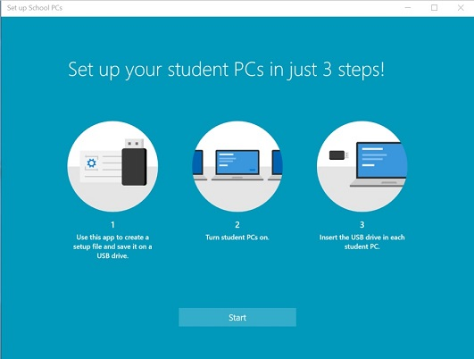
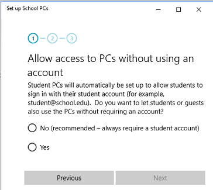
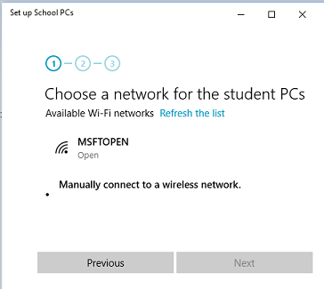
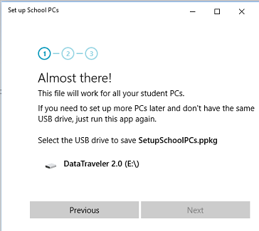

# Use the Set up School PCs app (Preview)
**Applies to:**

-   Windows 10 Insider Preview  

> [Some information relates to pre-released product which may be substantially modified before it's commercially released. Microsoft makes no warranties, express or implied, with respect to the information provided here. ]

Teachers and IT administrators can use the **Set up School PCs** app to quickly set up computers for students. A computer set up using the app is tailored to provide students with the tools they need for learning while removing apps and features that they don't need.

## What does this app do?

The Set up School PCs app helps you set up new computers running Windows 10, version 1607. Some benefits of using this app to set up your students' PCs:
* A computer set up this way is tailored to provide students with the tools they need for learning while removing apps and features that they don't need. 
    * Places tiles for OneNote, Office 365 web apps, Sway, and Microsoft Classroom on the Start menu
    * Installs OneDrive for cloud-based documents and places it on the Start menu and taskbar 
    * Sets Microsoft Edge as the default browser
    * Uninstalls apps not specific to education, such as Solitaire and Sports
    * Turns off Offers and tips
    * Prevents students from adding personal Microsoft accounts to the computer
* Significantly improves how fast students sign-in.
* The app connects the PCs to your school’s cloud so IT can manage them (optional).
* Windows 10 automatically manages accounts no matter how many students use the PC.
* Keeps computers up-to-date without interfering with class time using Windows Update and maintenance hours (by default, 12 AM).
* Customizes the sign-in screen to support students with IDs and temporary users.
* Locks down the computer to prevent mischievous activity:
    * Prevents students from installing apps
    * Prevents students from removing the computer from the school's device management system
    * Prevents students from removing the Set up School PCs settings

## Tips for success

* **Run the app at work**: For the best results, run the **Set up School PCs** app on your work device connected to your school's network. That way the app can gather accurate information about your wireless networks and cloud subscriptions.
    > **Note**: Don't use **Set up Schools PCs** app for PCs that must connect to enterprise networks or to open wi-fi networks that require the user to accept Terms of Use.
* **Apply to new computers**: The setup file that the **Set up School PCs** app creates should be used on new computers that haven't been set up for accounts yet. If you apply the setup file to a computer that has already been set up, existing accounts and data might be lost.
> **Warning**: Only use the setup file on computers that you want to configure and lock down for students. After you apply the setup file to a computer, the computer must be reset to remove the settings.
* **Turn on student PCs and stay on first screen**: The computer must be on this screen when you insert the USB key.

If you have gone past this screen, you may have to reset your PC to start over.  To reset your PC after you have completed the first run experience, go to **Settings** > **Update & security** > **Recovery** > **Reset this PC**.
* **Use more than one USB key**: If you are setting up multiple PCs, you can set them up at the same time.  Just run the **Set up School PCs** app again and save the same settings to another key. That way you can run set up on more than one PC at once.  Create three keys and you can run it on three PCs at once, etc. 
* **Start fresh**: If the PC has already been set up and you want to return to the first-run-experience to apply a new package, go to **Settings** > **Update & security** > **Recovery** > **Reset this PC**.
* **Keep it clean**:  We strongly recommend that IT avoid changes to policies unless absolutely necessary, as any changes can impair performance and sign-in time. Get more information at [Set up School PCs app technical reference](set-up-school-pcs-technical.md).

## Set up School PCs app step-by-step

What you need:

- The **Set up School PCs** app, installed on your work computer, connected to your school's network
- A USB drive, 1 GB or larger

### Create the setup file in the app

The **Set up School PCs** app guides you through the configuration choices for the student PCs.

1. Open the **Set up School PCs** app and select **Start**.

    
    
2. Choose **No** to require students to sign in only with an account, or choose **Yes** to allow students to use the PC without an account too, and then select **Next**.

    

3. Choose a Wi-Fi network from the list and then select **Next**, or choose **Manually connect to a wireless network** to enter the network information yourself.

    

    - For a manual network connection, enter the network name, security type, and password (if required), and then select **Next**.
        
        
    
4. Insert a USB drive, select it in the app, and then select **Save**.

    

### Apply the setup file to PCs

The setup file on your USB drive is named SetupSchoolPCs.ppkg, which is a provisioning package. A provisioning package is a method for applying settings to Windows 10. When Windows 10 refers to *package*, it means your setup file, and when it refers to *provisioning*, it means applying the setup file to the computer.

1. Start with a computer on the first-run setup screen. If the PC has gone past this screen, reset the PC to start over. To reset the PC, go to **Settings** > **Update & security** > **Recovery** > **Reset this PC**.

    

2. Insert the USB drive. Windows Setup will recognize the drive and ask you if you want to set up the device. Select **Set up**.

    

3. The next screen asks you to select a provisioning source. Select **Removable Media** and tap **Next**.

    
    
4. Select `SetupSchoolPCs.ppkg` and tap **Next**.

    

5. Select **Yes, add it**.

    
    
6. Read and accept the Microsoft Software License Terms.  

    
    
7. Select **Use Express settings**.

    

8. If the PC doesn't use a volume license, you'll see the **Who owns this PC?** screen. Select **My work or school owns it** and tap **Next**.

    

9. On the **Choose how you'll connect** screen, select **Join Azure AD** and tap **Next**.

    

10. Your last step is to sign in. Use your Azure AD or Office 365 account and password. When you see the progress ring, you can remove the USB drive.

    

    
That's it! Sign out and the computer is now ready for students.

## Learn more

See [The Set up School PCs app technical reference](set-up-school-pcs-technical.md) for prerequisites and provisioning details. 

