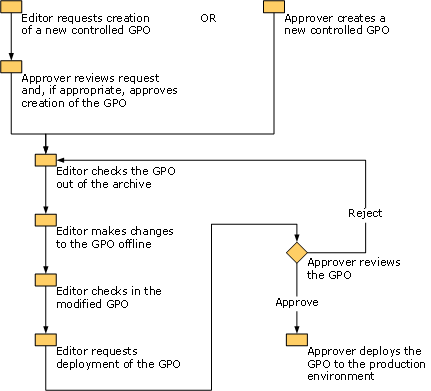

# Step-by-Step Guide for Microsoft Advanced Group Policy Management 3.0

This step-by-step guide demonstrates advanced techniques for Group Policy management using the Group Policy Management Console (GPMC) and Microsoft Advanced Group Policy Management (AGPM). AGPM increases the capabilities of the GPMC, providing:

-   Standard roles for delegating permissions to manage Group Policy objects (GPOs) to multiple Group Policy administrators, as well as the ability to delegate access to GPOs in the production environment.

-   An archive to enable Group Policy administrators to create and modify GPOs offline before deploying them to a production environment.

-   The ability to roll back to any previous version of a GPO in the archive and to limit the number of versions stored in the archive.

-   Check-in/check-out capability for GPOs to ensure that Group Policy administrators do not inadvertently overwrite each other's work.

## AGPM scenario overview

For this scenario, you will use a separate user account for each role in AGPM to demonstrate how Group Policy can be managed in an environment with multiple Group Policy administrators who have different levels of permissions. Specifically, you will perform the following tasks:

-   Using an account that is a member of the Domain Admins group, install AGPM Server and assign the AGPM Administrator role to an account or group.

-   Using accounts to which you will assign AGPM roles, install AGPM Client.

-   Using an account with the AGPM Administrator role, configure AGPM and delegate access to GPOs by assigning roles to other accounts.

-   Using an account with the Editor role, request the creation of a GPO, which you then approve using an account with the Approver role. With the Editor account, check the GPO out of the archive, edit the GPO, check the GPO into the archive, and request deployment.

-   Using an account with the Approver role, review the GPO and deploy it to your production environment.

-   Using an account with the Editor role, create a GPO template and use it as a starting point to create a new GPO.

-   Using an account with the Approver role, delete and restore a GPO.

## Requirements

Computers on which you want to install AGPM must meet the following requirements, and you must create accounts for use in this scenario.

**Note**  
If you have AGPM 2.5 installed and are upgrading from Windows Server® 2003 to Windows Server 2008 or Windows Vista® with no service packs installed to Windows Vista with Service Pack 1, you must upgrade the operating system before you can upgrade to AGPM 3.0.

 

### AGPM Server requirements

AGPM Server 3.0 requires Windows Server 2008 or Windows Vista with Service Pack 1 and the GPMC from Remote Server Administration Tools (RSAT) installed. Both 32-bit and 64-bit versions are supported.

Before you install AGPM Server, you must be a member of the Domain Admins group and the following Windows features must be present unless otherwise noted:

-   GPMC

    -   Windows Server 2008: The GPMC is automatically installed by AGPM if not present.

    -   Windows Vista: You must install the GPMC from RSAT before you install AGPM. For more information, see <https://go.microsoft.com/fwlink/?LinkID=116179>.

-   .NET Framework 3.5

The following Windows features are required by AGPM Server and will be automatically installed if not present:

-   WCF Activation; Non-HTTP Activation

-   Windows Process Activation Service

    -   Process Model

    -   .NET Environment

    -   Configuration APIs

### AGPM Client requirements

AGPM Client 3.0 requires Windows Server 2008 or Windows Vista with Service Pack 1 and the GPMC from Remote Server Administration Tools (RSAT) installed. Both 32-bit and 64-bit versions are supported. AGPM Client can be installed on a computer running AGPM Server.

The following Windows features are required by AGPM Client and will be automatically installed if not present unless otherwise noted:

-   GPMC

    -   Windows Server 2008: The GPMC is automatically installed by AGPM if not present.

    -   Windows Vista: You must install the GPMC from RSAT before you install AGPM. For more information, see <https://go.microsoft.com/fwlink/?LinkID=116179>.

-   .NET Framework 3.0

### Scenario requirements

Before you begin this scenario, create four user accounts. During the scenario, you will assign one of the following AGPM roles to each of these accounts: AGPM Administrator (Full Control), Approver, Editor, and Reviewer. These accounts must be able to send and receive e-mail messages. Assign **Link GPOs** permission to the accounts with the AGPM Administrator, Approver, and (optionally) Editor roles.

**Note**  
**Link GPOs** permission is assigned to members of Domain Administrators and Enterprise Administrators by default. To assign **Link GPOs** permission to additional users or groups (such as accounts with the roles of AGPM Administrator or Approver), click the node for the domain and then click the **Delegation** tab, select **Link GPOs**, click **Add**, and select users or groups to which to assign the permission.

 

## Steps for installing and configuring AGPM

You must complete the following steps to install and configure AGPM.

[Step 1: Install AGPM Server](#bkmk-config1)

[Step 2: Install AGPM Client](#bkmk-config2)

[Step 3: Configure an AGPM Server connection](#bkmk-config3)

[Step 4: Configure e-mail notification](#bkmk-config4)

[Step 5: Delegate access](#bkmk-config5)

### Step 1: Install AGPM Server

In this step, you install AGPM Server on the member server or domain controller that will run the AGPM Service, and you configure the archive. All AGPM operations are managed through this Windows service and are executed with the service's credentials. The archive managed by an AGPM Server can be hosted on that server or on another server in the same forest.

**To install AGPM Server on the computer that will host the AGPM Service**

1.  Log on with an account that is a member of the Domain Admins group.

2.  Start the Microsoft Desktop Optimization Pack CD and follow the instructions on screen to select **Advanced Group Policy Management - Server**.

3.  In the **Welcome** dialog box, click **Next**.

4.  In the **Microsoft Software License Terms** dialog box, accept the terms and click **Next**.

5.  In the **Application Path** dialog box, select a location in which to install AGPM Server. The computer on which AGPM Server is installed will host the AGPM Service and manage the archive. Click **Next**.

6.  In the **Archive Path** dialog box, select a location for the archive relative to the AGPM Server. The archive path can point to a folder on the AGPM Server or elsewhere, but you should select a location with sufficient space to store all GPOs and history data managed by this AGPM Server. Click **Next**.

7.  In the **AGPM Service Account** dialog box, select a service account under which the AGPM Service will run and then click **Next**.

8.  In the **Archive Owner** dialog box, select an account or group to which to initially assign the AGPM Administrator (Full Control) role. This AGPM Administrator can assign AGPM roles and permissions to other Group Policy administrators (including the role of AGPM Administrator). For this scenario, select the account to serve in the AGPM Administrator role. Click **Next**.

9.  In the **Port Configuration** dialog box, type a port on which the AGPM Service should listen. Do not clear the **Add port exception to firewall** check box unless you manually configure port exceptions or use rules to configure port exceptions. Click **Next**.

10. In the **Languages** dialog box, select one or more display languages to install for AGPM Server.

11. Click **Install**, and then click **Finish** to exit the Setup Wizard.

    **Caution**  
    Do not modify settings for the AGPM Service through **Administrative Tools** and **Services** in the operating system. Doing so can prevent the AGPM Service from starting. For information on how to modify settings for the service, see Help for Advanced Group Policy Management.

     

### Step 2: Install AGPM Client

Each Group Policy administrator—anyone who creates, edits, deploys, reviews, or deletes GPOs—must have AGPM Client installed on computers that they use to manage GPOs. For this scenario, you install AGPM Client on at least one computer. You do not need to install AGPM Client on the computers of end users who do not perform Group Policy administration.

**To install AGPM Client on the computer of a Group Policy administrator**

1.  Start the Microsoft Desktop Optimization Pack CD and follow the instructions on screen to select **Advanced Group Policy Management - Client**.

2.  In the **Welcome** dialog box, click **Next**.

3.  In the **Microsoft Software License Terms** dialog box, accept the terms and click **Next**.

4.  In the **Application Path** dialog box, select a location in which to install AGPM Client. Click **Next**.

5.  In the **AGPM Server** dialog box, type the fully-qualified computer name for the AGPM Server and the port to which to connect. The default port for the AGPM Service is 4600. Do not clear the **Allow Microsoft Management Console through the firewall** check box unless you manually configure port exceptions or use rules to configure port exceptions. Click **Next**.

6.  In the **Languages** dialog box, select one or more display languages to install for AGPM Client.

7.  Click **Install**, and then click **Finish** to exit the Setup Wizard.

### Step 3: Configure an AGPM Server connection

AGPM stores all versions of each controlled Group Policy object (GPO)—a GPO for which AGPM provides change control—in a central archive, so Group Policy administrators can view and modify GPOs offline without immediately impacting the deployed version of each GPO.

In this step, you configure an AGPM Server connection and ensure that all Group Policy administrators connect to the same AGPM Server. (For information about configuring multiple AGPM Servers, see Help for Advanced Group Policy Management.)

**To configure an AGPM Server connection for all Group Policy administrators**

1.  On a computer on which you have installed AGPM Client, log on with the user account that you selected as the Archive Owner. This user has the role of AGPM Administrator (Full Control).

2.  Click **Start**, point to **Administrative Tools**, and click **Group Policy Management** to open the GPMC.

3.  Edit a GPO that is applied to all Group Policy administrators.

4.  In the **Group Policy Management Editor** window, double-click **User Configuration**, **Policies**, **Administrative Templates**, **Windows Components**, and **AGPM**.

5.  In the details pane, double-click **AGPM: Specify default AGPM Server (all domains)**.

6.  In the **Properties** window, select **Enabled** and type the fully-qualified computer name and port (for example, **server.contoso.com:4600**) for the server hosting the archive. By default, the AGPM Service uses port 4600.

7.  Click **OK**, and then close the **Group Policy Management Editor** window. When Group Policy is updated, the AGPM Server connection is configured for each Group Policy administrator.

### Step 4: Configure e-mail notification

As an AGPM Administrator (Full Control), you designate the e-mail addresses of Approvers and AGPM Administrators to whom an e-mail message containing a request is sent when an Editor attempts to create, deploy, or delete a GPO. You also determine the alias from which these messages are sent.

**To configure e-mail notification for AGPM**

1.  In the details pane, click the **Domain Delegation** tab.

2.  In the **From e-mail address** field, type the e-mail alias for AGPM from which notifications should be sent.

3.  In the **To e-mail address** field, type the e-mail address for the user account to which you intend to assign the Approver role.

4.  In the **SMTP server** field, type a valid SMTP mail server.

5.  In the **User name** and **Password** fields, type the credentials of a user with access to the SMTP service. Click **Apply**.

### Step 5: Delegate access

As an AGPM Administrator (Full Control), you delegate domain-level access to GPOs, assigning roles to the account of each Group Policy administrator.

**Note**  
You can also delegate access at the GPO level rather than the domain level. For details, see Help for Advanced Group Policy Management.

 

**Important**  
You should restrict membership in the Group Policy Creator Owners group, so it cannot be used to circumvent AGPM management of access to GPOs. (In the **Group Policy Management Console**, click **Group Policy Objects** in the forest and domain in which you want to manage GPOs, click **Delegation**, and then configure the settings to meet the needs of your organization.)

 

**To delegate access to all GPOs throughout a domain**

1.  On the **Domain Delegation** tab, click the **Add** button, select the user account of the Group Policy administrator to serve as Approver, and then click **OK**.

2.  In the **Add Group or User** dialog box, select the **Approver** role to assign that role to the account, and then click **OK**. (This role includes the Reviewer role.)

3.  Click the **Add** button, select the user account of the Group Policy administrator to serve as Editor, and then click **OK**.

4.  In the **Add Group or User** dialog box, select the **Editor** role to assign that role to the account, and then click **OK**. (This role includes the Reviewer role.)

5.  Click the **Add** button, select the user account of the Group Policy administrator to serve as Reviewer, and then click **OK**.

6.  In the **Add Group or User** dialog box, select the **Reviewer** role to assign only that role to the account.

## Steps for managing GPOs

You must complete the following steps to create, edit, review, and deploy GPOs using AGPM. Additionally, you will create a template, delete a GPO, and restore a deleted GPO.

[Step 1: Create a GPO](#bkmk-manage1)

[Step 2: Edit a GPO](#bkmk-manage2)

[Step 3: Review and deploy a GPO](#bkmk-manage3)

[Step 4: Use a template to create a GPO](#bkmk-manage4)

[Step 5: Delete and restore a GPO](#bkmk-manage5)

### Step 1: Create a GPO

In an environment with multiple Group Policy administrators, those with the Editor role have the ability to request the creation of new GPOs, but such a request must be approved by someone with the Approver role because the creation of a new GPO impacts the production environment.

In this step, you use an account with the Editor role to request the creation of a new GPO. Using an account with the Approver role, you approve this request and complete the creation of a GPO.

**To request the creation of a new GPO managed through AGPM**

1.  On a computer on which you have installed AGPM Client, log on with a user account that has been assigned the Editor role in AGPM.

2.  In the **Group Policy Management Console** tree, click **Change Control** in the forest and domain in which you want to manage GPOs.

3.  Right-click the **Change Control** node, and then click **New Controlled GPO**.

4.  In the **New Controlled GPO** dialog box:

    1.  To receive a copy of the request, type your e-mail address in the **Cc** field.

    2.  Type **MyGPO** as the name for the new GPO.

    3.  Type a comment for the new GPO.

    4.  Click **Create live** so the new GPO will be deployed to the production environment immediately upon approval. Click **Submit**.

5.  When the **AGPM Progress** window indicates that overall progress is complete, click **Close**. The new GPO is displayed on the **Pending** tab.

**To approve the pending request to create a GPO**

1.  On a computer on which you have installed AGPM Client, log on with a user account that has been assigned the role of Approver in AGPM.

2.  Open the e-mail inbox for the account, and note that you have received an e-mail message from the AGPM alias with the Editor's request to create a GPO.

3.  In the **Group Policy Management Console** tree, click **Change Control** in the forest and domain in which you want to manage GPOs.

4.  On the **Contents** tab, click the **Pending** tab to display the pending GPOs.

5.  Right-click **MyGPO**, and then click **Approve**.

6.  Click **Yes** to confirm approval of the creation of the GPO. The GPO is moved to the **Controlled** tab.

### Step 2: Edit a GPO

You can use GPOs to configure computer or user settings and deploy them to many computers or users. In this step, you use an account with the Editor role to check out a GPO from the archive, edit the GPO offline, check the edited GPO into the archive, and request deployment of the GPO to the production environment. For this scenario, you configure a setting in the GPO to require that the password be at least eight characters in length.

**To check the GPO out from the archive for editing**

1.  On a computer on which you have installed AGPM Client, log on with a user account that has been assigned the role of Editor in AGPM.

2.  In the **Group Policy Management Console** tree, click **Change Control** in the forest and domain in which you want to manage GPOs.

3.  On the **Contents** tab in the details pane, click the **Controlled** tab to display the controlled GPOs.

4.  Right-click **MyGPO**, and then click **Check Out**.

5.  Type a comment to be displayed in the history of the GPO while it is checked out, and then click **OK**.

6.  When the **AGPM Progress** window indicates that overall progress is complete, click **Close**. On the **Controlled** tab, the state of the GPO is identified as **Checked Out**.

**To edit the GPO offline and configure the minimum password length**

1.  On the **Controlled** tab, right-click **MyGPO**, and then click **Edit** to open the **Group Policy Management Editor** window and make changes to an offline copy of the GPO. For this scenario, configure the minimum password length:

    1.  Under **Computer Configuration**, double-click **Policies**, **Windows Settings**, **Security Settings**, **Account Policies**, and **Password Policy**.

    2.  In the details pane, double-click **Minimum password length**.

    3.  In the properties window, select the **Define this policy setting** check box, set the number of characters to **8**, and then click **OK**.

2.  Close the **Group Policy Management Editor** window.

**To check the GPO into the archive**

1.  On the **Controlled** tab, right-click **MyGPO** and then click **Check In**.

2.  Type a comment, and then click **OK**.

3.  When the **AGPM Progress** window indicates that overall progress is complete, click **Close**. On the **Controlled** tab, the state of the GPO is identified as **Checked In**.

**To request the deployment of the GPO to the production environment**

1.  On the **Controlled** tab, right-click **MyGPO** and then click **Deploy**.

2.  Because this account is not an Approver or AGPM Administrator, you must submit a request for deployment. To receive a copy of the request, type your e-mail address in the **Cc** field. Type a comment to be displayed in the history of the GPO, and then click **Submit**.

3.  When the **AGPM Progress** window indicates that overall progress is complete, click **Close**. **MyGPO** is displayed on the list of GPOs on the **Pending** tab.

### Step 3: Review and deploy a GPO

In this step, you act as an Approver, creating reports and analyzing the settings and changes to settings in the GPO to determine whether you should approve them. After evaluating the GPO, you deploy it to the production environment and link it to a domain or an organizational unit (OU) so that it takes effect when Group Policy is refreshed for computers in that domain or OU.

**To review settings in the GPO**

1. On a computer on which you have installed AGPM Client, log on with a user account that has been assigned the role of Approver in AGPM. (Any Group Policy administrator with the Reviewer role, which is included in all of the other roles, can review the settings in a GPO.)

2. Open the e-mail inbox for the account and note that you have received an e-mail message from the AGPM alias with an Editor's request to deploy a GPO.

3. In the **Group Policy Management Console** tree, click **Change Control** in the forest and domain in which you want to manage GPOs.

4. On the **Contents** tab in the details pane, click the **Pending** tab.

5. Double-click **MyGPO** to display its history.

6. Review the settings in the most recent version of MyGPO:

   1.  In the **History** window, right-click the GPO version with the most recent timestamp, click **Settings**, and then click **HTML Report** to display a summary of the GPO's settings.

   2.  In the Web browser, click **show all** to display all of the settings in the GPO. Close the browser.

7. Compare the most recent version of MyGPO to the first version checked in to the archive:

   1. In the **History** window, click the GPO version with the most recent time stamp. Press CTRL and click the oldest GPO version for which the **Computer Version** is not **\\***.

   2. Click the **Differences** button. The **Account Policies/Password Policy** section is highlighted in green and preceded by **\[+\]**, indicating that this setting is configured only in the latter version of the GPO.

   3. Click **Account Policies/Password Policy**. The **Minimum password length** setting is also highlighted in green and preceded by **\[+\]**, indicating that it is configured only in the latter version of the GPO.

   4. Close the Web browser.

**To deploy the GPO to the production environment**

1.  On the **Pending** tab, right-click **MyGPO** and then click **Approve**.

2.  Type a comment to include in the history of the GPO.

3.  Click **Yes**. When the **AGPM Progress** window indicates that overall progress is complete, click **Close**. The GPO is deployed to the production environment.

**To link the GPO to a domain or organizational unit**

1.  In the GPMC, right-click the domain or an OU to which to apply the GPO that you configured, and then click **Link an Existing GPO**.

2.  In the **Select GPO** dialog box, click **MyGPO**, and then click **OK**.

### Step 4: Use a template to create a GPO

In this step, you use an account with the Editor role to create a template—an uneditable, static version of a GPO for use as a starting point for creating new GPOs—and then create a new GPO based upon that template. Templates are useful for quickly creating multiple GPOs that include many of the same settings.

**To create a template based on an existing GPO**

1.  On a computer on which you have installed AGPM Client, log on with a user account that has been assigned the role of Editor in AGPM.

2.  In the **Group Policy Management Console** tree, click **Change Control** in the forest and domain in which you want to manage GPOs.

3.  On the **Contents** tab in the details pane, click the **Controlled** tab.

4.  Right-click **MyGPO**, and then click **Save as Template** to create a template incorporating all settings currently in MyGPO.

5.  Type **MyTemplate** as the name for the template and a comment, and then click **OK**.

6.  When the **AGPM Progress** window indicates that overall progress is complete, click **Close**. The new template appears on the **Templates** tab.

**To request the creation of a new GPO managed through AGPM**

1.  Click the **Controlled** tab.

2.  Right-click the **Change Control** node, and then click **New Controlled GPO**.

3.  In the **New Controlled GPO** dialog box:

    1.  To receive a copy of the request, type your e-mail address in the **Cc** field.

    2.  Type **MyOtherGPO** as the name for the new GPO.

    3.  Type a comment for the new GPO.

    4.  Click **Create live**, so the new GPO will be deployed to the production environment immediately upon approval.

    5.  For **From GPO template**, select **MyTemplate**. Click **Submit**.

4.  When the **AGPM Progress** window indicates that overall progress is complete, click **Close**. The new GPO is displayed on the **Pending** tab.

Use an account that has been assigned the role of Approver to approve the pending request to create the GPO as you did in [Step 1: Create a GPO](#bkmk-manage1). MyTemplate incorporates all of the settings that you configured in MyGPO. Because MyOtherGPO was created using MyTemplate, it initially contains all of the settings that MyGPO contained at the time that MyTemplate was created. You can confirm this by generating a difference report to compare MyOtherGPO to MyTemplate.

**To check the GPO out from the archive for editing**

1.  On a computer on which you have installed AGPM Client, log on with a user account that has been assigned the role of Editor in AGPM.

2.  Right-click **MyOtherGPO**, and then click **Check Out**.

3.  Type a comment to be displayed in the history of the GPO while it is checked out, and then click **OK**.

4.  When the **AGPM Progress** window indicates that overall progress is complete, click **Close**. On the **Controlled** tab, the state of the GPO is identified as **Checked Out**.

**To edit the GPO offline and configure the account lockout duration**

1.  On the **Controlled** tab, right-click **MyOtherGPO**, and then click **Edit** to open the **Group Policy Management Editor** window and make changes to an offline copy of the GPO. For this scenario, configure the minimum password length:

    1.  Under **Computer Configuration**, double-click **Policies**, **Windows Settings**, **Security Settings**, **Account Policies**, and **Account Lockout Policy**.

    2.  In the details pane, double-click **Account lockout duration**.

    3.  In the properties window, check **Define this policy setting**, set the duration to **30** minutes, and then click **OK**.

2.  Close the **Group Policy Management Editor** window.

Check MyOtherGPO into the archive and request deployment as you did for MyGPO in [Step 2: Edit a GPO](#bkmk-manage2). You can compare MyOtherGPO to MyGPO or to MyTemplate using difference reports. Any account that includes the Reviewer role (AGPM Administrator \[Full Control\], Approver, Editor, or Reviewer) can generate reports.

**To compare a GPO to another GPO and to a template**

1.  To compare MyGPO and MyOtherGPO:

    1.  On the **Controlled** tab, click **MyGPO**. Press CTRL and then click **MyOtherGPO**.

    2.  Right-click **MyOtherGPO**, point to **Differences**, and click **HTML Report**.

2.  To compare MyOtherGPO and MyTemplate:

    1.  On the **Controlled** tab, click **MyOtherGPO**.

    2.  Right-click **MyOtherGPO**, point to **Differences**, and click **Template**.

    3.  Select **MyTemplate** and **HTML Report**, and then click **OK**.

### Step 5: Delete and restore a GPO

In this step, you act as an Approver to delete a GPO.

**To delete a GPO**

1.  On a computer on which you have installed AGPM Client, log on with a user account that has been assigned the role of Approver.

2.  In the **Group Policy Management Console** tree, click **Change Control** in the forest and domain in which you want to manage GPOs.

3.  On the **Contents** tab, click the **Controlled** tab to display the controlled GPOs.

4.  Right-click **MyGPO**, and then click **Delete**. Click **Delete GPO from archive and production** to delete both the version in the archive as well as the deployed version of the GPO in the production environment.

5.  Type a comment to be displayed in the audit trail for the GPO, and then click **OK**.

6.  When the **AGPM Progress** window indicates that overall progress is complete, click **Close**. The GPO is removed from the **Controlled** tab and is displayed on the **Recycle Bin** tab, where it can be restored or destroyed.

Occasionally you may discover after deleting a GPO that it is still needed. In this step, you act as an Approver to restore a GPO that has been deleted.

**To restore a deleted GPO**

1.  On the **Contents** tab, click the **Recycle Bin** tab to display deleted GPOs.

2.  Right-click **MyGPO**, and then click **Restore**.

3.  Type a comment to be displayed in the history of the GPO, and then click **OK**.

4.  When the **AGPM Progress** window indicates that overall progress is complete, click **Close**. The GPO is removed from the **Recycle Bin** tab and is displayed on the **Controlled** tab.

    **Note**  
    Restoring a GPO to the archive does not automatically redeploy it to the production environment. To return the GPO to the production environment, deploy the GPO as in [Step 3: Review and deploy a GPO](#bkmk-manage3).

     

After editing and deploying a GPO, you may discover that recent changes to the GPO are causing a problem. In this step, you act as an Approver to roll back to a previous version of the GPO. You can roll back to any version in the history of the GPO. You can use comments and labels to identify known good versions and when specific changes were made.

**To roll back to a previous version of a GPO**

1.  On the **Contents** tab, click the **Controlled** tab to display the controlled GPOs.

2.  Double-click **MyGPO** to display its history.

3.  Right-click the version to be deployed, click **Deploy**, and then click **Yes**.

4.  When the **Progress** window indicates that overall progress is complete, click **Close**. In the **History** window, click **Close**.

    **Note**  
    To verify that the version that has been redeployed is the version intended, examine a difference report for the two versions. In the **History** window for the GPO, select the two versions, right-click them, point to **Difference**, and then click either **HTML Report** or **XML Report**.

     

 

 

