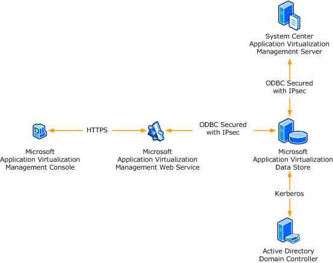

# Configuring App-V for Secure Administration

In an environment where securing administrative operations is important, App-V allows for secure communication between the App-V Web Management Service and the App-V Management Console. Because the Management Service is a Web-based application, it requires securing the App-V Management Server application on the Web server that hosts the Management Service. As shown in the following illustration, this process includes using HTTPS for communication and configuring the IIS server to allow only Windows Integrated Authentication.

The App-V Web Management Service is installed as a Web-based application on IIS. For the Web Management Service to support secure (SSL) connections between the App-V Management Console and the Web Management Service, you will need to configure the IIS server where the Web Management Service is installed and configure the App-V Management Console.

## In This Section

[Configuring Certificates to Support the App-V Web Management Service](configuring-certificates-to-support-the-app-v-web-management-service.md)  
Provides helpful information about configuring certificates to support SSL-based connections, to help secure communication for the App-V Web Management Service.

[How to Install and Configure the App-V Management Console for a More Secure Environment](how-to-install-and-configure-the-app-v-management-console-for-a-more-secure-environment.md)  
Provides a step-by-step procedure for connecting to an App-V Web Management Service by using a secure connection.

 

 

