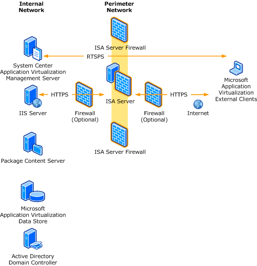
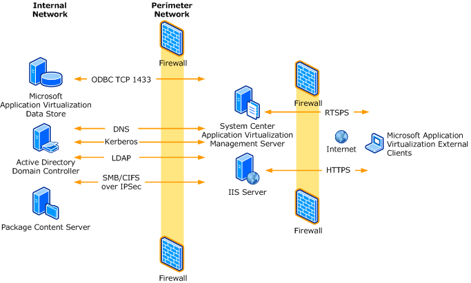

# Internet-Facing Server Scenarios for Perimeter Networks

App-V 4.5 supports Internet-facing server scenarios, in which users who are not connected to the corporate network or who disconnect from the network can still use App-V. As shown in the following illustration, only the use of secure protocols on the Internet (RTSPS and HTTPS) is supported.

You can set up an Internet-facing solution, using an ISA Server, where the App-V infrastructure is on the internal network in the following ways:

-   Create a Web Publishing rule for the IIS server that is hosting the ICO and OSD files—and optionally, the packages for streaming—located on the internal network. Detailed steps are provided at <https://go.microsoft.com/fwlink/?LinkId=151982>.

-   Create a Server Publishing rule for the App-V Web Management Server (RTSPS). Detailed steps are provided at [https://go.microsoft.com/fwlink/?LinkId=151983&](https://go.microsoft.com/fwlink/?LinkId=151983).

As shown in the following illustration, if the infrastructure has implemented other firewalls between the client and the ISA Server or between the ISA Server and the internal network, both RTSPS (TCP 322) and HTTPS (TCP 443) firewall rules must be created to support the flow of traffic. Also, if firewalls have been implemented between the ISA Server and the internal network, the default traffic required for domain members must be permitted to tunnel through the firewall (DNS, LDAP, Kerberos, SMB/CIFS).

Because the firewall solutions vary from environment to environment, the guidance provided in this topic describes the traffic that would be required to configure an Internet-facing App-V environment in the perimeter network. This information also includes the recommended internal network servers.

Place the following servers in the perimeter network:

-   App-V Management Server

-   IIS server for publishing and streaming

**Note**  
It is a best practice to place the Management Server and IIS server on separate computers.

 

Place the following servers in the internal network:

-   Content server

-   Data store (SQL Server)

-   Active Directory Domain Controller

## Traffic Requirements

The following tables list the traffic requirements for communication from the Internet and the perimeter network and from the perimeter network to the internal network.

<table>
<colgroup>
<col width="50%" />
<col width="50%" />
</colgroup>
<thead>
<tr class="header">
<th align="left">Traffic Requirements from Internet to Perimeter Network</th>
<th align="left">Details</th>
</tr>
</thead>
<tbody>
<tr class="odd">
<td align="left">
RTSPS (publishing refresh and streaming packages)
</td>
<td align="left">
TCP 322 by default; this can be changed in App-V Management Server.
</td>
</tr>
<tr class="even">
<td align="left">
HTTPS (publishing ICO and OSD files and streaming packages)
</td>
<td align="left">
TCP 443 by default; this can be changed in the IIS configuration.
</td>
</tr>
</tbody>
</table>

 

<table>
<colgroup>
<col width="50%" />
<col width="50%" />
</colgroup>
<thead>
<tr class="header">
<th align="left">Traffic Requirements from Perimeter Network to Internal Network</th>
<th align="left">Details</th>
</tr>
</thead>
<tbody>
<tr class="odd">
<td align="left">
SQL Server
</td>
<td align="left">
TCP 1433 is the default but can be configured in SQL Server.
</td>
</tr>
<tr class="even">
<td align="left">
SMB/CIFS
</td>
<td align="left">
If the content directory is located remotely from the Management Server(s) or IIS server (recommended).
</td>
</tr>
<tr class="odd">
<td align="left">
Kerberos
</td>
<td align="left">
TCP and UDP 88
</td>
</tr>
<tr class="even">
<td align="left">
LDAP
</td>
<td align="left">
TCP and UDP 389
</td>
</tr>
<tr class="odd">
<td align="left">
DNS
</td>
<td align="left">
For name resolution of internal resources (can be eliminated with the use of host’s file on perimeter network servers)
</td>
</tr>
</tbody>
</table>

 

 

 

