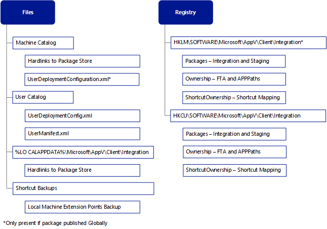
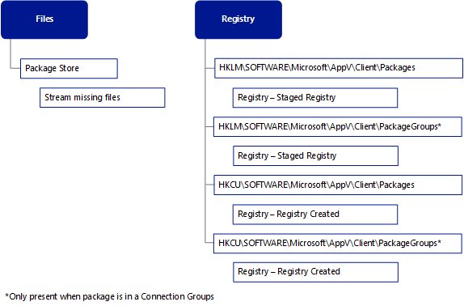

# Application Publishing and Client Interaction


This article provides technical information about common App-V client operations and their integration with the local operating system.

-   [App-V package files created by the Sequencer](#bkmk-appv-pkg-files-list)

-   [What’s in the appv file?](#bkmk-appv-file-contents)

-   [App-V client data storage locations](#bkmk-files-data-storage)

-   [Package registry](#bkmk-pkg-registry)

-   [App-V package store behavior](#bkmk-pkg-store-behavior)

-   [Roaming registry and data](#bkmk-roaming-reg-data)

-   [App-V client application lifecycle management](#bkmk-clt-app-lifecycle)

-   [Integration of App-V packages](#bkmk-integr-appv-pkgs)

-   [Dynamic configuration processing](#bkmk-dynamic-config)

-   [Side-by-side assemblies](#bkmk-sidebyside-assemblies)

-   [Client logging](#bkmk-client-logging)

For additional reference information, see [Microsoft Application Virtualization (App-V) Documentation Resources Download Page](https://www.microsoft.com/download/details.aspx?id=27760).

## <a href="" id="bkmk-appv-pkg-files-list"></a>App-V package files created by the Sequencer


The Sequencer creates App-V packages and produces a virtualized application. The sequencing process creates the following files:

<table>
<colgroup>
<col width="50%" />
<col width="50%" />
</colgroup>
<thead>
<tr class="header">
<th align="left">File</th>
<th align="left">Description</th>
</tr>
</thead>
<tbody>
<tr class="odd">
<td align="left"><p>.appv</p></td>
<td align="left"><ul>
<li><p>The primary package file, which contains the captured assets and state information from the sequencing process.</p></li>
<li><p>Architecture of the package file, publishing information, and registry in a tokenized form that can be reapplied to a machine and to a specific user upon delivery.</p></li>
</ul></td>
</tr>
<tr class="even">
<td align="left"><p>.MSI</p></td>
<td align="left"><p>Executable deployment wrapper that you can use to deploy .appv files manually or by using a third-party deployment platform.</p></td>
</tr>
<tr class="odd">
<td align="left"><p>_DeploymentConfig.XML</p></td>
<td align="left"><p>File used to customize the default publishing parameters for all applications in a package that is deployed globally to all users on a computer that is running the App-V client.</p></td>
</tr>
<tr class="even">
<td align="left"><p>_UserConfig.XML</p></td>
<td align="left"><p>File used to customize the publishing parameters for all applications in a package that is a deployed to a specific user on a computer that is running the App-V client.</p></td>
</tr>
<tr class="odd">
<td align="left"><p>Report.xml</p></td>
<td align="left"><p>Summary of messages resulting from the sequencing process, including omitted drivers, files, and registry locations.</p></td>
</tr>
<tr class="even">
<td align="left"><p>.CAB</p></td>
<td align="left"><p><em>Optional:</em> Package accelerator file used to automatically rebuild a previously sequenced virtual application package.</p></td>
</tr>
<tr class="odd">
<td align="left"><p>.appvt</p></td>
<td align="left"><p><em>Optional:</em> Sequencer template file used to retain commonly reused Sequencer settings.</p></td>
</tr>
</tbody>
</table>

 

For information about sequencing, see [Application Virtualization 5.0 Sequencing Guide](https://www.microsoft.com/download/details.aspx?id=27760).

## <a href="" id="bkmk-appv-file-contents"></a>What’s in the appv file?


The appv file is a container that stores XML and non-XML files together in a single entity. This file is built from the AppX format, which is based on the Open Packaging Conventions (OPC) standard.

To view the appv file contents, make a copy of the package, and then rename the copied file to a ZIP extension.

The appv file contains the following folder and files, which are used when creating and publishing a virtual application:

<table>
<colgroup>
<col width="33%" />
<col width="33%" />
<col width="33%" />
</colgroup>
<thead>
<tr class="header">
<th align="left">Name</th>
<th align="left">Type</th>
<th align="left">Description</th>
</tr>
</thead>
<tbody>
<tr class="odd">
<td align="left"><p>Root</p></td>
<td align="left"><p>File folder</p></td>
<td align="left"><p>Directory that contains the file system for the virtualized application that is captured during sequencing.</p></td>
</tr>
<tr class="even">
<td align="left"><p>[Content_Types].xml</p></td>
<td align="left"><p>XML File</p></td>
<td align="left"><p>List of the core content types in the appv file (e.g. DLL, EXE, BIN).</p></td>
</tr>
<tr class="odd">
<td align="left"><p>AppxBlockMap.xml</p></td>
<td align="left"><p>XML File</p></td>
<td align="left"><p>Layout of the appv file, which uses File, Block, and BlockMap elements that enable location and validation of files in the App-V package.</p></td>
</tr>
<tr class="even">
<td align="left"><p>AppxManifest.xml</p></td>
<td align="left"><p>XML File</p></td>
<td align="left"><p>Metadata for the package that contains the required information for adding, publishing, and launching the package. Includes extension points (file type associations and shortcuts) and the names and GUIDs associated with the package.</p></td>
</tr>
<tr class="odd">
<td align="left"><p>FilesystemMetadata.xml</p></td>
<td align="left"><p>XML File</p></td>
<td align="left"><p>List of the files captured during sequencing, including attributes (e.g., directories, files, opaque directories, empty directories,and long and short names).</p></td>
</tr>
<tr class="even">
<td align="left"><p>PackageHistory.xml</p></td>
<td align="left"><p>XML File</p></td>
<td align="left"><p>Information about the sequencing computer (operating system version, Internet Explorer version, .Net Framework version) and process (upgrade, package version).</p></td>
</tr>
<tr class="odd">
<td align="left"><p>Registry.dat</p></td>
<td align="left"><p>DAT File</p></td>
<td align="left"><p>Registry keys and values captured during the sequencing process for the package.</p></td>
</tr>
<tr class="even">
<td align="left"><p>StreamMap.xml</p></td>
<td align="left"><p>XML File</p></td>
<td align="left"><p>List of files for the primary and publishing feature block. The publishing feature block contains the ICO files and required portions of files (EXE and DLL) for publishing the package. When present, the primary feature block includes files that have been optimized for streaming during the sequencing process.</p></td>
</tr>
</tbody>
</table>

 

## <a href="" id="bkmk-files-data-storage"></a>App-V client data storage locations


The App-V client performs tasks to ensure that virtual applications run properly and work like locally installed applications. The process of opening and running virtual applications requires mapping from the virtual file system and registry to ensure the application has the required components of a traditional application expected by users. This section describes the assets that are required to run virtual applications and lists the location where App-V stores the assets.

<table>
<colgroup>
<col width="33%" />
<col width="33%" />
<col width="33%" />
</colgroup>
<thead>
<tr class="header">
<th align="left">Name</th>
<th align="left">Location</th>
<th align="left">Description</th>
</tr>
</thead>
<tbody>
<tr class="odd">
<td align="left"><p>Package Store</p></td>
<td align="left"><p>%ProgramData%\App-V</p></td>
<td align="left"><p>Default location for read only package files</p></td>
</tr>
<tr class="even">
<td align="left"><p>Machine Catalog</p></td>
<td align="left"><p>%ProgramData%\Microsoft\AppV\Client\Catalog</p></td>
<td align="left"><p>Contains per-machine configuration documents</p></td>
</tr>
<tr class="odd">
<td align="left"><p>User Catalog</p></td>
<td align="left"><p>%AppData%\Microsoft\AppV\Client\Catalog</p></td>
<td align="left"><p>Contains per-user configuration documents</p></td>
</tr>
<tr class="even">
<td align="left"><p>Shortcut Backups</p></td>
<td align="left"><p>%AppData%\Microsoft\AppV\Client\Integration\ShortCutBackups</p></td>
<td align="left"><p>Stores previous integration points that enable restore on package unpublish</p></td>
</tr>
<tr class="odd">
<td align="left"><p>Copy on Write (COW) Roaming</p></td>
<td align="left"><p>%AppData%\Microsoft\AppV\Client\VFS</p></td>
<td align="left"><p>Writeable roaming location for package modification</p></td>
</tr>
<tr class="even">
<td align="left"><p>Copy on Write (COW) Local</p></td>
<td align="left"><p>%LocalAppData%\Microsoft\AppV\Client\VFS</p></td>
<td align="left"><p>Writeable non-roaming location for package modification</p></td>
</tr>
<tr class="odd">
<td align="left"><p>Machine Registry</p></td>
<td align="left"><p>HKLM\Software\Microsoft\AppV</p></td>
<td align="left"><p>Contains package state information, including VReg for machine or globally published packages (Machine hive)</p></td>
</tr>
<tr class="even">
<td align="left"><p>User Registry</p></td>
<td align="left"><p>HKCU\Software\Microsoft\AppV</p></td>
<td align="left"><p>Contains user package state information including VReg</p></td>
</tr>
<tr class="odd">
<td align="left"><p>User Registry Classes</p></td>
<td align="left"><p>HKCU\Software\Classes\AppV</p></td>
<td align="left"><p>Contains additional user package state information</p></td>
</tr>
</tbody>
</table>

 

Additional details for the table are provided in the section below and throughout the document.

### Package store

The App-V Client manages the applications assets mounted in the package store. This default storage location is `%ProgramData%\App-V`, but you can configure it during or after setup by using the `Set-AppVClientConfiguration` PowerShell command, which modifies the local registry (`PackageInstallationRoot` value under the `HKLM\Software\Microsoft\AppV\Client\Streaming` key). The package store must be located at a local path on the client operating system. The individual packages are stored in the package store in subdirectories named for the Package GUID and Version GUID.

Example of a path to a specific application:

``` syntax
C:\ProgramData\App-V\PackGUID\VersionGUID
```

To change the default location of the package store during setup, see [How to Deploy the App-V Client](how-to-deploy-the-app-v-client-gb18030.md).

### Shared Content Store

If the App-V Client is configured in Shared Content Store mode, no data is written to disk when a stream fault occurs, which means that the packages require minimal local disk space (publishing data). The use of less disk space is highly desirable in VDI environments, where local storage can be limited, and streaming the applications from a high performance network location (such as a SAN) is preferable. For more information on shared content store mode, see <https://go.microsoft.com/fwlink/p/?LinkId=392750>.

**Note**  
The machine and package store must be located on a local drive, even when you’re using Shared Content Store configurations for the App-V Client.

 

### Package catalogs

The App-V Client manages the following two file-based locations:

-   **Catalogs (user and machine).**

-   **Registry locations** - depends on how the package is targeted for publishing. There is a Catalog (data store) for the computer, and a catalog for each individual user. The Machine Catalog stores global information applicable to all users or any user, and the User Catalog stores information applicable to a specific user. The Catalog is a collection of Dynamic Configurations and manifest files; there is discrete data for both file and registry per package version. 

### Machine catalog

<table>
<colgroup>
<col width="50%" />
<col width="50%" />
</colgroup>
<tbody>
<tr class="odd">
<td align="left"><p>Description</p></td>
<td align="left"><p>Stores package documents that are available to users on the machine, when packages are added and published. However, if a package is “global” at publishing time, the integrations are available to all users.</p>
<p>If a package is non-global, the integrations are published only for specific users, but there are still global resources that are modified and visible to anyone on the client computer (e.g., the package directory is in a shared disk location).</p>
<p>If a package is available to a user on the computer (global or non-global), the manifest is stored in the Machine Catalog. When a package is published globally, there is a Dynamic Configuration file, stored in the Machine Catalog; therefore, the determination of whether a package is global is defined according to whether there is a policy file (UserDeploymentConfiguration file) in the Machine Catalog.</p></td>
</tr>
<tr class="even">
<td align="left"><p>Default storage location</p></td>
<td align="left"><p><code>%programdata%\Microsoft\AppV\Client\Catalog&lt;/code&gt;</p>
<p>This location is not the same as the Package Store location. The Package Store is the golden or pristine copy of the package files.</p></td>
</tr>
<tr class="odd">
<td align="left"><p>Files in the machine catalog</p></td>
<td align="left"><ul>
<li><p>Manifest.xml</p></li>
<li><p>DeploymentConfiguration.xml</p></li>
<li><p>UserManifest.xml (Globally Published Package)</p></li>
<li><p>UserDeploymentConfiguration.xml (Globally Published Package)</p></li>
</ul></td>
</tr>
<tr class="even">
<td align="left"><p>Additional machine catalog location, used when the package is part of a connection group</p></td>
<td align="left"><p>The following location is in addition to the specific package location mentioned above:</p>
<p><code>%programdata%\Microsoft\AppV\Client\Catalog\PackageGroups\ConGroupGUID\ConGroupVerGUID</code></p></td>
</tr>
<tr class="odd">
<td align="left"><p>Additional files in the machine catalog when the package is part of a connection group</p></td>
<td align="left"><ul>
<li><p>PackageGroupDescriptor.xml</p></li>
<li><p>UserPackageGroupDescriptor.xml (globally published Connection Group)</p></li>
</ul></td>
</tr>
</tbody>
</table>

 

### User catalog

<table>
<colgroup>
<col width="50%" />
<col width="50%" />
</colgroup>
<tbody>
<tr class="odd">
<td align="left"><p>Description</p></td>
<td align="left"><p>Created during the publishing process. Contains information used for publishing the package, and also used at launch to ensure that a package is provisioned to a specific user. Created in a roaming location and includes user-specific publishing information.</p>
<p>When a package is published for a user, the policy file is stored in the User Catalog. At the same time, a copy of the manifest is also stored in the User Catalog. When a package entitlement is removed for a user, the relevant package files are removed from the User Catalog. Looking at the user catalog, an administrator can view the presence of a Dynamic Configuration file, which indicates that the package is entitled for that user.</p>
<p>For roaming users, the User Catalog needs to be in a roaming or shared location to preserve the legacy App-V behavior of targeting users by default. Entitlement and policy are tied to a user, not a computer, so they should roam with the user once they are provisioned.</p></td>
</tr>
<tr class="even">
<td align="left"><p>Default storage location</p></td>
<td align="left"><p><code>appdata\roaming\Microsoft\AppV\Client\Catalog\Packages\PkgGUID\VerGUID</code></p></td>
</tr>
<tr class="odd">
<td align="left"><p>Files in the user catalog</p></td>
<td align="left"><ul>
<li><p>UserManifest.xml</p></li>
<li><p>DynamicConfiguration.xml or UserDeploymentConfiguration.xml</p></li>
</ul></td>
</tr>
<tr class="even">
<td align="left"><p>Additional user catalog location, used when the package is part of a connection group</p></td>
<td align="left"><p>The following location is in addition to the specific package location mentioned above:</p>
<p><code>appdata\roaming\Microsoft\AppV\Client\Catalog\PackageGroups\PkgGroupGUID\PkgGroupVerGUID</code></p></td>
</tr>
<tr class="odd">
<td align="left"><p>Additional file in the machine catalog when the package is part of a connection group</p></td>
<td align="left"><p><code>UserPackageGroupDescriptor.xml</code></p></td>
</tr>
</tbody>
</table>

 

### Shortcut backups

During the publishing process, the App-V Client backs up any shortcuts and integration points to `%AppData%\Microsoft\AppV\Client\Integration\ShortCutBackups.` This backup enables the restoration of these integration points to the previous versions when the package is unpublished.

### Copy on Write files

The Package Store contains a pristine copy of the package files that have been streamed from the publishing server. During normal operation of an App-V application, the user or service may require changes to the files. These changes are not made in the package store in order to preserve your ability to repair the application, which removes these changes. These locations, called Copy on Write (COW), support both roaming and non-roaming locations. The location where the modifications are stored depends where the application has been programmed to write changes to in a native experience.

### COW roaming

The COW Roaming location described above stores changes to files and directories that are targeted to the typical %AppData% location or \\Users\\{username}\\AppData\\Roaming location. These directories and files are then roamed based on the operating system settings.

### COW local

The COW Local location is similar to the roaming location, but the directories and files are not roamed to other computers, even if roaming support has been configured. The COW Local location described above stores changes applicable to typical windows and not the %AppData% location. The directories listed will vary but there will be two locations for any typical Windows locations (e.g. Common AppData and Common AppDataS). The **S** signifies the restricted location when the virtual service requests the change as a different elevated user from the logged on users. The non-**S** location stores user based changes.

## <a href="" id="bkmk-pkg-registry"></a>Package registry


Before an application can access the package registry data, the App-V Client must make the package registry data available to the applications. The App-V Client uses the real registry as a backing store for all registry data.

When a new package is added to the App-V Client, a copy of the REGISTRY.DAT file from the package is created at `%ProgramData%\Microsoft\AppV\Client\VREG\{Version GUID}.dat`. The name of the file is the version GUID with the .DAT extension. The reason this copy is made is to ensure that the actual hive file in the package is never in use, which would prevent the removal of the package at a later time.

<table>
<colgroup>
<col width="33%" />
<col width="33%" />
<col width="33%" />
</colgroup>
<tbody>
<tr class="odd">
<td align="left"><p><strong>Registry.dat from Package Store</strong></p></td>
<td align="left"><p><strong> &gt; </strong></p></td>
<td align="left"><p><strong>%ProgramData%\Microsoft\AppV\Client\Vreg{VersionGuid}.dat</strong></p></td>
</tr>
</tbody>
</table>

 

When the first application from the package is launched on the client, the client stages or copies the contents out of the hive file, re-creating the package registry data in an alternate location `HKEY_LOCAL_MACHINE\SOFTWARE\Microsoft\AppV\Client\Packages\PackageGuid\Versions\VersionGuid\REGISTRY`. The staged registry data has two distinct types of machine data and user data. Machine data is shared across all users on the machine. User data is staged for each user to a userspecific location `HKCU\Software\Microsoft\AppV\Client\Packages\PackageGuid\Registry\User`. The machine data is ultimately removed at package removal time, and the user data is removed on a user unpublish operation.

### Package registry staging vs. connection group registry staging

When connection groups are present, the previous process of staging the registry holds true, but instead of having one hive file to process, there are more than one. The files are processed in the order in which they appear in the connection group XML, with the first writer winning any conflicts.

The staged registry persists the same way as in the single package case. Staged user registry data remains for the connection group until it is disabled; staged machine registry data is removed on connection group removal.

### Virtual registry

The purpose of the virtual registry (VREG) is to provide a single merged view of the package registry and the native registry to applications. It also provides copy-on-write (COW) functionality – that is any changes made to the registry from the context of a virtual process are made to a separate COW location. This means that the VREG must combine up to three separate registry locations into a single view based on the populated locations in the registry COW -&gt; package -&gt; native. When a request is made for a registry data it will locate in order until it finds the data it was requesting. Meaning if there is a value stored in a COW location it will not proceed to other locations, however, if there is no data in the COW location it will proceed to the Package and then Native location until it finds the appropriate data.

### Registry locations

There are two package registry locations and two connection group locations where the App-V Client stores registry information, depending on whether the Package is published individually or as part of a connection group. There are three COW locations for packages and three for connection groups, which are created and managed by the VREG. Settings for packages and connection groups are not shared:

**Single Package VReg:**

<table>
<colgroup>
<col width="50%" />
<col width="50%" />
</colgroup>
<tbody>
<tr class="odd">
<td align="left"><p><strong>Location</strong></p></td>
<td align="left"><p><strong>Description</strong></p></td>
</tr>
<tr class="even">
<td align="left"><p><strong>COW</strong></p></td>
<td align="left"><ul>
<li><p>Machine Registry\Client\Packages\PkgGUID\REGISTRY (Only elevate process can write)</p></li>
<li><p>User Registry\Client\Packages\PkgGUID\REGISTRY (User Roaming anything written under HKCU except Software\Classes</p></li>
<li><p>User Registry Classes\Client\Packages\PkgGUID\REGISTRY (HKCU\Software\Classes writes and HKLM for non elevated process)</p></li>
</ul></td>
</tr>
<tr class="odd">
<td align="left"><p><strong>Package</strong></p></td>
<td align="left"><ul>
<li><p>Machine Registry\Client\Packages\PkgGUID\Versions\VerGuid\Registry\Machine</p></li>
<li><p>User Registry Classes\Client\Packages\PkgGUID\Versions\VerGUID\Registry</p></li>
</ul></td>
</tr>
<tr class="even">
<td align="left"><p><strong>Native</strong></p></td>
<td align="left"><ul>
<li><p>Native application registry location</p></li>
</ul></td>
</tr>
</tbody>
</table>

 

 

**Connection Group VReg:**

<table>
<colgroup>
<col width="50%" />
<col width="50%" />
</colgroup>
<tbody>
<tr class="odd">
<td align="left"><p><strong>Location</strong></p></td>
<td align="left"><p><strong>Description</strong></p></td>
</tr>
<tr class="even">
<td align="left"><p><strong>COW</strong></p></td>
<td align="left"><ul>
<li><p>Machine Registry\Client\PackageGroups\GrpGUID\REGISTRY (only elevate process can write)</p></li>
<li><p>User Registry\Client\PackageGroups\GrpGUID\REGISTRY (Anything written to HKCU except Software\Classes</p></li>
<li><p>User Registry Classes\Client\PackageGroups\GrpGUID\REGISTRY</p></li>
</ul></td>
</tr>
<tr class="odd">
<td align="left"><p><strong>Package</strong></p></td>
<td align="left"><ul>
<li><p>Machine Registry\Client\PackageGroups\GrpGUID\Versions\VerGUID\REGISTRY</p></li>
<li><p>User Registry Classes\Client\PackageGroups\GrpGUID\Versions\VerGUID\REGISTRY</p></li>
</ul></td>
</tr>
<tr class="even">
<td align="left"><p><strong>Native</strong></p></td>
<td align="left"><ul>
<li><p>Native application registry location</p></li>
</ul></td>
</tr>
</tbody>
</table>

 

 

There are two COW locations for HKLM; elevated and non-elevated processes. Elevated processes always write HKLM changes to the secure COW under HKLM. Non-elevated processes always write HKLM changes to the non-secure COW under HKCU\\Software\\Classes. When an application reads changes from HKLM, elevated processes will read changes from the secure COW under HKLM. Non-elevated reads from both, favoring the changes made in the unsecure COW first.

### Pass-through keys

Pass-through keys enable an administrator to configure certain keys so they can only be read from the native registry, bypassing the Package and COW locations. Pass-through locations are global to the machine (not package specific) and can be configured by adding the path to the key, which should be treated as pass-through to the **REG\_MULTI\_SZ** value called **PassThroughPaths** of the key `HKLM\Software\Microsoft\AppV\Subsystem\VirtualRegistry`. Any key that appears under this multi-string value (and their children) will be treated as pass-through.

The following locations are configured as pass-through locations by default:

-   HKEY\_CURRENT\_USER\\SOFTWARE\\Classes\\Local Settings\\Software\\Microsoft\\Windows\\CurrentVersion\\AppModel

-   HKEY\_LOCAL\_MACHINE\\SOFTWARE\\Classes\\Local Settings\\Software\\Microsoft\\Windows\\CurrentVersion\\AppModel

-   HKEY\_LOCAL\_MACHINE\\SOFTWARE\\Microsoft\\Windows\\CurrentVersion\\WINEVT

-   HKEY\_LOCAL\_MACHINE\\SYSTEM\\CurrentControlSet\\services\\eventlog\\Application

-   HKEY\_LOCAL\_MACHINE\\SYSTEM\\CurrentControlSet\\Control\\WMI\\Autologger

-   HKEY\_CURRENT\_USER\\SOFTWARE\\Microsoft\\Windows\\CurrentVersion\\Internet Settings

-   HKEY\_LOCAL\_MACHINE\\SOFTWARE\\Microsoft\\Windows NT\\CurrentVersion\\Perflib

-   HKEY\_LOCAL\_MACHINE\\SOFTWARE\\Policies

-   HKEY\_CURRENT\_USER\\SOFTWARE\\Policies

The purpose of Pass-through keys is to ensure that a virtual application does not write registry data in the VReg that is required for non-virtual applications for successful operation or integration. The Policies key ensures that Group Policy based settings set by the administrator are utilized and not per package settings. The AppModel key is required for integration with Windows Modern UI based applications. It is recommend that administers do not modify any of the default pass-through keys, but in some instances, based on application behavior may require adding additional pass-through keys.

## <a href="" id="bkmk-pkg-store-behavior"></a>App-V package store behavior


App-V 5 manages the Package Store, which is the location where the expanded asset files from the appv file are stored. By default, this location is stored at %ProgramData%\\App-V, and is limited in terms of storage capabilities only by free disk space. The package store is organized by the GUIDs for the package and version as mentioned in the previous section.

### Add packages

App-V Packages are staged upon addition to the computer with the App-V Client. The App-V Client provides on-demand staging. During publishing or a manual Add-AppVClientPackage, the data structure is built in the package store (c:\\programdata\\App-V\\{PkgGUID}\\{VerGUID}). The package files identified in the publishing block defined in the StreamMap.xml are added to the system and the top level folders and child files staged to ensure proper application assets exist at launch.

### Mounting packages

Packages can be explicitly loaded using the PowerShell `Mount-AppVClientPackage` or by using the **App-V Client UI** to download a package. This operation completely loads the entire package into the package store.

### Streaming packages

The App-V Client can be configured to change the default behavior of streaming. All streaming policies are stored under the following registry key: `HKEY_LOCAL_MAcHINE\Software\Microsoft\AppV\Client\Streaming`. Policies are set using the PowerShell cmdlet `Set-AppvClientConfiguration`. The following policies apply to Streaming:

<table>
<colgroup>
<col width="50%" />
<col width="50%" />
</colgroup>
<thead>
<tr class="header">
<th align="left">Policy</th>
<th align="left">Description</th>
</tr>
</thead>
<tbody>
<tr class="odd">
<td align="left"><p>AllowHighCostLaunch</p></td>
<td align="left"><p>On Windows 8 it allows streaming over 3G and cellular networks</p></td>
</tr>
<tr class="even">
<td align="left"><p>AutoLoad</p></td>
<td align="left"><p>Specifies the Background Load setting:</p>
<p><strong>0</strong> - Disabled</p>
<p><strong>1</strong> – Previously Used Packages only</p>
<p><strong>2</strong> – All Packages</p></td>
</tr>
<tr class="odd">
<td align="left"><p>PackageInstallationRoot</p></td>
<td align="left"><p>The root folder for the package store in the local machine</p></td>
</tr>
<tr class="even">
<td align="left"><p>PackageSourceRoot</p></td>
<td align="left"><p>The root override where packages should be streamed from</p></td>
</tr>
<tr class="odd">
<td align="left"><p>SharedContentStoreMode</p></td>
<td align="left"><p>Enables the use of Shared Content Store for VDI scenarios</p></td>
</tr>
</tbody>
</table>

 

 

These settings affect the behavior of streaming App-V package assets to the client. By default, App-V only downloads the assets required after downloading the initial publishing and primary feature blocks. There are three specific behaviors around streaming packages that must be explained:

-   Background Streaming

-   Optimized Streaming

-   Stream Faults

### Background streaming

The PowerShell cmdlet `Get-AppvClientConfiguration` can be used to determine the current mode for background streaming with the AutoLoad setting and modified with the cmdlet Set-AppvClientConfiguration or from the registry (HKLM\\SOFTWARE\\Microsoft\\AppV\\ClientStreaming key). Background streaming is a default setting where the Autoload setting is set to download previously used packages. The behavior based on default setting (value=1) downloads App-V data blocks in the background after the application has been launched. This setting can be disabled all together (value=0) or enabled for all packages (value=2), whether they have been launched.

### Optimized streaming

App-V packages can be configured with a primary feature block during sequencing. This setting allows the sequencing engineer to monitor launch files for a specific application, or applications, and mark the blocks of data in the App-V package for streaming at first launch of any application in the package.

### Stream faults

After the initial stream of any publishing data and the primary feature block, requests for additional files perform stream faults. These blocks of data are downloaded to the package store on an as-needed basis. This allows a user to download only a small part of the package, typically enough to launch the package and run normal tasks. All other blocks are downloaded when a user initiates an operation that requires data not currently in the package store.

For more information on App-V Package streaming visit: <https://go.microsoft.com/fwlink/?LinkId=392770>.

Sequencing for streaming optimization is available at: <https://go.microsoft.com/fwlink/?LinkId=392771>.

### Package upgrades

App-V Packages require updating throughout the lifecycle of the application. App-V Package upgrades are similar to the package publish operation, as each version will be created in its own PackageRoot location: `%ProgramData%\App-V\{PkgGUID}\{newVerGUID}`. The upgrade operation is optimized by creating hard links to identical- and streamed-files from other versions of the same package.

### Package removal

The behavior of the App-V Client when packages are removed depends on the method used for removal. Using an App-V full infrastructure to unpublish the application, the user catalog files (machine catalog for globally published applications) are removed, but retains the package store location and COW locations. When the PowerShell cmdlet `Remove-AppVClientPackge` is used to remove an App-V Package, the package store location is cleaned. Remember that unpublishing an App-V Package from the Management Server does not perform a Remove operation. Neither operation will remove the Package Store package files.

## <a href="" id="bkmk-roaming-reg-data"></a>Roaming registry and data


App-V 5 is able to provide a near-native experience when roaming, depending on how the application being used is written. By default, App-V roams AppData that is stored in the roaming location, based on the roaming configuration of the operating system. Other locations for storage of file-based data do not roam from computer to computer, since they are in locations that are not roamed.

### <a href="" id="bkmk-clt-inter-roam-reqs"></a>Roaming requirements and user catalog data storage

App-V stores data, which represents the state of the user’s catalog, in the form of:

-   Files under %appdata%\\Microsoft\\AppV\\Client\\Catalog

-   Registry settings under `HKEY_CURRENT_USER\Software\Microsoft\AppV\Client\Packages`

Together, these files and registry settings represent the user’s catalog, so either both must be roamed, or neither must be roamed for a given user. App-V does not support roaming %AppData%, but not roaming the user’s profile (registry), or vice versa.

**Note**  
The **Repair-AppvClientPackage** cmdlet does not repair the publishing state of packages, where the user’s App-V state under `HKEY_CURRENT_USER` is missing or mismatched with the data in %appdata%.

 

### Registry-based data

App-V registry roaming falls into two scenarios, as shown in the following table.

<table>
<colgroup>
<col width="50%" />
<col width="50%" />
</colgroup>
<thead>
<tr class="header">
<th align="left">Scenario</th>
<th align="left">Description</th>
</tr>
</thead>
<tbody>
<tr class="odd">
<td align="left"><p>Applications that are run as standard users</p></td>
<td align="left"><p>When a standard user launches an App-V application, both HKLM and HKCU for App-V applications are stored in the HKCU hive on the machine. This presents as two distinct paths:</p>
<ul>
<li><p>HKLM: HKCU\SOFTWARE\Classes\AppV\Client\Packages{PkgGUID}\REGISTRY\MACHINE\SOFTWARE</p></li>
<li><p>HKCU: HKCU\SOFTWARE\Microsoft\AppV\Client\Packages{PkgGUID}\REGISTRY\USER{UserSID}\SOFTWARE</p></li>
</ul>
<p>The locations are enabled for roaming based on the operating system settings.</p></td>
</tr>
<tr class="even">
<td align="left"><p>Applications that are run with elevation</p></td>
<td align="left"><p>When an application is launched with elevation:</p>
<ul>
<li><p>HKLM data is stored in the HKLM hive on the local computer</p></li>
<li><p>HKCU data is stored in the User Registry location</p></li>
</ul>
<p>In this scenario, these settings are not roamed with normal operating system roaming configurations, and the resulting registry keys and values are stored in the following location:</p>
<ul>
<li><p>HKLM\SOFTWARE\Microsoft\AppV\Client\Packages{PkgGUID}{UserSID}\REGISTRY\MACHINE\SOFTWARE</p></li>
<li><p>HKCU\SOFTWARE\Microsoft\AppV\Client\Packages{PkgGUID}\Registry\User{UserSID}\SOFTWARE</p></li>
</ul></td>
</tr>
</tbody>
</table>

 

### App-V and folder redirection

App-V 5.0 SP2 supports folder redirection of the roaming AppData folder (%AppData%). When the virtual environment is started, the roaming AppData state from the user’s roaming AppData directory is copied to the local cache. Conversely, when the virtual environment is shut down, the local cache that is associated with a specific user’s roaming AppData is transferred to the actual location of that user’s roaming AppData directory.

A typical package has several locations mapped in the user’s backing store for settings in both AppData\\Local and AppData\\Roaming. These locations are the Copy on Write locations that are stored per user in the user’s profile, and that are used to store changes made to the package VFS directories and to protect the default package VFS.

The following table shows local and roaming locations, when folder redirection has not been implemented.

<table>
<colgroup>
<col width="50%" />
<col width="50%" />
</colgroup>
<thead>
<tr class="header">
<th align="left">VFS directory in package</th>
<th align="left">Mapped location of backing store</th>
</tr>
</thead>
<tbody>
<tr class="odd">
<td align="left"><p>ProgramFilesX86</p></td>
<td align="left"><p>C:\users\jsmith\AppData&lt;strong&gt;Local</strong>\Microsoft\AppV\Client\VFS&amp;lt;GUID&gt;\ProgramFilesX86</p></td>
</tr>
<tr class="even">
<td align="left"><p>SystemX86</p></td>
<td align="left"><p>C:\users\jsmith\AppData&lt;strong&gt;Local</strong>\Microsoft\AppV\Client\VFS&amp;lt;GUID&gt;\SystemX86</p></td>
</tr>
<tr class="odd">
<td align="left"><p>Windows</p></td>
<td align="left"><p>C:\users\jsmith\AppData&lt;strong&gt;Local</strong>\Microsoft\AppV\Client\VFS&amp;lt;GUID&gt;\Windows</p></td>
</tr>
<tr class="even">
<td align="left"><p>appv_ROOT</p></td>
<td align="left"><p>C:\users\jsmith\AppData&lt;strong&gt;Local</strong>\Microsoft\AppV\Client\VFS&amp;lt;GUID&gt;\appv_ROOT</p></td>
</tr>
<tr class="odd">
<td align="left"><p>AppData</p></td>
<td align="left"><p>C:\users\jsmith\AppData&lt;strong&gt;Roaming</strong>\Microsoft\AppV\Client\VFS&amp;lt;GUID&gt;\AppData</p></td>
</tr>
</tbody>
</table>

 

 

The following table shows local and roaming locations, when folder redirection has been implemented for %AppData%, and the location has been redirected (typically to a network location).

<table>
<colgroup>
<col width="50%" />
<col width="50%" />
</colgroup>
<thead>
<tr class="header">
<th align="left">VFS directory in package</th>
<th align="left">Mapped location of backing store</th>
</tr>
</thead>
<tbody>
<tr class="odd">
<td align="left"><p>ProgramFilesX86</p></td>
<td align="left"><p>C:\users\jsmith\AppData&lt;strong&gt;Local</strong>\Microsoft\AppV\Client\VFS&amp;lt;GUID&gt;\ProgramFilesX86</p></td>
</tr>
<tr class="even">
<td align="left"><p>SystemX86</p></td>
<td align="left"><p>C:\users\jsmith\AppData&lt;strong&gt;Local</strong>\Microsoft\AppV\Client\VFS&amp;lt;GUID&gt;\SystemX86</p></td>
</tr>
<tr class="odd">
<td align="left"><p>Windows</p></td>
<td align="left"><p>C:\users\jsmith\AppData&lt;strong&gt;Local</strong>\Microsoft\AppV\Client\VFS&amp;lt;GUID&gt;\Windows</p></td>
</tr>
<tr class="even">
<td align="left"><p>appv_ROOT</p></td>
<td align="left"><p>C:\users\jsmith\AppData&lt;strong&gt;Local</strong>\Microsoft\AppV\Client\VFS&amp;lt;GUID&gt;\appv_ROOT</p></td>
</tr>
<tr class="odd">
<td align="left"><p>AppData</p></td>
<td align="left"><p><strong>\Fileserver</strong>\users\jsmith\roaming\Microsoft\AppV\Client\VFS&amp;lt;GUID&gt;\AppData</p></td>
</tr>
</tbody>
</table>

 

 

The current App-V Client VFS driver cannot write to network locations, so the App-V Client detects the presence of folder redirection and copies the data on the local drive during publishing and when the virtual environment starts. After the user closes the App-V application and the App-V Client closes the virtual environment, the local storage of the VFS AppData is copied back to the network, enabling roaming to additional machines, where the process will be repeated. The detailed steps of the processes are:

1.  During publishing or virtual environment startup, the App-V Client detects the location of the AppData directory.

2.  If the roaming AppData path is local or ino AppData\\Roaming location is mapped, nothing happens.

3.  If the roaming AppData path is not local, the VFS AppData directory is mapped to the local AppData directory.

This process solves the problem of a non-local %AppData% that is not supported by the App-V Client VFS driver. However, the data stored in this new location is not roamed with folder redirection. All changes during the running of the application happen to the local AppData location and must be copied to the redirected location. The detailed steps of this process are:

1.  App-V application is shut down, which shuts down the virtual environment.

2.  The local cache of the roaming AppData location is compressed and stored in a ZIP file.

3.  A timestamp at the end of the ZIP packaging process is used to name the file.

4.  The timestamp is recorded in the registry: HKEY\_CURRENT\_USER\\Software\\Microsoft\\AppV\\Client\\Packages\\&lt;GUID&gt;\\AppDataTime as the last known AppData timestamp.

5.  The folder redirection process is called to evaluate and initiate the ZIP file uploaded to the roaming AppData directory.

The timestamp is used to determine a “last writer wins” scenario if there is a conflict and is used to optimize the download of the data when the App-V application is published or the virtual environment is started. Folder redirection will make the data available from any other clients covered by the supporting policy and will initiate the process of storing the AppData\\Roaming data to the local AppData location on the client. The detailed processes are:

1.  The user starts the virtual environment by starting an application.

2.  The application’s virtual environment checks for the most recent time stamped ZIP file, if present.

3.  The registry is checked for the last known uploaded timestamp, if present.

4.  The most recent ZIP file is downloaded unless the local last known upload timestamp is greater than or equal to the timestamp from the ZIP file.

5.  If the local last known upload timestamp is earlier than that of the most recent ZIP file in the roaming AppData location, the ZIP file is extracted to the local temp directory in the user’s profile.

6.  After the ZIP file is successfully extracted, the local cache of the roaming AppData directory is renamed and the new data is moved into place.

7.  The renamed directory is deleted and the application opens with the most recently saved roaming AppData data.

This completes the successful roaming of application settings that are present in AppData\\Roaming locations. The only other condition that must be addressed is a package repair operation. The details of the process are:

1.  During repair, detect if the path to the user’s roaming AppData directory is not local.

2.  Map the non-local roaming AppData path targets are recreated the expected roaming and local AppData locations.

3.  Delete the timestamp stored in the registry, if present.

This process will re-create both the local and network locations for AppData and remove the registry record of the timestamp.

## <a href="" id="bkmk-clt-app-lifecycle"></a>App-V client application lifecycle management


In an App-V Full Infrastructure, after applications are sequenced they are managed and published to users or computers via the App-V Management and Publishing servers. This section details the operations that occur during the common App-V application lifecycle operations (Add, publishing, launch, upgrade, and removal) and the file and registry locations that are changed and modified from the App-V Client perspective. The App-V Client operations are performed as a series of PowerShell commands initiated on the computer running the App-V Client.

This document focuses on App-V Full Infrastructure solutions. For specific information on App-V Integration with Configuration Manager 2012 visit: <https://go.microsoft.com/fwlink/?LinkId=392773>.

The App-V application lifecycle tasks are triggered at user login (default), machine startup, or as background timed operations. The settings for the App-V Client operations, including Publishing Servers, refresh intervals, package script enablement, and others, are configured during setup of the client or post-setup with PowerShell commands. See the How to Deploy the Client section on TechNet at: [How to Deploy the App-V Client](how-to-deploy-the-app-v-client-gb18030.md) or utilize the PowerShell:

```powershell
get-command *appv*
```

### Publishing refresh

The publishing refresh process is comprised of several smaller operations that are performed on the App-V Client. Since App-V is an application virtualization technology and not a task scheduling technology, the Windows Task Scheduler is utilized to enable the process at user logon, machine startup, and at scheduled intervals. The configuration of the client during setup listed above is the preferred method when distributing the client to a large group of computers with the correct settings. These client settings can be configured with the following PowerShell cmdlets:

-   **Add-AppVPublishingServer:** Configures the client with an App-V Publishing Server that provides App-V packages.

-   **Set-AppVPublishingServer:** Modifies the current settings for the App-V Publishing Server.

-   **Set-AppVClientConfiguration:** Modifies the currents settings for the App-V Client.

-   **Sync-AppVPublishingServer:** Initiates an App-V Publishing Refresh process manually. This is also utilized in the scheduled tasks created during configuration of the publishing server.

The focus of the following sections is to detail the operations that occur during different phases of an App-V Publishing Refresh. The topics include:

-   Adding an App-V Package

-   Publishing an App-V Package

### Adding an App-V package

Adding an App-V package to the client is the first step of the publishing refresh process. The end result is the same as the `Add-AppVClientPackage` cmdlet in PowerShell, except during the publishing refresh add process, the configured publishing server is contacted and passes a high-level list of applications back to the client to pull more detailed information and not a single package add operation. The process continues by configuring the client for package or connection group additions or updates, then accesses the appv file. Next, the contents of the appv file are expanded and placed on the local operating system in the appropriate locations. The following is a detailed workflow of the process, assuming the package is configured for Fault Streaming.

**How to add an App-V package**

1.  Manual initiation via PowerShell or Task Sequence initiation of the Publishing Refresh process.

    1.  The App-V Client makes an HTTP connection and requests a list of applications based on the target. The Publishing refresh process supports targeting machines or users.

    2.  The App-V Publishing Server uses the identity of the initiating target, user or machine, and queries the database for a list of entitled applications. The list of applications is provided as an XML response, which the client uses to send additional requests to the server for more information on a per package basis.

2.  The Publishing Agent on the App-V Client performs all actions below serialized.

    Evaluate any connection groups that are unpublished or disabled, since package version updates that are part of the connection group cannot be processed.

3.  Configure the packages by identifying an Add or Update operations.

    1.  The App-V Client utilizes the AppX API from Windows and accesses the appv file from the publishing server.

    2.  The package file is opened and the AppXManifest.xml and StreamMap.xml are downloaded to the Package Store.

    3.  Completely stream publishing block data defined in the StreamMap.xml. Stores the publishing block data in the Package Store\\PkgGUID\\VerGUID\\Root.

        -   Icons: Targets of extension points.

        -   Portable Executable Headers (PE Headers): Targets of extension points that contain the base information about the image need on disk, directly accessed or via file types.

        -   Scripts: Download scripts directory for use throughout the publishing process.

    4.  Populate the Package store:

        1.  Create sparse files on disk that represent the extracted package for any directories listed.

        2.  Stage top level files and directories under root.

        3.  All other files are created when the directory is listed as sparse on disk and streamed on demand.

    5.  Create the machine catalog entries. Create the Manifest.xml and DeploymentConfiguration.xml from the package files (if no DeploymentConfiguration.xml file in the package a placeholder is created).

    6.  Create location of the package store in the registry HKLM\\Software\\Microsoft\\AppV\\Client\\Packages\\PkgGUID\\Versions\\VerGUID\\Catalog

    7.  Create the Registry.dat file from the package store to %ProgramData%\\Microsoft\\AppV\\Client\\VReg\\{VersionGUID}.dat

    8.  Register the package with the App-V Kernel Mode Driver HKLM\\Microsoft\\Software\\AppV\\MAV

    9.  Invoke scripting from the AppxManifest.xml or DeploymentConfig.xml file for Package Add timing.

4.  Configure Connection Groups by adding and enabling or disabling.

5.  Remove objects that are not published to the target (user or machine).

    **Note**  
    This will not perform a package deletion but rather remove integration points for the specific target (user or machine) and remove user catalog files (machine catalog files for globally published).

     

6.  Invoke background load mounting based on client configuration.

7.  Packages that already have publishing information for the machine or user are immediately restored.

    **Note**  
    This condition occurs as a product of removal without unpublishing with background addition of the package.

     

This completes an App-V package add of the publishing refresh process. The next step is publishing the package to the specific target (machine or user).


### Publishing an App-V package

During the Publishing Refresh operation, the specific publishing operation (Publish-AppVClientPackage) adds entries to the user catalog, maps entitlement to the user, identifies the local store, and finishes by completing any integration steps. The following are the detailed steps.

**How to publish and App-V package**

1.  Package entries are added to the user catalog

    1.  User targeted packages: the UserDeploymentConfiguration.xml and UserManifest.xml are placed on the machine in the User Catalog

    2.  Machine targeted (global) packages: the UserDeploymentConfiguration.xml is placed in the Machine Catalog

2.  Register the package with the kernel mode driver for the user at HKLM\\Software\\Microsoft\\AppV\\MAV

3.  Perform integration tasks.

    1.  Create extension points.

    2.  Store backup information in the user’s registry and roaming profile (Shortcut Backups).

        **Note**  
        This enables restore extension points if the package is unpublished.

         

    3.  Run scripts targeted for publishing timing.

Publishing an App-V Package that is part of a Connection Group is very similar to the above process. For connection groups, the path that stores the specific catalog information includes PackageGroups as a child of the Catalog Directory. Review the machine and users catalog information above for details.



### Application launch

After the Publishing Refresh process, the user launches and subsequently re-launches an App-V application. The process is very simple and optimized to launch quickly with a minimum of network traffic. The App-V Client checks the path to the user catalog for files created during publishing. After rights to launch the package are established, the App-V Client creates a virtual environment, begins streaming any necessary data, and applies the appropriate manifest and deployment configuration files during virtual environment creation. With the virtual environment created and configured for the specific package and application, the application starts.

**How to launch App-V applications**

1.  User launches the application by clicking on a shortcut or file type invocation.

2.  The App-V Client verifies existence in the User Catalog for the following files

    -   UserDeploymentConfiguration.xml

    -   UserManifest.xml

3.  If the files are present, the application is entitled for that specific user and the application will start the process for launch. There is no network traffic at this point.

4.  Next, the App-V Client checks that the path for the package registered for the App-V Client service is found in the registry.

5.  Upon finding the path to the package store, the virtual environment is created. If this is the first launch, the Primary Feature Block downloads if present.

6.  After downloading, the App-V Client service consumes the manifest and deployment configuration files to configure the virtual environment and all App-V subsystems are loaded.

7.  The Application launches. For any missing files in the package store (sparse files), App-V will stream fault the files on an as needed basis.

    

### Upgrading an App-V package

The App-V 5 package upgrade process differs from the older versions of App-V. App-V supports multiple versions of the same package on a machine entitled to different users. Package versions can be added at any time as the package store and catalogs are updated with the new resources. The only process specific to the addition of new version resources is storage optimization. During an upgrade, only the new files are added to the new version store location and hard links are created for unchanged files. This reduces the overall storage by only presenting the file on one disk location and then projecting it into all folders with a file location entry on the disk. The specific details of upgrading an App-V Package are as follows:

**How to upgrade an App-V package**

1.  The App-V Client performs a Publishing Refresh and discovers a newer version of an App-V Package.

2.  Package entries are added to the appropriate catalog for the new version

    1.  User targeted packages: the UserDeploymentConfiguration.xml and UserManifest.xml are placed on the machine in the user catalog at appdata\\roaming\\Microsoft\\AppV\\Client\\Catalog\\Packages\\PkgGUID\\VerGUID

    2.  Machine targeted (global) packages: the UserDeploymentConfiguration.xml is placed in the machine catalog at %programdata%\\Microsoft\\AppV\\Client\\Catalog\\Packages\\PkgGUID\\VerGUID

3.  Register the package with the kernel mode driver for the user at HKLM\\Software\\Microsoft\\AppV\\MAV

4.  Perform integration tasks.

    -   Integrate extensions points (EP) from the Manifest and Dynamic Configuration files.

    1.  File based EP data is stored in the AppData folder utilizing Junction Points from the package store.

    2.  Version 1 EPs already exist when a new version becomes available.

    3.  The extension points are switched to the Version 2 location in machine or user catalogs for any newer or updated extension points.

5.  Run scripts targeted for publishing timing.

6.  Install Side by Side assemblies as required.

### Upgrading an in-use App-V package

**Starting in App-V 5 SP2**: If you try to upgrade a package that is in use by an end user, the upgrade task is placed in a pending state. The upgrade will run later, according to the following rules:

<table>
<colgroup>
<col width="50%" />
<col width="50%" />
</colgroup>
<thead>
<tr class="header">
<th align="left">Task type</th>
<th align="left">Applicable rule</th>
</tr>
</thead>
<tbody>
<tr class="odd">
<td align="left"><p>User-based task, e.g., publishing a package to a user</p></td>
<td align="left"><p>The pending task will be performed after the user logs off and then logs back on.</p></td>
</tr>
<tr class="even">
<td align="left"><p>Globally based task, e.g., enabling a connection group globally</p></td>
<td align="left"><p>The pending task will be performed when the computer is shut down and then restarted.</p></td>
</tr>
</tbody>
</table>

 

When a task is placed in a pending state, the App-V client also generates a registry key for the pending task, as follows:

<table>
<colgroup>
<col width="50%" />
<col width="50%" />
</colgroup>
<thead>
<tr class="header">
<th align="left">User-based or globally based task</th>
<th align="left">Where the registry key is generated</th>
</tr>
</thead>
<tbody>
<tr class="odd">
<td align="left"><p>User-based tasks</p></td>
<td align="left"><p>KEY_CURRENT_USER\Software\Microsoft\AppV\Client\PendingTasks</p></td>
</tr>
<tr class="even">
<td align="left"><p>Globally based tasks</p></td>
<td align="left"><p>HKEY_LOCAL_MACHINE\Software\Microsoft\AppV\Client\PendingTasks</p></td>
</tr>
</tbody>
</table>

 

The following operations must be completed before users can use the newer version of the package:

<table>
<colgroup>
<col width="50%" />
<col width="50%" />
</colgroup>
<thead>
<tr class="header">
<th align="left">Task</th>
<th align="left">Details</th>
</tr>
</thead>
<tbody>
<tr class="odd">
<td align="left"><p>Add the package to the computer</p></td>
<td align="left"><p>This task is computer specific and you can perform it at any time by completing the steps in the Package Add section above.</p></td>
</tr>
<tr class="even">
<td align="left"><p>Publish the package</p></td>
<td align="left"><p>See the Package Publishing section above for steps. This process requires that you update extension points on the system. End users cannot be using the application when you complete this task.</p></td>
</tr>
</tbody>
</table>

 

Use the following example scenarios as a guide for updating packages.

<table>
<colgroup>
<col width="50%" />
<col width="50%" />
</colgroup>
<thead>
<tr class="header">
<th align="left">Scenario</th>
<th align="left">Requirements</th>
</tr>
</thead>
<tbody>
<tr class="odd">
<td align="left"><p>App-V package is not in use when you try to upgrade</p></td>
<td align="left"><p>None of the following components of the package can be in use: virtual application, COM server, or shell extensions.</p>
<p>The administrator publishes a newer version of the package and the upgrade works the next time a component or application inside the package is launched. The new version of the package is streamed and run. Nothing has changed in this scenario in App-V 5 SP2 from previous releases of App-V 5.</p></td>
</tr>
<tr class="even">
<td align="left"><p>App-V package is in use when the administrator publishes a newer version of the package</p></td>
<td align="left"><p>The upgrade operation is set to pending by the App-V Client, which means that it is queued and carried out later when the package is not in use.</p>
<p>If the package application is in use, the user shuts down the virtual application, after which the upgrade can occur.</p>
<p>If the package has shell extensions (Office 2013), which are permanently loaded by Windows Explorer, the user cannot be logged in. Users must log off and the log back in to initiate the App-V package upgrade.</p></td>
</tr>
</tbody>
</table>

 

### Global vs user publishing

App-V Packages can be published in one of two ways; User which entitles an App-V package to a specific user or group of users and Global which entitles the App-V package to the entire machine for all users of the machine. Once a package upgrade has been pended and the App-V package is not in use, consider the two types of publishing:

-   **Globally published**: the application is published to a machine; all users on that machine can use it. The upgrade will happen when the App-V Client Service starts, which effectively means a machine restart.

-   **User published**: the application is published to a user. If there are multiple users on the machine, the application can be published to a subset of the users. The upgrade will happen when the user logs in or when it is published again (periodically, ConfigMgr Policy refresh and evaluation, or an App-V periodic publishing/refresh, or explicitly via PowerShell commands).

### Removing an App-V package

Removing App-V applications in a Full Infrastructure is an unpublish operation, and does not perform a package removal. The process is the same as the publish process above, but instead of adding the removal process reverses the changes that have been made for App-V Packages.

### Repairing an App-V package

The repair operation is very simple but may affect many locations on the machine. The previously mentioned Copy on Write (COW) locations are removed, and extension points are de-integrated and then re-integrated. Please review the COW data placement locations by reviewing where they are registered in the registry. This operation is done automatically and there is no administrative control other than initiating a Repair operation from the App-V Client Console or via PowerShell (Repair-AppVClientPackage).

## <a href="" id="bkmk-integr-appv-pkgs"></a>Integration of App-V packages


The App-V Client and package architecture provides specific integration with the local operating system during the addition and publishing of packages. Three files define the integration or extension points for an App-V Package:

-   AppXManifest.xml: Stored inside of the package with fallback copies stored in the package store and the user profile. Contains the options created during the sequencing process.

-   DeploymentConfig.xml: Provides configuration information of computer and user based integration extension points.

-   UserConfig.xml: A subset of the Deploymentconfig.xml that only provides user- based configurations and only targets user-based extension points.

### Rules of integration

When App-V applications are published to a computer with the App-V Client, some specific actions take place as described in the list below:

-   Global Publishing: Shortcuts are stored in the All Users profile location and other extension points are stored in the registry in the HKLM hive.

-   User Publishing: Shortcuts are stored in the current user account profile and other extension points are stored in the registry in the HKCU hive.

-   Backup and Restore: Existing native application data and registry (such as FTA registrations) are backed up during publishing.

    1.  App-V packages are given ownership based on the last integrated package where the ownership is passed to the newest published App-V application.

    2.  Ownership transfers from one App-V package to another when the owning App-V package is unpublished. This will not initiate a restore of the data or registry.

    3.  Restore the backed up data when the last package is unpublished or removed on a per extension point basis.

### Extension points

The App-V publishing files (manifest and dynamic configuration) provide several extension points that enable the application to integrate with the local operating system. These extension points perform typical application installation tasks, such as placing shortcuts, creating file type associations, and registering components. As these are virtualized applications that are not installed in the same manner a traditional application, there are some differences. The following is a list of extension points covered in this section:

-   Shortcuts

-   File Type Associations

-   Shell Extensions

-   COM

-   Software Clients

-   Application capabilities

-   URL Protocol Handler

-   AppPath

-   Virtual Application

### Shortcuts

The short cut is one of the basic elements of integration with the OS and is the interface for direct user launch of an App-V application. During the publishing and unpublishing of App-V applications.

From the package manifest and dynamic configuration XML files, the path to a specific application executable can be found in a section similar to the following:

```xml
<Extension Category="AppV.Shortcut">
          <Shortcut>
            <File>[{Common Desktop}]\Adobe Reader 9.lnk</File>
            <Target>[{AppVPackageRoot}]\Reader\AcroRd32.exe</Target>
            <Icon>[{Windows}]\Installer\{AC76BA86-7AD7-1033-7B44-A94000000001}\SC_Reader.ico</Icon>
            <Arguments />
            <WorkingDirectory />
            <ShowCommand>1</ShowCommand>
            <ApplicationId>[{AppVPackageRoot}]\Reader\AcroRd32.exe</ApplicationId>
          </Shortcut>
        </Extension>
```

As mentioned previously, the App-V shortcuts are placed by default in the user’s profile based on the refresh operation. Global refresh places shortcuts in the All Users profile and user refresh stores them in the specific user’s profile. The actual executable is stored in the Package Store. The location of the ICO file is a tokenized location in the App-V package.

### File type associations

The App-V Client manages the local operating system File Type Associations during publishing, which enables users to use file type invocations or to open a file with a specifically registered extension (.docx) to start an App-V application. File type associations are present in the manifest and dynamic configuration files as represented in the example below:

```xml
<Extension Category="AppV.FileTypeAssociation">
          <FileTypeAssociation>
            <FileExtension MimeAssociation="true">
              <Name>.xdp</Name>
              <ProgId>AcroExch.XDPDoc</ProgId>
              <ContentType>application/vnd.adobe.xdp+xml</ContentType>
            </FileExtension>
            <ProgId>
              <Name>AcroExch.XDPDoc</Name>
              <Description>Adobe Acrobat XML Data Package File</Description>
              <EditFlags>65536</EditFlags>
              <DefaultIcon>[{Windows}]\Installer\{AC76BA86-7AD7-1033-7B44-A94000000001}\XDPFile_8.ico</DefaultIcon>
              <ShellCommands>
                <DefaultCommand>Read</DefaultCommand>
                <ShellCommand>
                  <ApplicationId>[{AppVPackageRoot}]\Reader\AcroRd32.exe</ApplicationId>
                  <Name>Open</Name>
                  <CommandLine>"[{AppVPackageRoot}]\Reader\AcroRd32.exe" "%1"</CommandLine>
                </ShellCommand>
                <ShellCommand>
                  <ApplicationId>[{AppVPackageRoot}]\Reader\AcroRd32.exe</ApplicationId>
                  <Name>Printto</Name>
                  <CommandLine>"[{AppVPackageRoot}]\Reader\AcroRd32.exe"  /t "%1" "%2" "%3" "%4"</CommandLine>
                </ShellCommand>
                <ShellCommand>
                  <ApplicationId>[{AppVPackageRoot}]\Reader\AcroRd32.exe</ApplicationId>
                  <Name>Read</Name>
                  <FriendlyName>Open with Adobe Reader 9</FriendlyName>
                  <CommandLine>"[{AppVPackageRoot}]\Reader\AcroRd32.exe" "%1"</CommandLine>
                </ShellCommand>
              </ShellCommands>
            </ProgId>
          </FileTypeAssociation>
        </Extension>
```

**Note**  
In this example:

-   `<Name>.xdp</Name>` is the extension

-   `<Name>AcroExch.XDPDoc</Name>` is the ProgId value (which points to the adjoining ProgId)

-   `<CommandLine>"[{AppVPackageRoot}]\Reader\AcroRd32.exe" "%1"</CommandLine>` is the command line, which points to the application executable

 

### Shell extensions

Shell extensions are embedded in the package automatically during the sequencing process. When the package is published globally, the shell extension gives users the same functionality as if the application were locally installed. The application requires no additional setup or configuration on the client to enable the shell extension functionality.

**Requirements for using shell extensions:**

-   Packages that contain embedded shell extensions must be published globally.

-   The “bitness” of the application, Sequencer, and App-V client must match, or the shell extensions won’t work. For example:

    -   The version of the application is 64-bit.

    -   The Sequencer is running on a 64-bit computer.

    -   The package is being delivered to a 64-bit App-V client computer.

The following table displays the supported shell extensions.

<table>
<colgroup>
<col width="50%" />
<col width="50%" />
</colgroup>
<thead>
<tr class="header">
<th align="left">Handler</th>
<th align="left">Description</th>
</tr>
</thead>
<tbody>
<tr class="odd">
<td align="left"><p>Context menu handler</p></td>
<td align="left"><p>Adds menu items to the context menu. It is called before the context menu is displayed.</p></td>
</tr>
<tr class="even">
<td align="left"><p>Drag-and-drop handler</p></td>
<td align="left"><p>Controls the action upon right-click drag-and-drop and modifies the context menu that appears.</p></td>
</tr>
<tr class="odd">
<td align="left"><p>Drop target handler</p></td>
<td align="left"><p>Controls the action after a data object is dragged-and-dropped over a drop target such as a file.</p></td>
</tr>
<tr class="even">
<td align="left"><p>Data object handler</p></td>
<td align="left"><p>Controls the action after a file is copied to the clipboard or dragged-and-dropped over a drop target. It can provide additional clipboard formats to the drop target.</p></td>
</tr>
<tr class="odd">
<td align="left"><p>Property sheet handler</p></td>
<td align="left"><p>Replaces or adds pages to the property sheet dialog box of an object.</p></td>
</tr>
<tr class="even">
<td align="left"><p>Infotip handler</p></td>
<td align="left"><p>Allows retrieving flags and infotip information for an item and displaying it inside a popup tooltip upon mouse- hover.</p></td>
</tr>
<tr class="odd">
<td align="left"><p>Column handler</p></td>
<td align="left"><p>Allows creating and displaying custom columns in Windows Explorer <em>Details view</em>. It can be used to extend sorting and grouping.</p></td>
</tr>
<tr class="even">
<td align="left"><p>Preview handler</p></td>
<td align="left"><p>Enables a preview of a file to be displayed in the Windows Explorer Preview Pane.</p></td>
</tr>
</tbody>
</table>

 

### COM

The App-V Client supports publishing applications with support for COM integration and virtualization. COM integration allows the App-V Client to register COM objects on the local operating system and virtualization of the objects. For the purposes of this document, the integration of COM objects requires additional detail.

App-V supports registering COM objects from the package to the local operating system with two process types: Out-of-process and in-process. Registering COM objects is accomplished with one or a combination of multiple modes of operation for a specific App-V package that includes off, Isolated, and Integrated. The integrated mode is configured for either the out-of-process or in-process type. Configuration of COM modes and types is accomplished with dynamic configuration files (deploymentconfig.xml or userconfig.xml).

Details on App-V integration are available at: <https://go.microsoft.com/fwlink/?LinkId=392834>.

### Software clients and application capabilities

App-V supports specific software clients and application capabilities extension points that enable virtualized applications to be registered with the software client of the operating system. This enables users to select default programs for operations like email, instant messaging, and media player. This operation is performed in the control panel with the Set Program Access and Computer Defaults, and configured during sequencing in the manifest or dynamic configuration files. Application capabilities are only supported when the App-V applications are published globally.

Example of software client registration of an App-V based mail client.

```xml
    <SoftwareClients Enabled="true">
      <ClientConfiguration EmailEnabled="true" />
      <Extensions>
        <Extension Category="AppV.SoftwareClient">
          <SoftwareClients>
            <EMail MakeDefault="true">
              <Name>Mozilla Thunderbird</Name>
              <Description>Mozilla Thunderbird</Description>
              <DefaultIcon>[{ProgramFilesX86}]\Mozilla Thunderbird\thunderbird.exe,0</DefaultIcon>
              <InstallationInformation>
                <RegistrationCommands>
                  <Reinstall>"[{ProgramFilesX86}]\Mozilla Thunderbird\uninstall\helper.exe" /SetAsDefaultAppGlobal</Reinstall>
                  <HideIcons>"[{ProgramFilesX86}]\Mozilla Thunderbird\uninstall\helper.exe" /HideShortcuts</HideIcons>
                  <ShowIcons>"[{ProgramFilesX86}]\Mozilla Thunderbird\uninstall\helper.exe" /ShowShortcuts</ShowIcons>
                </RegistrationCommands>
                <IconsVisible>1</IconsVisible>
                <OEMSettings />
              </InstallationInformation>
              <ShellCommands>
                <ApplicationId>[{ProgramFilesX86}]\Mozilla Thunderbird\thunderbird.exe</ApplicationId>
                <Open>"[{ProgramFilesX86}]\Mozilla Thunderbird\thunderbird.exe" -mail</Open>
              </ShellCommands>
              <MAPILibrary>[{ProgramFilesX86}]\Mozilla Thunderbird\mozMapi32_InUse.dll</MAPILibrary>
              <MailToProtocol>
                <Description>Thunderbird URL</Description>
                <EditFlags>2</EditFlags>
                <DefaultIcon>[{ProgramFilesX86}]\Mozilla Thunderbird\thunderbird.exe,0</DefaultIcon>
                <ShellCommands>
                  <ApplicationId>[{ProgramFilesX86}]\Mozilla Thunderbird\thunderbird.exe</ApplicationId>
                  <Open>"[{ProgramFilesX86}]\Mozilla Thunderbird\thunderbird.exe" -osint -compose "%1"</Open>
                </ShellCommands>
              </MailToProtocol>
            </EMail>
          </SoftwareClients>
        </Extension>
      </Extensions>
    </SoftwareClients>
```

**Note**  
In this example:

-   `<ClientConfiguration EmailEnabled="true" />` is the overall Software Clients setting to integrate Email clients

-   `<EMail MakeDefault="true">` is the flag to set a particular Email client as the default Email client

-   `<MAPILibrary>[{ProgramFilesX86}]\Mozilla Thunderbird\mozMapi32_InUse.dll</MAPILibrary>` is the MAPI dll registration

 

### URL Protocol handler

Applications do not always specifically called virtualized applications utilizing file type invocation. For, example, in an application that supports embedding a mailto: link inside a document or web page, the user clicks on a mailto: link and expects to get their registered mail client. App-V supports URL Protocol handlers that can be registered on a per-package basis with the local operating system. During sequencing, the URL protocol handlers are automatically added to the package.

For situations where there is more than one application that could register the specific URL Protocol handler, the dynamic configuration files can be utilized to modify the behavior and suppress or disable this feature for an application that should not be the primary application launched.

### AppPath

The AppPath extension point supports calling App-V applications directly from the operating system. This is typically accomplished from the Run or Start Screen, depending on the operating system, which enables administrators to provide access to App-V applications from operating system commands or scripts without calling the specific path to the executable. It therefore avoids modifying the system path environment variable on all systems, as it is accomplished during publishing.

The AppPath extension point is configured either in the manifest or in the dynamic configuration files and is stored in the registry on the local machine during publishing for the user. For additional information on AppPath review: <https://go.microsoft.com/fwlink/?LinkId=392835>.

### Virtual application

This subsystem provides a list of applications captured during sequencing which is usually consumed by other App-V components. Integration of extension points belonging to a particular application can be disabled using dynamic configuration files. For example, if a package contains two applications, it is possible to disable all extension points belonging to one application, in order to allow only integration of extension points of other application.

### Extension point rules

The extension points described above are integrated into the operating system based on how the packages has been published. Global publishing places extension points in public machine locations, where user publishing places extension points in user locations. For example a shortcut that is created on the desktop and published globally will result in the file data for the shortcut (%Public%\\Desktop) and the registry data (HKLM\\Software\\Classes). The same shortcut would have file data (%UserProfile%\\Desktop) and registry data (HKCU\\Software\\Classes).

Extension points are not all published the same way, where some extension points will require global publishing and others require sequencing on the specific operating system and architecture where they are delivered. Below is a table that describes these two key rules.

<table>
<colgroup>
<col width="33%" />
<col width="33%" />
<col width="33%" />
</colgroup>
<thead>
<tr class="header">
<th align="left">Virtual Extension</th>
<th align="left">Requires target OS Sequencing</th>
<th align="left">Requires Global Publishing</th>
</tr>
</thead>
<tbody>
<tr class="odd">
<td align="left"><p>Shortcut</p></td>
<td align="left"><p></p></td>
<td align="left"><p></p></td>
</tr>
<tr class="even">
<td align="left"><p>File Type Association</p></td>
<td align="left"><p></p></td>
<td align="left"><p></p></td>
</tr>
<tr class="odd">
<td align="left"><p>URL Protocols</p></td>
<td align="left"><p>X</p></td>
<td align="left"><p></p></td>
</tr>
<tr class="even">
<td align="left"><p>AppPaths</p></td>
<td align="left"><p>X</p></td>
<td align="left"><p></p></td>
</tr>
<tr class="odd">
<td align="left"><p>COM Mode</p></td>
<td align="left"><p></p></td>
<td align="left"><p></p></td>
</tr>
<tr class="even">
<td align="left"><p>Software Client</p></td>
<td align="left"><p>X</p></td>
<td align="left"><p></p></td>
</tr>
<tr class="odd">
<td align="left"><p>Application Capabilities</p></td>
<td align="left"><p>X</p></td>
<td align="left"><p>X</p></td>
</tr>
<tr class="even">
<td align="left"><p>Context Menu Handler</p></td>
<td align="left"><p>X</p></td>
<td align="left"><p>X</p></td>
</tr>
<tr class="odd">
<td align="left"><p>Drag-and-drop Handler</p></td>
<td align="left"><p>X</p></td>
<td align="left"><p></p></td>
</tr>
<tr class="even">
<td align="left"><p>Data Object Handler</p></td>
<td align="left"><p>X</p></td>
<td align="left"><p></p></td>
</tr>
<tr class="odd">
<td align="left"><p>Property Sheet Handler</p></td>
<td align="left"><p>X</p></td>
<td align="left"><p></p></td>
</tr>
<tr class="even">
<td align="left"><p>Infotip Handler</p></td>
<td align="left"><p>X</p></td>
<td align="left"><p></p></td>
</tr>
<tr class="odd">
<td align="left"><p>Column Handler</p></td>
<td align="left"><p>X</p></td>
<td align="left"><p></p></td>
</tr>
<tr class="even">
<td align="left"><p>Shell Extensions</p></td>
<td align="left"><p>X</p></td>
<td align="left"><p></p></td>
</tr>
<tr class="odd">
<td align="left"><p>Browser Helper Object</p></td>
<td align="left"><p>X</p></td>
<td align="left"><p>X</p></td>
</tr>
<tr class="even">
<td align="left"><p>Active X Object</p></td>
<td align="left"><p>X</p></td>
<td align="left"><p>X</p></td>
</tr>
</tbody>
</table>

 

## <a href="" id="bkmk-dynamic-config"></a>Dynamic configuration processing


Deploying App-V packages to one machine or user is very simple. However, as organizations deploy AppV applications across business lines and geographic and political boundaries, the ability to sequence an application one time with one set of settings becomes impossible. App-V was designed for this scenario, as it captures specific settings and configurations during sequencing in the Manifest file, but also supports modification with Dynamic Configuration files.

App-V dynamic configuration allows for specifying a policy for a package either at the machine level or at the user level. The Dynamic Configuration files enable sequencing engineers to modify the configuration of a package, post-sequencing, to address the needs of individual groups of users or machines. In some instances it may be necessary to make modifications to the application to provide proper functionality within the App-V environment. For example, it may be necessary to make modifications to the \_\*config.xml files to allow certain actions to be performed at a specified time during the execution of the application, like disabling a mailto extension to prevent a virtualized application from overwriting that extension from another application.

App-V Packages contain the Manifest file inside of the appv package file, which is representative of sequencing operations and is the policy of choice unless Dynamic Configuration files are assigned to a specific package. Post-sequencing, the Dynamic Configuration files can be modified to allow the publishing of an application to different desktops or users with different extension points. The two Dynamic Configuration Files are the Dynamic Deployment Configuration (DDC) and Dynamic User Configuration (DUC) files. This section focuses on the combination of the manifest and dynamic configuration files.

### Example for dynamic configuration files

The example below shows the combination of the Manifest, Deployment Configuration and User Configuration files after publishing and during normal operation. These examples are abbreviated examples of each of the files. The purpose is show the combination of the files only and not to be a complete description of the specific categories available in each of the files. For more information review the App-V 5 Sequencing Guide at: <https://go.microsoft.com/fwlink/?LinkID=269810>

**Manifest**

```xml
<appv:Extension Category="AppV.Shortcut">
     <appv:Shortcut>
          <appv:File>[{Common Programs}]\7-Zip\7-Zip File Manager.lnk</appv:File>
          <appv:Target>[{AppVPackageRoot}]\7zFM.exe</appv:Target>
          <appv:Icon>[{AppVPackageRoot}]\7zFM exe.O.ico</appv:Icon>
     </appv:Shortcut>
</appv:Extension>
```

**Deployment Configuration**

```xml
<MachineConfiguration>
     <Subsystems>
          <Registry>
               <Include>
                    <Key Path= "\REGISTRY\Machine\Software\7zip">
                    <Value Type="REG_SZ" Name="Config" Data="1234"/>
                    </Key>
               </Include>
          </Registry>
     </Subsystems>
```

**User Configuration**

```xml
<UserConfiguration>
     <Subsystems>
<appv:ExtensionCategory="AppV.Shortcut">
     <appv:Shortcut>
          <appv:File>[{Desktop}]\7-Zip\7-Zip File Manager.lnk</appv:File>
          <appv:Target>[{AppVPackageRoot}]\7zFM.exe</appv:Target>
          <appv:Icon>[{AppVPackageRoot}]\7zFM exe.O.ico</appv:Icon>
     </appv:Shortcut>
</appv:Extension>
     </Subsystems>
<UserConfiguration>
     <Subsystems>
<appv:Extension Category="AppV.Shortcut">
     <appv:Shortcut>
          <appv:Fìle>[{Desktop}]\7-Zip\7-Zip File Manager.lnk</appv:File>
          <appv:Target>[{AppVPackageRoot}]\7zFM.exe</appv:Target>
          <appv:Icon>[{AppVPackageRoot}]\7zFM.exe.O.ico</appv:Icon>
     </appv:Shortcut>
     <appv:Shortcut>
          <appv:File>[{Common Programs}]\7-Zip\7-Zip File Manager.Ink</appv:File>
          <appv:Target>[{AppVPackageRoot}]\7zFM.exe</appv:Target>
          <appv:Icon>[{AppVPackageRoot)]\7zFM.exe.O.ico</appv: Icon>
     </appv:Shortcut>
</appv:Extension>
     </Subsystems>
<MachineConfiguration>
     <Subsystems>
          <Registry>
               <Include>
                    <Key Path="\REGISTRY\Machine\Software\7zip">
                    <Value Type=”REG_SZ" Name="Config" Data="1234"/>
               </Include>
          </Registry>
     </Subsystems>
```

## <a href="" id="bkmk-sidebyside-assemblies"></a>Side-by-side assemblies


App-V supports the automatic packaging of side-by-side (SxS) assemblies during sequencing and deployment on the client during virtual application publishing. App-V 5 SP2 supports capturing SxS assemblies during sequencing for assemblies not present on the sequencing machine. And for assemblies consisting of Visual C++ (Version 8 and newer) and/or MSXML run-time, the Sequencer will automatically detect and capture these dependencies even if they were not installed during monitoring. The Side by Side assemblies feature removes the limitations of previous versions of App-V, where the App-V Sequencer did not capture assemblies already present on the sequencing workstation, and privatizing the assemblies which limited to one bit version per package. This behavior resulted in deployed App-V applications to clients missing the required SxS assemblies, causing application launch failures. This forced the packaging process to document and then ensure that all assemblies required for packages were locally installed on the user’s client operating system to ensure support for the virtual applications. Based on the number of assemblies and the lack of application documentation for the required dependencies, this task was both a management and implementation challenge.

Side by Side Assembly support in App-V has the following features.

-   Automatic captures of SxS assembly during Sequencing, regardless of whether the assembly was already installed on the sequencing workstation.

-   The App-V Client automatically installs required SxS assemblies to the client computer at publishing time when they are not present.

-   The Sequencer reports the VC run-time dependency in Sequencer reporting mechanism.

-   The Sequencer allows opting to not package the assemblies that are already installed on the Sequencer, supporting scenarios where the assemblies have previously been installed on the target computers.

### Automatic publishing of SxS assemblies

During publishing of an App-V package with SxS assemblies the App-V Client will check for the presence of the assembly on the machine. If the assembly does not exist, the client will deploy the assembly to the machine. Packages that are part of connection groups will rely on the Side by Side assembly installations that are part of the base packages, as the connection group does not contain any information about assembly installation.

**Note**  
UnPublishing or removing a package with an assembly does not remove the assemblies for that package.

 

## <a href="" id="bkmk-client-logging"></a>Client logging


The App-V client logs information to the Windows Event log in standard ETW format. The specific App-V events can be found in the event viewer, under Applications and Services Logs\\Microsoft\\AppV\\Client.

**Note**  
In App-V 5.0 SP3, some logs have been consolidated and moved to the following location:

`Event logs/Applications and Services Logs/Microsoft/AppV/ServiceLog`

For a list of the moved logs, see [About App-V 5.0 SP3](about-app-v-50-sp3.md#bkmk-event-logs-moved).

 

There are three specific categories of events recorded described below.

**Admin**: Logs events for configurations being applied to the App-V Client, and contains the primary warnings and errors.

**Operational**: Logs the general App-V execution and usage of individual components creating an audit log of the App-V operations that have been completed on the App-V Client.

**Virtual Application**: Logs virtual application launches and use of virtualization subsystems.


 

 


