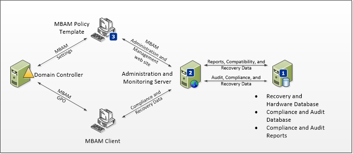
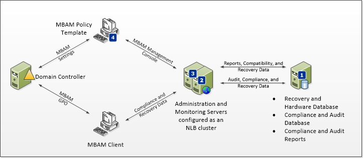
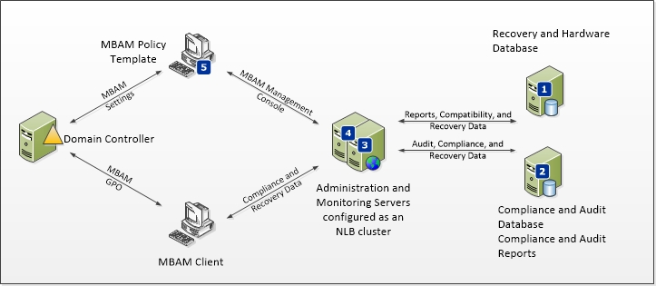

# Deploying the MBAM 1.0 Server Infrastructure

You can install Microsoft BitLocker Administration and Monitoring (MBAM) Server features in different configurations by using one to five servers. Generally, you should use a configuration of three to five servers for production environments, depending on your scalability needs. For more information about performance scalability of MBAM and recommended deployment topologies, see the [MBAM Scalability and High-Availability Guide White Paper](https://go.microsoft.com/fwlink/p/?LinkId=258314).

## Deploy all MBAM 1.0 on a single server

In this configuration, all MBAM features are installed on a single server. This deployment topology for MBAM server infrastructure will support up to 21,000 MBAM client computers.

**Important**  
This configuration is supported, but we recommend it for testing only.

 

The procedures in this section describe the full installation of the MBAM features on a single server.

[How to Install and Configure MBAM on a Single Server](how-to-install-and-configure-mbam-on-a-single-server-mbam-1.md)

## Deploy MBAM 1.0 on distributed servers

MBAM features can be installed in different configurations, depending on your scalability needs. For more information about how to plan for MBAM server feature deployment, see [Planning for MBAM 1.0 Server Deployment](planning-for-mbam-10-server-deployment.md).

The procedures in this section describe the full installation of the MBAM features on distributed servers.

### Three-computer configuration

The following diagram displays the three-computer deployment topology for MBAM. We recommend this topology for production environments that support up to 55,000 MBAM Clients.

In this configuration, MBAM features are installed in the following configuration:

1.  Recovery and Hardware Database, Compliance and Audit Database, and Compliance and Audit Reports are installed on a server.

2.  Administration and Monitoring Server feature is installed on a server.

3.  MBAM Group Policy template is installed on a computer that is capable of modifying Group Policy Objects (GPO).

### Four-computer configuration

The following diagram displays the four-computer deployment topology for MBAM. We recommended this topology for production environments that support up to 110,000 MBAM Clients.

In this configuration, MBAM features are installed in the following configuration:

1.  Recovery and Hardware Database, Compliance and Audit Database, and Compliance and Audit Reports are installed on a server.

2.  Administration and Monitoring Server feature is installed on a server that is configured in a Network Load Balancing (NLB) Server Cluster.

3.  MBAM Group Policy template is installed on a computer that is capable of modifying the Group Policy Objects.

### Five-computer configuration

The following diagram displays the five-computer deployment topology for MBAM. We recommend this topology for production environments that support up to 135,000 MBAM Clients.

In this configuration, MBAM features are installed in the following configuration:

1.  Recovery and Hardware Database is installed on a server.

2.  The Compliance and Audit Database and Compliance and Audit Reports are installed on a server.

3.  Administration and Monitoring Server feature is installed on a server that is configured in a Network Load Balancing (NLB) Server Cluster.

4.  MBAM Group Policy template is installed on a computer that is capable of modifying Group Policy Objects.

[How to Install and Configure MBAM on Distributed Servers](how-to-install-and-configure-mbam-on-distributed-servers-mbam-1.md)

[How to Configure Network Load Balancing for MBAM](how-to-configure-network-load-balancing-for-mbam.md)

## Other resources for MBAM 1.0 Server features deployment

[Deploying MBAM 1.0](deploying-mbam-10.md)

 

 

