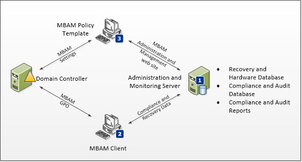

# High Level Architecture for MBAM 1.0

Microsoft BitLocker Administration and Monitoring (MBAM) is a client/server data encryption solution that can help you simplify BitLocker provisioning and deployment, improve BitLocker compliance and reporting, and reduce support costs. MBAM includes the features that are described in this topic.

Additionally, there is a video that provides an overview of the MBAM architecture and MBAM Setup. For more information, see [MBAM Deployment and Architecture Overview](https://go.microsoft.com/fwlink/p/?LinkId=258392).

## Architecture Overview

The following diagram displays the MBAM architecture. The single-server MBAM deployment topology is shown to introduce the MBAM features. However, this MBAM deployment topology is recommended only for lab environments.

**Note**  
At least a three-computer MBAM deployment topology is recommended for a production deployment. For more information about MBAM deployment topologies, see [Deploying the MBAM 1.0 Server Infrastructure](deploying-the-mbam-10-server-infrastructure.md).

 

1.  **Administration and Monitoring Server**. The MBAM Administration and Monitoring Server is installed on a Windows server and hosts the MBAM Administration and Management website and the monitoring web services. The MBAM Administration and Management website is used to determine enterprise compliance status, to audit activity, to manage hardware capability, and to access recovery data, such as the BitLocker recovery keys. The Administration and Monitoring Server connects to the following databases and services:

    -   Recovery and Hardware Database. The Recovery and Hardware database is installed on a Windows-based server and supported SQL Server instance. This database stores recovery data and hardware information that is collected from MBAM client computers.

    -   Compliance and Audit Database. The Compliance and Audit Database is installed on a Windows server and supported SQL Server instance. This database stores compliance data for MBAM client computers. This data is used primarily for reports that are hosted by SQL Server Reporting Services (SSRS).

    -   Compliance and Audit Reports. The Compliance and Audit Reports are installed on a Windows-based server and supported SQL Server instance that has the SSRS feature installed. These reports provide Microsoft BitLocker Administration and Monitoring reports. These reports can be accessed from the MBAM Administration and Management website or directly from the SSRS Server.

2.  **MBAM Client**. The Microsoft BitLocker Administration and Monitoring Client performs the following tasks:

    -   Uses Group Policy to enforce the BitLocker encryption of client computers in the enterprise.

    -   Collects the recovery key for the three BitLocker data drive types: operating system drives, fixed data drives, and removable data (USB) drives.

    -   Collects recovery information and hardware information about the client computers.

    -   Collects compliance data for the computer and passes the data to the reporting system.

3.  **Policy Template**. The MBAM Group Policy template is installed on a supported Windows-based server or client computer. This template is used to specify the MBAM implementation settings for BitLocker drive encryption.

## Related topics

[Getting Started with MBAM 1.0](getting-started-with-mbam-10.md)

 

 

