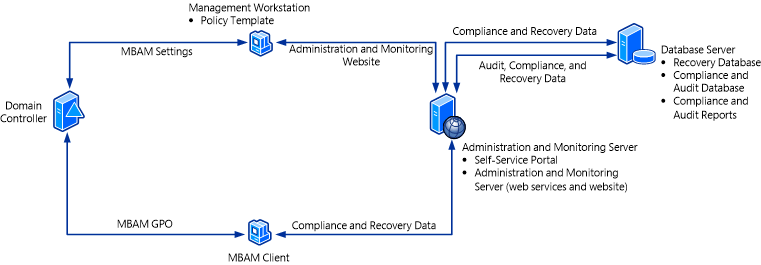

# Deploying the MBAM 2.0 Server Infrastructure

Microsoft BitLocker Administration and Monitoring (MBAM) Server features for the Stand-alone topology can be installed in different configurations on two or more servers in a production environment. The recommended configuration is two servers for a production environment, depending on your scalability requirements. Use a single server for an MBAM installation only in test environments. For more information about planning for the MBAM Server feature deployment, see [Planning for MBAM 2.0 Server Deployment](planning-for-mbam-20-server-deployment-mbam-2.md).

The following diagram shows an example of how you can configure the recommended two-server MBAM deployment. This configuration supports up to 200,000 MBAM clients in a production environment. The server features and databases in the architecture image are described in the following section and are listed under the computer or server where we recommend that you install them.

## Administration and Monitoring Server

The following features are installed on this server:

-   **Administration and Monitoring Server**. The Administration and Monitoring Server feature is installed on a Windows server and consists of the Help Desk website and the monitoring web services.

-   **Self-Service Portal**. The Self-Service Portal is installed on a Windows server. The Self-Service Portal enables end users on client computers to independently log on to a website, where they can obtain a recovery key to recover a locked BitLocker volume.

## Database Server

The following features are installed on this server:

-   **Recovery Database**. The Recovery Database is installed on a Windows server and a supported instance of Microsoft SQL Server. This database stores recovery data that is collected from MBAM client computers.

-   **Compliance and Audit Database**. The Compliance and Audit Database is installed on a Windows server and a supported instance of SQL Server. This database stores compliance data for MBAM client computers. This data is used primarily for reports that SQL Server Reporting Services (SSRS) hosts.

-   **Compliance and Audit Reports**. The Compliance and Audit Reports are installed on a Windows server and a supported instance of SQL Server that has the SQL Server Reporting Services (SSRS) feature installed. These reports provide MBAM reports that you can access from the Help Desk website or directly from the SSRS server.

## Management Workstation

The following feature is installed on the Management Workstation, which can be a Windows server or a client computer.

-   **Policy Template**. The Policy Template consists of Group Policies that define MBAM implementation settings for BitLocker drive encryption. You can install the Policy template on any server or workstation, but it is commonly installed on a management workstation, which is a supported Windows server or client computer. The workstation does not have to be a dedicated computer.

##  MBAM Client

The MBAM Client is installed on a Windows computer and has the following characteristics:

-   Uses Group Policy to enforce the BitLocker drive encryption of client computers in the enterprise.

-   Collects the recovery key for the three BitLocker data drive types: operating system drives, fixed data drives, and removable data (USB) drives.

-   Collects compliance data for the computer and passes the data to the reporting system.

## Other Resources for Deploying MBAM 2.0 Server Features

[Deploying MBAM 2.0](deploying-mbam-20-mbam-2.md)

 

 

