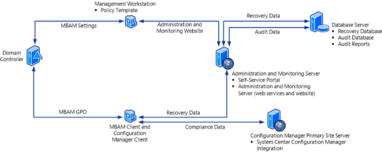

# Getting Started - Using MBAM with Configuration Manager

When you install Microsoft BitLocker Administration and Monitoring (MBAM), you can choose a topology that integrates MBAM with Configuration Manager 2007 or System Center 2012 Configuration Manager. For a list of the supported versions of Configuration Manager that MBAM supports, see [Planning to Deploy MBAM with Configuration Manager](planning-to-deploy-mbam-with-configuration-manager-2.md). In the integrated topology, the hardware compliance and reporting features are removed from MBAM and are accessed from Configuration Manager.

**Important**  
Windows To Go is not supported when you install the integrated topology of MBAM with Configuration Manager 2007.

 

## Using MBAM with Configuration Manager

The integration of MBAM is based on a new Configuration Pack that installs the following three items into Configuration Manager 2007 or System Center 2012 Configuration Manager, which are described in detail in the following sections:

Configuration data that consists of configuration items and a configuration baseline

Collection

Reports

### Configuration Data

The configuration data installs a configuration baseline, called “BitLocker Protection,” which contains two configuration items: “BitLocker Operating System Drive Protection” and “BitLocker Fixed Data Drives Protection.” The configuration baseline is deployed to the collection, which is also created when MBAM is installed. The two configuration items provide the basis for evaluating the compliance status of the client computers. This information is captured, stored, and evaluated in Configuration Manager. The configuration items are based on the compliance requirements for operating system drives (OSDs) and Fixed Data Drives (FDDs). The required details for the deployed computers are collected so that the compliance for those drive types can be evaluated. By default, the configuration baseline evaluates the compliance status every 12 hours and sends the compliance data to Configuration Manager.

### Collection

MBAM creates a collection that is called MBAM Supported Computers. The configuration baseline is targeted to client computers that are in this collection. This is a dynamic collection that, by default, runs every 12 hours and evaluates membership. Membership is based on three criteria:

-   It is a supported version of the Windows operating system. Currently, MBAM supports only Windows 7 Enterprise and Windows 7 Ultimate, Windows 8 Enterprise, and Windows To Go, when Windows To Go is running on Windows 8 Enterprise.

-   It is a physical computer. Virtual machines are not supported.

-   Trusted Platform Module (TPM) is available. A compatible version of TPM 1.2 or later is required for Windows 7. Windows 8 and Windows To Go do not require a TPM.

The collection is evaluated against all computers and creates the subset of compatible computers that provides the basis for compliance evaluation and reporting for the MBAM integration.

### Reports

There are four reports that you can use to view compliance. They are:

-   **BitLocker Enterprise Compliance Dashboard** – gives IT administrators three different views of information on a single report: Compliance Status Distribution, Non Compliant – Errors Distribution, and Compliance Status Distribution By Drive Type. Drill-down options on the report let IT administrators click through the data and view a list of computers that match the state that you select.

-   **BitLocker Enterprise Compliance Details** – lets IT administrators view information about the BitLocker encryption compliance status of the enterprise and includes the compliance status for each computer. Drill-down options on the report let IT administrators click through the data and view a list of computers that match the state that you select.

-   **BitLocker Computer Compliance** – lets IT administrators view an individual computer and determine why it was reported with a given status of compliant or not compliant. The report also displays the encryption state of the operating system drives (OSD) and fixed data drives (FDDs).

-   **BitLocker Enterprise Compliance Summary** – lets IT administrators view the status of the compliance of the enterprise with MBAM policy. Each computer’s state is evaluated, and the report shows a summary of the compliance of all computers in the enterprise against the policy. Drill-down options on the report let IT administrators click through the data and view a list of computers that match the state that you select.

## High-Level Architecture of MBAM with Configuration Manager

The following image shows the MBAM architecture with the Configuration Manager topology. This configuration supports up to 200,000 MBAM clients in a production environment.

A description of the servers, databases, and features of this architecture follows. The server features and databases in the architecture image are listed under the computer or server where we recommend that you install them.

-   **Database Server** – The **Recovery Database**, **Audit Database**, and **Audit Reports** are installed on a Windows server and supported SQL Server instance. The Recovery database stores recovery data that is collected from MBAM client computers. The Audit Database stores audit activity data that is collected from client computers that have accessed recovery data. The Audit Reports provide data about the compliance status of client computers in your enterprise.

-   **Configuration Manager Primary Site Server** – The Configuration Manager Server contains of the MBAM server installation with the System Center Configuration Manager Integration topology, which must be installed on a Configuration Manager primary site server. The Configuration Manager Server collects the hardware inventory information from client computers and is used to report BitLocker compliance of client computers. When you run the MBAM Setup server installation, a collection and the configuration data are installed on the Configuration Manager Primary Site Server.

-   **Administration and Monitoring Server** - The **Administration and Monitoring Server** is installed on a Windows server and consists of the Administration and Monitoring website and the monitoring web services. The Administration and Monitoring website is used to audit activity and to access recovery data (for example, BitLocker recovery keys). The **Self-Service Portal** is also installed on the Administration and Monitoring Server. The Portal enables end users on client computers to independently log onto a website to get a recovery key if they lose or forget their BitLocker password. The Audit reports are also installed on the Administration and Monitoring Server.

-   **Management Workstation** - The **Policy Template** consists of Group Policy Objects that define MBAM implementation settings for BitLocker drive encryption. You can install the Policy template on any server or workstation, but it is commonly installed on a management workstation that is a supported Windows server or client computer. The workstation does not have to be a dedicated computer.

-   **MBAM Client** and **Configuration Manager Client** computer

    -   The **MBAM Client** performs the following tasks:

        -   Uses Group Policy Objects to enforce the BitLocker encryption of client computers in the enterprise.

        -   Collects the recovery key for the three BitLocker data drive types: operating system drives, fixed data drives, and removable data (USB) drives.

        -   Collects recovery information and computer information about the client computers.

    -   **Configuration Manager Client** – The Configuration Manager client enables Configuration Manager to collect hardware compatibility data about the client computers, and enables Configuration Manager to report compliance information.

## Related topics

[Using MBAM with Configuration Manager](using-mbam-with-configuration-manager.md)

 

 

