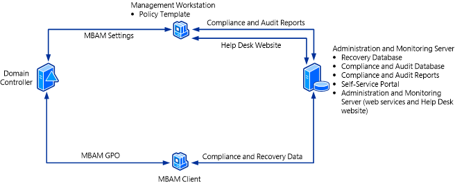

# How to Install and Configure MBAM on a Single Server

The procedures in this topic describe how to install Microsoft BitLocker Administration and Monitoring (MBAM) in the Stand-alone topology on a single server. Use the single-server configuration only in a test environment. For production environments, use two or more servers. If you are installing Microsoft BitLocker Administration and Monitoring by using the Configuration Manager topology, see [Deploying MBAM with Configuration Manager](deploying-mbam-with-configuration-manager-mbam2.md).

The following diagram shows an example of a single-server architecture. For a description of the databases and features, see [High-Level Architecture for MBAM 2.0](high-level-architecture-for-mbam-20-mbam-2.md).

Each server feature has certain prerequisites. To verify that you have met the prerequisites and hardware and software requirements, see [MBAM 2.0 Deployment Prerequisites](mbam-20-deployment-prerequisites-mbam-2.md) and [MBAM 2.0 Supported Configurations](mbam-20-supported-configurations-mbam-2.md). In addition, some features also have information that must be provided during the installation process to successfully deploy the feature. You should also review [Preparing your Environment for MBAM 2.0](preparing-your-environment-for-mbam-20-mbam-2.md) before you start MBAM deployment.

**Note**  
To obtain the setup log files, you have use the Msiexec package and the **/L** &lt;location&gt; option to install MBAM. Log files are created in the location that you specify.

Additional setup log files are created in the %temp% folder on the server of the user who is installing MBAM.

## To install MBAM Server features on a single server

The following steps describe how to install general MBAM features.

**To start the MBAM Server features installation**

1.  On the server where you want to install MBAM, run **MBAMSetup.exe** to start the MBAM installation wizard.

2.  On the **Welcome** page, optionally select the **Customer Experience Improvement Program**, and then click **Start**.

3.  Read and accept the Microsoft Software License Agreement, and then click **Next** to continue the installation.

4.  On the **Topology Selection** page, select the **Stand-alone** topology, and then click **Next**.

5.  On the **Select features to install** page, select the features that you want to install. By default, all MBAM features are selected for installation. Features that are to be installed on the same computer must be installed together at the same time. Clear the check boxes for any features that you want to install elsewhere. You must install MBAM features in the following order:

    -   Recovery Database

    -   Compliance and Audit Database

    -   Compliance and Audit Reports

    -   Self-Service Server

    -   Administration and Monitoring Server

    -   MBAM Group Policy template

    **Note**  
    The installation wizard checks the prerequisites for your installation and displays the prerequisites that are missing. If all of the prerequisites are met, the installation continues. If a missing prerequisite is detected, you have to resolve the missing prerequisites, and then click **Check prerequisites again**. If all prerequisites are met this time, the installation resumes.

6.  On the **Configure network communication security** page, choose whether to encrypt the communication between the Web Services on the Administration and Monitoring Server and the clients. If you decide to encrypt the communication, select the certification authority-provisioned certificate to use for encryption. The certificate must be created prior to this step to enable you to select it on this page.

    **Note**  
    This page appears only if you selected the Self-Service Portal or the Administration and Monitoring Server feature on the **Select features to install** page.

7.  Click **Next**, and then continue to the next set of steps to configure the MBAM Server features.

**To configure the MBAM Server features**

1.  On the **Configure the Recovery database** page, specify the SQL Server instance name and the name of the database that will store the recovery data. You must also specify both where the database files will be located and where the log information will be located.

2.  Click **Next** to continue.

3.  On the **Configure the Compliance and Audit database** page, specify the SQL Server instance name and the name of the database that will store the compliance and audit data. You must also specify where the database files will be located and where the log information will be located.

4.  Click **Next** to continue.

5.  On the **Configure the Compliance and Audit Reports** page, specify the SQL Server Reporting Services instance where the Compliance and Audit reports will be installed, and provide a domain user account and password for accessing the Compliance and Audit database. Configure the password for this account to never expire. The user account should be able to access all data available to the MBAM Reports Users group.

6.  Click **Next** to continue.

7.  On the **Configure the Self-Service Portal** page, enter the port number, host name, virtual directory name, and installation path for the Self-Service Portal.

    **Note**  
    The port number that you specify must be an unused port number on the Administration and Monitoring Server unless you specify a unique host header name. If you are using Windows Firewall, the port will be opened automatically.

8.  Click **Next** to continue.

9.  Specify whether to use Microsoft Updates to help keep your computer secure, and then click **Next**. This does not turn on Automatic Updates in Windows.

10. On the **Configure the Administration and Monitoring Server** page, enter the port number, host name, virtual directory name, and installation path for the Help Desk website.

    **Note**  
    The port number that you specify must be an unused port number on the Administration and Monitoring Server unless you specify a unique host header name. If you are using Windows Firewall, the port will be opened automatically.

11. On the **Installation Summary** page, review the list of features that will be installed, and click **Install** to start installing the MBAM features. Click **Back** to move back through the wizard if you have to review or change your installation settings, or click **Cancel** to exit Setup. Setup installs the MBAM features and notifies you that the installation is complete.

12. Click **Finish** to exit the wizard. After the Microsoft BitLocker Administration and Monitoring Server features have been installed, continue to the next section and complete the steps have to add users to the Microsoft BitLocker Administration and Monitoring roles. For more information about roles, see [Planning for MBAM 2.0 Administrator Roles](planning-for-mbam-20-administrator-roles-mbam-2.md).

**To perform post-installation configuration**

1.  On the Administration and Monitoring Server, add users to the following local groups to give them access to the MBAM Help Desk website features:

    -   **MBAM Helpdesk Users**: Members of this local group can access the Drive Recovery and Manage TPM features on the MBAM Administration and Monitoring website. All fields in Drive Recovery and Manage TPM are required fields for a Helpdesk User.

    -   **MBAM Advanced Helpdesk Users**: Members of this local group have advanced access to the Drive Recovery and Manage TPM features on the MBAM Administration and Monitoring website. For Advanced Helpdesk Users, only the **Key ID** field is required in Drive Recovery. In Manage TPM, only the **Computer Domain** field and **Computer Name** field are required.

2.  On the Administration and Monitoring Server, add users to the following local group to enable them to access the Reports feature on the MBAM Administration and Monitoring website:

    -   **MBAM Report Users**: Members of this local group can access the Reports features on the MBAM Administration and Monitoring website.

    -   Brand the Self-Service Portal with your company name, notice text, and other company-specific information. For instructions, see [How to Brand the Self-Service Portal](how-to-brand-the-self-service-portal.md).

    **Note**  
    Identical user or group membership of the **MBAM Report Users** local group must be maintained on all computers where the MBAM Administration and Monitoring Server features, Compliance and Audit Database, and Compliance and Audit Reports are installed. The recommended way to do this is to create a domain security group and add that domain group to each local MBAM Report Users group. When you use this process, manage the group memberships by way of the domain group.

## Validating the MBAM Server feature installation

When the Microsoft BitLocker Administration and Monitoring installation is completed, validate that the installation has successfully set up all the necessary MBAM features that are required for BitLocker management. Use the following procedure to confirm that the MBAM service is functional.

**To validate the MBAM Server feature installation**

1. On each server where a MBAM feature is deployed, open **Control Panel**. Select **Programs**, and then select **Programs and Features**. Verify that **Microsoft BitLocker Administration and Monitoring** appears in the **Programs and Features** list.

   **Note**  
   To validate the installation, you must use a domain account that has local computer administrative credentials on each server.

2. On the server where the Recovery Database is installed, open SQL Server Management Studio, and verify that the **MBAM Recovery and Hardware** database is installed.

3. On the server where the Compliance and Audit Database is installed, open SQL Server Management Studio, and verify that the **MBAM Compliance Status Database** is installed.

4. On the server where the Compliance and Audit Reports are installed, open a web browser with administrative credentials and browse to the “Home” of the SQL Server Reporting Services site.

   The default Home location of a SQL Server Reporting Services site instance is at http://<em>&lt;NameofMBAMReportsServer&gt;</em>/Reports. To find the actual URL, use the Reporting Services Configuration Manager tool and select the instances that are specified during setup.

   Confirm that a Reports folder named Microsoft BitLocker Administration and Monitoring contains a data source called **MaltaDataSource** and that an **en-us** folder contains four reports.

   **Note**  
   If SQL Server Reporting Services was configured as a named instance, the URL should resemble the following: http://*&lt;NameofMBAMReportsServer&gt;*/Reports\_*&lt;SRSInstanceName&gt;*

~~~
**Note**  
If SSRS was not configured to use Secure Socket Layer (SSL), the URL for the reports will be set to HTTP instead of HTTPS when you install the MBAM Server. If you then go to the Administration and Monitoring website and select a report, the following message appears: “Only Secure Content is Displayed.” To show the report, click **Show All Content**.
~~~

5. On the server where the Administration and Monitoring feature is installed, run **Server Manager** and browse to **Roles**. Select **Web Server (IIS)**, and then click **Internet Information Services (IIS) Manager.**

6. In **Connections,** browse to *&lt;computername&gt;*, select **Sites**, and then select **Microsoft BitLocker Administration and Monitoring**. Verify that **MBAMAdministrationService**, **MBAMUserSupportService**, **MBAMComplianceStatusService**, and **MBAMRecoveryAndHardwareService** are listed.

7. On the server where the Administration and Monitoring features and Self-Service Portal are installed, open a web browser with administrative credentials and browse to the following locations to verify that they load successfully:

   -   *http://&lt;hostname&gt;/HelpDesk/default.aspx* and confirm each of the links for navigation and reports

   -   *http://&lt;hostname&gt;/SelfService&gt;/*

   -   *http://&lt;computername&gt;/MBAMAdministrationService/AdministrationService.svc*

   -   *http://&lt;hostname&gt;/MBAMUserSupportService/UserSupportService.svc*

   -   *http://&lt;computername&gt;/MBAMComplianceStatusService/StatusReportingService.svc*

   -   *http://&lt;computername&gt;/MBAMRecoveryAndHardwareService/CoreService.svc*

   **Note**  
   It is assumed that the server features were installed on the default port without network encryption. If you installed the server features on a different port or virtual directory, change the URLs to include the appropriate port, for example, *http://&lt;hostname&gt;:&lt;port&gt;/HelpDesk/default.asp*x or*http://&lt;hostname&gt;:&lt;port&gt;/&lt;virtualdirectory&gt;/default.aspx*

   If the server features were installed with network encryption, change http:// to https://.

## Related topics

[Deploying the MBAM 2.0 Server Infrastructure](deploying-the-mbam-20-server-infrastructure-mbam-2.md)

