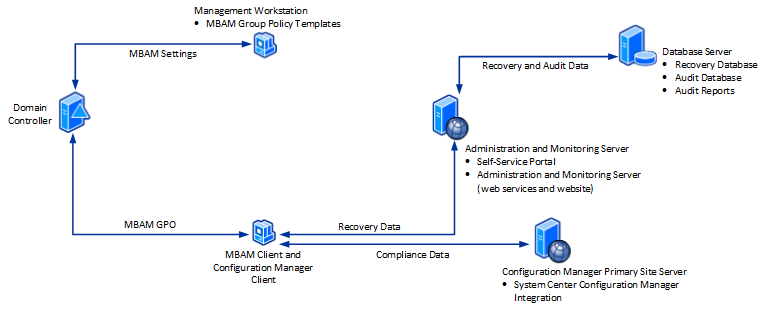

# High-level architecture of MBAM 2.5 with Configuration Manager Integration topology

This topic describes the recommended architecture for deploying Microsoft BitLocker Administration and Monitoring (MBAM) with the Configuration Manager Integration topology. This topology integrates MBAM with System Center Configuration Manager. To deploy MBAM with the Stand-alone topology, see [High-Level Architecture of MBAM 2.5 with Stand-alone Topology](high-level-architecture-of-mbam-25-with-stand-alone-topology.md).

For a list of the supported versions of the software mentioned in this topic, see [MBAM 2.5 Supported Configurations](mbam-25-supported-configurations.md).

**Important**  
Windows To Go is not supported for the Configuration Manager Integration topology installation when you are using Configuration Manager 2007.

 

## Recommended number of servers and supported number of clients

The recommended number of servers and supported number of clients in a production environment is as follows:

<table>
<colgroup>
<col width="50%" />
<col width="50%" />
</colgroup>
<thead>
<tr class="header">
<th align="left">Recommended architecture</th>
<th align="left">Details</th>
</tr>
</thead>
<tbody>
<tr class="odd">
<td align="left">
Number of servers and other computers
</td>
<td align="left">
Three servers

One workstation
</td>
</tr>
<tr class="even">
<td align="left">
Number of client computers supported
</td>
<td align="left">
500,000
</td>
</tr>
</tbody>
</table>

 

## Differences between Configuration Manager Integration and stand-alone topologies

The main differences between the topologies are:

-   The compliance and reporting features are removed from MBAM and are accessed from Configuration Manager.

-   Reports are viewed from the Configuration Manager Management Console, with the exception of the Recovery Audit Report, which you continue to view from the MBAM Administration and Monitoring Website.

## Recommended MBAM high-level architecture with the Configuration Manager Integration topology

The following diagram and table describe the recommended high-level architecture for MBAM with the Configuration Manager Integration topology. MBAM multi-forest deployments require a one-way or two-way trust. One-way trusts require that the server domain trusts the client domain.

### Database server

#### Recovery database

This feature is configured on a computer running Windows Server and supported SQL Server instance.

The **Recovery Database** stores recovery data that is collected from MBAM Client computers.

#### Audit database

This feature is configured on a computer running Windows Server and supported SQL Server instance.

The **Audit Database** stores audit activity data that is collected from client computers that have accessed recovery data.

#### Reports

This feature is configured on a computer running Windows Server and supported SQL Server instance.

The **Reports** provide recovery audit data for the client computers in your enterprise. You can view reports from the Configuration Manager console or directly from SQL Server Reporting Services.

### Configuration Manager primary site server

System Center Configuration Manager Integration feature

-   This feature is configured on the Configuration Manager Primary Site Server, which is the top-tier server in your Configuration Manager infrastructure.

-   The **Configuration Manager Server** collects the hardware inventory information from client computers and is used to report BitLocker compliance of client computers.

-   When you run the Microsoft BitLocker Administration and Monitoring Setup wizard to install the server software, the MBAM Supported Computers collection, configuration baseline, and reports are configured on the Configuration Manager Primary Site Server.

-   The **Configuration Manager console** must be installed on the same computer on which you install the MBAM Server software.

### Administration and monitoring server

#### Administration and monitoring website

This feature is configured on a computer running Windows Server.

The **Administration and monitoring website** is used to:

-   Help end users regain access to their computers when they are locked out. (This area of the Website is commonly called the Help Desk.)

-   View the Recovery Audit Report, which shows recovery activity for client computers. Other reports are viewed from the Configuration Manager console.

#### Self-service portal

This feature is configured on a computer running Windows Server.

The **Self-Service Portal** is a website that enables end users on client computers to independently log on to a website to get a recovery key if they lose or forget their BitLocker password.

#### Monitoring web services for this website

This feature is installed on a computer running Windows Server.

The **monitoring web services** are used by the MBAM Client and the websites to communicate to the database.

**Important** The Monitoring Web Service is no longer available in Microsoft BitLocker Administration and Monitoring (MBAM) 2.5 SP1 since the MBAM websites communicate directly with the Recovery Database. 

 

### Management workstation

#### MBAM group policy templates

-   The **MBAM Group Policy Templates** are Group Policy settings that define implementation settings for MBAM, which enable you to manage BitLocker drive encryption.

-   Before you run MBAM, you must download the Group Policy Templates from [How to Get MDOP Group Policy (.admx) Templates](https://go.microsoft.com/fwlink/p/?LinkId=393941) and copy them to a server or workstation that is running a supported Windows Server or Windows operating system.

    **NOTE** The workstation does not have to be a dedicated computer.

     

### MBAM Client and Configuration Manager Client computer

#### MBAM Client software

The **MBAM Client**:

-   Uses Group Policy Objects to enforce BitLocker drive encryption on client computers in the enterprise.

-   Collects the BitLocker recovery key for three data drive types: operating system drives, fixed data drives, and removable (USB) data drives.

-   Collects recovery information and computer information about the client computers.

#### Configuration Manager Client

The **Configuration Manager Client** enables Configuration Manager to collect hardware compatibility data about the client computers and report compliance information.

 

## Differences in MBAM deployment for supported Configuration Manager versions

When you deploy MBAM with the Configuration Manager Integration topology, you can install MBAM on a primary site server. However, the MBAM installation works differently for System Center 2012 Configuration Manager and Configuration Manager 2007.

<table>
<colgroup>
<col width="50%" />
<col width="50%" />
</colgroup>
<thead>
<tr class="header">
<th align="left">Configuration Manager version</th>
<th align="left">Description</th>
</tr>
</thead>
<tbody>
<tr class="odd">
<td align="left">
System Center 2012 R2 Configuration Manager

System Center 2012 Configuration Manager
</td>
<td align="left">
If you install MBAM on a primary site server or on a central administration server, MBAM performs all of the installation actions on that site server.
</td>
</tr>
<tr class="even">
<td align="left">
Configuration Manager 2007 R2

Configuration Manager 2007
</td>
<td align="left">
If you install MBAM on a primary site server that is part of a larger Configuration Manager hierarchy with a central site parent server, MBAM identifies the central site parent server and performs all of the installation actions on that parent server. The installation includes checking prerequisites and installing the Configuration Manager objects and reports.

For example, if you install MBAM on a primary site server that is a child of a central site parent server, MBAM installs all of the Configuration Manager objects and reports on the parent server. If you install MBAM on the parent server, MBAM performs all of the installation actions on that parent server.
</td>
</tr>
</tbody>
</table>

 

## How MBAM works with Configuration Manager

The integration of MBAM with Configuration Manager is based on a configuration pack that installs the items described in the following table.

<table>
<colgroup>
<col width="50%" />
<col width="50%" />
</colgroup>
<thead>
<tr class="header">
<th align="left">Items installed into Configuration Manager</th>
<th align="left">Description</th>
</tr>
</thead>
<tbody>
<tr class="odd">
<td align="left">
Configuration data
</td>
<td align="left">
The configuration data installs a configuration baseline, called “BitLocker Protection,” which contains two configuration items:

<ul>
<li>
BitLocker Operating System Drive Protection
</li>
<li>
BitLocker Fixed Data Drives Protection
</li>
</ul>

The configuration baseline is deployed to the MBAM Supported Computers collection, which is also created when MBAM is installed.

The two configuration items provide the basis for evaluating the compliance status of the client computers. This information is captured, stored, and evaluated in Configuration Manager.

The configuration items are based on the compliance requirements for operating system drives and fixed data drives. The required details for the deployed computers are collected so that the compliance for those drive types can be evaluated.

By default, the configuration baseline evaluates the compliance status every 12 hours and sends the compliance data to Configuration Manager.
</td>
</tr>
<tr class="even">
<td align="left">
MBAM Supported Computers collection
</td>
<td align="left">
MBAM creates a collection that is called MBAM Supported Computers. The configuration baseline is targeted to client computers that are in this collection.

This is a dynamic collection. By default, it runs every 12 hours and evaluates membership, based on three criteria:

<ul>
<li>
The computer is a supported version of the Windows operating system.
</li>
<li>
The computer is a physical computer. Virtual machines are not supported.
</li>
<li>
The computer has a Trusted Platform Module (TPM) that is available. A compatible version of TPM 1.2 or later is required for Windows 7. Windows 10, Windows 8.1, Windows 8, and Windows To Go do not require a TPM.
</li>
</ul>

The collection is evaluated against all computers and a subset of compatible computers is created, which provides the basis for compliance evaluation and reporting for the MBAM integration.
</td>
</tr>
<tr class="odd">
<td align="left">
Reports
</td>
<td align="left">
When you configure MBAM with the Configuration Manager Integration topology, you view all reports in Configuration Manager, except the Recovery Audit Report, the latter of which you continue to view in the MBAM Administration and Monitoring Website. The reports available in Configuration Manager are:

<table>
<colgroup>
<col width="50%" />
<col width="50%" />
</colgroup>
<thead>
<tr class="header">
<th align="left">Report</th>
<th align="left">Description</th>
</tr>
</thead>
<tbody>
<tr class="odd">
<td align="left">
BitLocker Enterprise Compliance Dashboard
</td>
<td align="left">
Gives IT administrators three views of information in a single report: Compliance Status Distribution, Non Compliant – Errors Distribution, and Compliance Status Distribution By Drive Type. Drill-down options on the report let IT administrators click through the data and view a list of computers that match the selected state.
</td>
</tr>
<tr class="even">
<td align="left">
BitLocker Enterprise Compliance Details
</td>
<td align="left">
Lets IT administrators view information about the BitLocker encryption compliance status of the enterprise and includes the compliance status for each computer. Drill-down options on the report let IT administrators click through the data and view a list of computers that match the selected state.
</td>
</tr>
<tr class="odd">
<td align="left">
BitLocker Computer Compliance
</td>
<td align="left">
Lets IT administrators view an individual computer and determine why it was reported with a status of compliant or not compliant. The report also displays the encryption state of the operating system drives and fixed data drives.
</td>
</tr>
<tr class="even">
<td align="left">
BitLocker Enterprise Compliance Summary
</td>
<td align="left">
Lets IT administrators view the status of MBAM policy compliance in the enterprise. Each computer’s state is evaluated, and the report shows a summary of the compliance of all computers in the enterprise against the policy. Drill-down options on the report let IT administrators click through the data and view a list of computers that match the selected state.
</td>
</tr>
</tbody>
</table>

 
</td>
</tr>
</tbody>
</table>

 

## Related topics

[Getting Started with MBAM 2.5](getting-started-with-mbam-25.md)

[High-Level Architecture of MBAM 2.5 with Stand-alone Topology](high-level-architecture-of-mbam-25-with-stand-alone-topology.md)

[Illustrated Features of an MBAM 2.5 Deployment](illustrated-features-of-an-mbam-25-deployment.md)

 

 
## Got a suggestion for MBAM?
- Add or vote on suggestions [here](http://mbam.uservoice.com/forums/268571-microsoft-bitlocker-administration-and-monitoring). 
- For MBAM issues, use the [MBAM TechNet Forum](https://social.technet.microsoft.com/Forums/home?forum=mdopmbam).

