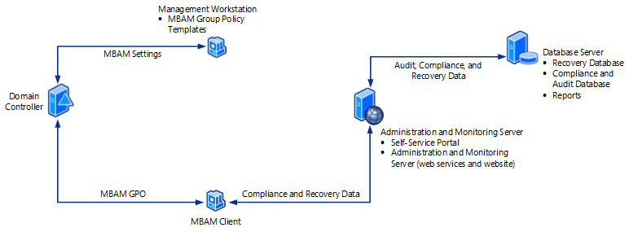

# High-Level Architecture of MBAM 2.5 with Stand-alone Topology

This topic describes the recommended architecture for deploying Microsoft BitLocker Administration and Monitoring (MBAM) with the Configuration Manager Stand-alone topology. In this topology, MBAM is deployed as a stand-alone product. You can alternatively deploy MBAM with the Configuration Manager Integration topology, which integrates MBAM with Configuration Manager. For more information, see [High-Level Architecture of MBAM 2.5 with Configuration Manager Integration Topology](high-level-architecture-of-mbam-25-with-configuration-manager-integration-topology.md).

For a list of the supported versions of the software mentioned in this topic, see [MBAM 2.5 Supported Configurations](mbam-25-supported-configurations.md).

**Note**  
We recommend you use a single-server architecture in test environments only.

 

## Recommended number of servers and supported number of clients

The recommended number of servers and supported number of clients in a production environment is as follows:

<table>
<colgroup>
<col width="50%" />
<col width="50%" />
</colgroup>
<thead>
<tr class="header">
<th align="left">Recommended architecture in a production environment</th>
<th align="left">Details</th>
</tr>
</thead>
<tbody>
<tr class="odd">
<td align="left">
Number of servers and other computers
</td>
<td align="left">
Two servers

One workstation
</td>
</tr>
<tr class="even">
<td align="left">
Number of client computers supported
</td>
<td align="left">
500,000
</td>
</tr>
</tbody>
</table>

 

## Recommended MBAM high-level architecture with the Stand-alone topology

The following diagram and table describe the recommended high-level, two-server architecture for MBAM with the Stand-alone topology. MBAM multi-forest deployments require a one-way or two-way trust. One-way trusts require that the server domain trusts the client domain.

Server
Features to configure on this server
Description
Database server

Compliance and Audit Database

This feature is configured on a server running Windows Server and supported SQL Server instance.

The **Compliance and Audit Database** stores compliance data, which is used primarily for reports that SQL Server Reporting Services hosts.

Recovery Database

This feature is configured on a server running Windows Server and supported SQL Server instance.

The **Recovery Database** stores recovery data that is collected from MBAM client computers.

Reports

This feature is configured on a server running Windows Server and supported SQL Server instance.

The **Reports** provide recovery audit and compliance status data about the client computers in your enterprise. You can access the reports from the Administration and Monitoring Website or directly from SQL Server Reporting Services.

Administration and Monitoring Server

Administration and Monitoring Website

This feature is configured on a computer running Windows Server.

The **Administration and Monitoring Website** is used to:

-   Help end users regain access to their computers when they are locked out. (This area of the Website is commonly called the Help Desk.)

-   View reports that show compliance status and recovery activity for client computers.

Self-Service Portal

This feature is configured on a computer running Windows Server.

The **Self-Service Portal** is a website that enables end users on client computers to independently log on to a website to get a recovery key if they lose or forget their BitLocker password.

Monitoring web services for this website

This feature is configured on a computer running Windows Server.

The **monitoring web services** are used by the MBAM Client and the websites to communicate to the database.

**Important**  
The Monitoring Web Service is no longer available in Microsoft BitLocker Administration and Monitoring (MBAM) 2.5 SP1 since the MBAM websites communicate directly with the Recovery Database.

 

Management workstation

MBAM Group Policy Templates

-   The MBAM Group Policy Templates are Group Policy settings that define implementation settings for MBAM, which enable you to manage BitLocker Drive Encryption.

-   Before you run MBAM, you must download the Group Policy Templates from [How to Get MDOP Group Policy (.admx) Templates](https://go.microsoft.com/fwlink/p/?LinkId=393941) and copy them to a server or workstation that is running a supported Windows Server or Windows operating system.

-   The workstation does not have to be a dedicated computer.

MBAM Client and Configuration Manager client computer

MBAM Client software

The MBAM Client:

-   Uses Group Policy Objects to enforce BitLocker Drive Encryption on client computers in the enterprise.

-   Collects the Bitlocker recovery key for three data drive types: operating system drives, fixed data drives, and removable (USB) data drives.

-   Collects recovery information and computer information about the client computers.

## Related topics

[Getting Started with MBAM 2.5](getting-started-with-mbam-25.md)

[High-Level Architecture of MBAM 2.5 with Configuration Manager Integration Topology](high-level-architecture-of-mbam-25-with-configuration-manager-integration-topology.md)

[Illustrated Features of an MBAM 2.5 Deployment](illustrated-features-of-an-mbam-25-deployment.md)

 

## Got a suggestion for MBAM?
- Add or vote on suggestions [here](http://mbam.uservoice.com/forums/268571-microsoft-bitlocker-administration-and-monitoring). 
- For MBAM issues, use the [MBAM TechNet Forum](https://social.technet.microsoft.com/Forums/home?forum=mdopmbam). 

