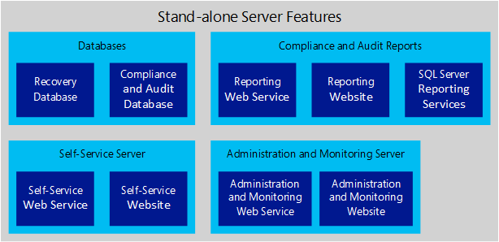
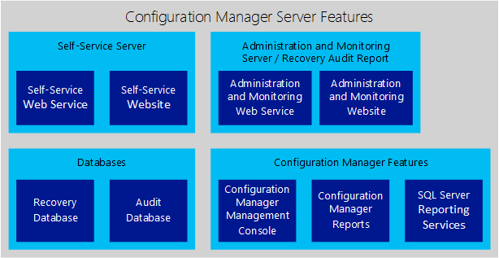

# Illustrated Features of an MBAM 2.5 Deployment

This topic describes the individual features that make up a Microsoft BitLocker Administration and Monitoring (MBAM) 2.5 deployment for the following topologies:

-   MBAM Stand-alone

-   System Center Configuration Manager Integration

**Important**  
These features do not represent the recommended architecture for deploying MBAM. Use this information only as a guide to understand the individual features that make up an MBAM deployment. See [High-Level Architecture for MBAM 2.5](high-level-architecture-for-mbam-25.md) for the recommended architecture for MBAM.

 

For a list of the supported versions of the software mentioned in this topic, see [MBAM 2.5 Supported Configurations](mbam-25-supported-configurations.md).

##  MBAM Stand-alone topology

The following image and table explain the features in an MBAM Stand-alone topology.

|Feature type|Description|Database|
|-|-|-|
|Recovery Database|This database stores recovery data that is collected from MBAM client computers.|This feature is configured on a server running Windows Server and a supported SQL Server instance.|
|Compliance and Audit Database|This database stores compliance data, which is used primarily for the Reports that SQL Server Reporting Services hosts.|This feature is configured on a server running Windows Server and a supported SQL Server instance.|
|Compliance and Audit Reports|||
|Reporting Web Service|This web service enables communication between the Administration and Monitoring Website and the SQL Server instance where reporting data is stored.|This feature is installed on a server running Windows Server.|
|Reporting Website (Administration and Monitoring Website)|You view Reports from the Administration and Monitoring Website. The Reports provide recovery audit and compliance status data about the client computers in your enterprise.|This feature is configured on a server running Windows Server.|
|SQL Server Reporting Services (SSRS)|Reports are configured in an SSRS database instance. Reports can be viewed directly from SSRS or from the Administration and Monitoring Website.|This feature is configured on a server running Windows Server and a supported SQL Server instance that is running SSRS.|
|Self-Service Server|||
|Self-Service Web Service|This web service is used by the MBAM Client and the Administration and Monitoring Website and Self-Service Portal to communicate to the Recovery Database.|This feature is installed on a computer running Windows Server.|
|Self-Service Website (Self-Service Portal)|This website enables end users on client computers to independently sign in to a website to get a recovery key if they lose or forget their BitLocker password.|This feature is configured on a computer running Windows Server.|
|Administration and Monitoring Server|||
|Administration and Monitoring Web Service|The Monitoring Web Service is used by the MBAM Client and the websites to communicate to the databases.|This feature is installed on a computer running Windows Server.|

**Important**  
The Self-Service Web Service is no longer available in Microsoft BitLocker Administration and Monitoring (MBAM) 2.5 SP1, in which the MBAM Client, the Administration and Monitoring Website, and the Self-Service Portal communicate directly with the Recovery Database.

**Important**  
The Monitoring Web Service is no longer available in Microsoft BitLocker Administration and Monitoring (MBAM) 2.5 SP1 since the MBAM Client and the websites communicate directly with the Recovery Database.
 

## System Center Configuration Manager Integration topology

The following image and table explain the features in the System Center Configuration Manager Integration topology.

**Important**  
The Self-Service Web Service is no longer available in Microsoft BitLocker Administration and Monitoring (MBAM) 2.5 SP1, in which the MBAM Client, the Administration and Monitoring Website, and the Self-Service Portal communicate directly with the Recovery Database.

**Warning**  
The Monitoring Web Service is no longer available in Microsoft BitLocker Administration and Monitoring (MBAM) 2.5 SP1 since the MBAM Client and the websites communicate directly with the Recovery Database.

|Feature type|Description|
|-|-|
|Self-Service Server|||
|Self-Service Web Service|This web service is used by the MBAM Client and the Self-Service Portal to communicate to the Recovery Database.|This feature is installed on a computer running Windows Server.|
|Self-Service Website|This website enables end users on client computers to independently sign in to a website to get a recovery key if they lose or forget their BitLocker password.|This feature is configured on a computer running Windows Server.|
|Administration and Monitoring Server/Recovery Audit Report|||
|Administration and Monitoring Web Service|This web service enables communication between the Administration and Monitoring Website and the SQL Server databases where reporting data is stored.|This feature is installed on a server running Windows Server.|
|Administration and Monitoring Website|The Recovery Audit report is viewed from the Administration and Monitoring Website. Use the Configuration Manager console to view all other reports, or view reports directly from SQL Server Reporting Services.|This feature is configured on a server running Windows Server.|
|Databases|||
|Recovery Database|This database stores recovery data that is collected from MBAM client computers.|This feature is configured on a server running Windows Server and a supported SQL Server instance.|
|Audit Database|This database stores audit information about recovery attempts and activity.|This feature is configured on a server running Windows Server and a supported SQL Server instance.|
|Configuration Manager Features|||
|Configuration Manager Management console|This console is built into Configuration Manager and is used to view reports.|For viewing reports only, this feature can be installed on any server or client computer.|
|Configuration Manager Reports|Reports show compliance and recovery audit data for client computers in your enterprise.|The Reports feature is installed on a server running Windows Server and SSRS, and Reports run on a supported SQL Server instance. A reporting services point must be defined in Configuration Manager on the server that is running SSRS.|
|SQL Server Reporting Services|SSRS enables the MBAM Reports. Reports can be viewed directly from SSRS or from the Configuration Manager console.|SSRS is installed on a server running Windows Server. A reporting services point must be defined in Configuration Manager on the server that is running SSRS.|

## Related topics

[High-Level Architecture for MBAM 2.5](high-level-architecture-for-mbam-25.md)

[Getting Started with MBAM 2.5](getting-started-with-mbam-25.md)

## Got a suggestion for MBAM?
- Add or vote on suggestions [here](http://mbam.uservoice.com/forums/268571-microsoft-bitlocker-administration-and-monitoring). 
- For MBAM issues, use the [MBAM TechNet Forum](https://social.technet.microsoft.com/Forums/home?forum=mdopmbam).

