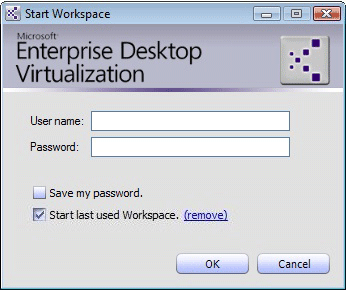

# How to Start, Stop, and Restart a MED-V Workspace

**To start a MED-V workspace**

1.  In the notification area, right-click the MED-V icon.

2.  On the submenu, click **Start Workspace**.

    -   If there are multiple MED-V workspaces running on the computer, the **Workspace Selection** window appears.

        1.  Select a MED-V workspace.

        2.  Select the **Start the selected Workspace without asking me** check box to skip this window the next time the client is started and to automatically open the selected MED-V workspace.

        3.  Click **OK**.

    The **Start Workspace Authentication** window appears.

    -   If there are several MED-V workspaces on the computer and you have opted to use a specified MED-V workspace, the window shown in the following figure appears.

        

    -   If there is only one MED-V workspace on the computer, the “Start last used Workspace” option is unavailable.

3.  Type in your domain user credentials.

    **Note**  
    The first time a MED-V workspace is started, the user name should be in the following format: &lt;domain name&gt;\\&lt;user name&gt;.

     

4.  Select **Save my password** to save your password between sessions.

    **Note**  
    To enable the save password feature, the EnableSavePassword attribute must be set to True in the ClientSettings.xml file. The file can be found in the *Servers\\Configuration Server\\* folder.

     

5.  Clear the **Start last used workspace** check box to choose a different MED-V workspace.

6.  Click **OK**.

    Several status screens appear depending on the MED-V workspace configuration.

    The **Starting Workspace** screen appears.

**To restart a MED-V workspace**

1.  When the client is running, in the notification area, right-click the MED-V icon.

2.  On the submenu, click **Restart Workspace**.

    The MED-V workspace is restarted.

    -   In a persistent MED-V workspace, the virtual machine is shut down and then restarted.

    -   In a revertible MED-V workspace, the virtual machine does not actually shut down; instead, it returns to its original state.

**To stop a MED-V workspace**

1.  In the notification area, right-click the MED-V icon.

2.  On the submenu, click **Stop Workspace**.

    The MED-V workspace is stopped.

## Related topics

[How to Start and Exit the MED-V Client](how-to-start-and-exit-the-med-v-client.md)

 

 

