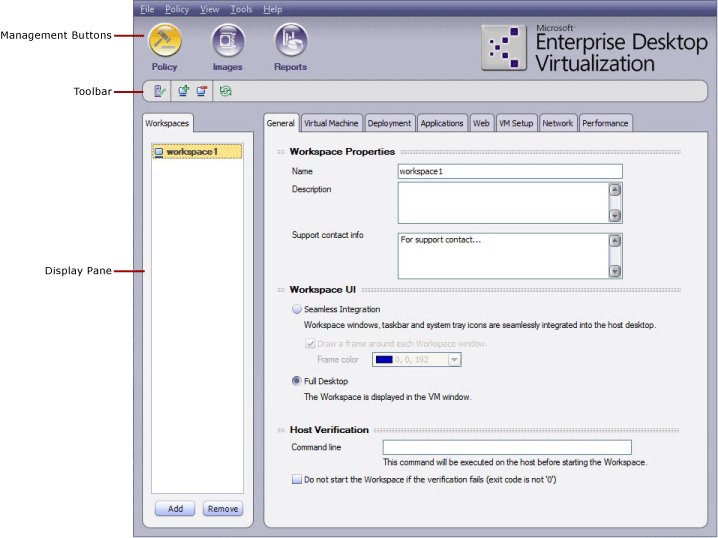

# Using the MED-V Management Console User Interface

The console user interface is divided into the following sections:

-   The following **MED-V management buttons**, which correspond to the three modules:

    -   **Policy**—The **Policy** module is used to define the MED-V workspaces and their related settings and permissions.

    -   **Images**—The **Images** module is used to manage MED-V workspace images.

    -   **Reports**—The **Reports** module is used for generating and viewing MED-V workspace reports.

-   The **toolbar** displays shortcuts relevant to the button selected.

-   The **display pane** displays a module corresponding to the button that is selected.

## How to Log In to the MED-V Management Console

**To open the MED-V management console**

-   On the Windows **Start** menu, select **All Programs &gt; MED-V &gt; MED-V Management**, or on the desktop, double-click the MED-V Management icon.

    The **MED-V Management Login** window appears.

**Note**  
For security reasons, the first user to log in to the MED-V management console will become the only user on that computer allowed to access the management console.

 

**To log in**

1.  Type in your domain user credentials in the following format:

    "domain\_name\\user\_name", "password"

    **Note**  
    When configuring the server, users with full access as well as users with read-only access are defined. All users must be domain users. The domain user name and password is used for MED-V management login.

     

2.  Click **OK**.

    The **MED-V Management** console appears.

## Related topics

[How to Install MED-V Client and MED-V Management Console](how-to-install-med-v-client-and-med-v-management-console.md)

 

 

